# M1P 用户手册


## 修订历史

| Revision | Content | Date | Edited by |
| --- | --- | --- | --- |
| 1.0.0 | 初版发行 | 2022-04-18 | PD |
| 1.1.0 | 更新附录C结构图纸<br>更新附录A录包工具推荐优先级 | 2022-07-01 | PD |
| 1.2.0 | 更新章节1中部分描述错误 | 2022-09-05 | PD |
| 1.3.0 | 更新章节2通信协议，IP及端口号等<br>更新章节3状态机定义，补充线束说明<br>更新附录ARSView软件版本及界面手册<br>更新附录B Driver & SDK最新地址 | 2022-12-16 | PD |

## 1 产品规格

RS-LiDAR-M1P采用MEMS固态激光雷达方式，测量距离高达200米(180m@10%)，出点数高达750,000点/秒(单回波模式)及1,500,000点/秒(双回波模式)，水平测角 $120^{\circ}$ ( $-60.0^{\circ} \sim +60.0^{\circ}$ )，垂直测角 $25^{\circ}$ ( $-12.5^{\circ} \sim +12.5^{\circ}$ )

表 1: 产品规格表

<table class="product-spec-table">
  <tbody>
    <tr>
      <td>传感器</td>
      <td>
        <ul>
          <li>TOF 法测距，包含反射强度信息</li>
          <li>测距：0.5m ~ 200m (180m@10% NIST)<sup>1</sup></li>
          <li>精度：± 5cm@1 sigma<sup>2</sup></li>
          <li>视角（垂直）：25° (-12.5°~+12.5°)<sup>3</sup></li>
          <li>角分辨率（垂直）：平均 0.2°<sup>4</sup></li>
          <li>视角（水平）：120° (-60.0°~+60.0°)</li>
          <li>角分辨率（水平）：平均 0.2°<sup>4</sup></li>
          <li>帧率：10Hz</li>
        </ul>
      </td>
    </tr>
    <tr>
      <td>激光</td>
      <td>
        <ul>
          <li>Class 1 eye safe</li>
          <li>波长：905nm</li>
        </ul>
      </td>
    </tr>
    <tr>
      <td>输出</td>
      <td>
        <ul>
          <li>~750,000 点/秒（单回波模式）</li>
          <li>~1,500,000 点/秒（双回波模式）</li>
          <li>1000Base-T1 千兆以太网</li>
          <li>UDP 包中包含<span class="spec-subline">三维空间坐标、反射强度信息、时间戳等</span></li>
        </ul>
      </td>
    </tr>
    <tr>
      <td>机械 / 电子操作</td>
      <td>
        <ul>
          <li>功耗：15w<sup>5</sup></li>
          <li>工作电压：9~16VDC</li>
          <li>重量：约 0.75kg（不包含数据线）</li>
          <li>尺寸：长 110mm * 宽 111mm * 高 45mm</li>
          <li>防护安全级别：IP67, IP6K9K</li>
          <li>工作温度范围：-40°C~85°C（要求长时间工作需强制对流）<sup>6</sup></li>
          <li>存储温度范围：-40°C~105°C</li>
        </ul>
      </td>
    </tr>
  </tbody>
</table>

<div class="spec-footnotes">
  <p><sup>1</sup> 测距能力 180 米以 10% NIST 漫反射板作为目标，测试结果会受到环境影响，包括但不限于环境温度、光照强度等因素</p>
  <p><sup>2</sup> 测距精度以 50% NIST 漫反射板为目标在 10m~100m 范围内测试，测试结果会受到环境影响，包括但不限于环境温度、目标物距离等因素，且精度值适用于大部分通道，部分通道之间存在差异</p>
  <p><sup>3</sup> RS-LiDAR-M1P 整机 5 个通道水平排列，在垂直方向上会有一定位置上的错开；单个视场最大包络垂直 FoV 为 25.2°；5 个视场拼接后呈现非规则排列，按照最大包络计算则垂直 FoV 为 35.79°</p>
  <p><sup>4</sup> 水平&amp;垂直分辨率在整个 FOV 区域内并非均匀分布，角分辨率的均值为 0.2°</p>
  <p><sup>5</sup> 设备功耗测试在稳定工作时测试，结果会受到外部环境影响，包括但不限于环境温度、目标物的距离、目标物反射率等因素</p>
  <p><sup>6</sup> 设备运行温度可能会受到外部环境影响，包括但不限于太阳辐射、气流变化等因素</p>
</div>

## 2 通信协议

RS-LiDAR-M1P 与电脑之间的通信采用以太网介质，使用 UDP 协议，输出包有两种类型：MSOP 包和 DIFOP 包。文中所有涉及 MSOP 协议包均为 1210Bytes 定长；DIFOP 协议包均为 256Bytes 定长。单回波模式下，每秒发射 6300 个 MSOP 包和 10 个 DIFOP 包，数据传输速率要求不低于 58.2 Mbps。双回波模式下，要求不低于 116.4 Mbps。RS-LiDAR-M1P 网络参数可配置，出厂默认采用固定 IP 和固定目的端口号模式，按照如下表格。

表 2：出厂默认网络配置表

|  | IP 地址 | MSOP 包端口号 | DIFOP 包端口号 |
| --- | --- | --- | --- |
| RS-LiDAR-M1P | 192.168.1.200 | / | / |
| 电脑 | 192.168.1.102 | 6699 | 7788 |

设备默认 MAC 地址是在工厂初始设置的，每台设备 MAC 地址唯一。

当单播使用设备的时候，需要把电脑的 IP 设置为与设备同一网段上，例如 192.168.1.x(x 的取值范围为 1~254)，子网掩码为 255.255.255.0。若不知设备网络配置信息，请将主机子网掩码设置为 0.0.0.0 后连接设备并使用 Wireshark 抓取设备输出包进行分析。

RS-LiDAR-M1P 和电脑之间的通信协议主要分两类，一览表见下表格。

- 主数据流输出协议 MSOP，将激光雷达扫描出来的距离，角度，反射率等信息封装成包输出给电脑；

- 设备信息输出协议 DIFOP，将激光雷达当前状态的各种配置信息输出给电脑。

表 3：设备协议一览表

| (协议/包)名称 | 简写 | 功能 | 类型 | 包大小 |
| --- | --- | --- | --- | --- |
| Main Data Stream Output Protocol | MSOP | 扫描数据输出 | UDP | 1210 Bytes |
| Device Information Output Protocol | DIFOP | 设备信息输出 | UDP | 256 Bytes |

<span class="manual-note-red">注：下面章节皆为对协议中的有效载荷（MSOP 包 1210Bytes 和 DIFOP 包 256Bytes）部分进行描述和定义。</span>

### 2.1 主数据流输出协议（MSOP）

主数据流输出协议：Main data Stream Output Protocol，简称：MSOP

I/O 类型：设备输出，电脑解析。

默认端口号为 6699

MSOP 包完成三维测量相关数据输出，包括激光测距值、回波的反射强度值、垂直角度、水平角度和时间戳。MSOP 包的有效载荷长度为 1210 字节，其中 32 Bytes 的同步帧头 Header，1175 Bytes 的数据块区间（共 25 个 47 Bytes 的 data block），3 Bytes 为帧尾。

基本结构如下图所示：

<figure markdown>
  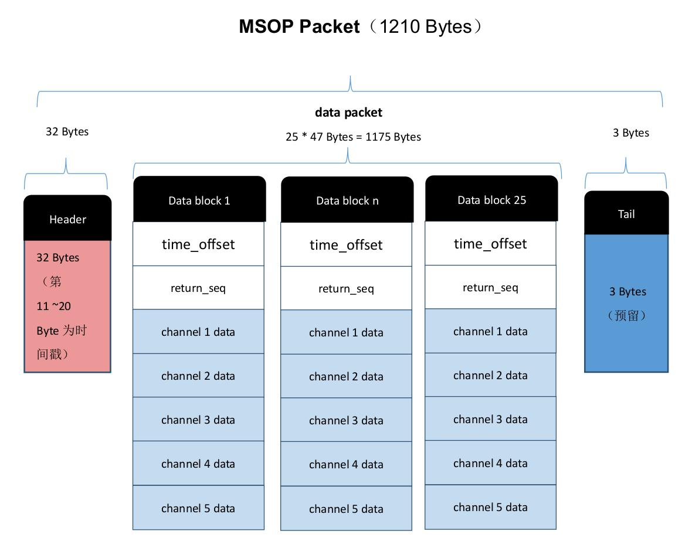
  <figcaption>图 1: MSOP Packet 数据包定义示意图</figcaption>
</figure>

#### 2.1.1 帧头

帧头 Header 共 32 Bytes，用于识别出数据的开始位置，包计数，UDP 通信预留以及存储时间戳。详细定义如下：

表 4: MSOP 包头定义

<table class="packet-def-table">
  <thead>
    <tr>
      <th colspan="5">Header (32 Bytes)</th>
    </tr>
  </thead>
  <tbody>
    <tr>
      <td>pkt_header</td>
      <td>pkt_psn</td>
      <td>protocol version</td>
      <td>wave_mode</td>
      <td>time_sync_mode</td>
    </tr>
    <tr>
      <td>4 Bytes</td>
      <td>2 Bytes</td>
      <td>2 Bytes</td>
      <td>1 Byte</td>
      <td>1 Byte</td>
    </tr>
    <tr>
      <td>timestamp</td>
      <td>reserved</td>
      <td>lidar_type</td>
      <td>mems_tmp</td>
      <td rowspan="2"></td>
    </tr>
    <tr>
      <td>10 Bytes</td>
      <td>10 Bytes</td>
      <td>1 Byte</td>
      <td>1 Byte</td>
    </tr>
  </tbody>
</table>

**pkt_header**: 可作为包的检查序列，识别头为 0x55, 0xaa,, 0x5a, 0xa5

**pkt_psn**: 包序列号，表示包计数，循环计数，从每帧数据的起点的包计数为 1，每帧数据的最后一个点的包计数为最大值。

**protocol version**: 表示 UDP 通信协议的版本号。

**wave_mode**: 回波模式标志位，0-双回波，1-N/A，2-N/A, 3-N/A, 4- 最强回波，5-最后回波，6-第一回波。

**time_sync_mode**: 时间同步模式：
- 0x00 表示当前使用雷达内部自己计时
- 0x01 表示当前使用 1PPS 进行亚秒在整秒复位模式
- 0x02 表示当前使用 PTP 时间同步模式
- 0x03 表示当前使用 gPTP 时间同步模式

**timestamp**: 用于存储时间戳，定义的时间戳用来记录系统的时间，高 6 Bytes 为秒位，低 4 Bytes 为微秒位。

**reserved**: 预留位

**lidar_type**: 雷达类型标志位，默认值 0x10

**mems_tmp**: mems 温度，Temp=mems_tmp-80;即原始值 0 代表-80 度；255 代表 175 度。

#### 2.1.2 数据块区域

数据块区间是 MSOP 包中传感器的测量值部分, 共 1175 Bytes。它由 25 个 data block 组成, 每个 data block 长度为 47 Bytes。

对于单回波模式，代表一组 5 个通道一次测量完整的测距数据。每一个 Data Block 就储存单次发射回波的数据。

对于双回波模式，单数个 MSOP Packet 为第一回波的数据，包含 25 个 Data Block。偶数个 MSOP Packet 为第二回波的数据，包含 25 个 Data Block。依次交替出现，可以根据 return_seq 标志位来判定该 Packet 属于第几个回波，具体参看表 5 中说明。两个 MSOP Packet 组成一次完整的测量。双回波一次测量总点数为单回波一次测量的两倍。

详细定义如下:

表 5: MSOP 包中 data block 定义

<table class="packet-def-table">
  <thead>
    <tr>
      <th colspan="4">data block N (47 Bytes)</th>
    </tr>
    <tr>
      <th>content</th>
      <th>offset(byte)</th>
      <th>byte</th>
      <th>instruction</th>
    </tr>
  </thead>
  <tbody>
    <tr><td>time_offset</td><td>0</td><td>1</td><td>该组 Block 里面所有的点相对于包的 timestamp 的时间偏移量,该组点的时间等于timestamp+time_offset</td></tr>
    <tr><td>return_seq</td><td>1</td><td>1</td><td>回波序列。单回波模式下,此标志位恒定为 0;双回波模式下,第一回波(距离更近的)用 0x1 表示,第二回波(距离更远的)用 0x2 表示</td></tr>
    <tr><td>ch1_radius</td><td>2</td><td>2</td><td>极坐标系下,通道 1 的径向点距离值,距离解析分辨率 5mm</td></tr>
    <tr><td>ch1_elevation</td><td>4</td><td>2</td><td>极坐标系下,通道 1 的点垂直夹角,分辨率 0.01°</td></tr>
    <tr><td>ch1_azimuth</td><td>6</td><td>2</td><td>极坐标系下,通道 1 的点水平夹角,分辨率 0.01°</td></tr>
    <tr><td>ch1_intensity</td><td>8</td><td>1</td><td>通道 1 的点反射强度值,取值范围 0~255</td></tr>
    <tr><td>resev.</td><td>9</td><td>2</td><td>预留</td></tr>
    <tr><td>ch2_radius</td><td>11</td><td>2</td><td>极坐标系下,通道 2 的径向点距离值,距离解析分辨率 5mm</td></tr>
    <tr><td>ch2_elevation</td><td>13</td><td>2</td><td>极坐标系下,通道 2 的点垂直夹角,分辨率 0.01°</td></tr>
    <tr><td>ch2_azimuth</td><td>15</td><td>2</td><td>极坐标系下,通道 2 的点水平夹角,分辨率 0.01°</td></tr>
    <tr><td>ch2_intensity</td><td>17</td><td>1</td><td>通道 2 的点反射强度值,取值范围 0~255</td></tr>
    <tr><td>resev.</td><td>18</td><td>2</td><td>预留</td></tr>
    <tr><td>ch3_radius</td><td>20</td><td>2</td><td>极坐标系下,通道 3 的径向点距离值,距离解析分辨率 5mm</td></tr>
    <tr><td>ch3_elevation</td><td>22</td><td>2</td><td>极坐标系下,通道 3 的点垂直夹角,分辨率 0.01°</td></tr>
    <tr><td>ch3_azimuth</td><td>24</td><td>2</td><td>极坐标系下,通道 3 的点水平夹角,分辨率 0.01°</td></tr>
    <tr><td>ch3_intensity</td><td>26</td><td>1</td><td>通道 3 的点反射强度值,取值范围 0~255</td></tr>
    <tr><td>resev.</td><td>27</td><td>2</td><td>预留</td></tr>
    <tr><td>ch4_radius</td><td>29</td><td>2</td><td>极坐标系下,通道 4 的径向点距离值,距离解析分辨率 5mm</td></tr>
    <tr><td>ch4_elevation</td><td>31</td><td>2</td><td>极坐标系下,通道 4 的点垂直夹角,分辨率 0.01°</td></tr>
    <tr><td>ch4_azimuth</td><td>33</td><td>2</td><td>极坐标系下,通道 4 的点水平夹角,分辨率 0.01°</td></tr>
    <tr><td>ch4_intensity</td><td>35</td><td>1</td><td>通道 4 的点反射强度值,取值范围 0~255</td></tr>
    <tr><td>resev.</td><td>36</td><td>2</td><td>预留</td></tr>
    <tr><td>ch5_radius</td><td>38</td><td>2</td><td>极坐标系下,通道 5 的径向点距离值,距离解析分辨率 5mm</td></tr>
    <tr><td>ch5_elevation</td><td>40</td><td>2</td><td>极坐标系下,通道5的点垂直夹角,分辨率0.01°</td></tr>
    <tr><td>ch5_azimuth</td><td>42</td><td>2</td><td>极坐标系下,通道5的点水平夹角,分辨率0.01°</td></tr>
    <tr><td>ch5_intensity</td><td>44</td><td>1</td><td>通道5的点反射强度值,取值范围0~255</td></tr>
    <tr><td>resev.</td><td>45</td><td>2</td><td>预留</td></tr>
  </tbody>
</table>

N 为任一个 MSOP 包中第 N 个 data block

**time_offset**: 第 N 组 Block 里面所有的点相对于包的 timestamp 的时间偏移量，该组点的时间等于 timestamp+time_offset

**return_seq**: 回波序列。单回波模式下，此标志位恒定为 0；双回波模式下，第一回波（距离更近的）用 0x1 表示，第二回波（距离更远的）用 0x2 表示。

n 为第 N 组 data block 中第 n 个通道，n=1, 2, 3, 4, 5，其包含数据如下：

- **chn_radius**: 极坐标系下，通道 n 的径向点距离值，距离解析分辨率 5mm
- **chn_elevation**: 极坐标系下，通道 n 的点俯仰角，分辨率 0.01°
- **chn_azimuth**: 极坐标系下，通道 n 的点方位角，分辨率 0.01°
- **chn_intensity**: 通道 n 的点反射强度值，取值范围 0~255

##### 2.1.2.1 channel data 定义

Channel data 是 9 Bytes，此通道径向距离 2 Bytes、俯仰角 2 Bytes、方位角 2 Bytes、反射强度值 1 Byte、预留 2 Bytes

详细定义如下:

表 6: data block 中通道数据定义

<table class="packet-def-table">
  <thead>
    <tr>
      <th colspan="7">channel data (9 Bytes)</th>
    </tr>
  </thead>
  <tbody>
    <tr>
      <td colspan="2">chn_radius(2 Bytes)</td>
      <td colspan="2">chn_elevation(2 Bytes)</td>
      <td colspan="2">chn_azimuth(2 bytes)</td>
      <td>chn_intensity(1 Byte)</td>
    </tr>
    <tr>
      <td>R1 [15:8]</td>
      <td>R2[7:0]</td>
      <td>E1[15:8]</td>
      <td>E2[7:0]</td>
      <td>A1[15:8]</td>
      <td>A2[7:0]</td>
      <td>Intensity[7:0]</td>
    </tr>
    <tr>
      <td colspan="2">resv.(2 Bytes)</td>
      <td colspan="5"></td>
    </tr>
    <tr>
      <td>r1 [15:8]</td>
      <td>r2 [7:0]</td>
      <td colspan="5"></td>
    </tr>
  </tbody>
</table>

以径向距离 radius 计算为例:

    chn_radius 是 2 Bytes，分辨率为 0.5 cm

    获取数据包里的某通道 radius 值的十六进制数为：R1 为 0x03，R2 为 0xfc

    0x03 为距离的高位，转换为十进制为 3，0xfc 为距离的低位，转化为十进制为 252

    因此：此通道的径向距离= $R1*256+R2=3*256+252=1020$ 

    根据坐标的分辨率，转化为米：1020 * 0.005 = 5.10m

    因此，此通道的测距在对应 elevation 和 azimuth 方向上的径向距离是 5.1 米。

XYZ 坐标运算:

通过 Wireshark 抓取 RS-LiDAR-M1P 的数据包，如下图所示：

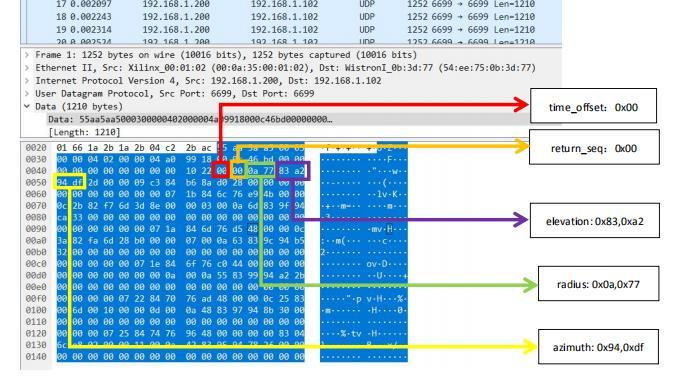

相关参数计算样例

1. time_offset: 数据块时间偏移量 HEX: 0x00 -> DEC: 00 -> 0 μs

2. return_seq: HEX: 0x00 -> 单回波

3. radius: 径向距离 HEX: 0x0a,0x77 -> DEC: 10, 119

    $$
    - > \text { radius } = (1 0 \times 2 5 6 + 1 1 9) \times 0. 0 0 5 [ \mathrm{m} ] = 1 3. 3 9 5 \mathrm{m}
    $$

4. elevation: 俯仰角 HEX: 0x83,0xa2 -> DEC: 131,162

    $$
    - > \text { elevation } = ((1 3 1 \times 2 5 6 + 1 6 2) - 3 2 7 6 8) \times 0. 0 1 [ \text { degree } ] = 9. 3 ^ {\circ}
    $$

5. azimuth: 方位角 HEX: 0x94,0xdf -> DEC: 148,223

    $$
    - > \text {   azimuth   } = ((1 4 8 \times 2 5 6 + 2 2 3) - 3 2 7 6 8) \times 0. 0 1 [ \text { degree } ] = 5 3. 4 3 ^ {\circ}
    $$

由下面的解析公式可以解析点云的 XYZ 坐标:

$\left\{ \begin{array}{l} X = \text{radius } \bullet \cos (\text{evelation}) \bullet \cos (\text{azimuth}) \\ Y = \text{radius } \bullet \cos (\text{evelation}) \bullet \sin (\text{azimuth}) \\ Z = \text{radius } \bullet \sin (\text{evelation}) \end{array} \right.$ $\left\{ \begin{array}{l} X = 13.395m \bullet \cos (9.3^\circ) \bullet \cos (53.43^\circ) \\ Y = 13.395m \bullet \cos (9.3^\circ) \bullet \sin (53.43^\circ) \\ Z = 13.395m \bullet \sin (9.3^\circ) \end{array} \right.$ 

由此得到该通道单回波的一次发射测量得到的点云坐标值 (7.88m, 10.62m, 2.17m)

#### 2.1.3 帧尾

帧尾（Tail）长度为 3 Bytes，为预留位。

### 2.2 设备信息输出协议（DIFOP）

设备信息输出协议，Device Info Output Protocol，简称：DIFOP

I/O 类型：设备输出，电脑读取。

默认端口号为 7788

DIFOP 是为了将设备序列号（S/N）、固件版本信息、上位机驱动兼容性信息、网络配置信息、校准信息、运行状态、故障诊断信息定期发送给用户的“仅输出”协议，用户可以通过读取 DIFOP 解读当前使用设备的各种参数的具体信息。

一个完整的 DIFOP Packet 的数据格式结构为同步帧头，数据区，预留。每个数据包共 256 Bytes：包括 8 Bytes 同步帧头 Header，1Byte 预留位，247Bytes 的数据区。

数据包的基本结构如下表所示。

表 7: DIFOP 包定义

<table class="packet-def-table">
  <thead>
    <tr>
      <th colspan="6">DIFOP 256Byte</th>
    </tr>
    <tr>
      <th>段落划分</th>
      <th>序号</th>
      <th>属性</th>
      <th>信息</th>
      <th>Offset</th>
      <th>长度 (byte)</th>
    </tr>
  </thead>
  <tbody>
    <tr>
      <td>Header</td>
      <td>1</td>
      <td>帧头8</td>
      <td>DIFOP识别头</td>
      <td>0</td>
      <td>8</td>
    </tr>
    <tr>
      <td rowspan="18">Data</td>
      <td>2</td>
      <td colspan="2">Reserve</td>
      <td>8</td>
      <td>1</td>
    </tr>
    <tr>
      <td>3</td>
      <td>帧率</td>
      <td>MEMS扫描帧率</td>
      <td>9</td>
      <td>1</td>
    </tr>
    <tr>
      <td rowspan="5">4</td>
      <td rowspan="5">以太网</td>
      <td>以太网IP源地址</td>
      <td>10</td>
      <td>4</td>
    </tr>
    <tr><td>以太网IP目标地址</td><td>14</td><td>4</td></tr>
    <tr><td>以太网MAC地址</td><td>18</td><td>6</td></tr>
    <tr><td>MSOP端口号</td><td>24</td><td>2</td></tr>
    <tr><td>DIFOP端口号</td><td>26</td><td>2</td></tr>
    <tr>
      <td rowspan="2">5</td>
      <td rowspan="2">版本信息</td>
      <td>主板PL侧固件版本号</td>
      <td>28</td>
      <td>5</td>
    </tr>
    <tr><td>主板PS侧固件版本号</td><td>33</td><td>5</td></tr>
    <tr>
      <td>6</td>
      <td colspan="2">Reserve</td>
      <td>38</td>
      <td>16</td>
    </tr>
    <tr>
      <td>7</td>
      <td>回波模式</td>
      <td>回波模式设置</td>
      <td>54</td>
      <td>1</td>
    </tr>
    <tr>
      <td rowspan="3">8</td>
      <td rowspan="3">时间信息</td>
      <td>时间同步方式设置</td>
      <td>55</td>
      <td>1</td>
    </tr>
    <tr><td>时间同步状态</td><td>56</td><td>1</td></tr>
    <tr><td>时间</td><td>57</td><td>10</td></tr>
    <tr>
      <td>9</td>
      <td>电压</td>
      <td>整机输入电源电压</td>
      <td>67</td>
      <td>2</td>
    </tr>
    <tr>
      <td>10</td>
      <td colspan="2">Reserve</td>
      <td>69</td>
      <td>67</td>
    </tr>
    <tr>
      <td>11</td>
      <td>故障诊断</td>
      <td>Lidar故障状态</td>
      <td>136</td>
      <td>1</td>
    </tr>
    <tr>
      <td>12</td>
      <td colspan="2">Reserve</td>
      <td>137</td>
      <td>118</td>
    </tr>
  </tbody>
</table>

注：

1. 表格中 Header (DIFOP 识别头) 为 0xa5,0xff,0x00,0x5a,0x11,0x11,0x55,0x55，可作为包的检查序列。
2. 水平 FOV 的 LSB 为 0.01 度，最小值 0，最大值 $120^{\circ}$ 。
3. 垂直 FOV 的 LSB 为 0.01 度，最小值 0，最大值 $25^{\circ}$ 。
4. 回波模式设置：回波模式标志位，0-双回波，1-N/A，2-N/A，3-N/A，4-最强回波，5-最后回波，6-第一回波。
5. 时间同步方式设置：默认值是 0x03。0x00 表示当前使用雷达内部自己计时，0x01 表示当前使用 1PPS 进行亚秒在整秒复位模式，0x02 表示当前使用 PTP 时间同步模式，0x03 表示当前使用 gPTP 时间同步模式。
6. 时间同步状态：标识时间同步是否成功的状态：0-不成功，1-成功，2-时钟源掉线。

## 3 LiDAR 接线及工作说明

3.1 线束说明

<table class="wire-harness-table">
  <thead>
    <tr>
      <th>线束名称</th>
      <th>实物图</th>
      <th>线束端子</th>
      <th>信号类型</th>
      <th></th>
    </tr>
  </thead>
  <tbody>
    <tr>
      <td rowspan="13">车载以太网电源线束</td>
      <td rowspan="13"></td>
      <td rowspan="8"><br>二合一端子:a</td>
      <td>D2</td>
      <td>1000Base T1 P</td>
    </tr>
    <tr><td>D1</td><td>1000Base T1 N</td></tr>
    <tr><td>1</td><td>GND</td></tr>
    <tr><td>2</td><td>Wakeup</td></tr>
    <tr><td>3</td><td>/</td></tr>
    <tr><td>4</td><td>Battery+</td></tr>
    <tr><td>5</td><td>/</td></tr>
    <tr><td>6</td><td>/</td></tr>
    <tr><td rowspan="3"><br>端子:b</td><td>1</td><td>GND</td></tr>
    <tr><td>2</td><td>Wakeup</td></tr>
    <tr><td>4</td><td>Battery+</td></tr>
    <tr><td rowspan="2"><br>端子:c</td><td>D2</td><td>1000Base T1 P</td></tr>
    <tr><td>D1</td><td>1000Base T1 N</td></tr>

    <tr>
      <td>AC电源线</td>
      <td></td>
      <td rowspan="4"><br>Interface Box</td>
      <td>d</td>
      <td>AC 电源</td>
    </tr>
    <tr>
      <td rowspan="2">AC电源适配器</td>
      <td rowspan="2"></td>
      <td>e</td>
      <td>AC 电源</td>
    </tr>
    <tr><td>f</td><td>12V 直流电源</td></tr>
    <tr>
      <td>千兆以太网线</td>
      <td></td>
      <td>g/h</td>
      <td>千兆以太网</td>
    </tr>
  </tbody>
</table>

### 3.2 Interface box 接线方式

<figure markdown>
  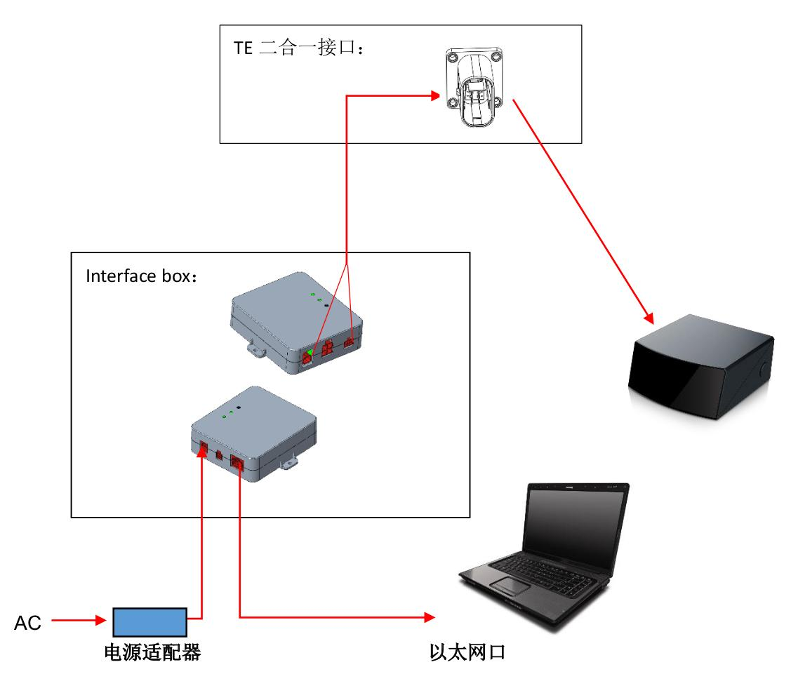
  <figcaption>图 2：雷达设备与上位机直连拓扑图</figcaption>
</figure>

注：
图 2 中展示的是 Interface Box (TE) 的结构图的接线方式。

| 接线说明 | TE Interface Box 结构图 |
| --- | --- |
| 连接LiDAR 侧 | 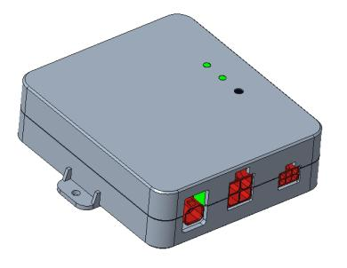 |
| 连接电源及上位机侧 | 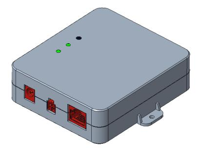 |

### 3.3 LiDAR 状态机说明

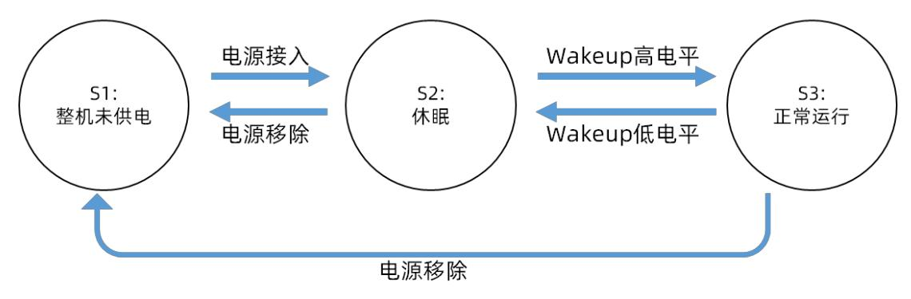

唤醒电压说明:

| 信号类型 | Wakeup I/O 电压 | 说明 |
| --- | --- | --- |
| Wakeup 高电平 | 7V~16V | 直流高电平信号 |
| Wakeup 低电平 | 0V~2V | 直流低电平信号 |

## 4 时间同步

RS-LiDAR-M1P 默认固件使用 gPTP (IEEE 802.1AS) 的时间同步方式。默认只支持 gPTP，如需要使用 PTP (IEEE 1588v2) 时间同步，请联系 RoboSense 技术支持。

### 4.1 精准时间同步协议

#### 4.1.1 时间同步介绍

PTP（Precision Time Protocol，精确时间协议）是一种时间同步的协议，其本身主要用于通过网络通讯的形式实现设备之间的高精度时间同步，也可被借用于设备之间的频率同步。相比现有的各种时间同步机制，PTP 具备以下优势：

1）相比 NTP（Network Time Protocol，网络时间协议），PTP 能够满足更高精度的时间同步要求，NTP 一般只能达到亚秒级的时间同步精度，而 PTP 则可达到亚微秒级。

2）相比 GPS（Global Positioning System，全球定位系统），PTP 具备更低的建设和维护成本，并且由于可以摆脱对 GPS 的依赖，在国家安全方面也具备特殊的意义。

PTP 同步可以通过不同的通信协议承载（CAN，以太网等）。同步模式上，PTP 同步可以使用两种机制：端到端 E2E 或对等网络 P2P:

- E2E（End to End）模式：采用请求应答机制（Request Response Mechanism）

- P2P（Peer to Peer）模式：采用对等延迟机制（Peer Delay Mechanism）。

说明：目前我司提供的 PTP 协议仅支持以太网协议 L2 层，E2E 模式。

gPTP(general precise time protocol)是PTP在时效性网络(Time-Sensitive Networking)的派生协议。同步机制采用和PTP协议一致的P2P端延迟机制(Peer Delay Mechanism)，同时采用以太网L2层通信。与PTP不同，gPTP要求使用硬件方式打时间戳，也就是常说的硬件时间戳，所以对于交换机和Master时钟会有较严苛的要求。

#### 4.1.2 gPTP 接线方式

使用 gPTP 同步方式，需要做以下准备，然后按照下图的连接方式进行连接：

1）一台 gPTP Master 授时主机（即插即用，无需额外配置）；

2）以太网交换机；

3）支持 gPTP 协议的设备 (RS-LiDAR-M1P 及其他待授时设备);

<figure markdown>
  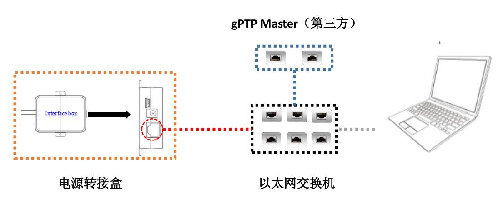
  <figcaption>图 3: gPTP 时间同步拓扑</figcaption>
</figure>

注：

1. gPTP Master 授时设备属于第三方设备，我司出货时不包含此配件，需要用户自行采购

2. 我司设备作为 gPTP Slave 设备只获取 gPTP Master 发出的时间，不做准确度判断。若解析雷达点云时间与真实时间出现偏差，请检查 gPTP Master 提供的时间是否准确

3. 雷达同步之后, 若 gPTP Master 断开连接, 点云数据包中的时间会继续按照雷达内部时钟进行叠加。雷达断电重启后时间才会被重置

### 4.2 使用 Linuxptp 工具简单验证时间同步

将 RS-LiDAR-M1P 电源线和网线与 Interface Box 相连，网线对端再与上位机相连。上位机操作系统（OS）必须为 Linux 系统，以下以 Ubuntu 为例。

1. 使用命令$ifconfig 查看网卡名。如下图所示网卡名为 enp2s0。

    <figure markdown>
      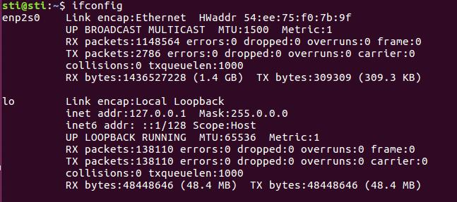
      <figcaption>图 4：查找网卡名示意图</figcaption>
    </figure>

2. 使用命令$ethtool -Tenp2s0（上一步查询到的网卡名），可以查看此网卡是否支持 PTP 硬件。对于 gPTP 同步，需要硬件支持，PTP Hardware Clock 选项要求不是 none 值。

    <figure markdown>
      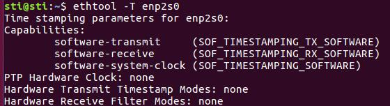
      <figcaption>图 5：检查 PTP 硬件支持情况示意图</figcaption>
    </figure>

3. 下载并安装 linuxptp 工具。

    ```bash
    $sudo git clone git://git.code.sf.net/p/linuxptp/code linuxptp
    $cd linuxptp
    $sudo make
    $sudo make install
    $reboot 
    ```

4. ptp4l 命令的使用。

    Ptp4I 命令选项介绍如下:

    **延迟机制选项**

    `-A` 自动模式，自动选择*E2E*延迟机制，当收到对等延迟请求时切换到*P2P* 

    `-E` *E2E* 模式，请求应答延迟机制（默认） 

    `-P` *P2P* 模式，端延迟机制 

    **网络传输选项**

    `-2` IEEE 802.3

    `-4` UDP IPV4（默认）

    `-6` UDP IPV6

    **时间戳选项**

    `-H` 硬件时间戳（默认）

    `-S` 软件模拟时间戳

    `-L` 老的硬件时间戳，LEGACY HW 需要配合PHC 设备使用。

    **其他选项**

    `-f [file]` 从指定文件 *file* 中读取配置。默认情况下不读取任何配置文件。

    `-i [dev]` 选择 PTP 接口设备，例如 *eth0*（可多次指定），必须至少使用此选项或配置文件指定一个端口。

    `-p [dev]` 此选项用于在旧 Linux 内核上指定要使用的 PHC 设备（例如 */dev/ptp0* 时钟设备），默认为 *auto*，忽略软件/ *LEGACY HW* 时间戳（不推荐使用此选项）

    `-s` *slaveOnly* mode，从时钟模式（覆盖配置文件）

    `-t` 透明的时钟模式

    `-l [num]` 将日志记录级别设置为 '*num*'，默认是 6

    `-m` 将消息打印到 *stdout*

    `-q` 不打印消息到 *syslog*

    `-v` 打印软件版本并退出

    `-h` 帮助命令

简单同步 RS-LiDAR-M1P 使用命令：

**(1) PTP E2E (L2层) 命令：**

```bash
$sudo ptp4l -E -S -2 -m -i enp2s0（网卡名）
```

如设备硬件支持 **PTP Hardware Clock** 不是 *none* 值，可以使用 `-H` 替代 `-S`

**(2) gPTP 命令：**

```bash
$sudo ptp4l -i enp4s0 -m -H -2 -f gptp-master.cfg
```

设备要求硬件支持 **PTP Hardware Clock** 不是 *none* 值。**特别说明**：无硬件支持设备可用 `-S` 替代 `-H` 进行 gPTP 同步模拟，但同步精度无法保证。其中，`gptp-master.cfg` 为 gPTP 主时钟配置文件。

在主机上新建 `gptp-master.cfg` 文件，在此文件中复制以下内容后，保存文件：

```txt
# 802.1AS example configuration containing those attributes which
# differ from the defaults.  See the file, default.cfg, for the
# complete list of available options.

[global]
domainNumber        0
logSyncInterval     -3
syncReceiptTimeout  3
neighborPropDelayThresh  800
path_trace_enabled  1
follow_up_info      1
transportSpecific 0x1
ptp_dst_mac 01:80:C2:00:00:0E
#p2p_dst_mac 01:1B:19:00:00:00
network_transport L2
delay_mechanism P2P
masterOnly 1
BMCA noop
asCapable true
inhibit_announce 1
inhibit_delay_req 1 
```

### 4.3 GPS 时间同步

如需要将 RS-LiDAR-M1P 与 GPS 模块同步。首先需要使 GPS 模块给 gPTP Master 授时，具体接口与授时方式需要与 gPTP Master 提供方明确。除特殊需求外，RoboSense 将不提供相关技术支持。

<figure markdown>
  
  <figcaption>图 6: GPS 同步拓扑简图</figcaption>
</figure>

## 附录 A RSView

在本附录中将展示如何使用 RSView 获取、可视化、保存和回放 RS-LiDAR-M1P 数据。

对于从 RS-LiDAR-M1P 得到的原始数据，可以使用一些免费工具去检测，例如 Wireshark 和 tcp-dump。但对于可视化这些数据，使用 RSView 是更为便捷和容易实现的方式，具体的 RSView 版本可以联系 RoboSense 技术人员。

### A.1 软件功能

RSView 提供将 RS-LiDAR-M1P 数据进行实时可视化的功能。RSView 也能回放保存为 pcap 文件格式的数据，但是还不能支持.pcapng 格式的文件。

RSView 将 RS-LiDAR-M1P 得到距离测量值显示为一个点。它能够支持多种自定义颜色来显示数据，例如 XYZ 坐标、径向距离、pitch（Elevation）和 yaw（azimuth）角度等。

RSView 所包含的功能:

● 通过以太网实时显示数据

● 将实时数据记录保存为 PCAP 文件

● 从记录的 PCAP 文件中回放

● 不同类型可视化模式，例如距离、pitch（elevation）和 yaw(azimuth)等等

● 用表格显示点的数据

● 测量距离工具

### A.2 安装 RSView

RSView 的安装文件支持 Windows 的 64 位操作系统，安装前不需要安装其他依赖软件。解压 RSView 的压缩包，在 /bin 文件夹下得到 RSView.exe 可执行文件。

### A.3 设置网路

默认采用单播模式，需要设定计算机的静态 IP 的地址为 192.168.1.XXX，子网掩码为 255.255.255.0。此外还需要确保 RSView 没有被防火墙或第三方安全软件给禁止。

### A.4 可视化数据

1. RS-LiDAR-M1P 接通电源，并用网线和电脑连接。

2. 右键使用管理员权限运行打开 RSView 软件。

3. 点击 File > Open Sensor(图 A-1)。

    <figure markdown>
      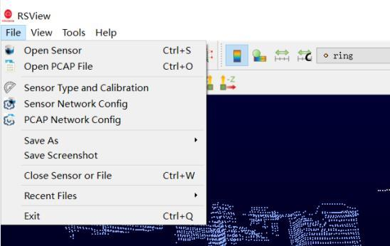
      <figcaption>图 A-1：打开 RSView 实时数据显示</figcaption>
    </figure>

4. 在弹出的 Sensor Type and Configuration 窗口中, Sensor Type 下拉选项中选择 RSM1 适配 RS-LiDAR-M1P 机型, Sensor Calibration 默认包含一个命名为 MEMSCorrectionFile_3V 的雷达参数, 可以直接点击 OK。RS-LiDAR-M1P 原始点云输出的已经是校准过的点云, 所以此参数文件里的值为空。

    <figure markdown>
      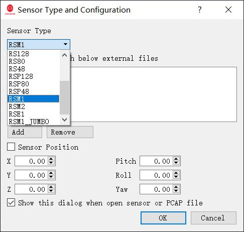
      <figcaption>图 A-2：选择 RS-LiDAR-M1P 参数配置文件</figcaption>
    </figure>

5. 确认 MSOP 和 DIFOP 端口号是否正确：Sensor Network Configuration，输入正确的 MSOP 端口号和 DIFOP 端口号。

    <figure markdown>
      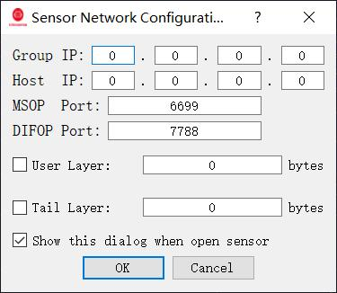
      <figcaption>图 A-3: RSView 雷达端口设置示意图</figcaption>
    </figure>

6. RSView 开始显示实时采集到数据(图 A-4)。可以通过点击 Play 按钮暂停，再点击一次可以继续显示。

    <figure markdown>
      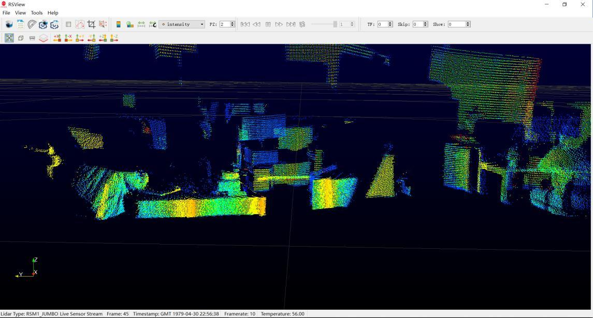
      <figcaption>图 A-4: RS-LiDAR-M1P 点云图像</figcaption>
    </figure>

7. 如没有图像显示请在工具栏 Tool 工具下 Data Port Setting 中查看 MSOP 和 DIFOP 端口是否配置正确。

### A.5 保存 RS-LiDAR-M1P 数据为 PCAP 格式

采用 Wireshark 作为录包工具:

1. 下载安装 wireshark 软件。

    <figure markdown>
      
      <figcaption>图 A-5：Wireshark 图标</figcaption>
    </figure>

2. 双击启动 wireshark 软件，启动后选择当前连接雷达的网卡名称双击进去。

    <figure markdown>
      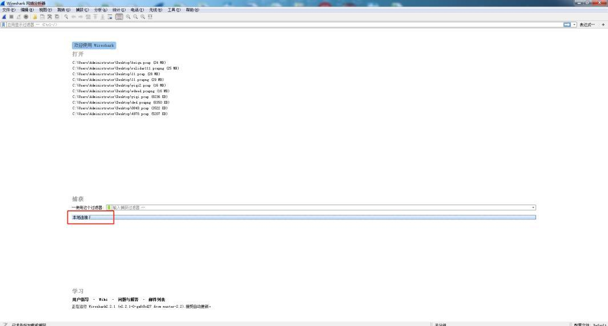
      <figcaption>图 A-6：Wireshark 启动</figcaption>
    </figure>

3. 看到下图数据则说明和雷达连接正常,红色框内数据分别代表“雷达 IP”,“PC IP”,“MSOP 端口号”,“DIFOP 包端口号”。

    <figure markdown>
      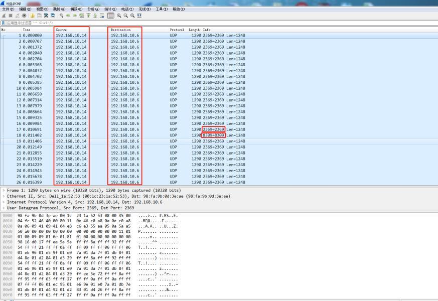
      <figcaption>图 A-7：Wireshark 工作</figcaption>
    </figure>

4. 软件左上角找到“文件-保存”。

    <figure markdown>
      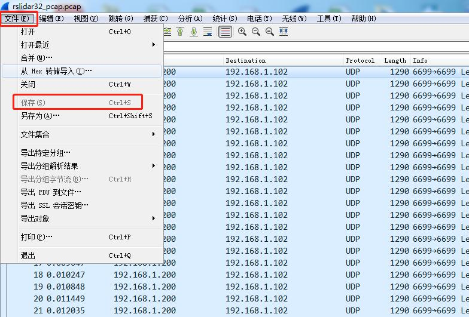
      <figcaption>图 A-8：Wireshark 数据保存</figcaption>
    </figure>

5. 在弹出的对话框中输入文件名称，数据格式选择.pcap 保存即可。

    <figure markdown>
      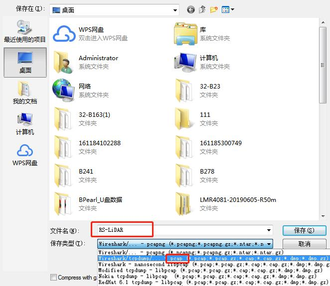
      <figcaption>图 A-9: Wireshark 数据保存</figcaption>
    </figure>

6. 此时可以在指定的文件夹目录下找到对应的文件，此时可以使用我们的 RSView 软件或者驱动去查看点云（RSView 操作请参照产品用户手册）。

    <figure markdown>
      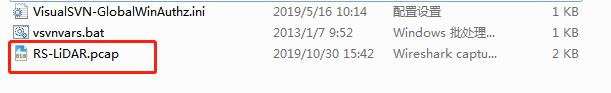
      <figcaption>图 A-10 Wireshark 数据保存</figcaption>
    </figure>

### A.6 回放 pcap 数据

可以使用 RSView 对 RS-LiDAR-M1P 保存的数据 pcap 文件进行回放或者测试。您可以使用 Play 按钮去播放或者选择数据中个别帧。也可以用鼠标选择 3D 点云数据中的一部分，然后打开表格进行分析。pcap 文件的保存路径不可以有中文。

1. 点击 File > Open PCAP File。

    <figure markdown>
      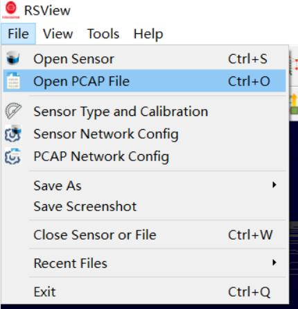
      <figcaption>图 A-11 打开 pcap 记录文件</figcaption>
    </figure>

2. 弹出 Open File 对话框，选择一个记录的 pcap 文件并且点击“打开（O）”按钮。

    <figure markdown>
      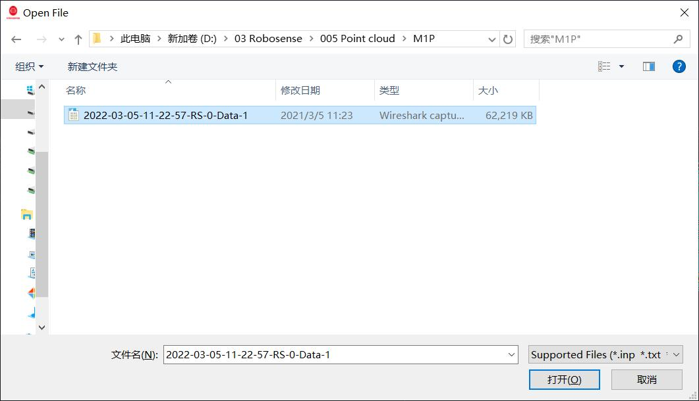
      <figcaption>图 A-12 打开 pcap 记录文件</figcaption>
    </figure>

3. 弹出 Sensor Type and Configuration 对话框，添加并选择正确的 RS-LiDAR-M1P 的配置文件并点击 OK 按钮。弹出 PCAP Network Configuration 对话框，输入正确的端口号并点击 OK 按钮。

4. 点击 Play 按钮可以播放或者暂停数据。使用 Scrub 滑动工具前后滑动可以选择数据中不同位置的帧 (图 A-15)。

    <figure markdown>
      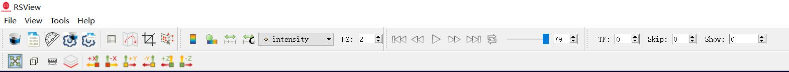
      <figcaption>图 A-13 RSView Play 按钮和 Scrub 滑动工具</figcaption>
    </figure>

5. 为了得到更为具体的分析，选择一帧您感兴趣的数据并且点击 Spreadsheet 按钮(图 A-16)。一个侧边栏数据表将会显示在软件中右边，在表中包含了这一帧所有的数据。

    <figure markdown>
      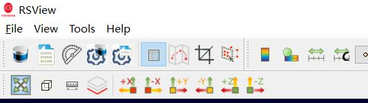
      <figcaption>图 A-14 RSView 表格工具</figcaption>
    </figure>

6. 可以调整表格每列的宽度，或者排序得到更直观的显示。

    <figure markdown>
      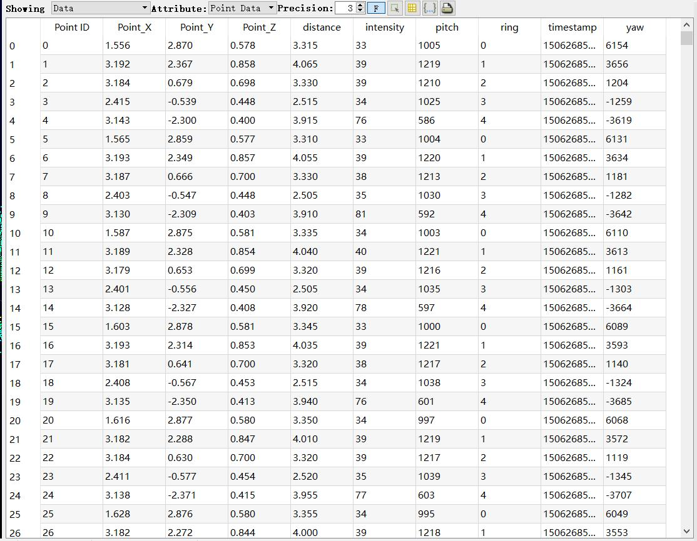
      <figcaption>图 A-15 RSView 表格显示</figcaption>
    </figure>

7. 点击 Spreadsheet 中的 Show only selected elements，可以得到所选择点对应的数据，当然如果没有选择，表格将为空(图 A-18)。

    <figure markdown>
      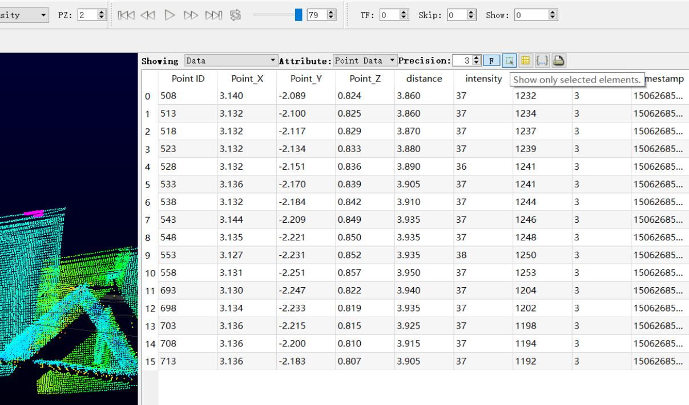
      <figcaption>图 A-16 RSView show only elements 工具</figcaption>
    </figure>

8. 点击 Select All Points 工具，这使得您的鼠标变成一个数据点选择工具（图 A-19）。

    <figure markdown>
      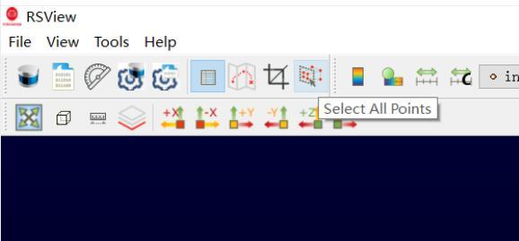
      <figcaption>图 A-17 RSView Select All Points 工具</figcaption>
    </figure>

9. 在 3D 数据显示空间中，使用鼠标画一个长方形框住一些数据点，这些点的数据将会在 Spreadsheet 被选择，并且在图中会变成粉红色(图 A-20)。

    <figure markdown>
      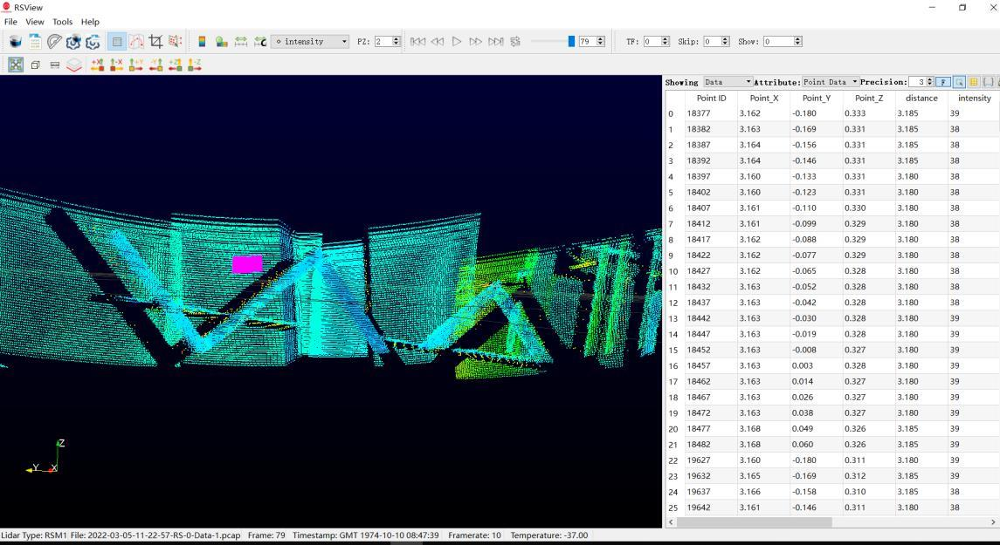
      <figcaption>图 A-18 RView List Selected Points 列表</figcaption>
    </figure>

10. 任何被选中的点都可以通过 Spreadsheet 工具栏 output csv data 保存（见图 A-21）。

    <figure markdown>
      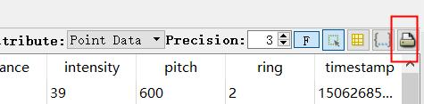
      <figcaption>图 A-19 RSView 输出选中点到 csv 文件</figcaption>
    </figure>

## 附录 B Driver & SDK

关于 RS-LiDAR-M1P Driver & SDK 文件及使用说明，请访问以下链接获取最新版本：
https://github.com/RoboSense-LiDAR/rslidar_sdk

## 附录 C 结构图纸

TE 接口雷达结构图纸:

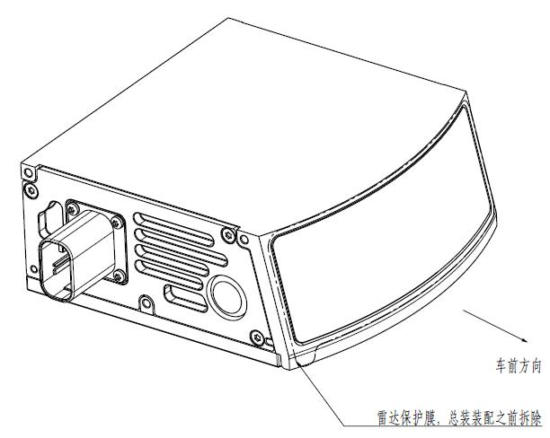

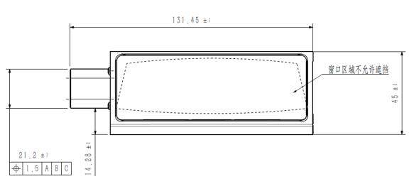

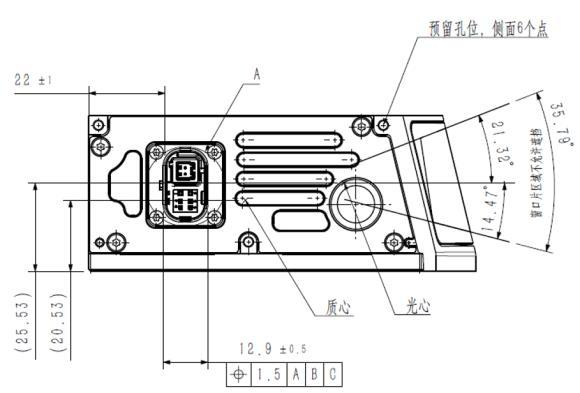

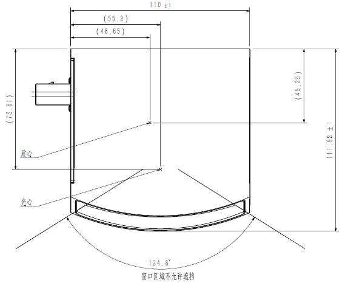

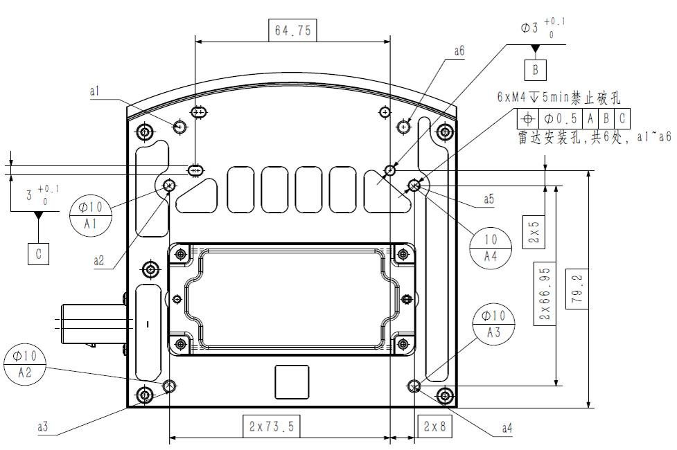

TE-Pin 脚定义说明:


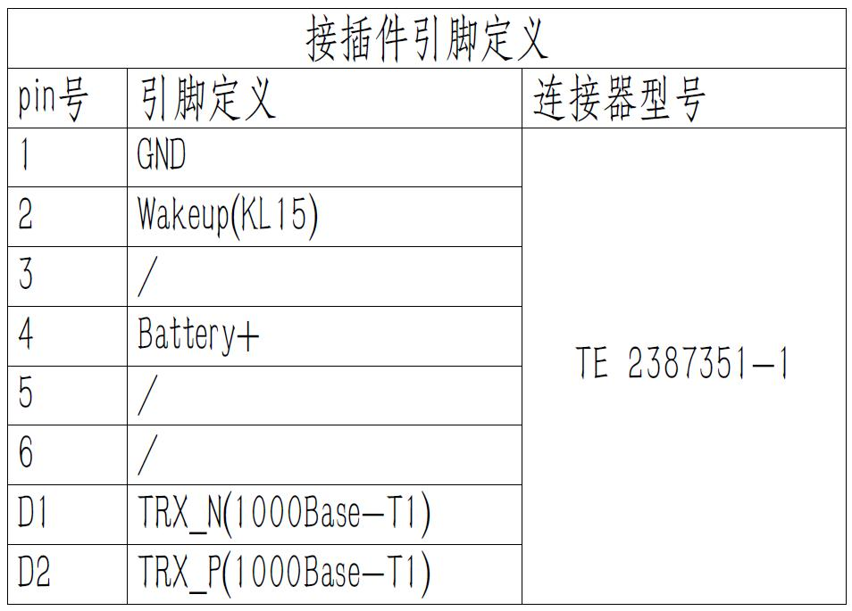

Smart Sensor, Safer World


深圳市速腾聚创科技有限公司

Shenzhen Suteng Innovation Technology Co., LTD.

Address: 深圳市南山区留仙大道 3370 号南山智园崇文园区 3 栋 10-11 层 10-11/F, Block 3,

Chongwen Garden, Nanshan IPark, 3370 Liuxian Avenue, Nanshan District, Shenzhen, China 

Web: www.robosense.ai 

Tel: 0755-8632-5830 

Email: service@robosense.cn 
