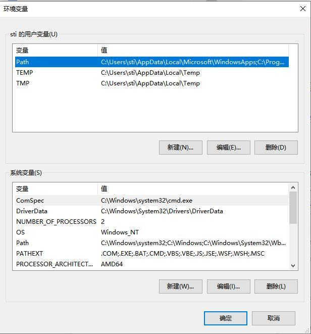
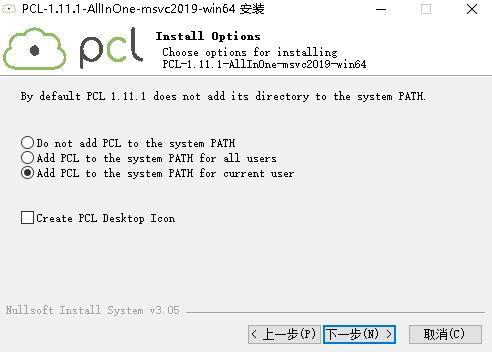

### A.1 rs_driver 的编译与安装

RS Driver 为 RoboSense 激光雷达提供跨平台的雷达驱动内核，方便用户二次开发使用。v 1.5.10 的驱动内核及之后的版本已支持本产品的点云解析及变换。可以在官方 GitHub 下载 rs_driver 包：

https://github.com/RoboSense-LiDAR/rs_driver 

rs_driver 目前支持下列系统和编译器:

1. Windows: 
    - MSVC (VS2017 & VS2019 已测试)
    - Mingw-w64 (x86_64-8.1.0-posix-seh-rt_v6-rev0 已测试)

2. Ubuntu (16.04, 18.04, 20.04): 
    - gcc (4.8 + ) 

#### A.1.1 依赖库的安装

rs_driver 依赖下列的第三方库，在编译之前需要先安装：

- Boost 
- Pcap 
- PCL (非必须, 如果不需要可视化工具可忽略)
- Eigen3 (非必须，如果不需要内置坐标变换可忽略)

在 Ubuntu 中安装以下依赖库:

```
sudo apt-get install libboost-dev libpcap-dev libpcl-dev libeigen3-dev
```

在 Windows 中安装以下依赖库:

- Boost 

    Windows 下需要从源码编译 Boost 库，请参考[官方指南](https://www.boost.org/doc/libs/1_67_0/more/getting_started/Windows.html)，编译安装完成之后，将 Boost 的路径添加到系统环境变量 `BOOST_ROOT`

    如果使用 MSVC，也可以选择直接下载相应版本的预编译的安装包。

    {: .manual-img--xl }
    <p align="center" style="font-size: 0.9em; color: gray;">环境变量添加示意图</p>

- pcap

    首先，安装 [pcap 运行库](https://www.winpcap.org/install/bin/WinPcap_4_1_3.exe)，然后下载[开发者包](https://www.winpcap.org/install/bin/WpdPack_4_1_2.zip)到任意位置，然后将 `WpdPack_4_1_2/WpdPack` 的路径添加到环境变量 `PATH`

- PCL (非必须，如果不需要可视化工具可忽略)：

    - MSVC 

        如果使用 MSVC 编译器，可使用 PCL 官方提供的安装包安装。安装过程中选择 “Add PCL to the system PATH for xxx”;

        {: .manual-img--xl }
        <p align="center" style="font-size: 0.9em; color: gray;">PCL 设置界面</p>

    - Mingw-w64

        PCL 官方并没有提供 mingw 编译的库，所以需要按照官方教程，从源码编译 PCL 并安装。

#### A.1.2 使用方式

##### A.1.2.1 rs_driver 安装使用

驱动编译以 Linux 环境为例（在 Windows 中 rs_driver 暂不支持安装使用），按顺序执行以下代码，安装驱动：

```bash
cd rs_driver
mkdir build && cd build
cmake .. && make -j4
sudo make install
```

##### A.1.2.2 作为子模块使用

在作为子模块使用时，需要添加如下命令到 `CMakeLists.txt` 文件中（将 rs_driver 作为子模块添加到工程内，使用 `find_package()` 指令找到 rs_driver 然后链接相关库）。

```cmake
add_subdirectory(${PROJECT_SOURCE_DIR}/rs_driver)
find_package(rs_driver REQUIRED)
include_directories(${rs_driver_INCLUDE_DIRS})
target_link_libraries(project ${rs_driver_LIBRARIES})
```

#### A.1.3 示例程序 & 可视化工具

##### A.1.3.1 示例程序

rs_driver 提供了两个示例程序，用户可参考示例程序编写代码调用接口，存放于 `rs_driver/demo` 中：

1. demo_online.cpp 
2. demo_pcap.cpp 

若希望编译这两个示例程序，执行 CMake 配置时加上参数：

```bash
cmake -DCOMPILE_DEMOS=ON ..
```

##### A.1.3.2 可视化工具

rs_driver 提供了一个基于 PCL 的点云可视化工具，存放于 `rs_driver/tool` 中：

1. rs_driver_viewer.cpp 

若希望编译可视化工具，执行 CMake 配置时加上参数：

```bash
cmake -DCOMPILE_TOOLS=ON ..
```

#### A.1.4 坐标变换

rs_driver 提供了内置的坐标变换功能，可以直接输出经过坐标变换后的点云，节省了用户对点云进行坐标变换的额外操作耗时。若希望启用此功能，执行 CMake 配置时加上参数：

```bash
cmake -DENABLE_TRANSFORM=ON ..
```

### A.2 rslidar_sdk 的编译与安装

rslidar_sdk 是 ROS 平台下的驱动 SDK，请通过 RoboSense GitHub 主页下载，或联系 RoboSense 获取。

1. rslidar_sdk 依赖 rs_driver

    [下载 rs_driver](https://github.com/RoboSense-LiDAR/rs_driver)

2. 如果使用环境为 ROS2，rslidar_sdk 还依赖 rslidar_msg

    [下载 rslidar_msg](https://github.com/RoboSense-LiDAR/rslidar_msg)

3. 驱动 SDK 包含丰富的使用指引，请在使用驱动 SDK 前，详细阅读其中的 README 以及 doc 文件夹下的文档。

    [下载 SDK](https://github.com/RoboSense-LiDAR/rslidar_sdk)
