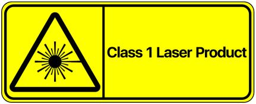
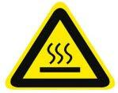

### 1.1 法律声明

!!! warning
    除非我们另行声明 RoboSense 的所有产品、技术、软件、程序、数据及其他信息（包括文字、图标、照片、音频、视频、图表、色彩组合、版面设计等）的所有权利（报告版权、商标权、专利权、商业秘密及其他相关权利）均归 RoboSense 及其授权方所有。

    未经 RoboSense 书面同意，任何人不得以任何方式非法使用本手册中所承载在的任何内容。

    “RoboSense”、“速腾聚创”等文字及/或标识，以及其他标识、产品和服务名称等均为 RoboSense 所有，如有宣传、展示等任何使用需要，您必须取得 RoboSense 的事先书面授权。

### 1.2 使用规范

!!! warning "请按以下要求，规范使用本产品"

    1. 请严格遵守国家激光安全相关法律法规；

    2. 请在使用产品前，详细阅读本产品手册；

    3. 请在相关针对的领域范围内使用本产品;

    4. 请避免在爆炸性、高腐蚀性、超越产品 IP 防护等级的环境中使用本产品。

### 1.3 违规操作

!!! warning "请按规定使用本产品，否则可能会造成产品损坏、财产损失及人员受伤。对违反规定的操作行为，需用户自行承担风险。"

    1. 请勿私自拆解、改装本产品（包含配套配件）

    2. 禁止使用非规定供电电源及配套配件

    3. 请避免跌落、碰撞、焚烧等非正常操作

    4. 如发现产品外观受损，请立即停止使用，并及时联系 RoboSense

    5. 如发现产品工作异常等情况,请立即停止使用,并及时联系 RoboSense

### 1.4 操作人员的要求

!!! warning "本产品的使用，对操作人员的基础专业知识及其他相关资质有一定要求。对无基础知识及未经培训上岗人员的不当操作行为，给产品及人员财产造成损害、伤害、损失等后果 RoboSense 不承担相关责任。"

    1. 使用产品前，详细阅读本产品手册；

    2. 禁止违规操作;

    3. 上岗前需经过培训，且有相关工种施工资格；

    4. 有一定的计算机数据连接、电气等基础知识。

### 1.5 工作安全和特殊危险

!!! warning "使用本产品前，为避免对用户或他人产生意外，同时损坏产品及违反保修条款，请务必仔细阅读并遵循本说明书中的操作及规范。"

    1. 激光安全：本产品激光安全等级符合 IEC 60825-1:2014 标准：

        

    2. 高温注意：注意表面过热标识，谨防发生意外。

        

    3. 保留说明：请保留所有安全和操作说明，以备将来参考。

    4. 注意警告：请遵守产品和操作说明中的所有警告，以免发生意外。

    5. 产品维修：请勿在缺少官方指导的情况下尝试打开产品进行维修。如需维修，请及时联系 RoboSense
