# Airy 产品手册

{: .manual-img--xl }

## 1 安全提示

--8<-- "snippets/safety-reminder.md"

## 2 产品描述

### 2.1 产品概要

Airy 是 RoboSense 专门为扫除盲区设计的新型近距离 3D 激光雷达，主要应用于机器人环境感知、无人驾驶汽车环境感知、无人机测绘、智慧城市等领域。

Airy 采用 RoboSense 创新性的信号处理技术，最小探测距离可近至 10 厘米，加上半球型超广视角的设计，可大范围内有效探测各类极近距离障碍物。

### 2.2 产品结构

Airy 结构图如图 1 所示。

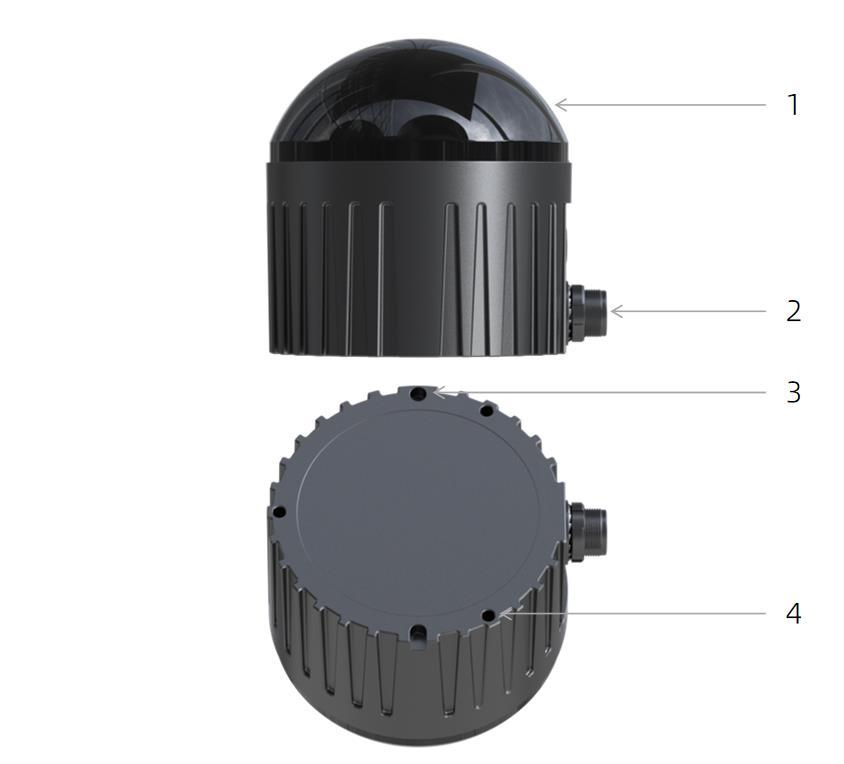{: .manual-img--xl }
<p align="center" style="font-size: 0.9em; color: gray;">图1 产品结构说明</p>

主要包括以下结构：

1. **防护罩**：激光雷达发射激光束和接收到的激光回波都需透过弧形特制防护罩，因此在激光发散的 FOV 范围内，严禁遮挡。

2. **航空插头**：激光雷达本体通过航插头与航插线连接，实现供电和数据传输的功能。

3. **定位孔**：用于支撑、固定激光雷达与支架之间的位置和方向，可提高安装效率与精度。

4. **M3螺钉安装孔**：用于激光雷达与安装支架间的固定，通过 M3 螺丝进行锁紧。

### 2.3 FOV 分布

Airy 的 FOV 在水平方向的角度范围是 $0 \sim 360^\circ$，在垂直方向的角度范围是 $0 \sim 90^\circ$，角度间隔为约为 $0.947^\circ$ 分布。96 路通道与真实的垂直角度对应关系如图 2 所示。

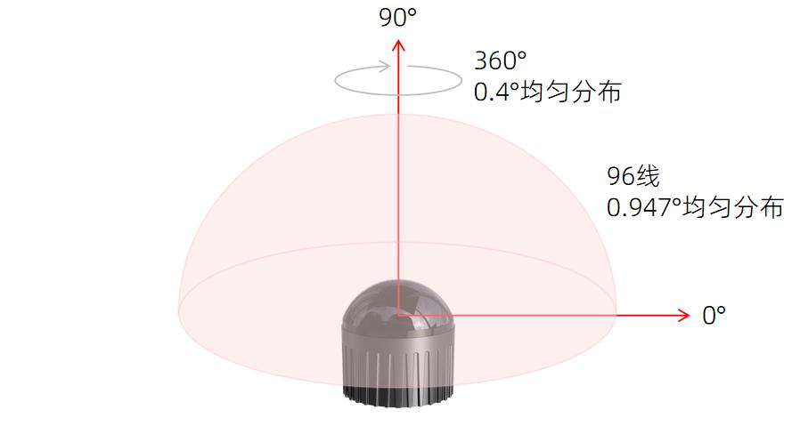{: .manual-img--xl }
<p align="center" style="font-size: 0.9em; color: gray;">图2 Airy FOV 示意图</p>

Airy 因其设计架构及扫描时序限制，每秒约有 9 ms 时间无法接收点云，也就是每 10 帧点云中有 1 帧点云出现约 $32^\circ$ 的点云缺口。该缺口的起始角度在量产固件上可配置，用户可根据实际需求配置在影响较小的位置处，见附录 A.2.2。

### 2.4 规格参数<sup>1</sup>

<p class="manual-table-caption">表1 Airy 规格参数</p>

<table class="manual-spec-grid-table">
  <tbody>
    <tr class="section-head">
      <th colspan="4">规格参数</th>
    </tr>
    <tr>
      <td class="spec-label">线数</td>
      <td class="spec-value">96</td>
      <td class="spec-label">水平视场角</td>
      <td class="spec-value">360°</td>
    </tr>
    <tr>
      <td class="spec-label">激光波长</td>
      <td class="spec-value">940 nm</td>
      <td class="spec-label">垂直视场角</td>
      <td class="spec-value">0~90°</td>
    </tr>
    <tr>
      <td class="spec-label">激光安全等级</td>
      <td class="spec-value">Class1 人眼安全</td>
      <td class="spec-label">水平角分辨率</td>
      <td class="spec-value">0.4°</td>
    </tr>
    <tr>
      <td class="spec-label">测距能力<sup>2</sup></td>
      <td class="spec-value">60 m (30 m @10% NIST)</td>
      <td class="spec-label">垂直角分辨率</td>
      <td class="spec-value">0.947°</td>
    </tr>
    <tr>
      <td class="spec-label">盲区</td>
      <td class="spec-value">0.1 m</td>
      <td class="spec-label">精度(典型值)<sup>3</sup></td>
      <td class="spec-value">1.5 cm (1 σ)</td>
    </tr>
    <tr>
      <td class="spec-label">转速</td>
      <td class="spec-value">600</td>
      <td class="spec-label">帧率</td>
      <td class="spec-value">10 Hz</td>
    </tr>
    <tr>
      <td class="spec-label">出点数</td>
      <td class="spec-value" colspan="3">856,320 pts / s</td>
    </tr>
    <tr>
      <td class="spec-label">以太网传输速率</td>
      <td class="spec-value" colspan="3">100 Base-TX</td>
    </tr>
    <tr>
      <td class="spec-label">输出数据协议</td>
      <td class="spec-value" colspan="3">UDP Packets Over Ethernet</td>
    </tr>
    <tr>
      <td class="spec-label">激光雷达数据包内容</td>
      <td class="spec-value" colspan="3">距离、反射强度、时间戳等</td>
    </tr>
    <tr>
      <td class="spec-label">工作电压</td>
      <td class="spec-value">9 V - 32 V</td>
      <td class="spec-label">尺寸<sup>4</sup></td>
      <td class="spec-value">Φ 60 mm (底部) × H 63 mm</td>
    </tr>
    <tr>
      <td class="spec-label">产品功率<sup>5</sup></td>
      <td class="spec-value">8 W(典型值)</td>
      <td class="spec-label">工作温度<sup>6</sup></td>
      <td class="spec-value">- 40℃ ～ + 60℃</td>
    </tr>
    <tr>
      <td class="spec-label">重量</td>
      <td class="spec-value">230g±20g(激光雷达本体)</td>
      <td class="spec-label">存储温度</td>
      <td class="spec-value">- 40℃ ～ + 85℃</td>
    </tr>
    <tr>
      <td class="spec-label">时间同步</td>
      <td class="spec-value">GPS, PTP &amp; gPTP</td>
      <td class="spec-label">防护等级</td>
      <td class="spec-value">IP67 / IP6K9K (工作中)</td>
    </tr>
    <tr>
      <td class="spec-label">产品型号</td>
      <td class="spec-value" colspan="3">Airy</td>
    </tr>
  </tbody>
</table>

<div class="spec-footnotes">

<p><sup>1</sup> 以下数据只针对量产产品，任何样品、试验机等其它非量产版本可能并不适用本规格数据，如有疑问请联系 RoboSense</p>

<p><sup>2</sup> 测距能力的测试结果可能受环境因素影响，包括但不限于环境温度和光照强度</p>

<p><sup>3</sup> 测距精度以 50% NIST 漫反射板为目标，测试结果会受到环境影响，包括但不限于环境温度、目标物距离等因素，且精度值适用于大部分通道，部分通道之间存在差异</p>

<p><sup>4</sup> 具体尺寸参考附录 E 结构图纸或整机数模</p>

<p><sup>5</sup> 设备功耗测试结果会受到外部环境影响，包括但不限于环境温度、目标物的距离、目标物反射强度等因素</p>

<p><sup>6</sup> 设备运行温度可能会受到外部环境影响，包括但不限于光照环境、气流变化等因素</p>

</div>

### 2.5 产品原理

#### 2.5.1 坐标映射

由于激光雷达封装的数据包仅为水平旋转角度和距离参量，为了呈现三维点云图的效果，将极坐标下的角度和距离信息转化为了笛卡尔坐标系下的 x, y, z 坐标，它们的转换关系如下式所示：

$$
\begin{cases}
x = r\cos(\omega)\sin(\alpha) + R\cos(\alpha) \\
y = r\cos(\omega)\cos(\alpha) + R\sin(\alpha) \\
z = r\sin(\omega) + Z
\end{cases}
$$

其中：
- $r$ 为实测距离
- $\omega$ 为激光的垂直角度
- $\alpha$ 为激光的水平旋转角度
- $R$ 为光心到原点的平面半径
- $Z$ 为光心到原点的 Z 轴高度
- $x, y, z$ 为极坐标投影到笛卡尔 X, Y, Z 轴上的坐标

#### 2.5.2 反射强度解读

Airy 激光雷达提供了反射强度信息来表征被测物体的反射率。在 Airy 数据中，标定后的反射强度范围区间为 1 ~ 255（该范围区间为 RoboSense 产品自定义的对目标反射率探测的数值）。

#### 2.5.3 回波模式

##### 2.5.3.1 回波模式原理

Airy 支持多种回波模式，包括**最强回波 (Strongest Return)**、**最后回波 (Last Return)**、及**最近回波 (First Return)** 模式。

Airy 分析接收到的多个返回值，并根据用户选择分别输出最强、最后、最近一个回波值。若设置为最强回波模式，则仅输出最强的反射回波值；若设置为最后回波模式，则仅输出时域上检测到的最后回波。

##### 2.5.3.2 回波模式标志

Airy 出厂默认为**最强回波 (Strongest Return)** 模式，如若用户需更改设置，可在 Web 端中产品回波模式参数设定进行配置。在 DIFOP 中第 300 个 byte 是回波模式的标志位。

<p class="manual-table-caption">表2 回波模式和标志位对照表</p>

<table class="packet-def-table echo-mode-table">
  <thead>
    <tr>
      <th>DIFOP Offset</th>
      <th>标志位</th>
      <th>回波模式</th>
    </tr>
  </thead>
  <tbody>
    <tr>
      <td rowspan="3">1</td>
      <td>00</td>
      <td>最强回波</td>
    </tr>
    <tr>
      <td>01</td>
      <td>最近回波</td>
    </tr>
    <tr>
      <td>02</td>
      <td>最后回波</td>
    </tr>
  </tbody>
</table>

#### 2.5.4 相位锁定

Airy 相位锁定功能可用于设定 Airy 在整秒时刻，传感器旋转到特定的角度发射激光。

图 3 展示了 Airy 在不同相位角度下的设定示意，红色箭头表示在整秒时刻，传感器旋转到 $0^\circ$、$135^\circ$ 和 $270^\circ$ 发射激光，坐标系细节参见图 11。

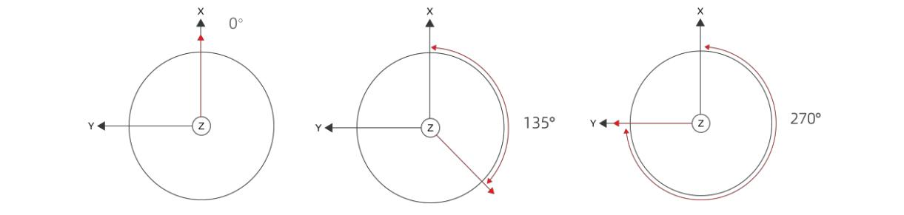{: .manual-img--xl }
<p align="center" style="font-size: 0.9em; color: gray;">图3 Airy 不同相位设定示意图</p>

Web 端 Setting > Phase Lock Setting 中提供了一个"Phase Lock"的参数设定，可用于设定锁定的相位角度，输入范围为 0～360 的整数，详情参见产品手册章节 4.2

#### 2.5.5 时间同步方式

Airy 支持 **GPS + PPS**、**PTP**（IEEE 1588 V2 协议）、**gPTP**（IEEE 802.1 AS 协议）三种同步方式，用户可在 Web 端进行设置，详情参见产品手册章节 4.2

##### 2.5.5.1 GPS 时间同步原理

GPS 模块连续向产品发送 GPRMC 数据和 PPS 同步脉冲信号，PPS 同步脉冲长度为 20～200 ms，GPRMC 数据必须在 PPS 同步脉冲下降沿后 10 ms 之后发射，在下一个 PPS 同步脉冲上升沿前 300 ms~500 ms 之间完成（建议 GPRMC 数据在两个 PPS 脉冲信号的正中间发送）。时序图如图 4 所示。

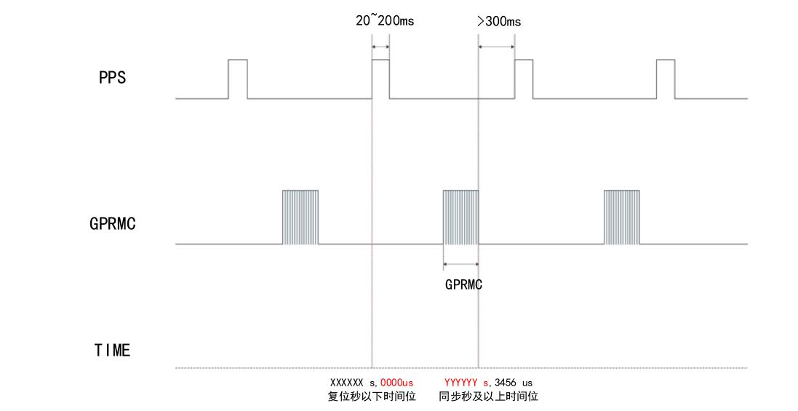{: .manual-img--xl }
<p align="center" style="font-size: 0.9em; color: gray;">图4 GPS 时间同步时序图</p>

!!! tip "提示"
    为确保时间同步的准确性，建议将 PPS 的脉宽设置在 20～200 ms 之间。GPRMC 的完成时间建议为 PPS 下降沿后 10 ms 和下一个 PPS 上升沿前 300～500 ms 之间。

##### 2.5.5.2 GPS 时间同步使用

Airy 激光雷达 GPS 接口电平协议为 **RS232** 电平标准，详情参见表 3

<p class="manual-table-caption">表3 产品授时引脚定义</p>

<table class="packet-def-table timing-pin-table">
  <thead>
    <tr>
      <th rowspan="2">通讯方式</th>
      <th colspan="2">接收引脚定义</th>
    </tr>
    <tr>
      <th>GPS GPRMC</th>
      <th>GPS PULSE</th>
    </tr>
  </thead>
  <tbody>
    <tr>
      <td>RS232</td>
      <td>接 GPS 模块输出的 RS232 电平标准的串口数据</td>
      <td>接 GPS 模块输出的正同步脉冲信号，电平要求 3.0 ~ 15.0 V</td>
    </tr>
  </tbody>
</table>

外接的 GPS 模块需要设置输出串口的波特率为 **9600 bps**，数据位 **8 bits**，无校验位，停止位 **1 bit**。Airy 只读取 GPS 模块发出的 GPRMC 格式的数据，其标准格式如下：

```
$GPRMC,<1>,<2>,<3>,<4>,<5>,<6>,<7>,<8>,<9>,<10>,<11>,<12>*hh
```

字段说明：

- `<1>` UTC 时间
- `<2>` 定位状态，A=有效定位，V=无效定位
- `<3>` 纬度
- `<4>` 纬度半球 N(北半球)或 S(南半球)
- `<5>` 经度
- `<6>` 经度半球 E(东经)或 W(西经)
- `<7>` 地面速率
- `<8>` 地面航向
- `<9>` UTC 日期
- `<10>` 磁偏角
- `<11>` 磁偏角方向，E(东)或W(西)
- `<12>` 模式指示 (A=自主定位, D=差分, E=估算, N=数据无效)

`*` 后 hh 为到 `*` 所有字符的异或和

!!! tip "提示"
    1. Airy 航插线上面的 GPS REC 接口规格为 SM2.54 插头，引脚定义如图 8 所示
    2. 1 PPS 脉冲的发送时间间隔需控制在 $1 s \pm 200 \mu s$ 内
    3. GPRMC 消息中状态位必须在 A 有效的情况才允许进行时间同步授时
    4. 目前市场的 GPS 模块发出的 GPRMC 消息长度存在不一致情况，本产品可兼容市场上大部分 GPS 模块发出来的 GPRMC 消息格式，如果在使用过程中发现不兼容的情况，请联系 RoboSense

##### 2.5.5.3 PTP 同步原理

PTP（Precision Time Protocol，IEEE 1588V2 协议）是一种时间同步的协议，其本身只是用于设备之间的高精度时间同步，但也可被借用于设备之间的频率同步。相比现有的各种时间同步机制，PTP 具备以下优势：

1. 相比 NTP（Network Time Protocol，网络时间协议），PTP 能够满足更高精度的时间同步要求，NTP 一般只能达到亚秒级的时间同步精度，而 PTP 则可达到亚微秒级；
2. 相比 GPS（Global Positioning System，全球定位系统），PTP 具备更低的建设和维护成本。

##### 2.5.5.4 gPTP 同步原理

gPTP (general Precise Time Protocol, IEEE802.1AS 协议) 是 PTP 在时效性网络（Time-Sensitive Networking）的派生协议。同步机制采用和 PTP 协议一致的 P2P 端延迟机制（Peer Delay Mechanism），同时采用以太网 L2 层通信。与 PTP 不同，gPTP 要求使用硬件方式打时间戳，即硬件时间戳，所以对于交换机和 Master 时钟要求较为严苛，需满足 IEEE802.1AS 协议。

##### 2.5.5.5 PTP/gPTP 接线方式

使用 PTP / gPTP 同步方式，需要做以下准备：

1. 在 Web 端中选择 PTP / gPTP 模式
2. PTP Master / gPTP Master 授时主机（即插即用，无需额外配置）
3. 以太网交换机
4. 支持 PTP / gPTP 协议的待授时设备

!!! tip "提示"
    1. Master 授时设备属于第三方设备，RoboSense 出货时不包含此配件，需用户自行采购；
    2. RoboSense 产品作为 Slave 设备只获取 Master 发出的时间，不对 Master 时钟源的准确度判断，若解析激光雷达点云时间出现突变，请检查 Master 提供的时间是否准确；
    3. 激光雷达同步之后，Master 断开连接，点云数据包中的时间则会按照激光雷达内部时钟进行叠加，激光雷达断电重启后才会被重置。

## 3 产品安装

### 3.1 配件说明

Airy 出货配件清单如表 4 所示，清单仅供参考。

<p class="manual-table-caption">表4 Airy 配件清单</p>

<div class="manual-table-wrap">
<table class="accessories-table">
  <thead>
    <tr>
      <th>序号</th>
      <th>配件名称</th>
      <th>规格</th>
      <th>数量</th>
    </tr>
  </thead>
  <tbody>
    <tr>
      <td>1</td>
      <td>激光雷达<br>LiDAR</td>
      <td>Airy</td>
      <td>1</td>
    </tr>
    <tr>
      <td>2</td>
      <td>螺丝包<br>Screw Pack</td>
      <td>M3*8</td>
      <td>3</td>
    </tr>
    <tr>
      <td>3</td>
      <td>螺丝包（选配）<br>Screw Pack</td>
      <td>M3*12</td>
      <td>3</td>
    </tr>
    <tr>
      <td>4</td>
      <td>航插连接线（选配）<br>Aviation Connector Cable</td>
      <td>1.5m</td>
      <td>1</td>
    </tr>
    <tr>
      <td>5</td>
      <td>电源适配器（选配）<br>Power Adapter</td>
      <td>DC12 V × 3.34 A / 40 W</td>
      <td></td>
    </tr>
    <tr>
      <td>6</td>
      <td>电源线（选配）<br>Power Cable</td>
      <td>1.2 m</td>
      <td></td>
    </tr>
    <tr>
      <td>7</td>
      <td>网线（选配）<br>Ethernet Cable</td>
      <td>1.5 m</td>
      <td>1</td>
    </tr>
    <tr>
      <td>8</td>
      <td>产品包装清单和出货检验报告<br>Product Packing List and Shipment Inspection Report</td>
      <td>/</td>
      <td>1</td>
    </tr>
  </tbody>
</table>
</div>

!!! tip "提示"
    如特殊要求请以商务协议为准

### 3.2 机械安装

激光雷达的结构安装图如图 5 所示。

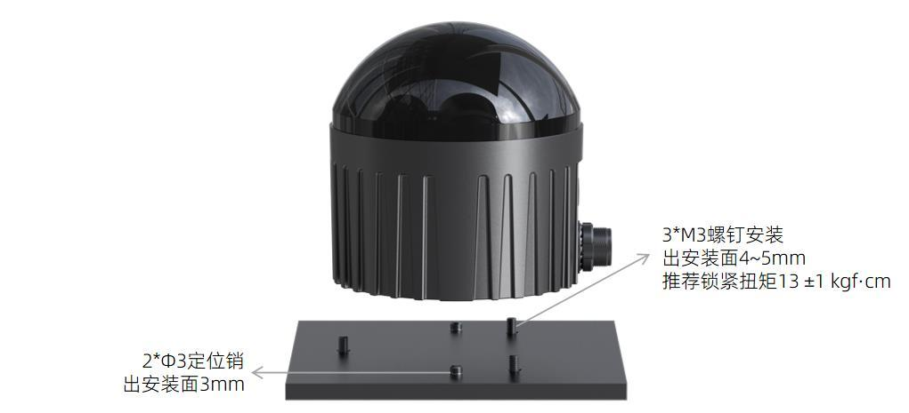{: .manual-img--xl }
<p align="center" style="font-size: 0.9em; color: gray;">图5 激光雷达结构安装示意图</p>

**1. 螺丝规格：**

- GB/T70.1，M3×8，内六角杯头，强度等级10.9，带耐落

**2. 安装要求：**

- 安装面平面度应优于 0.15 mm
- 底面用 3 个 M3 螺钉安装，出安装面 4~5 mm，推荐锁紧扭矩 $13 \pm 1$ kgf·cm
- 底面用 2 个 Φ3 定位销进行安装定位，出安装面 3 mm
- 激光雷达安装的时候，如果激光雷达上下面都有接触式的安装面，请确保安装面之间的间距大于激光雷达高度，避免挤压激光雷达
- 激光雷达安装走线时，请勿使激光雷达接线线缆太过紧绷（预留 2 cm 以上安装裕量），确保线缆具有一定的松弛度

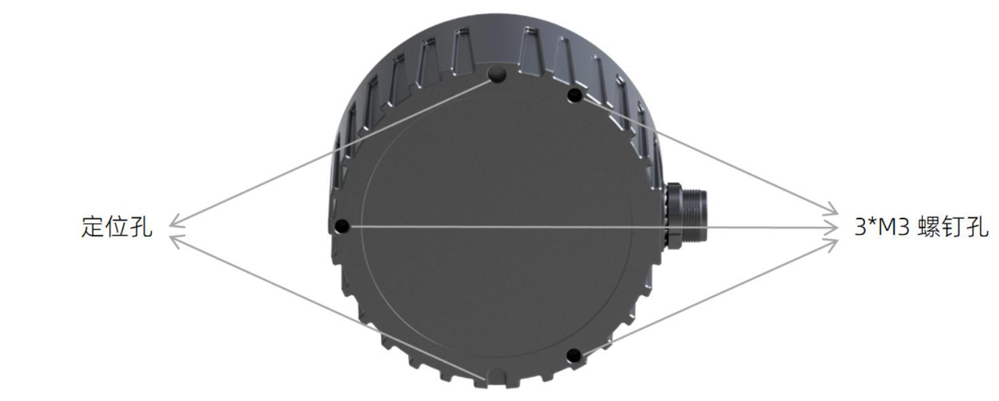{: .manual-img--xl }
<p align="center" style="font-size: 0.9em; color: gray;">图6 激光雷达底部定位孔及螺钉孔示意图</p>

**3. 支架刚度和强度要求：**

- 固定支架需有较好的刚性用于安装固定激光雷达，并在各种工况下保持激光雷达处于一个稳定的状态，因此要求激光雷达及其固定支架整体的一阶模态频率至少大于 $50 Hz$
- 激光雷达在使用过程中会经受各种随机振动、机械冲击等工况。在这些工况下，支架需承受较大的负载，因此支架还需有足够的强度。支架材质建议使用铝合金（厚度 4 mm 以上）或镀锌钢板（厚度 2 mm 以上），同时在各个方向尽可能增加加强筋以提高其刚度和强度，尽量避免设计出现尖角或小于 0.3 mm 的圆角、缺口等易产生应力集中的结构，支架强度需要经过仿真校核

**4. 散热要求：**

- 支架材料建议采用导热系数大于 $50 W/m \cdot K$ 的铝合金或者镀锌钢板等材料，尽量在支架上做一些散热鳍片，并合理的控制鳍片间距、高度和方向，尽量增大散热面积，方向上与空气对流方向一致，可以更有效散热
- 激光雷达底座或顶盖部位，确保不被非金属材质包覆，以免影响整机散热，造成激光雷达温升过高
- 若客户安装方式对散热不友好，或者无法确定散热状态是否 OK，请提前与我司 FAE 沟通，确定好散热方案，避免雷达过热导致影响产品性能或寿命

### 3.3 接口说明

#### 3.3.1 航插接口及定义

Airy 激光雷达侧的航插头，如图 7 所示。

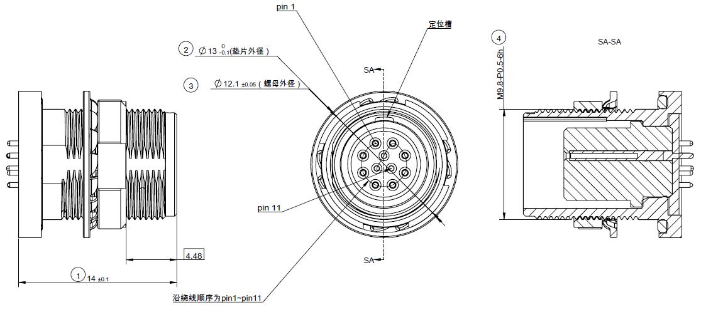{: .manual-img--xl }
<p align="center" style="font-size: 0.9em; color: gray;">图7 航插接口引脚序号</p>

雷达侧的航插接口上具体引脚定义参见表 5。

<p class="manual-table-caption">表5 航插接口引脚定义</p>

<div class="manual-table-wrap">
<table class="pin-def-table">
  <thead>
    <tr>
      <th>引脚编号</th>
      <th>规格</th>
      <th>信号</th>
    </tr>
  </thead>
  <tbody>
    <tr>
      <td>1</td>
      <td>26AWG</td>
      <td>2P(RX+)</td>
    </tr>
    <tr>
      <td>2</td>
      <td>26AWG</td>
      <td>2N(RX-)</td>
    </tr>
    <tr>
      <td>3</td>
      <td>26AWG</td>
      <td>1P(TX+)</td>
    </tr>
    <tr>
      <td>4</td>
      <td>26AWG</td>
      <td>1N(TX-)</td>
    </tr>
    <tr>
      <td>5</td>
      <td>26AWG</td>
      <td>GND</td>
    </tr>
    <tr>
      <td>6</td>
      <td>26AWG</td>
      <td>VIN</td>
    </tr>
    <tr>
      <td>7</td>
      <td>26AWG</td>
      <td>VIN</td>
    </tr>
    <tr>
      <td>8</td>
      <td>26AWG</td>
      <td>GND</td>
    </tr>
    <tr>
      <td>9</td>
      <td>30AWG</td>
      <td>GPS PPS</td>
    </tr>
    <tr>
      <td>10</td>
      <td>30AWG</td>
      <td>SYNC_OUT1</td>
    </tr>
    <tr>
      <td>11</td>
      <td>30AWG</td>
      <td>GPS GPRMC</td>
    </tr>
  </tbody>
</table>
</div>

#### 3.3.2 连接线（选配）

Airy 选配附件连接线如下图示：

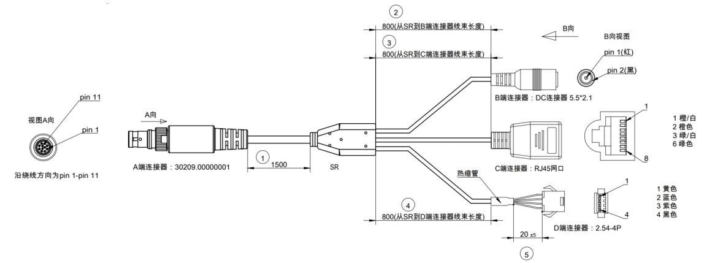{: .manual-img--xl }
<p align="center" style="font-size: 0.9em; color: gray;">图8 连接线示意图</p>

连接线各接口规格详情参见表 6。

<p class="manual-table-caption">表6 航插线接口规格</p>

<div class="manual-table-scroll-wrap">
<table class="packet-def-table aviation-cable-table">
  <thead>
    <tr>
      <th>A 端序号</th>
      <th>芯线规格</th>
      <th>芯线定义</th>
      <th>A 端颜色</th>
      <th>B 端序号</th>
      <th>C 端序号</th>
      <th>D 端序号</th>
      <th>D 端颜色</th>
    </tr>
  </thead>
  <tbody>
    <tr>
      <td>1</td>
      <td>26AWG</td>
      <td>2P(RX+)</td>
      <td>橙白色</td>
      <td>\</td>
      <td>1</td>
      <td>\</td>
      <td>\</td>
    </tr>
    <tr>
      <td>2</td>
      <td>26AWG</td>
      <td>2N(RX-)</td>
      <td>橙色</td>
      <td>\</td>
      <td>2</td>
      <td>\</td>
      <td>\</td>
    </tr>
    <tr>
      <td>3</td>
      <td>26AWG</td>
      <td>1P(TX+)</td>
      <td>绿白色</td>
      <td>\</td>
      <td>3</td>
      <td>\</td>
      <td>\</td>
    </tr>
    <tr>
      <td>4</td>
      <td>26AWG</td>
      <td>1N(TX-)</td>
      <td>绿色</td>
      <td>\</td>
      <td>6</td>
      <td>\</td>
      <td>\</td>
    </tr>
    <tr>
      <td>5</td>
      <td>26AWG</td>
      <td>GND</td>
      <td>黑色</td>
      <td>2</td>
      <td>\</td>
      <td>\</td>
      <td>\</td>
    </tr>
    <tr>
      <td>6</td>
      <td>26AWG</td>
      <td>VIN</td>
      <td>红色</td>
      <td>1</td>
      <td>\</td>
      <td>\</td>
      <td>\</td>
    </tr>
    <tr>
      <td>7</td>
      <td>26AWG</td>
      <td>VIN</td>
      <td>红色</td>
      <td>1</td>
      <td>\</td>
      <td>\</td>
      <td>\</td>
    </tr>
    <tr>
      <td>8</td>
      <td>26AWG</td>
      <td>GND</td>
      <td>黑色</td>
      <td>2</td>
      <td>\</td>
      <td>4</td>
      <td>黑色</td>
    </tr>
    <tr>
      <td>9</td>
      <td>30AWG</td>
      <td>GPS PPS</td>
      <td>紫色</td>
      <td>\</td>
      <td>\</td>
      <td>3</td>
      <td>紫色</td>
    </tr>
    <tr>
      <td>10</td>
      <td>30AWG</td>
      <td>SYNC_OUT1</td>
      <td>蓝色</td>
      <td>\</td>
      <td>\</td>
      <td>2</td>
      <td>蓝色</td>
    </tr>
    <tr>
      <td>11</td>
      <td>30AWG</td>
      <td>GPS GPRMC</td>
      <td>黄色</td>
      <td>\</td>
      <td>\</td>
      <td>1</td>
      <td>黄色</td>
    </tr>
  </tbody>
</table>
</div>

#### 3.3.3 电源接口

Airy 电源接口使用标准 **DC 5.5 - 2.1** 接口。

若连接电源后，雷达电机不转动，可能是线束损坏，请联系 Robosense

!!! info "重要"
    1. 本机接地方式：本雷达采用机壳与内部电路板共地设计。
    2. 安装环境建议：当安装环境中的设备外壳为浮地状态时，为确保设备正常工作并防止潜在干扰，建议通过非金属绝缘件或其他方式，使雷达外壳与设备外壳之间实现电气隔离。

#### 3.3.4 RJ45 网口

Airy 网络接口遵循 **EIA / TIA568B** 标准。

#### 3.3.5 同步接口

Airy 同步接口定义：

- **GPS REC** 为 GPS GPRMC 输入
- **GPS PULSE** 为 GPS PPS 输入

!!! info "重要"
    Airy 的"地"与外部系统连接时，外部系统供电电源负极（"地"）与 GPS 系统的"地"必须为非隔离共地系统。

### 3.4 快速连接

Airy 网络参数可配置，出厂默认采用固定 IP 和端口号模式，详情参见表 7。

<p class="manual-table-caption">表7 出厂默认网络配置表</p>

<div class="manual-table-wrap">
<table class="manual-network-table manual-network-table--four-col">
  <colgroup>
    <col class="net-col-device" />
    <col class="net-col-ip" />
    <col class="net-col-port" />
    <col class="net-col-port" />
  </colgroup>
  <thead>
    <tr>
      <th>设备</th>
      <th>IP 地址</th>
      <th>MSOP 包端<br>口号</th>
      <th>DIFOP 包端<br>口号</th>
    </tr>
  </thead>
  <tbody>
    <tr>
      <td>Airy</td>
      <td>192.168.1.200</td>
      <td rowspan="2"><span class="network-port-value">6699</span></td>
      <td rowspan="2"><span class="network-port-value">7788</span></td>
    </tr>
    <tr>
      <td>电脑</td>
      <td>192.168.1.102</td>
    </tr>
  </tbody>
</table>
</div>

用户使用产品时，需要把电脑的 IP 设置为与产品同一网段上，例如 192.168.1.x (x 的取值范围为 1～254)，子网掩码为 255.255.255.0

未知产品网络配置信息，请连接产品并使用 Wireshark 抓取产品输出包进行分析。配置 IP 与连接方式如下：

**1. 连接激光雷达**

连接方式如图 9 所示。

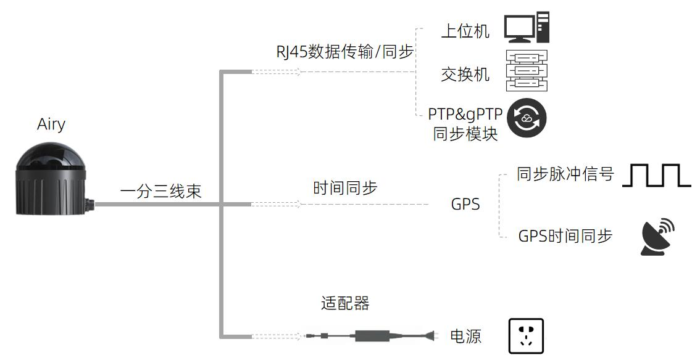{: .manual-img--xl }
<p align="center" style="font-size: 0.9em; color: gray;">图9 雷达航插线连接示意图</p>

1. 激光雷达通过航插头转连接接口
2. PC 与航插线间通过 RJ45 网口接头进行连接
3. 通电后，激光雷达即可正常工作

**2. 通过 Wireshark 抓包，解析 ARP 报文进行本地 IP 配置**

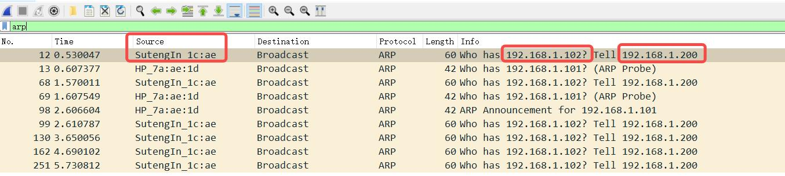{: .manual-img--xl }
<p align="center" style="font-size: 0.9em; color: gray;">图10 解析 ARP 报文</p>

1. 如上步骤，激光雷达与 PC 完成连接后，启动 Wireshark（第三方网络解析工具），选择正确的网口，开始抓包
2. 通过 Wireshark 的搜索框，输入 "arp" 进行搜索激光雷达与 PC 间的互相寻址报文，如图 10 所示
3. Source 列中的 SutengIn 字样为激光雷达的信息源，提示 192.168.1.200 为 Source IP，即为激光雷达 IP，再请求访问 192.168.1.102，即为 PC IP

**3. 配置 PC 的本地 IP**

1. 在控制面板中，通过"网络与 Internet"进入"网络与共享中心"，在"查看活动网络"内容中，点击对应的以太网连接，进入对应的"以太网状态"，点击其中的"属性"设置
2. 双击 Internet 协议版本 4（TCP/IPv4），进入 IP 信息设置，使用静态 IP 进行配置
3. 将本地 IP 地址设置为 192.168.1.102，子网掩码 255.255.255.0，点击"确认"，完成 PC 的静态 IP 设置

**4. 连接完成**

!!! tip "提示"
    1. 时间同步模块（PTP & gPTP、GPS 时间同步模块）非出厂标配产品，如需使用相关功能，请自行购买
    2. 以上配置本地静态 IP 仅以 Windows 系统操作为例，其它操作系统请以实际为准

## 4 产品使用

### 4.1 产品坐标系

产品的坐标及旋转方向如图 11 所示。关于激光雷达坐标原点数值以及 IMU 的外参，可以通过 SDK 或者 DIFOP 的对应字段获取。

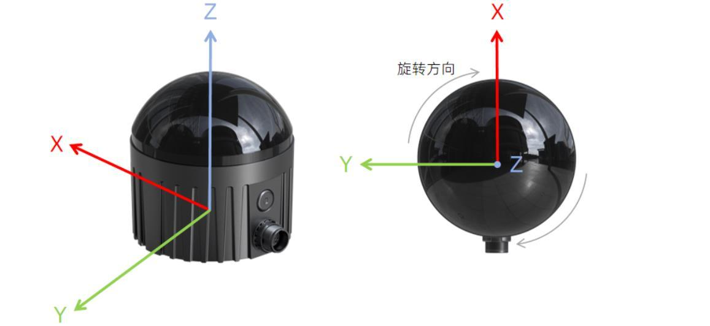{: .manual-img--xl }
<p align="center" style="font-size: 0.9em; color: gray;">图11 激光雷达坐标及旋转方向示意图</p>

!!! tip "提示"
    激光雷达的坐标原点定义在激光雷达底座中心处

### 4.2 Web 端使用

#### 4.2.1 Web 端功能

Airy 支持通过网页端对产品进行参数设定、运行信息/状态查看及固件升级等操作。

Airy Web 地址跟随 Device IP 变化而变化，出厂默认 Device IP 为 192.168.1.200，若用户更改过 Device IP，则 Web 地址变更为新设定的 IP 地址。

#### 4.2.2 访问 Web 端

产品按照要求连接及正确配置完成后，使用连接激光雷达的电脑浏览器访问产品 IP 地址（默认 Device IP：192.168.1.200）进入激光雷达 Web 首页，首页默认为"Device"栏。

#### 4.2.3 使用 Web 端

关于使用 Web 进行操作详情参见产品手册附录 A。

### 4.3 RSView 使用

在 Airy 的数据的检测上，可使用 Wireshark 和 tcp-dump 等免费工具获取原始数据，而 RSView 可帮助用户更为便捷地实现对原始数据的可视化。

#### 4.3.1 软件功能

RSView 提供将 Airy 数据进行实时可视化的功能。RSView 也能回放保存为 ".pcap" 文件格式的数据，但是目前还不支持 ".pcapng" 格式的文件。

RSView 将 Airy 得到距离测量值显示为一个点。它能够支持多种自定义颜色来显示数据，例如反射强度、时间、距离、水平角度和激光线束序号。所显示的数据能够导出保存为 ".csv" 格式，RSView 3.1.3 以后的版本支持导出 ".las" 格式的数据。

RSView 包含以下功能：

1. 通过以太网实时显示数据
2. 将实时数据记录保存为 PCAP 文件
3. 从记录的 PCAP 文件中回放
4. 不同类型可视化模式，例如距离、时间、水平角度等等
5. 用表格显示点的数据
6. 将点云数据导出为 CSV 格式文件
7. 测量距离工具
8. 将回放数据的连续多帧同时显示
9. 显示或者隐藏 Airy 中个别线束
10. 裁剪显示

#### 4.3.2 安装 RSView

RSView 支持在 Windows 64 位、Ubuntu 18.04 以上操作系统上运行。可从 Robosense 的官网（http://www.robosense.cn/resources）下载最新版本 RSView 软件压缩包。下载后，软件的解压路径请勿出现中文字符，软件无需安装，解压后运行可执行文件即可正常使用。

#### 4.3.3 使用 RSView

打开 RSview 后，在软件界面，可通过 F1 按钮打开软件使用指南，或通过点击软件菜单栏 Help 选项中的 RS-LiDARUserGuide 进行查阅。

### 4.4 通信协议

Airy 与电脑之间的通信采用以太网介质，使用 UDP 协议，和电脑之间的通信协议主要分为两类，详情参见表 8。

<p class="manual-table-caption">表8 产品协议一览表</p>

<table class="packet-def-table product-protocol-table">
  <colgroup>
    <col class="pp-col-name" />
    <col class="pp-col-abbr" />
    <col class="pp-col-func" />
    <col class="pp-col-type" />
    <col class="pp-col-size" />
    <col class="pp-col-rate" />
  </colgroup>
  <thead>
    <tr>
      <th>（协议/包）名称</th>
      <th>简写</th>
      <th>功能</th>
      <th>类型</th>
      <th>包大小</th>
      <th>发送间隔</th>
    </tr>
  </thead>
  <tbody>
    <tr>
      <td>Main Data Stream Output Protocol</td>
      <td>MSOP</td>
      <td>扫描数据输出</td>
      <td>UDP</td>
      <td>1248 bytes</td>
      <td>约 444.44 us</td>
    </tr>
    <tr>
      <td>Device Information Output Protocol</td>
      <td>DIFOP</td>
      <td>产品信息输出</td>
      <td>UDP</td>
      <td>1248 bytes</td>
      <td>约 1 s</td>
    </tr>
  </tbody>
</table>

!!! tip "提示"
    1. 产品手册 4.4 节皆为对协议中的有效载荷（1248 bytes）部分进行描述和定义
    2. 主数据流输出协议 MSOP，将激光雷达扫描出来的距离，角度，反射强度等信息封装成包输出
    3. 产品信息输出协议 DIFOP，将激光雷达当前状态的各种配置信息输出

#### 4.4.1 MSOP 与 DIFOP 数据协议

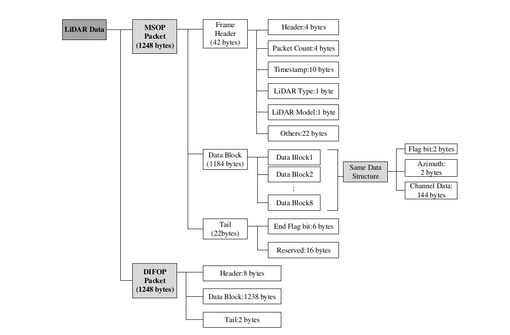{: .manual-img--xl }
<p align="center" style="font-size: 0.9em; color: gray;">图12 激光雷达数据结构图</p>

#### 4.4.2 主数据流输出协议（MSOP）

主数据流输出协议：Main data Stream Output Protocol，简称：MSOP

- **I/O 类型**：产品输出，电脑解析
- **出厂默认端口号**：6699

##### 4.4.2.1 帧头

帧头 Header 共 42 bytes，用于识别出数据的开始位置。

<p class="manual-table-caption">表9 MSOP Header 数据表</p>

<table class="packet-def-table msop-header-table">
  <thead>
    <tr>
      <th>信息</th>
      <th>Offset</th>
      <th>长度 (byte)</th>
      <th>释义</th>
      <th>总长度 (byte)</th>
    </tr>
  </thead>
  <tbody>
    <tr>
      <td>pkt_head</td>
      <td>0</td>
      <td>4</td>
      <td>0x55AA055A</td>
      <td rowspan="9">42</td>
    </tr>
    <tr>
      <td>REV0</td>
      <td>4</td>
      <td>8</td>
      <td>/</td>
    </tr>
    <tr>
      <td>pktcnt</td>
      <td>12</td>
      <td>4</td>
      <td>发送包循环计数：0-65535</td>
    </tr>
    <tr>
      <td>REV1</td>
      <td>16</td>
      <td>4</td>
      <td>/</td>
    </tr>
    <tr>
      <td>timestamp</td>
      <td>20</td>
      <td>10</td>
      <td>时间戳，前 6 byte 表示秒，后 4 byte 表示微秒</td>
    </tr>
    <tr>
      <td>REV2</td>
      <td>30</td>
      <td>1</td>
      <td>/</td>
    </tr>
    <tr>
      <td>lidar_type</td>
      <td>31</td>
      <td>1</td>
      <td>0x31: airy</td>
    </tr>
    <tr>
      <td>lidar_model</td>
      <td>32</td>
      <td>1</td>
      <td>0x02:96 线</td>
    </tr>
    <tr>
      <td>REV3</td>
      <td>33</td>
      <td>9</td>
      <td>/</td>
    </tr>
  </tbody>
</table>

!!! tip "提示"
    定义的时间戳用来记录系统的时间，分辨率为 $1 \mu s$，具体参见产品手册附录 C.9 中的时间定义。

##### 4.4.2.2 数据块区间

如表 10 所示，数据块区间 Data block 是 MSOP 包中传感器测量值部分，共 1184 bytes。它由 8 个 Data block 组成，每个 block 长度为 148 bytes。

Data block 中 148 bytes 的空间包括：2 bytes 的标志位，使用 0xffee 表示；2 bytes 的 Azimuth，表示水平旋转角度信息，每个角度信息对应着 48 个的 channel data。

<p class="manual-table-caption">表10 Data Block 数据包定义</p>

<table class="packet-def-table data-block-table">
  <thead>
    <tr>
      <th>说明</th>
      <th colspan="5">数据块 (1184 bytes)</th>
    </tr>
    <tr>
      <th>数据块序号</th>
      <th>Data Block 1</th>
      <th>Data Block 2</th>
      <th>…</th>
      <th>Data Block 7</th>
      <th>Data Block 8</th>
    </tr>
  </thead>
  <tbody>
    <tr>
      <td>标志位</td>
      <td>0xffee</td>
      <td>0xffee</td>
      <td>…</td>
      <td>0xffee</td>
      <td>0xffee</td>
    </tr>
    <tr>
      <td>水平旋转角</td>
      <td>Azimuth 1</td>
      <td>Azimuth 1</td>
      <td>…</td>
      <td>Azimuth 2</td>
      <td>Azimuth 2</td>
    </tr>
    <tr>
      <td>通道 1</td>
      <td>Channel Data 1</td>
      <td>Channel Data 49</td>
      <td>…</td>
      <td>Channel Data 1</td>
      <td>Channel Data 49</td>
    </tr>
    <tr>
      <td>通道 2</td>
      <td>Channel Data 2</td>
      <td>Channel Data 50</td>
      <td>…</td>
      <td>Channel Data 2</td>
      <td>Channel Data 50</td>
    </tr>
    <tr>
      <td>…</td>
      <td>…</td>
      <td>…</td>
      <td>…</td>
      <td>…</td>
      <td>…</td>
    </tr>
    <tr>
      <td>通道 48</td>
      <td>Channel Data 48</td>
      <td>Channel Data 96</td>
      <td>…</td>
      <td>Channel Data 48</td>
      <td>Channel Data 96</td>
    </tr>
  </tbody>
</table>

**1. 通道数据定义**

通道数据 Channel data 是 3 bytes，高两字节用于表示距离信息，低一字节用于表示反射强度信息。

<p class="manual-table-caption">表11 Channel Data 示意表</p>

<table class="packet-def-table channel-data-table">
  <thead>
    <tr>
      <th colspan="3">通道数据（3 bytes）</th>
    </tr>
  </thead>
  <tbody>
    <tr>
      <td colspan="2">2 bytes Distance</td>
      <td>1 byte Reflectivity</td>
    </tr>
    <tr>
      <td>Distance1 [15:8]</td>
      <td>Distance2 [7:0]</td>
      <td>Reflectivity(反射强度信息)</td>
    </tr>
  </tbody>
</table>

!!! tip "提示"
    Distance 是 2 bytes，分辨率为 0.5 cm

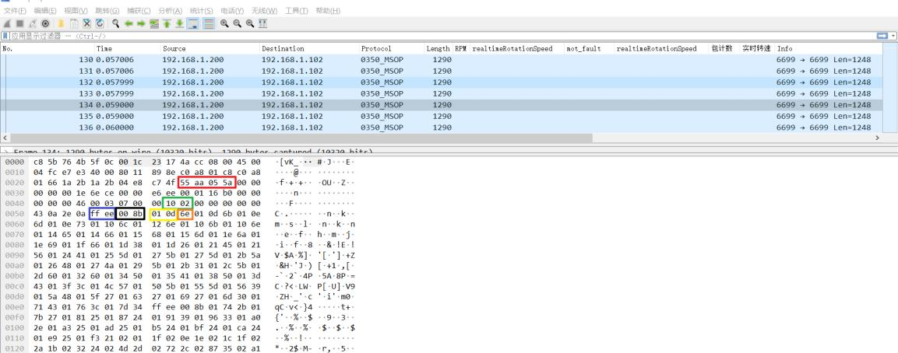{: .manual-img--xl }
<p align="center" style="font-size: 0.9em; color: gray;">图13 MSOP 包示意图</p>

红色框：Header ID

绿色框：LiDAR Type 和 LiDAR Model

蓝色框：Data Block 标志位

黑色框：Channel Data 1 的 Azimuth 值

黄色框：Channel Data 1 的 Distance 值

橙色框：Channel Data 1 反射强度值

**数据包的距离值计算：**

1. 数据包里的距离值的十六进制数：0x01, 0x0D
2. 将数据组成 16 bits，为 16 bits 无符号整型数据。表示为：0x010D
3. 距离值转换为十进制数字：269，根据距离分辨率不同，进行计算
4. 结果 $269 \times 0.5 cm = 134.5 cm = 1.345 m$

**数据包的角度值计算：**

1. 数据包里的角度值得十六进制数：0x00，0x8B
2. 将数据组成 16 bits，为 16 bits 无符号整型数据。表示为：0x008B
3. 转换为十进制数字：139，将转化成十进制后的数据除以100
4. 结果 $139^\circ / 100 = 1.39^\circ$

**数据包的反射强度值计算：**

1. 数据包里的反射强度值得十六进制数：0x6E
2. 转换为十进制数字：110
3. 结果得到反射强度值为 110

**2. 角度值定义**

在每个 Block 中，Airy 输出的角度值是该 Block 中第一个通道激光测距时的角度值。角度值来源于角度编码器，角度编码器的零位即角度的零点，水平旋转角度值的分辨率为 $0.01^\circ$

##### 4.4.2.3 帧尾

帧尾（Tail）长度 6 bytes，4 bytes 位预留信息，2 bytes 的 0x00，0xFF。

#### 4.4.3 产品信息输出协议（DIFOP）

产品信息输出协议，Device Info Output Protocol，简称：DIFOP

- **I/O 类型**：产品输出，电脑读取
- **默认端口号**：7788

DIFOP 是为了将产品序列号（S/N）、固件版本信息、上位机驱动兼容性信息、配置信息、角度信息、运行状态、故障诊断等信息，定期发送给用户的"仅输出"协议，用户可以通过读取 DIFOP 解读当前使用产品的各种参数的具体信息。

一个完整的 DIFOP Packet 的数据格式结构为同步帧头，数据区，帧尾。每个数据包共 1248 bytes。

<p class="manual-table-caption">表12 DIFOP Packet 的数据格式结构</p>

<div class="manual-table-scroll-wrap">
<table class="packet-def-table difop-packet-table airy-difop-layout-table">
  <colgroup>
    <col class="difop-col-group" />
    <col class="difop-col-var" />
    <col class="difop-col-offset" />
    <col class="difop-col-len" />
    <col class="difop-col-content" />
  </colgroup>
  <thead>
    <tr>
      <th>序号</th>
      <th>信息</th>
      <th>Offset</th>
      <th>长度 (byte)</th>
      <th>说明</th>
    </tr>
  </thead>
  <tbody>
    <tr>
      <td>1</td>
      <td>DIFOP 帧头</td>
      <td>0</td>
      <td>8</td>
      <td class="difop-content">0xA5 0xFF 0x00 0x5A <br> 0x11 0x11 0x55 0x55</td>
    </tr>
    <tr>
      <td>2</td>
      <td>电机设置转速</td>
      <td>8</td>
      <td>2</td>
      <td class="difop-content">附录 C.1</td>
    </tr>
    <tr>
      <td>3</td>
      <td>以太网 IP 源地址</td>
      <td>10</td>
      <td>4</td>
      <td class="difop-content" rowspan="7">附录 C.2</td>
    </tr>
    <tr>
      <td>4</td>
      <td>以太网 IP 目标地址</td>
      <td>14</td>
      <td>4</td>
    </tr>
    <tr>
      <td>5</td>
      <td>雷达 MAC 地址</td>
      <td>18</td>
      <td>6</td>
    </tr>
    <tr>
      <td>6</td>
      <td>MSOP 端口</td>
      <td>24</td>
      <td>2</td>
    </tr>
    <tr>
      <td>7</td>
      <td>预留</td>
      <td>26</td>
      <td>2</td>
    </tr>
    <tr>
      <td>8</td>
      <td>DIFOP 端口</td>
      <td>28</td>
      <td>2</td>
    </tr>
    <tr>
      <td>9</td>
      <td>预留</td>
      <td>30</td>
      <td>10</td>
    </tr>
    <tr>
      <td>10</td>
      <td>主板固件版本</td>
      <td>40</td>
      <td>5</td>
      <td class="difop-content">附录 C.3</td>
    </tr>
    <tr>
      <td>11</td>
      <td>底板固件版本</td>
      <td>45</td>
      <td>5</td>
      <td class="difop-content">附录 C.4</td>
    </tr>
    <tr>
      <td>12</td>
      <td>APP 固件版本</td>
      <td>50</td>
      <td>5</td>
      <td class="difop-content">附录 C.5</td>
    </tr>
    <tr>
      <td>13</td>
      <td>电机固件版本</td>
      <td>55</td>
      <td>5</td>
      <td class="difop-content">附录 C.6</td>
    </tr>
    <tr>
      <td>14</td>
      <td>预留</td>
      <td>60</td>
      <td>229</td>
      <td class="difop-content"></td>
    </tr>
    <tr>
      <td>15</td>
      <td>产品序列号</td>
      <td>292</td>
      <td>6</td>
      <td class="difop-content">附录 C.7</td>
    </tr>
    <tr>
      <td>16</td>
      <td>预留</td>
      <td>298</td>
      <td>2</td>
      <td class="difop-content"></td>
    </tr>
    <tr>
      <td>17</td>
      <td>回波模式</td>
      <td>300</td>
      <td>1</td>
      <td class="difop-content"></td>
    </tr>
    <tr>
      <td>18</td>
      <td>时间同步方式设置</td>
      <td>301</td>
      <td>1</td>
      <td class="difop-content" rowspan="2">附录 C.8</td>
    </tr>
    <tr>
      <td>19</td>
      <td>时间同步状态</td>
      <td>302</td>
      <td>1</td>
    </tr>
    <tr>
      <td>20</td>
      <td>时间</td>
      <td>303</td>
      <td>10</td>
      <td class="difop-content">附录 C.9</td>
    </tr>
    <tr>
      <td>21</td>
      <td>预留</td>
      <td>313</td>
      <td>60</td>
      <td class="difop-content"></td>
    </tr>
    <tr>
      <td>22</td>
      <td>电机实时转速</td>
      <td>373</td>
      <td>2</td>
      <td class="difop-content">附录 C.10</td>
    </tr>
    <tr>
      <td>23</td>
      <td>预留</td>
      <td>375</td>
      <td>93</td>
      <td class="difop-content"></td>
    </tr>
    <tr>
      <td>24</td>
      <td>垂直角校准</td>
      <td>468</td>
      <td>288</td>
      <td class="difop-content">附录 C.11</td>
    </tr>
    <tr>
      <td>25</td>
      <td>水平角校准</td>
      <td>756</td>
      <td>288</td>
      <td class="difop-content">附录 C.12</td>
    </tr>
    <tr>
      <td>26</td>
      <td>主板总输入电压</td>
      <td>1044</td>
      <td>2</td>
      <td class="difop-content">附录 C.13</td>
    </tr>
    <tr>
      <td>27</td>
      <td>预留</td>
      <td>1046</td>
      <td>20</td>
      <td class="difop-content"></td>
    </tr>
    <tr>
      <td>28</td>
      <td>整机输入电压</td>
      <td>1066</td>
      <td>2</td>
      <td class="difop-content">附录 C.14</td>
    </tr>
    <tr>
      <td>29</td>
      <td>底板 12V 电压</td>
      <td>1068</td>
      <td>2</td>
      <td class="difop-content">附录 C.15</td>
    </tr>
    <tr>
      <td>30</td>
      <td>预留</td>
      <td>1070</td>
      <td>10</td>
      <td class="difop-content"></td>
    </tr>
    <tr>
      <td>31</td>
      <td>主板发射温度</td>
      <td>1080</td>
      <td>2</td>
      <td class="difop-content">附录 C.16</td>
    </tr>
    <tr>
      <td>32</td>
      <td>预留</td>
      <td>1082</td>
      <td>10</td>
      <td class="difop-content"></td>
    </tr>
    <tr>
      <td>33</td>
      <td>IMU 标定数据</td>
      <td>1092</td>
      <td>28</td>
      <td class="difop-content">附录 C.17</td>
    </tr>
    <tr>
      <td>34</td>
      <td>预留</td>
      <td>1120</td>
      <td>126</td>
      <td class="difop-content">预留</td>
    </tr>
    <tr>
      <td>35</td>
      <td>帧尾</td>
      <td>1246</td>
      <td>2</td>
      <td class="difop-content">0x0F 0xF0</td>
    </tr>
  </tbody>
</table>
</div>

!!! tip "提示"
    1. Header（DIFOP 识别头）内容为 0xA5, 0xFF, 0x00, 0x5A, 0x11, 0x11, 0x55, 0x55，可作为包的检查序列
    2. Tail 帧尾内容为 0x0F, 0xF0
    3. 每一项信息的寄存器的定义以及使用参见产品手册附录 A 中的详细描述，对应关系见表 12 备注栏内容。

#### 4.4.4 IMU 数据流输出协议

- **I/O 类型**：产品输出，电脑解析
- **出厂默认端口号**：6688

IMU 输出的为产品内部 IMU 的姿态信息，可用于客户产品外参调整。一个完整的 IMU Packet 的数据格式结构为帧头，数据区，帧尾。每个数据包共 51 bytes。

<p class="manual-table-caption">表13 IMU 数据格式结构</p>

<div class="manual-table-scroll-wrap">
<table class="packet-def-table imu-data-table">
  <thead>
    <tr>
      <th>序号</th>
      <th>信息</th>
      <th>Offset</th>
      <th>长度 (byte)</th>
      <th>说明</th>
      <th>备注</th>
    </tr>
  </thead>
  <tbody>
    <tr>
      <td>1</td>
      <td>IMU 帧头</td>
      <td>0</td>
      <td>4</td>
      <td>0xAA 0x55 0x5A 0x05</td>
      <td></td>
    </tr>
    <tr>
      <td>2</td>
      <td>时间</td>
      <td>4</td>
      <td>10</td>
      <td>UTC 时间格式，前 6 个 byte 为秒时间戳，后 4 个 byte 为微秒时间戳。</td>
      <td></td>
    </tr>
    <tr>
      <td>3</td>
      <td>AccelX</td>
      <td>14</td>
      <td>4</td>
      <td>X 轴加速度值，有符号，原始值</td>
      <td>
        原始值转换为实际值跟量程有关，如量程为+/-16g，则实际加速度值为：<br>
        原始值*16/32768(单位 g)<br>
        g 值为 9.80665m/s²
      </td>
    </tr>
    <tr>
      <td>4</td>
      <td>AccelY</td>
      <td>18</td>
      <td>4</td>
      <td>Y 轴加速度值，有符号，原始值</td>
      <td>同上</td>
    </tr>
    <tr>
      <td>5</td>
      <td>AccelZ</td>
      <td>22</td>
      <td>4</td>
      <td>Z 轴加速度值，有符号，原始值</td>
      <td>同上</td>
    </tr>
    <tr>
      <td>6</td>
      <td>GyroX</td>
      <td>26</td>
      <td>4</td>
      <td>X 轴角速度值，有符号，原始值</td>
      <td>原始值转换为实际值跟量程有关，如量程为+/-2000 dps，则实际角速度值为：原始值*2000/32768*PI/180(单位 rad/s)</td>
    </tr>
    <tr>
      <td>7</td>
      <td>GyroY</td>
      <td>30</td>
      <td>4</td>
      <td>Y 轴角速度值，有符号，原始值</td>
      <td>同上</td>
    </tr>
    <tr>
      <td>8</td>
      <td>GyroZ</td>
      <td>34</td>
      <td>4</td>
      <td>Z 轴角速度值，有符号，原始值</td>
      <td>同上</td>
    </tr>
    <tr>
      <td>9</td>
      <td>内部温度</td>
      <td>38</td>
      <td>4</td>
      <td>IMU 内部温度，有符号，分辨率 0.01 度</td>
      <td></td>
    </tr>
    <tr>
      <td>10</td>
      <td>ODR</td>
      <td>42</td>
      <td>1</td>
      <td>数据输出频率</td>
      <td>
        0: 25Hz<br>
        1: 50Hz<br>
        2: 100Hz<br>
        3: 200Hz<br>
        4: 1000Hz
      </td>
    </tr>
    <tr>
      <td>11</td>
      <td>AccelFsr</td>
      <td>43</td>
      <td>1</td>
      <td>加速度计量程</td>
      <td>
        0: +/- 2g<br>
        1: +/- 4g<br>
        2: +/- 8g<br>
        3: +/- 16g
      </td>
    </tr>
    <tr>
      <td>12</td>
      <td>GyroFsr</td>
      <td>44</td>
      <td>1</td>
      <td>陀螺仪量程</td>
      <td>
        0: +/- 250 dps<br>
        1: +/- 500 dps<br>
        2: +/- 1000 dps<br>
        3: +/- 2000 dps
      </td>
    </tr>
    <tr>
      <td>13</td>
      <td>包计数</td>
      <td>45</td>
      <td>4</td>
      <td>u32 类型，由 1 开始</td>
      <td></td>
    </tr>
    <tr>
      <td>14</td>
      <td>帧尾</td>
      <td>49</td>
      <td>2</td>
      <td>0xF0 0x0F</td>
      <td></td>
    </tr>
  </tbody>
</table>
</div>

## 5 产品维护

--8<-- "snippets/product-maintenance.md"

## 6 故障诊断

本章列举了部分在使用产品的过程中常见的问题以及对应的问题排查方法。

<p class="manual-table-caption">表14 常见故障排查方法表</p>

<table class="packet-def-table fault-troubleshoot-table">
  <colgroup>
    <col class="fault-col-phenomenon" />
    <col class="fault-col-solution" />
  </colgroup>
  <thead>
    <tr>
      <th>故障现象</th>
      <th>解决方法</th>
    </tr>
  </thead>
  <tbody>
    <tr>
      <td>产品电机不旋转</td>
      <td>检查航插线电源/产品端的连接线是否松动及线束破损。</td>
    </tr>
    <tr>
      <td>产品在启动时不断重启</td>
      <td>
        检查输入电源连接和极性是否正常；<br>
        检查输入电源的电压和电流是否满足要求（12 V 电压输入条件下，输入电流 ≥ 2 A）；<br>
        检查产品安装平面是否水平或激光雷达底部固定螺丝是否拧的太紧。
      </td>
    </tr>
    <tr>
      <td>产品内部旋转，但是没有数据</td>
      <td>
        检查激光是否正常发射；<br>
        检查网络连接是否正常；<br>
        确认电脑端网络配置是否正确；<br>
        使用另外的软件（例如 Wireshark）检查数据是否有被接收；<br>
        关闭防火墙和其它可能阻止网络的安全软件；<br>
        检查电源供电正常；<br>
        尝试重启产品。
      </td>
    </tr>
    <tr>
      <td>Wireshark 可以收到数据但是 RSView 不显示点云</td>
      <td>
        关闭电脑防火墙，并且运行 RSView 通过防火墙；<br>
        确认电脑的 IP 配置和产品设置的目的地址一致；<br>
        确认 RSView 中 Sensor Network Configuration 设置正确；<br>
        确认 RSView 安装目录或配置文件存放目录不包含任何中文字符；<br>
        确认 Wireshark 中收到的数据包是 MSOP 类型的包。
      </td>
    </tr>
    <tr>
      <td>产品存在频发的数据丢失</td>
      <td>
        确认网络中是否有大量的其它网络数据包或网路冲突；<br>
        确认网络中是否存在其它网络产品以广播模式发送大量数据造成传感器数据阻塞；<br>
        确认电脑的性能和接口性能是否满足要求；<br>
        移除其它所有网络产品，直连电脑确认是否存在丢包现象。
      </td>
    </tr>
    <tr>
      <td>无法同步 GPS/PTP/gPTP 时间</td>
      <td>
        1. 确认已在网页端将同步模式切换到正确模式下；<br>
        2. 在 GPS+PPS 时间同步方式下：<br>
        &nbsp;&nbsp;&nbsp;&nbsp;- 确认 GPS 模块波特率为 9600 bps，8 bits 数据位，无校验位，停止位 1；<br>
        &nbsp;&nbsp;&nbsp;&nbsp;- 确认 GPS 模块输出为 3.3 V TTL 还是 RS232 电平；<br>
        &nbsp;&nbsp;&nbsp;&nbsp;- 确认 1 PPS 脉冲连续且接线正确；<br>
        &nbsp;&nbsp;&nbsp;&nbsp;- 确认 GPRMC 的 NMEA 消息格式正确；<br>
        &nbsp;&nbsp;&nbsp;&nbsp;- 确认 GPS 模块和航插线共地；<br>
        &nbsp;&nbsp;&nbsp;&nbsp;- 确认 GPS 模块收到了有效的解；<br>
        &nbsp;&nbsp;&nbsp;&nbsp;- 确认 GPS 模块是否为有效定位（室外）；<br>
        3. 在 PTP / gPTP 时间同步方式下：<br>
        &nbsp;&nbsp;&nbsp;&nbsp;- 确认 PTP / gPTP Master 同步协议是否符合当前 PTP / gPTP 协议；<br>
        &nbsp;&nbsp;&nbsp;&nbsp;- 确认 PTP / gPTP Master 是否正常工作。
      </td>
    </tr>
    <tr>
      <td>产品通过路由器后无数据输出</td>
      <td>关闭路由器的 DHCP 功能或在路由器内部设置传感器的 IP 为正确的 IP。</td>
    </tr>
    <tr>
      <td>ROS 驱动显示点云时有固定的空白区域不断旋转</td>
      <td>此现象正常，是因为 ROS 驱动按照固定包数进行分帧显示，空白部分的数据会在下一帧进行显示。</td>
    </tr>
    <tr>
      <td>RSView 软件输出点云成一条射线</td>
      <td>如果是 Windows 10 系统请设置 RSView 使用 Windows 7 兼容模式运行。</td>
    </tr>
  </tbody>
</table>

## 7 售后

--8<-- "snippets/after-sales.md"

## 附录 A Web 端操作

### A.1 产品信息

激光雷达 Web 端默认为产品信息页，如图 14 所示。

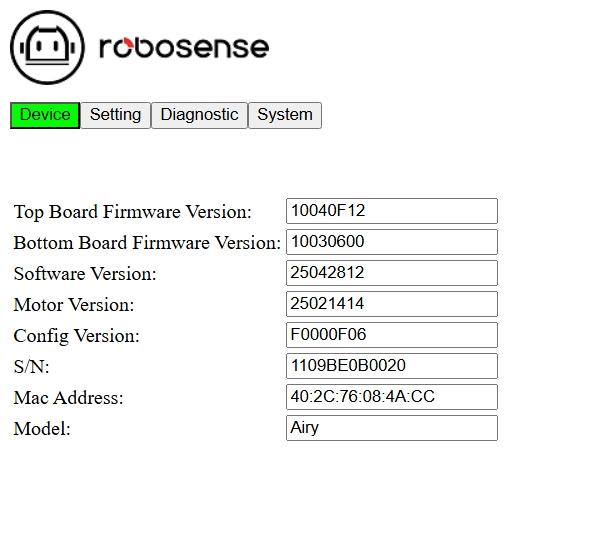{: .manual-img--xl }
<p align="center" style="font-size: 0.9em; color: gray;">图14 Web 端首页信息</p>

1. Top Board Firmware Version 为主板固件版本
2. Bottom Board Firmware Version 为底板固件版本
3. Software Version 为软件版本
4. Motor Firmware Version 为电机版本
5. S/N 为产品序列号
6. Mac Address 为 MAC 地址
7. Model 为产品名称

### A.2 产品参数设定

#### A.2.1 General Setting

网页端 "General Setting" 栏为激光雷达基本参数设定页，在此处可更改 Device IP、端口号、回波模式及角度触发等功能设定，如图 15 所示。

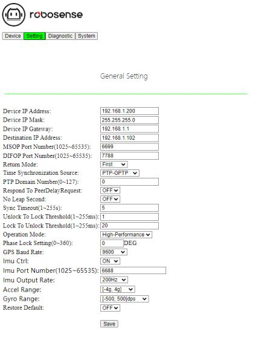{: .manual-img--xl }
<p align="center" style="font-size: 0.9em; color: gray;">图15 Web 端激光雷达设置信息</p>

1. 支持单播（默认）/广播模式，将 Destination IP 设置为 255.255.255.255 则为广播模式，默认出厂为 192.168.1.102
2. 可更改 MSOP 和 DIFOP 的数据端口，值范围 1025 ~ 65535
3. 可下拉 "Return Mode" 选最强回波（默认），最近回波，最远回波
4. 可下拉"Time Synchronization Source"选择 GPS、PTP-E2E、PTP-P2P、PTP-GPTP 和 PTP-E2E-L2 确定时间同步方式
5. 可更改 PTP 的时间同步域（对应时间同步报文的 domainNumber 字段），值范围 0~127
6. 可下拉 "Respond To PeerDelayRequest" 选择 OFF（默认）和 ON 确定是雷达作为 slave 是否响应其他节点的 peer delay request 请求消息
7. 可下拉 "No Leap Second" 选择 OFF（默认）和 ON 确定是否响应 announce 报文的闰秒偏差设置
8. 可更改设备因丢失授时 master 消息而导致退出时间同步状态的超时时间（默认 5s），值范围为 1~255 s
9. 可更改设备由非同步状态切换到同步状态的与 master 之间的 offset 阈值（默认 1ms），值范围为 1~255 ms
10. 可更改设备由同步状态切换到非同步状态的与 master 之间的 offset 阈值（默认 20ms），值范围为 1~255 ms
11. 可下拉 "Operation Mode" 选择工作模式，分别为 Standby/High Performance（默认）二种工作模式，当选择 Standby 模式时，激光雷达电机和发射器停止工作
12. 可更改设备 Phase lock 的角度，值范围为 0~360 Degree
13. 可下拉 "GPS Baud Rate" 选择 GPS 波特率，分别为 9600（默认）、14400、19200、38400、43200、57600、76800、115200 八种选项
14. 可下拉 "Imu Ctrl" 选择 OFF 和 ON（默认）确定是否开启对 IMU 功能的控制接口
15. 可更改 IMU 的通信端口，值范围为 1025~65535
16. 可下拉 "Imu Output Rate" 选择 25Hz/50Hz/100Hz/200Hz（默认）来更改 IMU 输出数据的消息输出频率
17. 可下拉"Accel Range"选择 [-2g,2g]/[-4g,4g]（默认）/[-8g,8g]/[-16g,16g]来更改 IMU 加速度计的最大加速度范围
18. 可下拉 "Gyro Range" 选择 [-250,250]dps/[-500,500]dps（默认）/[-1000,1000]dps/[-2000,2000]dps 来更改 IMU 陀螺仪量程范围
19. 可下拉 "Restore Default" 选择 OFF 和 ON 来确认是否启用恢复默认设置功能

#### A.2.2 Performance Setting

网页端 "Performance Setting" 栏为激光雷达高级参数设定页，在此处可进行雷达的反射率表现、吸拖点滤除和雨雾检测等高级功能的设定，如图 16 所示。

{: .manual-img--xl }
<p align="center" style="font-size: 0.9em; color: gray;">图16 高级功能设定</p>

1. 可下拉 "Reflectivity Enhancement" 选择 OFF（默认）和 ON 来确定是否开启反射率增强的功能
2. 可下拉 "Trail Filter Level" 选择 1/2/3/4（默认）/5 来确认拖点滤除等级
3. 可下拉 "Rain/Blockage Detection Distance" 选择 30cm（默认）/20cm/10cm 来确认雨天/遮挡检测距离
4. 可下拉"Blockage Detection Sensitivity"选择 high（默认）/medium/low 来控制激光雷达对遮挡的敏感程度
5. 可更改设备帧起始空洞角度偏移 Frame Start Angle，值范围为 0~360 Degree
6. 可下拉 "Dead Zone 10cm Enable" 选择 On（默认）/Off 来选择是否打开盲区内的点云信息
7. 可下拉 "Channel 81 85 89 93" 选择 On/Off（默认）来选择是否启用通道 81、85、89、93
8. 可下拉 "Gap Filling Enable" 选择 On/Off（默认）来选择是否为每十帧 32 度的点云空洞进行信息弥补

#### A.2.3 Angle Pulse Setting

网页端 "Angle Pulse Setting"栏为激光雷达角度脉冲触发设定页，在此处可设定雷达的角度触发信号，如图 17 所示。

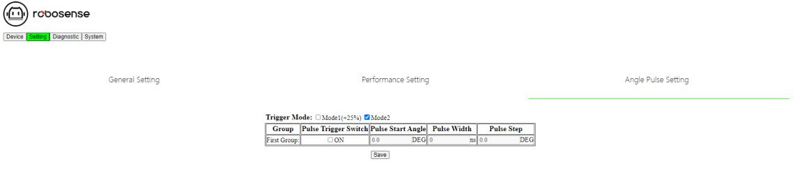{: .manual-img--xl }
<p align="center" style="font-size: 0.9em; color: gray;">图17 角度脉冲设定</p>

1. Trigger Mode：起始角模式有两种，模式1为起始脉宽增加25%，模式2为起始脉宽不增加（默认）
2. Group：此栏为对应 SYNC OUT 组，Airy 内含 SYNC OUT1
3. Pulse Trigger Switch: 开启/关闭触发功能，当 Pulse Trigger Switch 勾选 "ON" 开启后选项为可编辑状态，关闭时为灰色不可编辑状态
4. Pulse Start Angle：可设置对应的起始角，输入值需为整数
5. Pulse Width: 可设置对应的脉宽
6. Pulse Step：可设置对应的步距，输入值需为浮点数，保留1位小数

!!! tip "提示"
    1. Device IP 和 Destination IP 需在同一网段，否则可能会导致无法正常连接
    2. MSOP、DIFOP 和 IMU 端口号值的范围为 1025 ~ 65535，且 MSOP 端口、DIFOP 端口和 IMU 端口不可设置为相同的值
    3. 更改完成后需点击"Save"进行保存，提示成功则表示设定生效

### A.3 产品诊断/运行状态

此页可实时查看激光雷达运行状态，包括电压、电流、实时转速、运行时长及温度等信息，如图 18 所示。

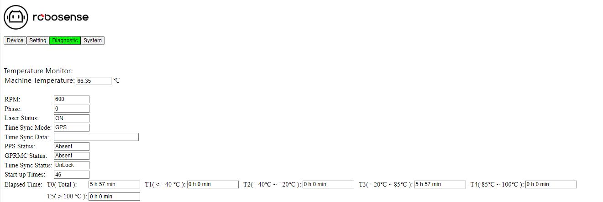{: .manual-img--xl }
<p align="center" style="font-size: 0.9em; color: gray;">图18 Web 端运行状态/故障诊断</p>

1. 用户可查看 Machine Temperature 获取当前产品运行温度
2. 用户可查看 RPM 获取产品当前实时转速信息
3. 用户可查看 Phase 获取产品当前旋转相位
4. Laser Status 有"On"（默认）和"Off"两种状态，用户设置 Standby 模式时为"Off"
5. 用户可查看 Time Sync Mode 获取激光雷达的时间同步模式
6. 用户可查看 Time Sync Data 获取激光雷达的时间同步数据
7. 用户可查看 PPP Status 获取 PPS 状态
8. 用户可查看 GPRMC Status 获取 GPRMC 状态
9. 用户可查看 Time Sync Status 获取当前时间同步状态，Lock 表示已成功锁定，Unlock 表示时间同步尚未成功
10. 用户可查看 Startup Times 获取当前产品总启动次数，每断电重启后会累加一次
11. 用户可查看 Elapsed time 获取产品总运行时间和产品在各温度下累计工作时间

!!! tip "提示"
    1. 本页刷新频率为 5 秒
    2. 若产品电压/电流框变红时，请检查产品当前是否为 Standby 模式，若不是则检查产品是否正常工作

### A.4 产品固件升级

点击网页"System"，此页可对产品的 App、底板、主板固件进行升级。

1. 请联系 RoboSense 获得升级固件。准备好待升级的固件后，点击"选择文件"，如图 19 所示：

    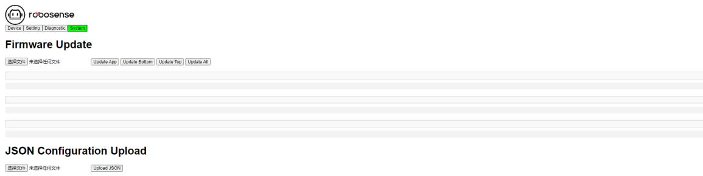{: .manual-img--xl }
    <p align="center" style="font-size: 0.9em; color: gray;">图19 点击选择文件</p>

2. 选择对应待升级固件的文件夹，选中待升级固件后点击"打开"（路径请勿出现中文字符），如图 20 所示：

    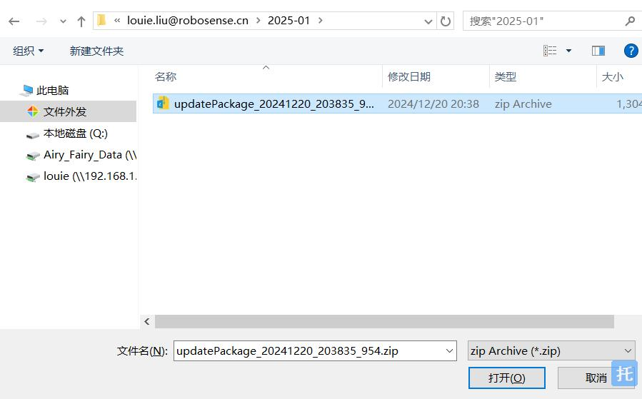{: .manual-img--xl }
    <p align="center" style="font-size: 0.9em; color: gray;">图20 选择升级包所在路径的文件</p>

3. 此时 web 界面会显示待升级固件文件名，选择对应的升级按钮则可升级对应固件，如图 21 所示：

    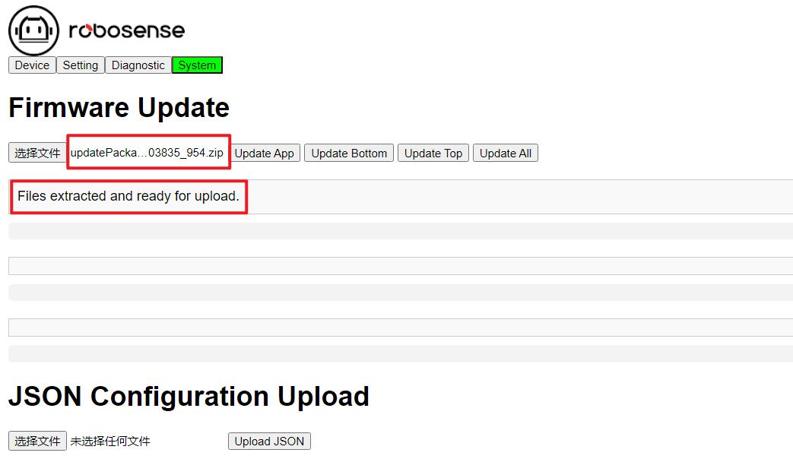{: .manual-img--xl }
    <p align="center" style="font-size: 0.9em; color: gray;">图21 升级文件选择完毕后界面</p>

!!! tip "提示"
    1. 升级包的格式为 Zip，web 的升级界面只支持上传 Zip 格式文件包
    2. 升级包名称需符合如下要求方可正常升级，否则会报错
    3. 主板升级文件：顺序逻辑必要后缀 ".bin"
    4. 底板升级文件：顺序逻辑必要后缀 ".bit"
    5. Web App 升级文件：顺序逻辑必要后缀 ".hs_fs"

## 附录 B ROS & ROS2 Package

rslidar_sdk 是 ROS 平台下的驱动 SDK，请通过 github 上的 RoboSense 主页下载，或联系 RoboSense 获取。

1. rslidar_sdk 依赖 rs_driver，后者是 RoboSense 的基本驱动。rs_driver 请从 github 平台下载
2. 如使用环境为 ROS2，rslidar_sdk 还依赖 rslidar_msg，这是 msg 定义文件。msg 文件请从 github 平台下载
3. 驱动 SDK 下载包内含丰富的使用指引，请在使用驱动 SDK 前，详细阅读文件内的 README 文件及 doc 文件夹下的文档

!!! tip "提示"
    1. SDK 获取地址：https://github.com/RoboSense-LiDAR/rsLiDAR_sdk
    2. rs_driver 获取地址：https://github.com/RoboSense-LiDAR/rs_driver
    3. msg 获取地址：https://github.com/RoboSense-LiDAR/rslidar_msg

## 附录 C DIFOP 数据定义

本附录内容补充章节 4.4.3 的 DIFOP 协议里各个信息定义的说明，便于用户对产品的使用和开发，涉及到计算部分，均采用大端模式，Value 代表对应 offset 字节换算后得出的十进制数值。

### C.1 电机转速（MOT_SPD）

<p class="manual-table-caption">表15 电机转速设置</p>

<table class="packet-def-table">
  <thead>
    <tr>
      <th colspan="3">电机转速设置（共 2 bytes）</th>
    </tr>
  </thead>
  <tbody>
    <tr>
      <td>序号</td>
      <td>byte 1</td>
      <td>byte 2</td>
    </tr>
    <tr>
      <td>功能</td>
      <td colspan="2">MOT_SPD</td>
    </tr>
  </tbody>
</table>

!!! note "寄存器说明"
    1. 该寄存器用于读取电机的转速设置值
    2. 如设置值为 600 RPM，读取 byte 1 = 0x02，byte 2 = 0x58，Value = 600

### C.2 以太网
ETH

<p class="manual-table-caption">表16 以太网</p>

<div class="manual-table-scroll-wrap">
<table class="packet-def-table">
  <thead>
    <tr>
      <th colspan="9">以太网寄存器（共 30 bytes）</th>
    </tr>
  </thead>
  <tbody>
    <tr>
      <td>序号</td>
      <td>byte 1</td>
      <td>byte 2</td>
      <td>byte 3</td>
      <td>byte 4</td>
      <td>byte 5</td>
      <td>byte 6</td>
      <td>byte 7</td>
      <td>byte 8</td>
    </tr>
    <tr>
      <td>功能</td>
      <td colspan="4">LIDAR_IP</td>
      <td colspan="4">DEST_PC_IP</td>
    </tr>
    <tr>
      <td>序号</td>
      <td>byte 9</td>
      <td>byte 10</td>
      <td>byte 11</td>
      <td>byte 12</td>
      <td>byte 13</td>
      <td>byte 14</td>
      <td>byte 15</td>
      <td>byte 16</td>
    </tr>
    <tr>
      <td>功能</td>
      <td colspan="6">MAC_ADDR</td>
      <td colspan="2">MSOP</td>
    </tr>
    <tr>
      <td>序号</td>
      <td>byte 17</td>
      <td>byte 18</td>
      <td>byte 19</td>
      <td>byte 20</td>
      <td>byte 21</td>
      <td>byte 22</td>
      <td>byte 23</td>
      <td>byte 24</td>
    </tr>
    <tr>
      <td>功能</td>
      <td colspan="2">预留</td>
      <td colspan="2">DIFOP</td>
      <td colspan="4">预留</td>
    </tr>
    <tr>
      <td>序号</td>
      <td>byte 25</td>
      <td>byte 26</td>
      <td>byte 27</td>
      <td>byte 28</td>
      <td>byte 29</td>
      <td>byte 30</td>
      <td>\</td>
      <td>\</td>
    </tr>
    <tr>
      <td>功能</td>
      <td colspan="6">预留</td>
      <td colspan="2">\</td>
    </tr>
  </tbody>
</table>
</div>

!!! note "寄存器说明"
    1. LIDAR IP 为激光雷达的源 IP 地址，占据 4 bytes
    2. DEST PC IP 为目的 PC 的 IP 地址，占据 4 bytes
    3. MAC_ADDR 为激光雷达的 MAC 地址
    4. MSOP与DIFOP分别占2 bytes，源端口号与目的端口号强制一致

### C.3 主板固件版本
TOP_FRM

<p class="manual-table-caption">表17 主板固件版本</p>

<table class="packet-def-table">
  <thead>
    <tr>
      <th colspan="6">主板固件版本（共 5 bytes）</th>
    </tr>
  </thead>
  <tbody>
    <tr>
      <td>序号</td>
      <td>byte 1</td>
      <td>byte 2</td>
      <td>byte 3</td>
      <td>byte 4</td>
      <td>byte 5</td>
    </tr>
    <tr>
      <td>功能</td>
      <td colspan="5">TOP_FRM</td>
    </tr>
  </tbody>
</table>

!!! note "寄存器说明"
    1. 该寄存器用于读取主板固件版本号
    2. 如 byte 1=0x00，byte 2=0x10，byte 3=0x04，byte 4=0x0c，byte 5=0x00，则固件版本号为：00 10 04 0c 00

### C.4 底板固件版本
BOT_FRM

<p class="manual-table-caption">表18 底板固件版本</p>

<table class="packet-def-table">
  <thead>
    <tr>
      <th colspan="6">底板固件版本（共 5 bytes）</th>
    </tr>
  </thead>
  <tbody>
    <tr>
      <td>序号</td>
      <td>byte 1</td>
      <td>byte 2</td>
      <td>byte 3</td>
      <td>byte 4</td>
      <td>byte 5</td>
    </tr>
    <tr>
      <td>功能</td>
      <td colspan="5">BOT_FRM</td>
    </tr>
  </tbody>
</table>

!!! note "寄存器说明"
    1. 该寄存器用于读取底板固件版本号
    2. 如 byte 1=0x00，byte 2=0x24，byte 3=0x12，byte 4=0x13，byte 5=0x12，则固件版本号为：00 24 12 13 12

### C.5 APP 固件版本
SOF_FRM

<p class="manual-table-caption">表19 软件版本</p>

<table class="packet-def-table">
  <thead>
    <tr>
      <th colspan="6">APP 固件版本（共 5 bytes）</th>
    </tr>
  </thead>
  <tbody>
    <tr>
      <td>序号</td>
      <td>byte 1</td>
      <td>byte 2</td>
      <td>byte 3</td>
      <td>byte 4</td>
      <td>byte 5</td>
    </tr>
    <tr>
      <td>功能</td>
      <td colspan="5">SOF_FRM</td>
    </tr>
  </tbody>
</table>

!!! note "寄存器说明"
    1. 该寄存器用于读取 APP 固件版本号
    2. 如 byte 1=0x00，byte 2=0x24，byte 3=0x12，byte 4=0x13，byte 5=0x12，则固件版本号为：00 24 12 13 12

### C.6 电机固件版本
MOT_FRM

<p class="manual-table-caption">表20 电机固件版本</p>

<table class="packet-def-table">
  <thead>
    <tr>
      <th colspan="6">电机固件版本（共 5 bytes）</th>
    </tr>
  </thead>
  <tbody>
    <tr>
      <td>序号</td>
      <td>byte 1</td>
      <td>byte 2</td>
      <td>byte 3</td>
      <td>byte 4</td>
      <td>byte 5</td>
    </tr>
    <tr>
      <td>功能</td>
      <td colspan="5">MOT_FRM</td>
    </tr>
  </tbody>
</table>

!!! note "寄存器说明"
    1. 该寄存器用于读取电机固件版本号
    2. 如 byte 1=0x00, byte 2=0x24, byte 3=0x12, byte 4=0x12, byte 5=0x25，则固件版本号为：00 24 12 12 25

### C.7 序列号
SN

<p class="manual-table-caption">表21 序列号寄存器</p>

<table class="packet-def-table">
  <thead>
    <tr>
      <th colspan="7">序列号（共 6 bytes）</th>
    </tr>
  </thead>
  <tbody>
    <tr>
      <td>序号</td>
      <td>byte 1</td>
      <td>byte 2</td>
      <td>byte 3</td>
      <td>byte 4</td>
      <td>byte 5</td>
      <td>byte 6</td>
    </tr>
    <tr>
      <td>功能</td>
      <td colspan="6">SN</td>
    </tr>
  </tbody>
</table>

!!! note "寄存器说明"
    1. 该寄存器用于设备序列号
    2. 类似 mac 地址，共 6 bytes，以 16 进制表示产品序列号

### C.8 时间同步信息
TIME_SYNC_INFO

<p class="manual-table-caption">表22 时间同步信息</p>

<table class="packet-def-table">
  <thead>
    <tr>
      <th colspan="3">时间同步信息（共 2 bytes）</th>
    </tr>
  </thead>
  <tbody>
    <tr>
      <td>序号</td>
      <td>byte 1</td>
      <td>byte 2</td>
    </tr>
    <tr>
      <td>功能</td>
      <td>Time_Sync_Mode</td>
      <td>Time_Sync_State</td>
    </tr>
  </tbody>
</table>

!!! note "寄存器说明"
    1. 该寄存器用于读取时间同步信息
    2. byte 1 为时间同步模式状态位，定义如下：
        - 0x00: GPS
        - 0x01: E2E-L4
        - 0x02: P2P
        - 0x03: gPTP
        - 0x04: E2E-L2
    3. byte 2 为时间同步成功状态位，定义如下：
        - 0x00: 未同步
        - 0x01: 同步成功

### C.9 时间
UTC_TIME

<p class="manual-table-caption">表23 时间寄存器</p>

<div class="manual-table-scroll-wrap">
<table class="packet-def-table">
  <thead>
    <tr>
      <th colspan="11">时间寄存器（共 10 bytes）</th>
    </tr>
  </thead>
  <tbody>
    <tr>
      <td>序号</td>
      <td>byte 1</td>
      <td>byte 2</td>
      <td>byte 3</td>
      <td>byte 4</td>
      <td>byte 5</td>
      <td>byte 6</td>
      <td>byte 7</td>
      <td>byte 8</td>
      <td>byte 9</td>
      <td>byte 10</td>
    </tr>
    <tr>
      <td>功能</td>
      <td colspan="6">sec</td>
      <td colspan="4">us</td>
    </tr>
  </tbody>
</table>
</div>

!!! note "寄存器说明"
    1. 该寄存器用于读取时间信息
    2. us 值范围：0 ~ 999,999

### C.10 电机实时转速
REALTIME_ROTATION_SPEED

<p class="manual-table-caption">表24 实时转速寄存器</p>

<table class="packet-def-table">
  <thead>
    <tr>
      <th colspan="3">实时转速寄存器（共 2 bytes）</th>
    </tr>
  </thead>
  <tbody>
    <tr>
      <td>序号</td>
      <td>byte 1</td>
      <td>byte 2</td>
    </tr>
    <tr>
      <td>功能</td>
      <td colspan="2">REALTIME_ROTATION_SPEED</td>
    </tr>
  </tbody>
</table>

!!! note "寄存器说明"
    1. 该寄存器用于读取电机实时转速信息
    2. 共 2 byte，以 16 进制表示

        例如 byte 1=0x01，byte 2=0x28，电机实际转速转成十进制是 600

### C.11 垂直角校准
COR_VERT_ANG

<p class="manual-table-caption">表25 垂直角校准寄存器</p>

<div class="manual-table-scroll-wrap">
<table class="packet-def-table">
  <thead>
    <tr>
      <th colspan="10">垂直角校准寄存器（共 288 bytes）</th>
    </tr>
  </thead>
  <tbody>
    <tr>
      <td>序号</td>
      <td>byte 1</td>
      <td>byte 2</td>
      <td>byte 3</td>
      <td>byte 4</td>
      <td>byte 5</td>
      <td>byte 6</td>
      <td>byte 7</td>
      <td>byte 8</td>
      <td>byte 9</td>
    </tr>
    <tr>
      <td>功能</td>
      <td colspan="3">1 通道垂直角度</td>
      <td colspan="3">2 通道垂直角度</td>
      <td colspan="3">3 通道垂直角度</td>
    </tr>
    <tr>
      <td>序号</td>
      <td>byte 10</td>
      <td>byte 11</td>
      <td>byte 12</td>
      <td>byte 13</td>
      <td>byte 14</td>
      <td>byte 15</td>
      <td>byte 16</td>
      <td>byte 17</td>
      <td>byte 18</td>
    </tr>
    <tr>
      <td>功能</td>
      <td colspan="3">4 通道垂直角度</td>
      <td colspan="3">5 通道垂直角度</td>
      <td colspan="3">6 通道垂直角度</td>
    </tr>
    <tr>
      <td>序号</td>
      <td>byte 19</td>
      <td>byte 20</td>
      <td>byte 21</td>
      <td>byte 22</td>
      <td>byte 23</td>
      <td>byte 24</td>
      <td>byte 25</td>
      <td>byte 26</td>
      <td>byte 27</td>
    </tr>
    <tr>
      <td>功能</td>
      <td colspan="3">7 通道垂直角度</td>
      <td colspan="3">8 通道垂直角度</td>
      <td colspan="3">9 通道垂直角度</td>
    </tr>
    <tr>
      <td>序号</td>
      <td>byte 28</td>
      <td>byte 29</td>
      <td>byte 30</td>
      <td>byte 31</td>
      <td>byte 32</td>
      <td>byte 33</td>
      <td>byte 34</td>
      <td>byte 35</td>
      <td>byte 36</td>
    </tr>
    <tr>
      <td>功能</td>
      <td colspan="3">10 通道垂直角度</td>
      <td colspan="3">11 通道垂直角度</td>
      <td colspan="3">12 通道垂直角度</td>
    </tr>
    <tr>
      <td>序号</td>
      <td>byte 37</td>
      <td>byte 38</td>
      <td>byte 39</td>
      <td>byte 40</td>
      <td>byte 41</td>
      <td>byte 42</td>
      <td>byte 43</td>
      <td>byte 44</td>
      <td>byte 45</td>
    </tr>
    <tr>
      <td>功能</td>
      <td colspan="3">13 通道垂直角度</td>
      <td colspan="3">14 通道垂直角度</td>
      <td colspan="3">15 通道垂直角度</td>
    </tr>
    <tr>
      <td>序号</td>
      <td>byte 46</td>
      <td>byte 47</td>
      <td>byte 48</td>
      <td>byte 49</td>
      <td>byte 50</td>
      <td>byte 51</td>
      <td>byte 52</td>
      <td>byte 53</td>
      <td>byte 54</td>
    </tr>
    <tr>
      <td>功能</td>
      <td colspan="3">16 通道垂直角度</td>
      <td colspan="3">17 通道垂直角度</td>
      <td colspan="3">18 通道垂直角度</td>
    </tr>
    <tr>
      <td>序号</td>
      <td>byte 55</td>
      <td>byte 56</td>
      <td>byte 57</td>
      <td>byte 58</td>
      <td>byte 59</td>
      <td>byte 60</td>
      <td>byte 61</td>
      <td>byte 62</td>
      <td>byte 63</td>
    </tr>
    <tr>
      <td>功能</td>
      <td colspan="3">19 通道垂直角度</td>
      <td colspan="3">20 通道垂直角度</td>
      <td colspan="3">21 通道垂直角度</td>
    </tr>
    <tr>
      <td>序号</td>
      <td colspan="3">...</td>
      <td colspan="3">...</td>
      <td colspan="3">...</td>
    </tr>
    <tr>
      <td>功能</td>
      <td colspan="9">...</td>
    </tr>
    <tr>
      <td>序号</td>
      <td>byte 262</td>
      <td>byte 263</td>
      <td>byte 264</td>
      <td>byte 265</td>
      <td>byte 266</td>
      <td>byte 267</td>
      <td>byte 268</td>
      <td>byte 269</td>
      <td>byte 270</td>
    </tr>
    <tr>
      <td>功能</td>
      <td colspan="3">88 通道垂直角度</td>
      <td colspan="3">89 通道垂直角度</td>
      <td colspan="3">90 通道垂直角度</td>
    </tr>
    <tr>
      <td>序号</td>
      <td>byte 271</td>
      <td>byte 272</td>
      <td>byte 273</td>
      <td>byte 274</td>
      <td>byte 275</td>
      <td>byte 276</td>
      <td>byte 277</td>
      <td>byte 278</td>
      <td>byte 279</td>
    </tr>
    <tr>
      <td>功能</td>
      <td colspan="3">91 通道垂直角度</td>
      <td colspan="3">92 通道垂直角度</td>
      <td colspan="3">93 通道垂直角度</td>
    </tr>
    <tr>
      <td>序号</td>
      <td>byte 280</td>
      <td>byte 281</td>
      <td>byte 282</td>
      <td>byte 283</td>
      <td>byte 284</td>
      <td>byte 285</td>
      <td>byte 286</td>
      <td>byte 287</td>
      <td>byte 288</td>
    </tr>
    <tr>
      <td>功能</td>
      <td colspan="3">94 通道垂直角度</td>
      <td colspan="3">95 通道垂直角度</td>
      <td colspan="3">96 通道垂直角度</td>
    </tr>
  </tbody>
</table>
</div>

!!! note "寄存器说明"
    1. 角度值为区分为正负，每个通道的垂直角度由 3 bytes 组成，其中第 1 个 byte 表示正负，第 2 和第 3 个 byte 共同组成角度的值
    2. 表示正负的第 1 个 byte 属性为 0x00 则通道垂直角度为正值，属性为 0x01 则通道垂直角度为负值
    3. 角度分辨率为 $0.01^\circ$
    4. 例如通道 5 寄存器的值为 byte 1=0x00，为正数；byte 2=0x01，byte 3=0x71 转换成十进制 369。则通道 5 的垂直角度值为 $3.69^\circ$

### C.12 水平偏移角校准
COR_HOR_ANG

<p class="manual-table-caption">表26 水平偏移角校准寄存器</p>

<div class="manual-table-scroll-wrap">
<table class="packet-def-table">
  <thead>
    <tr>
      <th colspan="10">水平偏移角校准寄存器（共 288 bytes）</th>
    </tr>
  </thead>
  <tbody>
    <tr>
      <td>序号</td>
      <td>byte 1</td>
      <td>byte 2</td>
      <td>byte 3</td>
      <td>byte 4</td>
      <td>byte 5</td>
      <td>byte 6</td>
      <td>byte 7</td>
      <td>byte 8</td>
      <td>byte 9</td>
    </tr>
    <tr>
      <td>功能</td>
      <td colspan="3">1 通道水平偏移角度</td>
      <td colspan="3">2 通道水平偏移角度</td>
      <td colspan="3">3 通道水平偏移角度</td>
    </tr>
    <tr>
      <td>序号</td>
      <td>byte 10</td>
      <td>byte 11</td>
      <td>byte 12</td>
      <td>byte 13</td>
      <td>byte 14</td>
      <td>byte 15</td>
      <td>byte 16</td>
      <td>byte 17</td>
      <td>byte 18</td>
    </tr>
    <tr>
      <td>功能</td>
      <td colspan="3">4 通道水平偏移角度</td>
      <td colspan="3">5 通道水平偏移角度</td>
      <td colspan="3">6 通道水平偏移角度</td>
    </tr>
    <tr>
      <td>序号</td>
      <td>byte 19</td>
      <td>byte 20</td>
      <td>byte 21</td>
      <td>byte 22</td>
      <td>byte 23</td>
      <td>byte 24</td>
      <td>byte 25</td>
      <td>byte 26</td>
      <td>byte 27</td>
    </tr>
    <tr>
      <td>功能</td>
      <td colspan="3">7 通道水平偏移角度</td>
      <td colspan="3">8 通道水平偏移角度</td>
      <td colspan="3">9 通道水平偏移角度</td>
    </tr>
    <tr>
      <td>序号</td>
      <td>byte 28</td>
      <td>byte 29</td>
      <td>byte 30</td>
      <td>byte 31</td>
      <td>byte 32</td>
      <td>byte 33</td>
      <td>byte 34</td>
      <td>byte 35</td>
      <td>byte 36</td>
    </tr>
    <tr>
      <td>功能</td>
      <td colspan="3">10 通道水平偏移角度</td>
      <td colspan="3">11 通道水平偏移角度</td>
      <td colspan="3">12 通道水平偏移角度</td>
    </tr>
    <tr>
      <td>序号</td>
      <td>byte 37</td>
      <td>byte 38</td>
      <td>byte 39</td>
      <td>byte 40</td>
      <td>byte 41</td>
      <td>byte 42</td>
      <td>byte 43</td>
      <td>byte 44</td>
      <td>byte 45</td>
    </tr>
    <tr>
      <td>功能</td>
      <td colspan="3">13 通道水平偏移角度</td>
      <td colspan="3">14 通道水平偏移角度</td>
      <td colspan="3">15 通道水平偏移角度</td>
    </tr>
    <tr>
      <td>序号</td>
      <td>byte 46</td>
      <td>byte 47</td>
      <td>byte 48</td>
      <td>byte 49</td>
      <td>byte 50</td>
      <td>byte 51</td>
      <td>byte 52</td>
      <td>byte 53</td>
      <td>byte 54</td>
    </tr>
    <tr>
      <td>功能</td>
      <td colspan="3">16 通道水平偏移角度</td>
      <td colspan="3">17 通道水平偏移角度</td>
      <td colspan="3">18 通道水平偏移角度</td>
    </tr>
    <tr>
      <td>序号</td>
      <td>byte 55</td>
      <td>byte 56</td>
      <td>byte 57</td>
      <td>byte 58</td>
      <td>byte 59</td>
      <td>byte 60</td>
      <td>byte 61</td>
      <td>byte 62</td>
      <td>byte 63</td>
    </tr>
    <tr>
      <td>功能</td>
      <td colspan="3">19 通道水平偏移角度</td>
      <td colspan="3">20 通道水平偏移角度</td>
      <td colspan="3">21 通道水平偏移角度</td>
    </tr>
    <tr>
      <td>序号</td>
      <td colspan="3">...</td>
      <td colspan="3">...</td>
      <td colspan="3">...</td>
    </tr>
    <tr>
      <td>功能</td>
      <td colspan="9">...</td>
    </tr>
    <tr>
      <td>序号</td>
      <td>byte 262</td>
      <td>byte 263</td>
      <td>byte 264</td>
      <td>byte 265</td>
      <td>byte 266</td>
      <td>byte 267</td>
      <td>byte 268</td>
      <td>byte 269</td>
      <td>byte 270</td>
    </tr>
    <tr>
      <td>功能</td>
      <td colspan="3">88 通道水平偏移角度</td>
      <td colspan="3">89 通道水平偏移角度</td>
      <td colspan="3">90 通道水平偏移角度</td>
    </tr>
    <tr>
      <td>序号</td>
      <td>byte 271</td>
      <td>byte 272</td>
      <td>byte 273</td>
      <td>byte 274</td>
      <td>byte 275</td>
      <td>byte 276</td>
      <td>byte 277</td>
      <td>byte 278</td>
      <td>byte 279</td>
    </tr>
    <tr>
      <td>功能</td>
      <td colspan="3">91 通道水平偏移角度</td>
      <td colspan="3">92 通道水平偏移角度</td>
      <td colspan="3">93 通道水平偏移角度</td>
    </tr>
    <tr>
      <td>序号</td>
      <td>byte 280</td>
      <td>byte 281</td>
      <td>byte 282</td>
      <td>byte 283</td>
      <td>byte 284</td>
      <td>byte 285</td>
      <td>byte 286</td>
      <td>byte 287</td>
      <td>byte 288</td>
    </tr>
    <tr>
      <td>功能</td>
      <td colspan="3">94 通道水平偏移角度</td>
      <td colspan="3">95 通道水平偏移角度</td>
      <td colspan="3">96 通道水平偏移角度</td>
    </tr>
  </tbody>
</table>
</div>

!!! note "寄存器说明"
    1. 角度值为区分为正负，每个通道的水平偏移角度由 3 bytes 组成，其中第 1 个 byte 表示正负，第 2 和第 3 个 byte 共同组成角度的值
    2. 表示正负的第 1 个 byte 属性为 0x00 则通道水平偏移角度为正值，属性为 0x01 则通道水平偏移角度为负值
    3. 角度分辨率为 $0.01^\circ$
    4. 例如通道 5 寄存器的值为 byte 1=0x01，为负数；byte 2=0x00，byte 3=0xae 转换成十进制 174。则通道 5 的水平偏移角度值为 $-1.74^\circ$

### C.13 主板总输入电压
MAINBOARD_VOLTAGE

<p class="manual-table-caption">表27 主板总输入电压</p>

<table class="packet-def-table">
  <thead>
    <tr>
      <th colspan="3">主板总输入电压（共 2 bytes）</th>
    </tr>
  </thead>
  <tbody>
    <tr>
      <td>序号</td>
      <td>byte 1</td>
      <td>byte 2</td>
    </tr>
    <tr>
      <td>功能</td>
      <td colspan="2">Mainboard Voltage</td>
    </tr>
  </tbody>
</table>

!!! note "寄存器说明"
    1. 该寄存器用于读取设备的主板输入电压
    2. 单位 V，电压值由 2 bytes 组成。计算公式：Mainboard Voltage = Value / 100

### C.14 整机输入电压
MACHINE_VOLTAGE

<p class="manual-table-caption">表28 整机输入电压</p>

<table class="packet-def-table">
  <thead>
    <tr>
      <th colspan="3">整机总输入电压（共 2 bytes）</th>
    </tr>
  </thead>
  <tbody>
    <tr>
      <td>序号</td>
      <td>byte 1</td>
      <td>byte 2</td>
    </tr>
    <tr>
      <td>功能</td>
      <td colspan="2">Machine Voltage</td>
    </tr>
  </tbody>
</table>

!!! note "寄存器说明"
    1. 该寄存器用于读取设备的整机输入电压
    2. 单位 V，电压值由 2 bytes 组成。计算公式：Machine Voltage = Value / 100

### C.15 底板 12V 电压
BASEBOARD_VOLTAGE

<p class="manual-table-caption">表29 底板 12V 电压</p>

<table class="packet-def-table">
  <thead>
    <tr>
      <th colspan="3">底板 12V 电压（共 2 bytes）</th>
    </tr>
  </thead>
  <tbody>
    <tr>
      <td>序号</td>
      <td>byte 1</td>
      <td>byte 2</td>
    </tr>
    <tr>
      <td>功能</td>
      <td colspan="2">Baseboard Voltage (12V)</td>
    </tr>
  </tbody>
</table>

!!! note "寄存器说明"
    1. 该寄存器用于读取设备的底板 12V 电压
    2. 单位 V，电压值由 2 bytes 组成。计算公式：Baseboard Voltage (12V) = Value / 100

### C.16 主板发射温度
MAINBOARD_EMIT_TEMP

<p class="manual-table-caption">表30 主板发射温度</p>

<table class="packet-def-table">
  <thead>
    <tr>
      <th colspan="3">主板发射温度（共 2 bytes）</th>
    </tr>
  </thead>
  <tbody>
    <tr>
      <td>序号</td>
      <td>byte 1</td>
      <td>byte 2</td>
    </tr>
    <tr>
      <td>功能</td>
      <td colspan="2">Mainboard Emit Temp</td>
    </tr>
  </tbody>
</table>

!!! note "寄存器说明"
    1. 该寄存器用于读取设备的主板发射温度
    2. 单位℃，电压值由 2 bytes 组成。计算公式：Mainboard Emit Temp = Value / 100

### C.17 IMU 标定数据
IMU_CALIB_DATA

<p class="manual-table-caption">表31 IMU 数据</p>

<table class="packet-def-table">
  <thead>
    <tr>
      <th colspan="9">IMU 标定数据（共 28 bytes）</th>
    </tr>
  </thead>
  <tbody>
    <tr>
      <td>序号</td>
      <td>byte 1</td>
      <td>byte 2</td>
      <td>byte 3</td>
      <td>byte 4</td>
      <td>byte 5</td>
      <td>byte 6</td>
      <td>byte 7</td>
      <td>byte 8</td>
    </tr>
    <tr>
      <td>功能</td>
      <td colspan="4">q_x</td>
      <td colspan="4">q_y</td>
    </tr>
    <tr>
      <td>序号</td>
      <td>byte 9</td>
      <td>byte 10</td>
      <td>byte 11</td>
      <td>byte 12</td>
      <td>byte 13</td>
      <td>byte 14</td>
      <td>byte 15</td>
      <td>byte 16</td>
    </tr>
    <tr>
      <td>功能</td>
      <td colspan="4">q_z</td>
      <td colspan="4">q_w</td>
    </tr>
    <tr>
      <td>序号</td>
      <td>byte 17</td>
      <td>byte 18</td>
      <td>byte 19</td>
      <td>byte 20</td>
      <td>byte 21</td>
      <td>byte 22</td>
      <td>byte 23</td>
      <td>byte 24</td>
    </tr>
    <tr>
      <td>功能</td>
      <td colspan="4">x</td>
      <td colspan="4">y</td>
    </tr>
    <tr>
      <td>序号</td>
      <td>byte 25</td>
      <td>byte 26</td>
      <td>byte 27</td>
      <td>byte 28</td>
      <td></td>
      <td></td>
      <td></td>
      <td></td>
    </tr>
    <tr>
      <td>功能</td>
      <td colspan="4">z</td>
      <td colspan="4"></td>
    </tr>
  </tbody>
</table>

!!! note "寄存器说明"
    1. 该寄存器用于读取 IMU 相对于激光雷达坐标系的标定数据
    2. 该标定数据包含姿态估计和位置偏移，数据类型为 32 位 float（符合 IEEE 754 标准）
    3. 例如当前 x（byte 17~byte 20）的字节为 3b 8b 43 96，其计算方式如下：

        首先将 4 个字节组合为 32 位二进制数，即 00111011 10001011 01000011 10010110

    4. 分出符号位，指数域和尾数域。其中符号位是 31 位，即 0，指数域是 23 位~30 位，即 01110111，尾数域是 0~22 位，即 00010110100001110010110
    5. 计算各个域的值，根据 IEEE 754，其中符号域是 0，代表正数。指数域是 01110111，转换为十进制为 119，实际指数为 119-127=-8。尾数域是 00010110100001110010110，该二进制代表的是小数位，因此先将其转化为十进制小数，该尾数位包含一个隐藏的 1.，因此尾数为 1.00010110100001110010110，转化为十进制为 1.088
    6. 计算浮点数，利用公式 $\text{Float32} = (-1)^{\text{符号域}} \times \text{尾数域} \times 2^{\text{指数域}} = (-1)^0 \times 1.088 \times 2^{-8} = 0.00425$

## 附录 D 各通道测距能力以及发射延时对应表

在每个 MSOP 包中，有 8 个 block，每个 block 包含 48 个通道数据，因此每个 MSOP 包包含 4 列点云的数据，Airy 不同通道测距能力和发射延时见表 32。

<p class="manual-table-caption">表32 Airy-h 测距能力和发射延时</p>

<div class="manual-table-scroll-wrap">
<table class="airy-channel-table">
  <thead>
    <tr>
      <th rowspan="2">通道序号</th>
      <th rowspan="2">垂直角度(°)</th>
      <th>测距@10%</th>
      <th rowspan="2">发射延时(μs)</th>
      <th rowspan="2">最远测距(米)</th>
      <th rowspan="2">通道序号</th>
      <th rowspan="2">垂直角度(°)</th>
      <th>测距@10%</th>
      <th rowspan="2">发射延时(μs)</th>
      <th rowspan="2">最远测距(米)</th>
    </tr>
    <tr>
      <th>目标反射物(米)</th>
      <th>目标反射物(米)</th>
    </tr>
  </thead>
  <tbody>
    <tr><td>1</td><td>-0.07</td><td>30</td><td>0</td><td>60</td><td>49</td><td>45.05</td><td>30</td><td>41.888</td><td>60</td></tr>
    <tr><td>2</td><td>0.88</td><td>30</td><td>0</td><td>60</td><td>50</td><td>46</td><td>30</td><td>41.888</td><td>60</td></tr>
    <tr><td>3</td><td>1.81</td><td>30</td><td>0</td><td>60</td><td>51</td><td>46.95</td><td>30</td><td>41.888</td><td>60</td></tr>
    <tr><td>4</td><td>2.76</td><td>30</td><td>0</td><td>60</td><td>52</td><td>47.9</td><td>30</td><td>41.888</td><td>60</td></tr>
    <tr><td>5</td><td>3.69</td><td>30</td><td>0</td><td>60</td><td>53</td><td>48.85</td><td>30</td><td>41.888</td><td>60</td></tr>
    <tr><td>6</td><td>4.62</td><td>30</td><td>0</td><td>60</td><td>54</td><td>49.8</td><td>30</td><td>41.888</td><td>60</td></tr>
    <tr><td>7</td><td>5.54</td><td>30</td><td>0</td><td>60</td><td>55</td><td>50.73</td><td>30</td><td>41.888</td><td>60</td></tr>
    <tr><td>8</td><td>6.48</td><td>30</td><td>0</td><td>60</td><td>56</td><td>51.69</td><td>30</td><td>41.888</td><td>60</td></tr>
    <tr><td>9</td><td>7.41</td><td>30</td><td>5.712</td><td>60</td><td>57</td><td>52.62</td><td>30</td><td>50.456</td><td>60</td></tr>
    <tr><td>10</td><td>8.34</td><td>30</td><td>5.712</td><td>60</td><td>58</td><td>53.56</td><td>30</td><td>50.456</td><td>60</td></tr>
    <tr><td>11</td><td>9.27</td><td>30</td><td>5.712</td><td>60</td><td>59</td><td>54.5</td><td>30</td><td>50.456</td><td>60</td></tr>
    <tr><td>12</td><td>10.21</td><td>30</td><td>5.712</td><td>60</td><td>60</td><td>55.45</td><td>30</td><td>50.456</td><td>60</td></tr>
    <tr><td>13</td><td>11.15</td><td>30</td><td>5.712</td><td>60</td><td>61</td><td>56.37</td><td>30</td><td>50.456</td><td>60</td></tr>
    <tr><td>14</td><td>12.09</td><td>30</td><td>5.712</td><td>60</td><td>62</td><td>57.3</td><td>30</td><td>50.456</td><td>60</td></tr>
    <tr><td>15</td><td>13.03</td><td>30</td><td>5.712</td><td>60</td><td>63</td><td>58.24</td><td>30</td><td>50.456</td><td>60</td></tr>
    <tr><td>16</td><td>13.98</td><td>30</td><td>5.712</td><td>60</td><td>64</td><td>59.18</td><td>30</td><td>50.456</td><td>60</td></tr>
    <tr><td>17</td><td>14.92</td><td>30</td><td>12.376</td><td>60</td><td>65</td><td>60.12</td><td>30</td><td>59.024</td><td>60</td></tr>
    <tr><td>18</td><td>15.87</td><td>30</td><td>12.376</td><td>60</td><td>66</td><td>61.05</td><td>30</td><td>59.024</td><td>60</td></tr>
    <tr><td>19</td><td>16.82</td><td>30</td><td>12.376</td><td>60</td><td>67</td><td>61.99</td><td>30</td><td>59.024</td><td>60</td></tr>
    <tr><td>20</td><td>17.77</td><td>30</td><td>12.376</td><td>60</td><td>68</td><td>62.93</td><td>30</td><td>59.024</td><td>60</td></tr>
    <tr><td>21</td><td>18.72</td><td>30</td><td>12.376</td><td>60</td><td>69</td><td>63.86</td><td>20</td><td>59.024</td><td>60</td></tr>
    <tr><td>22</td><td>19.67</td><td>30</td><td>12.376</td><td>60</td><td>70</td><td>64.81</td><td>20</td><td>59.024</td><td>60</td></tr>
    <tr><td>23</td><td>20.62</td><td>30</td><td>12.376</td><td>60</td><td>71</td><td>65.76</td><td>20</td><td>59.024</td><td>60</td></tr>
    <tr><td>24</td><td>21.57</td><td>30</td><td>12.376</td><td>60</td><td>72</td><td>66.69</td><td>20</td><td>59.024</td><td>60</td></tr>
    <tr><td>25</td><td>22.51</td><td>30</td><td>19.040</td><td>60</td><td>73</td><td>67.65</td><td>20</td><td>70.448</td><td>60</td></tr>
    <tr><td>26</td><td>23.45</td><td>30</td><td>19.040</td><td>60</td><td>74</td><td>68.6</td><td>20</td><td>70.448</td><td>60</td></tr>
    <tr><td>27</td><td>24.4</td><td>30</td><td>19.040</td><td>60</td><td>75</td><td>69.56</td><td>20</td><td>70.448</td><td>60</td></tr>
    <tr><td>28</td><td>25.33</td><td>30</td><td>19.040</td><td>60</td><td>76</td><td>70.51</td><td>20</td><td>70.448</td><td>60</td></tr>
    <tr><td>29</td><td>26.28</td><td>30</td><td>19.040</td><td>60</td><td>77</td><td>71.46</td><td>20</td><td>70.448</td><td>60</td></tr>
    <tr><td>30</td><td>27.21</td><td>30</td><td>19.040</td><td>60</td><td>78</td><td>72.42</td><td>20</td><td>70.448</td><td>60</td></tr>
    <tr><td>31</td><td>28.15</td><td>30</td><td>19.040</td><td>60</td><td>79</td><td>73.37</td><td>20</td><td>70.448</td><td>60</td></tr>
    <tr><td>32</td><td>29.08</td><td>30</td><td>19.040</td><td>60</td><td>80</td><td>74.33</td><td>20</td><td>70.448</td><td>60</td></tr>
    <tr><td>33</td><td>30.02</td><td>30</td><td>25.704</td><td>60</td><td>81</td><td>75.29</td><td>20</td><td>81.872</td><td>60</td></tr>
    <tr><td>34</td><td>30.95</td><td>30</td><td>25.704</td><td>60</td><td>82</td><td>76.24</td><td>20</td><td>81.872</td><td>60</td></tr>
    <tr><td>35</td><td>31.88</td><td>30</td><td>25.704</td><td>60</td><td>83</td><td>77.19</td><td>20</td><td>81.872</td><td>60</td></tr>
    <tr><td>36</td><td>32.82</td><td>30</td><td>25.704</td><td>60</td><td>84</td><td>78.14</td><td>20</td><td>81.872</td><td>60</td></tr>
    <tr><td>37</td><td>33.74</td><td>30</td><td>25.704</td><td>60</td><td>85</td><td>79.07</td><td>20</td><td>81.872</td><td>60</td></tr>
    <tr><td>38</td><td>34.68</td><td>30</td><td>25.704</td><td>60</td><td>86</td><td>80.02</td><td>20</td><td>81.872</td><td>60</td></tr>
    <tr><td>39</td><td>35.62</td><td>30</td><td>25.704</td><td>60</td><td>87</td><td>80.96</td><td>20</td><td>81.872</td><td>60</td></tr>
    <tr><td>40</td><td>36.55</td><td>30</td><td>25.704</td><td>60</td><td>88</td><td>81.9</td><td>20</td><td>81.872</td><td>60</td></tr>
    <tr><td>41</td><td>37.5</td><td>30</td><td>33.320</td><td>60</td><td>89</td><td>82.84</td><td>20</td><td>93.296</td><td>60</td></tr>
    <tr><td>42</td><td>38.43</td><td>30</td><td>33.320</td><td>60</td><td>90</td><td>83.78</td><td>20</td><td>93.296</td><td>60</td></tr>
    <tr><td>43</td><td>39.37</td><td>30</td><td>33.320</td><td>60</td><td>91</td><td>84.7</td><td>20</td><td>93.296</td><td>60</td></tr>
    <tr><td>44</td><td>40.31</td><td>30</td><td>33.320</td><td>60</td><td>92</td><td>85.64</td><td>20</td><td>93.296</td><td>60</td></tr>
    <tr><td>45</td><td>41.25</td><td>30</td><td>33.320</td><td>60</td><td>93</td><td>86.57</td><td>20</td><td>93.296</td><td>60</td></tr>
    <tr><td>46</td><td>42.21</td><td>30</td><td>33.320</td><td>60</td><td>94</td><td>87.52</td><td>20</td><td>93.296</td><td>60</td></tr>
    <tr><td>47</td><td>43.16</td><td>30</td><td>33.320</td><td>60</td><td>95</td><td>88.46</td><td>20</td><td>93.296</td><td>60</td></tr>
    <tr><td>48</td><td>44.09</td><td>30</td><td>33.320</td><td>60</td><td>96</td><td>89.4</td><td>20</td><td>93.296</td><td>60</td></tr>
  </tbody>
</table>
</div>

## 附录 E 结构图纸

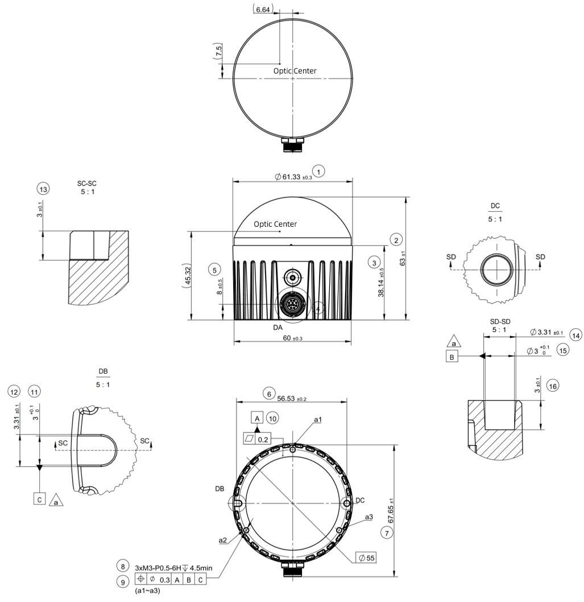{: .manual-img--xl }

{: .manual-img--xl }
