# Airy Lite 产品手册

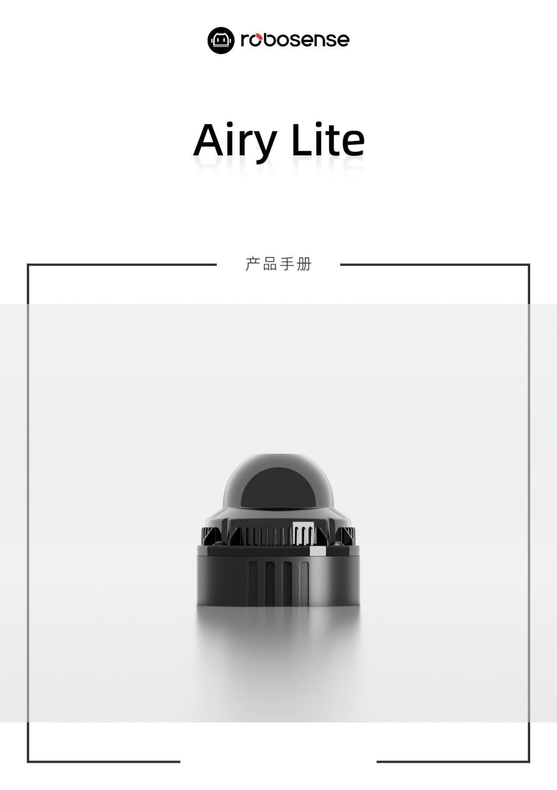{: .manual-img--xl }

## 1 安全提示

--8<-- "snippets/safety-reminder.md"

## 2 产品描述

### 2.1 产品概要

Airy Lite 是 RoboSense 专门为消除盲区设计的新型低成本 3D 激光雷达，主要应用于消费机器人、工业机器人、商用机器人等领域。

Airy Lite 最小探测距离可近至 0.1m，同时提供 $360^{\circ}(H)\times45^{\circ}(V)$ 的宽广 FOV 和最远 60m 的测距能力，可大范围内有效探测各类近距离障碍物。整机重量 200g，外露部分仅 $\varphi44\times20mm$ 的紧凑结构，显著降低空间占用，安装灵活便捷，轻松嵌入各类设备。依托于 RoboSense 数字化平台，采用革新的芯片化收发方案与数字化架构及信号处理技术，在实现高性能的同时兼顾成本优化与可靠性保障。

### 2.2 产品结构

Airy Lite 结构图如图 1 所示。

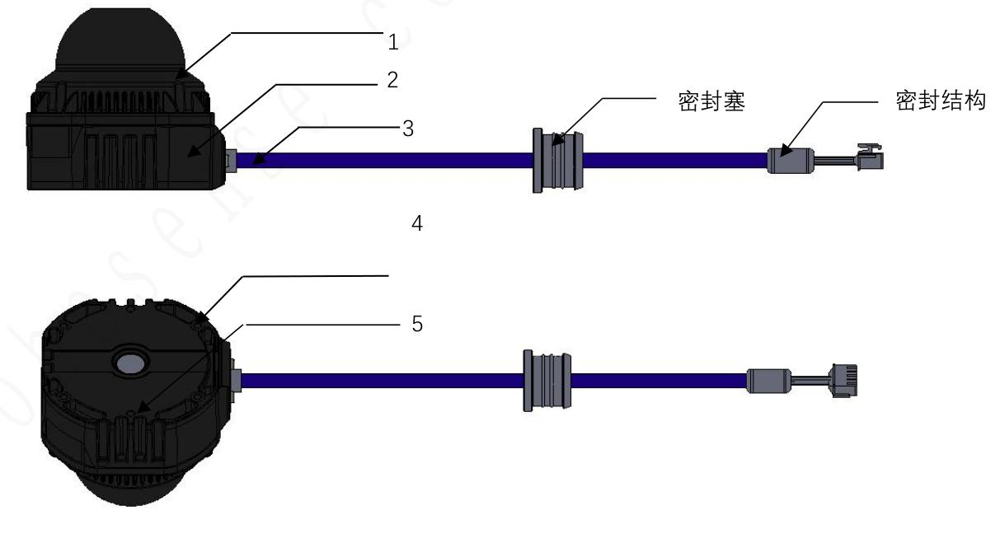{: .manual-img--xl }
<p align="center" style="font-size: 0.9em; color: gray;">图 1 产品结构说明</p>

其中包括以下结构:

#### 1) 防护罩

!!! warning "注意"
    激光雷达发射与接收激光均需透过弧形特制防护罩，在激光发散的 FOV 范围内严禁遮挡。

#### 2) 底座

激光雷达的底座部分，包含底部的透气膜、螺钉安装孔、定位孔以及出线接口。

#### 3) 线束

Airy Lite 本体配备一条线束，实现供电和数据传输的功能。关于线束接口的详细定义见章节 3.3。

!!! tip "提示"
    线束上的密封胶塞配合推荐材料和开孔尺寸后，可以实现 IPX7 要求；推荐开孔材料为铝合金，推荐开孔尺寸如下：

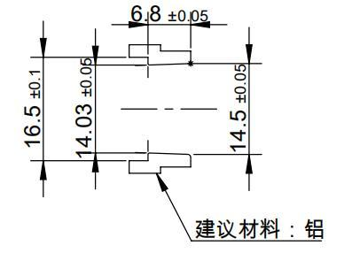{: .manual-img--xl }
<p align="center" style="font-size: 0.9em; color: gray;">图 2 胶塞推荐开孔尺寸</p>

线束上的另一密封结构（图 1 所指示的密封结构）是为了实现芯线间的密封，避免水等其他污染源倒灌进入雷达。

#### 4) M3 螺钉安装孔

用于激光雷达与安装支架间的固定，通过 M3 螺钉进行锁紧。

#### 5) 定位孔

用于支撑、固定激光雷达与支架之间的位置和方向，可提高安装效率与精度。

上述结构的详细尺寸和参数见附录 B 结构图纸部分。

### 2.3 雷达 FOV 分布

Airy Lite 的 FOV 在水平方向的角度范围是 0 ~ 360°，在垂直方向的角度范围是 $-11.5^{\circ} \sim +33.5^{\circ}$ ，垂直方向角度间隔约为 $1.96^{\circ}$ 。24路通道与真实的垂直角度对应关系如图3所示。

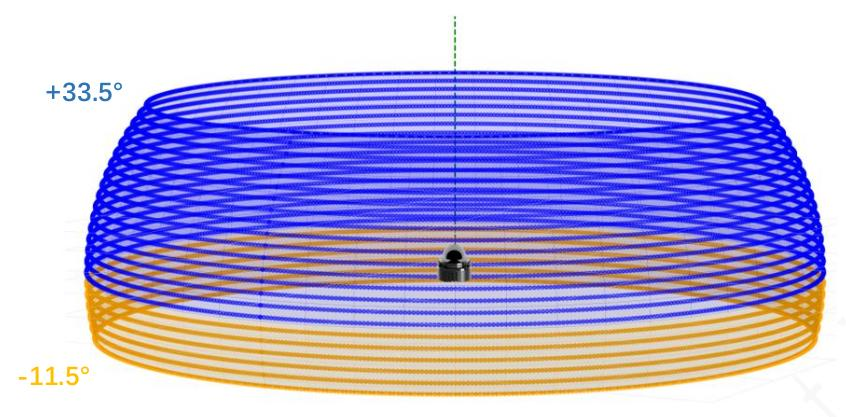{: .manual-img--xl }
<p align="center" style="font-size: 0.9em; color: gray;">图 3 FOV 示意图</p>

!!! info "提示"
    Airy Lite 因其设计架构及扫描时序限制，每秒约有 5ms 时间无法接收点云，也就是每 10 帧点云中有 1 帧点云出现约 30° 的点云缺口。

### 2.4 规格参数 $^{1}$

<p class="manual-table-caption">表 1 Airy Lite 规格参数</p>

<table class="manual-spec-grid-table">
  <tbody>
    <tr class="section-head">
      <th colspan="4">规格参数</th>
    </tr>
    <tr>
      <td class="spec-label">线数</td>
      <td class="spec-value">24</td>
      <td class="spec-label">水平视场角<sup>2</sup></td>
      <td class="spec-value">0° ~ 360°</td>
    </tr>
    <tr>
      <td class="spec-label">激光安全等级</td>
      <td class="spec-value">Class1 人眼安全</td>
      <td class="spec-label">垂直视场角<sup>3</sup></td>
      <td class="spec-value">-11.5° ~ +33.5°</td>
    </tr>
    <tr>
      <td class="spec-label">测距能力<sup>4</sup></td>
      <td class="spec-value" colspan="3">
        最远测距：60m<br>
        上下两边视场 (-11.5° ~ -0.25° &amp; +22.25° ~ +33.5°) ：30m@10% NIST<br>
        中间视场 (-0.25° ~ +22.25°) ：40m@10% NIST
      </td>
    </tr>
    <tr>
      <td class="spec-label">水平角分辨率</td>
      <td class="spec-value">0.6°</td>
      <td class="spec-label">垂直角分辨率</td>
      <td class="spec-value">1.96°</td>
    </tr>
    <tr>
      <td class="spec-label">盲区</td>
      <td class="spec-value">&lt; 0.1m</td>
      <td class="spec-label">精度（典型值）<sup>5</sup></td>
      <td class="spec-value">1 cm (1σ)</td>
    </tr>
    <tr>
      <td class="spec-label">出点数</td>
      <td class="spec-value">144,000 pts / s</td>
      <td class="spec-label">帧率</td>
      <td class="spec-value">10 Hz</td>
    </tr>
    <tr>
      <td class="spec-label">数据接口</td>
      <td class="spec-value" colspan="3">RS485 (双路 4000000 8-N-1)</td>
    </tr>
    <tr>
      <td class="spec-label">输出数据内容</td>
      <td class="spec-value" colspan="3">三维空间坐标、反射强度、时间戳等</td>
    </tr>
    <tr>
      <td class="spec-label">工作电压</td>
      <td class="spec-value">10V - 16V</td>
      <td class="spec-label">回波模式</td>
      <td class="spec-value">单回波：最强回波</td>
    </tr>
    <tr>
      <td class="spec-label">产品功率<sup>6</sup></td>
      <td class="spec-value">4.5W</td>
      <td class="spec-label">尺寸(H x W x D)</td>
      <td class="spec-value">整机：69*64*62 mm</td>
    </tr>
    <tr>
      <td class="spec-label"></td>
      <td class="spec-value"></td>
      <td class="spec-label"></td>
      <td class="spec-value">（包含出线接口）<br>防护罩： Φ44mm*20 mm</td>
    </tr>
    <tr>
      <td class="spec-label">重量</td>
      <td class="spec-value">210±10g<br>（激光雷达本体）</td>
      <td class="spec-label">工作温度<sup>7</sup></td>
      <td class="spec-value">- 20℃ ～ + 60℃</td>
    </tr>
    <tr>
      <td class="spec-label">时间同步</td>
      <td class="spec-value">GPS</td>
      <td class="spec-label">存储温度</td>
      <td class="spec-value">- 40℃ ～ + 85℃</td>
    </tr>
    <tr>
      <td class="spec-label">产品型号</td>
      <td class="spec-value">Airy Lite</td>
      <td class="spec-label">防护等级</td>
      <td class="spec-value">IP67（不含线束接口位置）</td>
    </tr>
  </tbody>
</table>

<div class="spec-footnotes">

<p><sup>1</sup> 以下数据只针对量产产品，任何样品、试验机等其它非量产版本可能并不适用本规格数据，如有疑问请联系 RoboSense。</p>

<p><sup>2</sup> 每 10 帧点云中有 1 帧点云出现约 30° 的点云缺口。</p>

<p><sup>3</sup> 垂直角度单体存在一定角度波动。</p>

<p><sup>4</sup> 测试条件在常温环境、100klux 光照、10%NIST 漫反射板为目标。</p>

<p><sup>5</sup> 测距精度以 50%NIST 漫反射板为目标，测试结果会受到环境影响，包括但不限于环境温度、目标物距离等因素，且精度值适用于大部分通道，部分通道之间存在差异。</p>

<p><sup>6</sup> 功耗测试结果会受到外部环境影响，包括但不限于环境温度、目标物的距离、目标物反射强度等因素。</p>

<p><sup>7</sup> 产品运行温度可能会受到外部环境影响，包括但不限于光照环境、气流变化等因素。</p>

</div>

### 2.5 产品原理

#### 2.5.1 坐标映射

由于激光雷达封装的数据包仅为水平旋转角度和距离参量, 为了呈现三维点云图的效果, 将极坐标下的角度和距离信息转化为了笛卡尔坐标系下的 x, y, z 坐标, 它们的转换关系如下式所示:

$$
\left\{ \begin{array}{c} x = r c o s (w) \cos (a) + R c o s (a) \\ y = - r \cos (w) \sin (a) - R s i n (a) \\ Z = r s i n (w) + z \end{array} \right.
$$

其中 r 为实测距离， $\omega$ 为激光的垂直角度， $\alpha$ 为激光的水平旋转角度，R 为光心到原点的平面半径，Z 为光心到原点的 Z 轴高度，x, y, z 为极坐标投影到笛卡尔 X, Y, Z 轴上的坐标。

#### 2.5.2 反射强度解读

Airy Lite 激光雷达提供了反射强度信息来表征被测物体的反射率。在 Airy Lite 数据中，标定后的反射强度范围区间为 1～255（该范围区间为 RoboSense 产品自定义的对目标反射率探测的数值）。

#### 2.5.3 时间同步方式

!!! info "提示"
    Airy Lite 当前仅支持 GPS 同步方式。

##### 2.5.3.1 GPS 时间同步原理

GPS 模块连续向产品发送 GPRMC 数据和 PPS 同步脉冲信号，PPS 同步脉冲长度为 20～200 ms，GPRMC 数据必须在 PPS 同步脉冲下降沿后 10 ms 之后发射，时序图如图 4 所示。

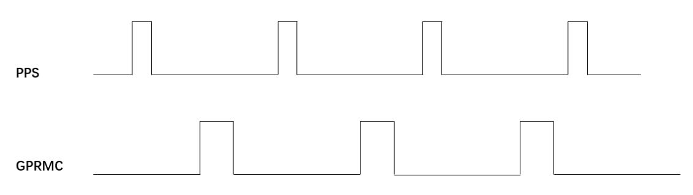{: .manual-img--xl }
<p align="center" style="font-size: 0.9em; color: gray;">图 4 GPS 时间同步时序图</p>

!!! tip "提示"
    为确保时间同步的准确性, 建议将 PPS 的脉宽设置在 20 ~ 200 ms 之间。发送周期为 1s。先发送 PPS, 然后通过后续 GPRMC 的时间内容确定之前发送 PPS 的授时 master 时间。

##### 2.5.3.2 GPS 时间同步使用

Airy Lite 激光雷达 GPS 接口电平协议为 TTL 电平标准，详情参见表 2。

<p class="manual-table-caption">表 2 产品授时引脚定义</p>

<table class="packet-def-table timing-pin-table">
  <thead>
    <tr>
      <th rowspan="2">通讯方式</th>
      <th colspan="2">接收引脚定义</th>
    </tr>
    <tr>
      <th>GPS GPRMC</th>
      <th>GPS PULSE</th>
    </tr>
  </thead>
  <tbody>
    <tr>
      <td>TTL</td>
      <td>接 GPS 模块输出的 TTL 电平标准的串口数据</td>
      <td>接 GPS 模块输出的同步脉冲信号，电平要求 3.3V</td>
    </tr>
  </tbody>
</table>

外接的 GPS 模块需要设置输出串口的波特率为 9600 bps，数据位 8 bits，无校验位，停止位 1 bit。Airy Lite 只读取 GPS 模块发出的 GPRMC 格式的数据，其标准格式如下：

```
$GPRMC,<1>,<2>,<3>,<4>,<5>,<6>,<7>,<8>,<9>,<10>,<11>,<12>*hh
```

- `<1>` UTC 时间
- `<2>` 定位状态，A=有效定位，V=无效定位
- `<3>` 纬度
- `<4>` 纬度半球 N(北半球)或 S(南半球)
- `<5>` 经度
- `<6>` 经度半球 E(东经)或 W(西经)
- `<7>` 地面速率
- `<8>` 地面航向
- `<9>` UTC 日期
- `<10>` 磁偏角
- `<11>` 磁偏角方向，E(东)或W(西)
- `<12>` 模式指示 (A=自主定位, D=差分, E=估算, N=数据无效)

`*` 后 hh 为到 `*` 所有字符的异或和

!!! tip "提示"
    1. 1 PPS 脉冲的发送时间间隔需控制在 $1 \, s \pm 200 \, us$ 内。
    2. 年份若在 00-69，解析为 2000-2069 年；若在 70-99，解析为 1970 年到 1999 年。
    3. 目前市场的 GPS 模块发出的 GPRMC 消息长度存在不一致情况，本产品可兼容市场上大部分 GPS 模块发出来的 GPRMC 消息格式，如果在使用过程中发现不兼容的情况，请联系 RoboSense
    4. 使用时消息需要满足仅 GPRMC 消息，其他信息需屏蔽。
    5. 模式指示必须为 A（有效定位）时，才可以同步成功。
    6. PPS 频率要求：1s 一次
    7. GPRMC 频率要求：1s 一次

## 3 产品安装

### 3.1 配件说明

Airy Lite 标配出货配件清单如表 3 所示，清单仅供参考。

<p class="manual-table-caption">表 3 出厂标准配件清单</p>

<div class="manual-table-wrap">
<table class="accessories-table">
  <thead>
    <tr>
      <th>序号</th>
      <th>配件名称</th>
      <th>规格</th>
      <th>数量</th>
    </tr>
  </thead>
  <tbody>
    <tr>
      <td>1</td>
      <td>激光雷达<br>LiDAR</td>
      <td>Airy Lite</td>
      <td>1</td>
    </tr>
    <tr>
      <td>2</td>
      <td>螺丝包（选配）<br>Screw Pack</td>
      <td>M3* 8</td>
      <td>4</td>
    </tr>
    <tr>
      <td>3</td>
      <td>产品包装清单和出货检验报告<br>Product Packing List and Shipment Inspection Report</td>
      <td>/</td>
      <td>1</td>
    </tr>
  </tbody>
</table>
</div>

!!! tip "提示"
    如特殊要求请以商务协议为准

### 3.2 机械安装

激光雷达的结构安装图如图 5 所示。

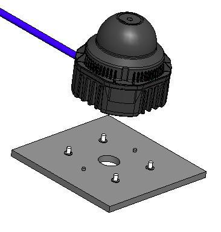{: .manual-img--xl }
<p align="center" style="font-size: 0.9em; color: gray;">图 5 激光雷达结构安装示意图</p>

**1. 螺钉规格**

- GB/T70.1，M3*8，内六角圆柱头，强度等级不低于8.8级；

**2. 安装及定位方式**

- 支架与激光雷达定位如图所示；推荐采用雷达底部定位柱方式进行定位；
- 底部支架建议在 4 个安装孔附近使用小凸台与激光雷达配合，凸台整体平面度要求 0.05 mm 以内；
- 底面用 4 个 M3 螺钉安装，超出安装面 4～5mm，推荐锁紧扭矩 $6.6 \pm 0. 5 \mathrm{kgf} \cdot \mathrm{cm}$;
- 底面用 2 个 $\Phi2.5$ 定位销进行安装定位, 高度不能高于安装面 1.5 mm;
- 激光雷达安装的时候，如果激光雷达上下面都有接触式的安装面，请确保安装面之间的间距大于激光雷达高度，避免挤压激光雷达；
!!! warning "注意"
    防护罩属于光学器件&塑胶材质，安装或使用过程避免其受力。

- 由于激光雷达需要线束与外界进行通信，如果线束走线空间太小，弯折半径太小，会对线束寿命与信号质量有影响，对线束安装的要求如下：
    - 激光雷达安装走线时，请勿使激光雷达接线线缆太过紧绷，确保线缆具有一定的松弛度；
    - 线束直径 $5 \pm 0.2 ~mm$ ，线束最小弯折半径为 5 倍线束直径。

**3. 支架刚度和强度要求**

固定支架需有较好的刚性用于安装固定激光雷达，并在各种工况下保持激光雷达处于一个稳定的状态，设计要求如下：

- 推荐激光雷达固定支架保持一定的刚性，具体边界要求由用户感知侧需求评估决定；
- 激光雷达支架在经历随机振动、机械冲击等工况下会承受较大的负载，应结合实际工况校核支架强度。机械冲击工况，支架最大应力应小于拉伸强度的 2/3。随机振动工况，支架 1sigma RMS 应力应小于拉伸强度的 1/5。

**4. 支架散热要求**

Airy Lite 在使用过程中会有一定程度的温升，且受周边热源、环境温度、太阳辐射等因素的影响，可能会加剧激光雷达的温升。RoboSense 可根据具体设计方案提供热仿真评估及优化建议。常规散热建议如下：

- 激光雷达附近环境温度需控制在工作温度范围内 $(-20^{\circ}\mathrm{C} \sim +60^{\circ}\mathrm{C})$ ;
- 支架材料建议采用导热系数大于 $50 \, W/m \cdot K$ 的铝合金等材料，尽量在支架上做一些散热鳍片，并合理的控制鳍片间距、高度和方向，增大散热面积，方向上与空气对流方向一致，可更有效散热。支架表面积不小于 $10000 \, mm^{2}$ ;
- 激光雷达底座或顶部需确保不被非金属材质包覆，以免影响整机散热，造成激光雷达温升过高；
- 激光雷达底座和下方金属支架之间，建议增加导热材料（导热系数3W/mK以上）以提升激光雷达向支架的热传导效率。

**5. 透气要求**

!!! warning "注意"
    Airy Lite 底座有透气孔、透气通道。支架、导热材料等不能封闭透气孔或透气通道。同时建议支架底部开孔透气（如图 6 所示）。

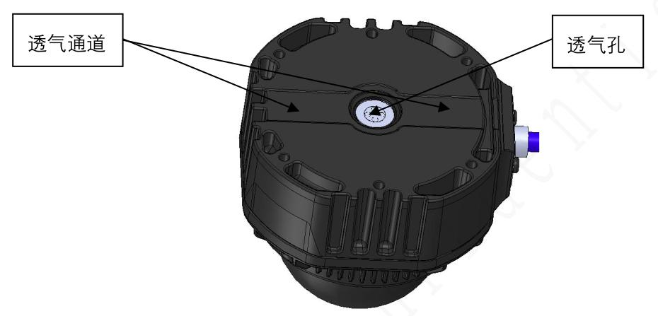{: .manual-img--xl }
<p align="center" style="font-size: 0.9em; color: gray;">图 6 激光雷达底部透气孔及透气通道示意图</p>

### 3.3 接口说明

Airy Lite 激光雷达自带一条甩出线，线束末端为连接器。

连接器型号为：连大 2HCB20010209，其引脚序号如图 7 所示：

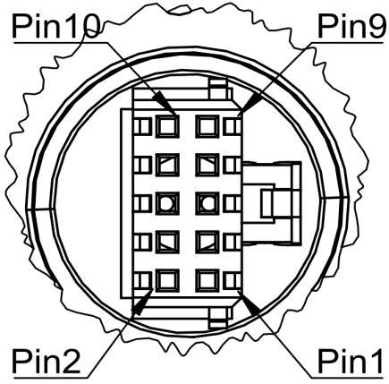{: .manual-img--xl }
<p align="center" style="font-size: 0.9em; color: gray;">图 7 连接器接口引脚序号</p>


具体引脚定义参见表 4。

<p class="manual-table-caption">表 4 连接器接口引脚定义</p>

<div class="manual-table-wrap">
<table class="packet-def-table pin-def-table">
  <thead>
    <tr>
      <th>引脚编号</th>
      <th>线规</th>
      <th>定义</th>
      <th>颜色</th>
      <th>备注</th>
    </tr>
  </thead>
  <tbody>
    <tr>
      <td>1</td>
      <td>AWG28</td>
      <td>VIN</td>
      <td>红色</td>
      <td></td>
    </tr>
    <tr>
      <td>2</td>
      <td>AWG28</td>
      <td>GND</td>
      <td>黑色</td>
      <td></td>
    </tr>
    <tr>
      <td>3</td>
      <td>/</td>
      <td>NC</td>
      <td>/</td>
      <td></td>
    </tr>
    <tr>
      <td>4</td>
      <td>/</td>
      <td>NC</td>
      <td>/</td>
      <td></td>
    </tr>
    <tr>
      <td>5</td>
      <td>AWG28</td>
      <td>A485_A</td>
      <td>绿色</td>
      <td rowspan="2">波特率 4000000 双绞<br>≥50 绞/m</td>
    </tr>
    <tr>
      <td>6</td>
      <td>AWG28</td>
      <td>A485_B</td>
      <td>青色</td>
    </tr>
    <tr>
      <td>7</td>
      <td>AWG28</td>
      <td>PPS</td>
      <td>黄色</td>
      <td>电平：3.3V TTL</td>
    </tr>
    <tr>
      <td>8</td>
      <td>AWG28</td>
      <td>GPS</td>
      <td>棕色</td>
      <td>电平：3.3V TTL，波特率 9600bps</td>
    </tr>
    <tr>
      <td>9</td>
      <td>AWG28</td>
      <td>B485_B</td>
      <td>紫色</td>
      <td rowspan="2">波特率 4000000 双绞<br>≥50 绞/m</td>
    </tr>
    <tr>
      <td>10</td>
      <td>AWG28</td>
      <td>B485_A</td>
      <td>蓝色</td>
    </tr>
  </tbody>
</table>
</div>

## 4 产品使用

### 4.1 产品坐标系

产品的坐标系及旋转方向如图 8 所示。

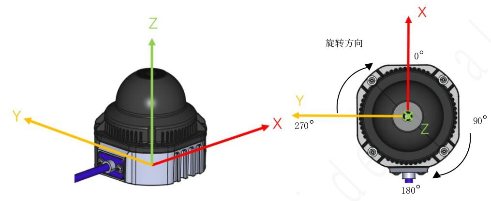{: .manual-img--xl }
<p align="center" style="font-size: 0.9em; color: gray;">图 8 激光雷达坐标及旋转方向示意图</p>

!!! tip "提示"
    激光雷达的坐标原点定义在激光雷达底座中心处

### 4.2 通信协议

Airy Lite 输出内容主要分为三大类，详情参见表 5。

<p class="manual-table-caption">表 5 产品协议一览表</p>

<table class="packet-def-table product-protocol-table">
  <colgroup>
    <col class="pp-col-name" />
    <col class="pp-col-abbr" />
    <col class="pp-col-func" />
    <col class="pp-col-size" />
    <col class="pp-col-rate" />
  </colgroup>
  <thead>
    <tr>
      <th>（协议/包）名称</th>
      <th>简写</th>
      <th>功能</th>
      <th>包大小</th>
      <th>发送间隔</th>
    </tr>
  </thead>
  <tbody>
    <tr>
      <td>Main data Stream Output Protocol</td>
      <td>MSOP</td>
      <td>扫描数据输出</td>
      <td>104 bytes</td>
      <td>约 166.67 us</td>
    </tr>
    <tr>
      <td>Device Information Output Protocol</td>
      <td>DIFOP</td>
      <td>产品信息输出</td>
      <td>337 bytes</td>
      <td>约 1 s</td>
    </tr>
    <tr>
      <td>IMU Output Protocol.</td>
      <td>IMU</td>
      <td>惯量传感器信息</td>
      <td>51 bytes</td>
      <td>约 5ms</td>
    </tr>
  </tbody>
</table>

!!! tip "提示"
    1. 产品手册 4.2 节为对协议中的有效载荷部分进行描述和定义。
    2. 主数据流输出协议 MSOP，将激光雷达扫描出来的距离，角度，反射强度等信息封装成包输出。
    3. 产品信息输出协议 DIFOP，将激光雷达当前状态的各种配置信息输出。
    4. 惯量传感器信息协议 IMU，输出雷达 6 轴加速度和角速度信息。
    5. IMU 和 DIFOP 通过 A485 发出，MSOP 通过 A485 和 B485 共同发出。
    6. GPS 接口正常使用时用于时间同步，在 OTA 固件时用于切换功能。
    7. MSOP 发送间隔与 485 传输路数以及角度缺失时间相关，IMU 发送间隔和频率相关，200Hz 下默认是 5ms。
    8. 当前手册未包含升级等诊断协议描述，如有需求请联系速腾技术支持人员获取。

#### 4.2.1 输出数据结构

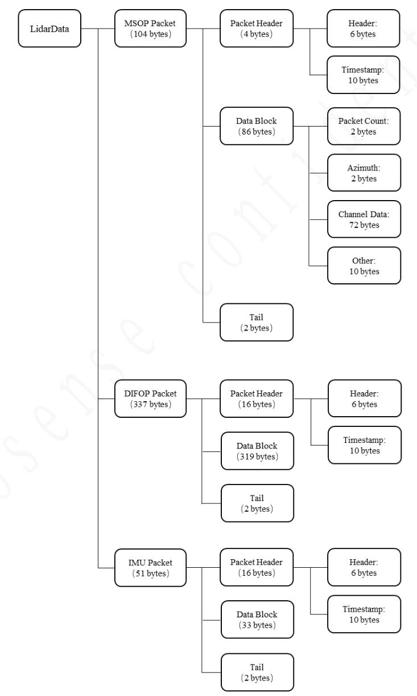{: .manual-img--xl }
<p align="center" style="font-size: 0.9em; color: gray;">图 9 激光雷达数据结构示意图</p>

#### 4.2.2 主数据流输出协议（MSOP）

主数据流输出协议：Main data Stream Output Protocol，简称：MSOP。

I/O 类型：产品输出，电脑解析。

##### 4.2.2.1 帧头

帧头 Packet Header 共 16 bytes，用于识别出此 Packet 的开始位置，数据结构详情参见表 6。

<p class="manual-table-caption">表 6 MSOP Header 数据表</p>

<table class="packet-def-table msop-header-table">
  <thead>
    <tr>
      <th>信息</th>
      <th>Offset</th>
      <th>长度 (byte)</th>
      <th>说明</th>
      <th>总长度 (byte)</th>
    </tr>
  </thead>
  <tbody>
    <tr>
      <td>pkt_head</td>
      <td>0</td>
      <td>4</td>
      <td>包起始标志 固定值 0x5A 0xFF 0x55 0xAA</td>
      <td rowspan="4">16</td>
    </tr>
    <tr>
      <td>预留</td>
      <td>4</td>
      <td>1</td>
      <td></td>
    </tr>
    <tr>
      <td>数据类型</td>
      <td>5</td>
      <td>1</td>
      <td>值为 1，表示点云数据</td>
    </tr>
    <tr>
      <td>timestamp</td>
      <td>6</td>
      <td>10</td>
      <td>时间戳，前 6 byte 表示秒，后 4 byte 表示微秒</td>
    </tr>
  </tbody>
</table>

!!! tip "提示"
    定义的时间戳用来记录系统的时间，分辨率为 1 us。

##### 4.2.2.2 数据块区间

如表 7 所示，数据块区间 Data block 是 MSOP 包中传感器测量值部分，共 86 bytes。

<p class="manual-table-caption">表 7 Data Block 数据包定义</p>

<table class="packet-def-table msop-header-table">
  <thead>
    <tr>
      <th>信息</th>
      <th>Offset</th>
      <th>长度 (byte)</th>
      <th>说明</th>
      <th>总长度 (byte)</th>
    </tr>
  </thead>
  <tbody>
    <tr>
      <td>Azimuth</td>
      <td>0</td>
      <td>2</td>
      <td>极坐标系下，水平夹角，分辨率 0.01</td>
      <td rowspan="10">86</td>
    </tr>
    <tr>
      <td rowspan="2">Channel data 1</td>
      <td>2</td>
      <td>2</td>
      <td>测距，取低 14bits，高 2bit 用于标记点云属性。[bit15:bit14] 0：正常点云；1：轻度脏污 2：重度脏污；3：遮挡</td>
    </tr>
    <tr>
      <td>4</td>
      <td>1</td>
      <td>反射率</td>
    </tr>
    <tr>
      <td>Channel data 2</td>
      <td>5</td>
      <td>3</td>
      <td>同 data 1</td>
    </tr>
    <tr>
      <td>Channel data 3</td>
      <td>8</td>
      <td>3</td>
      <td>同 data 1</td>
    </tr>
    <tr>
      <td>...</td>
      <td>...</td>
      <td>...</td>
      <td>...</td>
    </tr>
    <tr>
      <td>Channel data 23</td>
      <td>68</td>
      <td>3</td>
      <td>同 data 1</td>
    </tr>
    <tr>
      <td>Channel data 24</td>
      <td>71</td>
      <td>3</td>
      <td>同 data 1</td>
    </tr>
    <tr>
      <td>预留</td>
      <td>74</td>
      <td>10</td>
      <td></td>
    </tr>
    <tr>
      <td>包计数</td>
      <td>84</td>
      <td>2</td>
      <td>包计数范围：0-0xFFFF</td>
    </tr>
  </tbody>
</table>

Data block 中 86 bytes 的空间包括：2 bytes 的 Azimuth，表示水平旋转角度信息，每个角度信息对应着 24 个 channel data；10 bytes 的预留位；2 bytes 的包计数信息。

1）角度值定义

在每个 Block 中，Airy Lite 输出的 Azimuth 角度值是该 Block 中第一个通道激光测距时的角度值。角度值来源于角度编码器，角度编码器的零位即角度的零点，水平旋转角度值的分辨率为 $0.01^{\circ}$ 。

2) 通道数据定义

通道数据 Channel data 是 3 bytes，高两字节用于表示距离信息，低一字节用于表示反射强度信息，如表 8 所示。

<p class="manual-table-caption">表 8 Channel Data 示意表</p>

<table class="packet-def-table channel-data-table channel-data-table--two-col">
  <colgroup>
    <col class="channel-data-col-distance" />
    <col class="channel-data-col-reflectivity" />
  </colgroup>
  <thead>
    <tr>
      <th colspan="2">通道数据（3 bytes）</th>
    </tr>
  </thead>
  <tbody>
    <tr>
      <td>2 bytes Distance</td>
      <td>1 byte Reflectivity</td>
    </tr>
    <tr>
      <td>测距，取低 14bits，高 2bit 用于标记点云属性。[bit15:bit14]<br>0：正常点云；1：轻度脏污 2：重度脏污；3：遮挡</td>
      <td>反射强度信息</td>
    </tr>
  </tbody>
</table>

!!! tip "提示"
    Distance 是 2 bytes，分辨率为 0.5 cm。

#### 4.2.3 产品信息输出协议（DIFOP）

产品信息输出协议，Device Info Output Protocol，简称：DIFOP。

I/O 类型：产品输出，电脑解析

DIFOP 是为了将产品序列号（S/N）、固件版本、校准角度、运行状态等信息，定期发送给用户的“仅输出”协议，用户可以通过读取 DIFOP 解读当前使用产品的各种参数的具体信息。

一个完整的 DIFOP Packet 的基本数据格式结构为 DIFOP 帧头，数据区，帧尾。每个 Packet 共 337 bytes。数据包的基本结构如表 9 所示。

<p class="manual-table-caption">表 9 DIFOP Packet 的数据格式结构</p>

<div class="manual-table-scroll-wrap">
<table class="packet-def-table difop-packet-table airylite-difop-layout-table">
  <colgroup>
    <col class="difop-col-var" />
    <col class="difop-col-offset" />
    <col class="difop-col-len" />
    <col class="difop-col-content" />
  </colgroup>
  <thead>
    <tr>
      <th>信息</th>
      <th>Offset</th>
      <th>长度 (byte)</th>
      <th>说明</th>
    </tr>
  </thead>
  <tbody>
    <tr>
      <td>pkt_head</td>
      <td>0</td>
      <td>4</td>
      <td class="difop-content">包起始标志 固定值 0x5A 0xFF 0x55 0xAA</td>
    </tr>
    <tr>
      <td>预留</td>
      <td>4</td>
      <td>1</td>
      <td class="difop-content"></td>
    </tr>
    <tr>
      <td>数据类型</td>
      <td>5</td>
      <td>1</td>
      <td class="difop-content">值为 3，表示状态信息</td>
    </tr>
    <tr>
      <td rowspan="2">timestamp</td>
      <td>6</td>
      <td>6</td>
      <td class="difop-content">时间戳的秒部分</td>
    </tr>
    <tr>
      <td>12</td>
      <td>4</td>
      <td class="difop-content">时间戳的微秒部分。u32 类型<br>单位：µs<br>范围：0 ~ 999 999 µs (1 s)</td>
    </tr>
    <tr>
      <td>预留</td>
      <td>16</td>
      <td>2</td>
      <td class="difop-content"></td>
    </tr>
    <tr>
      <td>电机实时转速</td>
      <td>18</td>
      <td>2</td>
      <td class="difop-content">见附录 A.1</td>
    </tr>
    <tr>
      <td>预留</td>
      <td>20</td>
      <td>8</td>
      <td class="difop-content"></td>
    </tr>
    <tr>
      <td>主板 PL 固件版本</td>
      <td>28</td>
      <td>5</td>
      <td class="difop-content">首字节为 0，其他字节表示版本信息。见附录 A.2</td>
    </tr>
    <tr>
      <td>APP 固件版本</td>
      <td>33</td>
      <td>5</td>
      <td class="difop-content">首字节为 0，其他字节表示版本信息。见附录 A.3</td>
    </tr>
    <tr>
      <td>电机固件版本</td>
      <td>38</td>
      <td>5</td>
      <td class="difop-content">首字节为 0，其他字节表示版本信息。见附录 A.4</td>
    </tr>
    <tr>
      <td>预留</td>
      <td>43</td>
      <td>14</td>
      <td class="difop-content"></td>
    </tr>
    <tr>
      <td>产品序列号</td>
      <td>57</td>
      <td>6</td>
      <td class="difop-content">见附录 A.5</td>
    </tr>
    <tr>
      <td>预留</td>
      <td>63</td>
      <td>18</td>
      <td class="difop-content"></td>
    </tr>
    <tr>
      <td>GPS 状态</td>
      <td>81</td>
      <td>1</td>
      <td class="difop-content">bit0(PPS 锁定标志):锁相 = 1，失锁 = 0<br>bit1-bit2 预留<br>bit3(GPRMC 输入状态):有输入 = 1，无输入 = 0<br>bit4(PPS 输入状态):有输入 = 1，无输入 = 0<br>bit5-bit7 预留</td>
    </tr>
    <tr>
      <td>垂直角校准</td>
      <td>82</td>
      <td>48</td>
      <td class="difop-content" rowspan="2">见附录 A.6</td>
    </tr>
    <tr>
      <td>垂直角校准符号位</td>
      <td>130</td>
      <td>3</td>
    </tr>
    <tr>
      <td>水平角校准</td>
      <td>133</td>
      <td>48</td>
      <td class="difop-content" rowspan="2">见附录 A.7</td>
    </tr>
    <tr>
      <td>水平角校准符号位</td>
      <td>181</td>
      <td>3</td>
    </tr>
    <tr>
      <td>预留</td>
      <td>184</td>
      <td>101</td>
      <td class="difop-content"></td>
    </tr>
    <tr>
      <td rowspan="7">IMU 外参标定数据</td>
      <td>285</td>
      <td>4</td>
      <td class="difop-content" rowspan="7">见附录 A.8</td>
    </tr>
    <tr>
      <td>289</td>
      <td>4</td>
    </tr>
    <tr>
      <td>293</td>
      <td>4</td>
    </tr>
    <tr>
      <td>297</td>
      <td>4</td>
    </tr>
    <tr>
      <td>301</td>
      <td>4</td>
    </tr>
    <tr>
      <td>305</td>
      <td>4</td>
    </tr>
    <tr>
      <td>309</td>
      <td>4</td>
    </tr>
    <tr>
      <td>预留</td>
      <td>313</td>
      <td>20</td>
      <td class="difop-content"></td>
    </tr>
    <tr>
      <td>包计数</td>
      <td>333</td>
      <td>2</td>
      <td class="difop-content">包序号，u16 格式，范围为 0~0xFFFF</td>
    </tr>
    <tr>
      <td>帧尾</td>
      <td>335</td>
      <td>2</td>
      <td class="difop-content">CRC16</td>
    </tr>
  </tbody>
</table>
</div>

!!! tip "提示"
    每一项信息的寄存器的定义以及使用参见产品手册附录 A 中的详细描述，对应关系见表 9 说明栏内容。

#### 4.2.4 雷达 IMU 数据流输出协议

I/O 类型：产品输出，电脑解析。

IMU 输出的为产品内部 IMU 的姿态信息，可用于客户产品外参调整。每个数据包共 51 bytes。数据包的基本结构如表 10 所示。

<p class="manual-table-caption">表 10 IMU 数据格式结构</p>

<div class="manual-table-scroll-wrap">
<table class="packet-def-table difop-packet-table airylite-difop-layout-table">
  <colgroup>
    <col class="difop-col-var" />
    <col class="difop-col-offset" />
    <col class="difop-col-len" />
    <col class="difop-col-content" />
  </colgroup>
  <thead>
    <tr>
      <th>信息</th>
      <th>Offset</th>
      <th>长度 (byte)</th>
      <th>说明</th>
    </tr>
  </thead>
  <tbody>
    <tr>
      <td>IMU 帧头</td>
      <td>0</td>
      <td>4</td>
      <td class="difop-content">0x5A 0xFF 0x55 0xAA</td>
    </tr>
    <tr>
      <td>预留</td>
      <td>4</td>
      <td>1</td>
      <td class="difop-content"></td>
    </tr>
    <tr>
      <td>数据类型</td>
      <td>5</td>
      <td>1</td>
      <td class="difop-content">值为 2，表示 IMU 数据</td>
    </tr>
    <tr>
      <td rowspan="2">Timestamp</td>
      <td>6</td>
      <td>6</td>
      <td class="difop-content">时间戳的秒部分</td>
    </tr>
    <tr>
      <td>12</td>
      <td>4</td>
      <td class="difop-content">时间戳的微秒部分。u32 类型<br>单位：μs<br>范围：0 ~ 999 999 μs (1 s)</td>
    </tr>
    <tr>
      <td>AccelX</td>
      <td>16</td>
      <td>4</td>
      <td class="difop-content">X 轴加速度值，浮点数，单位 m/s^2</td>
    </tr>
    <tr>
      <td>AccelY</td>
      <td>20</td>
      <td>4</td>
      <td class="difop-content">Y 轴加速度值，浮点数，单位 m/s^2</td>
    </tr>
    <tr>
      <td>AccelZ</td>
      <td>24</td>
      <td>4</td>
      <td class="difop-content">Z 轴加速度值，浮点数，单位 m/s^2</td>
    </tr>
    <tr>
      <td>GyroX</td>
      <td>28</td>
      <td>4</td>
      <td class="difop-content">X 轴角速度值，浮点数，单位 rad/s</td>
    </tr>
    <tr>
      <td>GyroY</td>
      <td>32</td>
      <td>4</td>
      <td class="difop-content">Y 轴角速度值，浮点数，单位 rad/s</td>
    </tr>
    <tr>
      <td>GyroZ</td>
      <td>36</td>
      <td>4</td>
      <td class="difop-content">Z 轴角速度值，浮点数，单位 rad/s</td>
    </tr>
    <tr>
      <td>内部温度</td>
      <td>40</td>
      <td>4</td>
      <td class="difop-content">IMU 内部温度，有符号，分辨率 0.01 度</td>
    </tr>
    <tr>
      <td>ODR</td>
      <td>44</td>
      <td>1</td>
      <td class="difop-content">数据输出频率<br>0:25Hz<br>1:50Hz<br>2:100Hz<br>3:200Hz</td>
    </tr>
    <tr>
      <td>AccelFsr</td>
      <td>45</td>
      <td>1</td>
      <td class="difop-content">加速度计量程<br>0: +/- 2g<br>1: +/- 4g<br>2: +/- 8g<br>3: +/- 16g</td>
    </tr>
    <tr>
      <td>GyroFsr</td>
      <td>46</td>
      <td>1</td>
      <td class="difop-content">陀螺仪量程<br>0: +/- 250 dps<br>1: +/- 500 dps<br>2: +/- 1000 dps<br>3: +/- 2000 dps</td>
    </tr>
    <tr>
      <td>包计数</td>
      <td>47</td>
      <td>2</td>
      <td class="difop-content">包序号 u16 0~0xFFFF</td>
    </tr>
    <tr>
      <td>帧尾</td>
      <td>49</td>
      <td>2</td>
      <td class="difop-content">CRC16</td>
    </tr>
  </tbody>
</table>
</div>

## 5 故障诊断

本章列举了部分在使用产品的过程中常见的问题以及对应的问题排查方法，详情参见表 11。

<p class="manual-table-caption">表 11 常见故障排查方法表</p>

<table class="packet-def-table fault-troubleshoot-table">
  <colgroup>
    <col class="fault-col-phenomenon" />
    <col class="fault-col-solution" />
  </colgroup>
  <thead>
    <tr>
      <th>故障现象</th>
      <th>解决方法</th>
    </tr>
  </thead>
  <tbody>
    <tr>
      <td>产品电机不旋转</td>
      <td>检查接线是否松动及线束破损。</td>
    </tr>
    <tr>
      <td>产品在启动时不断重启</td>
      <td>
        1. 检查输入电源连接和极性是否正常；<br>
        2. 检查输入电源的电压和电流是否满足要求；<br>
        3. 检查产品安装平面是否水平或激光雷达底部固定螺丝是否拧的太紧。
      </td>
    </tr>
    <tr>
      <td>产品内部旋转，但是没有数据</td>
      <td>
        1. 检查激光是否正常发射；<br>
        2. 检查串口连接是否正常；<br>
        3. 确认串口号配置是否正确；<br>
        4. 使用另外的软件（例如 XCOM）检查数据是否有被接收；<br>
        5. 检查电源供电正常；<br>
        6. 尝试重启产品。
      </td>
    </tr>
    <tr>
      <td>产品存在频发的数据丢失</td>
      <td>
        1. 确认是否安装高速串口驱动；<br>
        2. 确认电脑的性能和接口性能是否满足要求；<br>
        3. 直连电脑确认是否存在丢包现象。
      </td>
    </tr>
  </tbody>
</table>

## 6 产品维护

--8<-- "snippets/product-maintenance.md"

## 7 售后

--8<-- "snippets/after-sales.md"

## 附录 A DIFOP 数据定义

!!! info "提示"
    本附录内容补充章节 4.2.3 的 DIFOP 协议里各个信息定义的说明，便于用户对产品的使用和开发。涉及到计算部分，均采用大端模式，Value 代表对应 offset 字节换算后得出的十进制数值。

### A.1 电机实时转速

<p class="manual-table-caption">表 12 电机实时转速</p>

<table class="packet-def-table">
  <thead>
    <tr>
      <th colspan="3">电机实时转速（共 2 bytes）</th>
    </tr>
  </thead>
  <tbody>
    <tr>
      <td>序号</td>
      <td>byte 1</td>
      <td>byte 2</td>
    </tr>
    <tr>
      <td>功能</td>
      <td colspan="2">REALTIME_ROTATION_SPEED</td>
    </tr>
  </tbody>
</table>

!!! note "寄存器说明"
    1. 该寄存器用于读取电机的实时转速值，单位为 0.1RPM;
    2. 例如读取 byte 1 = 0x17, byte 2 = 0x70, Value = 6000。则实时转速为 6000 × 0.1 RPM = 600 RPM

### A.2 主板固件版本

<p class="manual-table-caption">表 13 主板固件版本</p>

<table class="packet-def-table">
  <thead>
    <tr>
      <th colspan="6">主板固件版本（共 5 bytes）</th>
    </tr>
  </thead>
  <tbody>
    <tr>
      <td>序号</td>
      <td>byte 1</td>
      <td>byte 2</td>
      <td>byte 3</td>
      <td>byte 4</td>
      <td>byte 5</td>
    </tr>
    <tr>
      <td>功能</td>
      <td colspan="5">TOP_FRM</td>
    </tr>
  </tbody>
</table>

!!! note "寄存器说明"
    1. 该寄存器用于读取主板固件版本号，首字节为 0;
    2. 如 byte 1=0x00, byte 2=0x10, byte 3=0x04, byte 4=0x0c, byte 5=0x00, 则固件版本号为：10 04 0c 00。

### A.3 雷达 APP 固件版本

<p class="manual-table-caption">表 14 APP 固件版本</p>

<table class="packet-def-table">
  <thead>
    <tr>
      <th colspan="6">APP 固件版本（共 5 bytes）</th>
    </tr>
  </thead>
  <tbody>
    <tr>
      <td>序号</td>
      <td>byte 1</td>
      <td>byte 2</td>
      <td>byte 3</td>
      <td>byte 4</td>
      <td>byte 5</td>
    </tr>
    <tr>
      <td>功能</td>
      <td colspan="5">SOF_FRM</td>
    </tr>
  </tbody>
</table>

!!! note "寄存器说明"
    1. 该寄存器用于读取 APP 固件版本号，首字节为 0;
    2. 如 byte 1=0x00, byte 2=0x24, byte 3=0x12, byte 4=0x13, byte 5=0x12, 则固件版本号为：24 12 13 12。

### A.4 电机固件版本

<p class="manual-table-caption">表 15 电机固件版本</p>

<table class="packet-def-table">
  <thead>
    <tr>
      <th colspan="6">电机固件版本（共 5 bytes）</th>
    </tr>
  </thead>
  <tbody>
    <tr>
      <td>序号</td>
      <td>byte 1</td>
      <td>byte 2</td>
      <td>byte 3</td>
      <td>byte 4</td>
      <td>byte 5</td>
    </tr>
    <tr>
      <td>功能</td>
      <td colspan="5">MOT_FRM</td>
    </tr>
  </tbody>
</table>

!!! note "寄存器说明"
    1. 该寄存器用于读取电机固件版本号，首字节为 0;
    2. 如 byte 1=0x00, byte 2=0x24, byte 3=0x12, byte 4=0x12, byte 5=0x25, 则固件版本号为：24 12 12 25。

### A.5 序列号

<p class="manual-table-caption">表 16 序列号寄存器</p>

<table class="packet-def-table">
  <thead>
    <tr>
      <th colspan="7">序列号（共 6 bytes）</th>
    </tr>
  </thead>
  <tbody>
    <tr>
      <td>序号</td>
      <td>byte 1</td>
      <td>byte 2</td>
      <td>byte 3</td>
      <td>byte 4</td>
      <td>byte 5</td>
      <td>byte 6</td>
    </tr>
    <tr>
      <td>功能</td>
      <td colspan="6">SN</td>
    </tr>
  </tbody>
</table>

!!! note "寄存器说明"
    1. 该寄存器用于设备序列号;
    2. 共 6 bytes，以 16 进制表示产品序列号。

### A.6 垂直角校准与垂直角校准符号位

<p class="manual-table-caption">表 17 垂直角校准寄存器</p>

<div class="manual-table-scroll-wrap">
<table class="packet-def-table">
  <thead>
    <tr>
      <th colspan="9">垂直角校准寄存器（共 48 bytes）</th>
    </tr>
  </thead>
  <tbody>
    <tr>
      <td>序号</td>
      <td>byte 1</td>
      <td>byte 2</td>
      <td>byte 3</td>
      <td>byte 4</td>
      <td>byte 5</td>
      <td>byte 6</td>
      <td>byte 7</td>
      <td>byte 8</td>
    </tr>
    <tr>
      <td>功能</td>
      <td colspan="2">1 通道垂直角度</td>
      <td colspan="2">2 通道垂直角度</td>
      <td colspan="2">3 通道垂直角度</td>
      <td colspan="2">4 通道垂直角度</td>
    </tr>
    <tr>
      <td>序号</td>
      <td colspan="8">...</td>
    </tr>
    <tr>
      <td>功能</td>
      <td colspan="8">...</td>
    </tr>
    <tr>
      <td>序号</td>
      <td>byte 41</td>
      <td>byte 42</td>
      <td>byte 43</td>
      <td>byte 44</td>
      <td>byte 45</td>
      <td>byte 46</td>
      <td>byte 47</td>
      <td>byte 48</td>
    </tr>
    <tr>
      <td>功能</td>
      <td colspan="2">21 通道垂直角度</td>
      <td colspan="2">22 通道垂直角度</td>
      <td colspan="2">23 通道垂直角度</td>
      <td colspan="2">24 通道垂直角度</td>
    </tr>
  </tbody>
</table>
</div>

<p class="manual-table-caption">表 18 垂直角校准符号位寄存器</p>

<table class="packet-def-table">
  <thead>
    <tr>
      <th colspan="4">垂直角校准符号位寄存器（共 3 bytes）</th>
    </tr>
  </thead>
  <tbody>
    <tr>
      <td>序号</td>
      <td>byte 1</td>
      <td>byte 2</td>
      <td>byte 3</td>
    </tr>
    <tr>
      <td>功能</td>
      <td colspan="3">24 通道垂直角度对应符号位</td>
    </tr>
  </tbody>
</table>

!!! note "寄存器说明"
    1. 每个通道的垂直校准角度，需结合垂直角校准与垂直角校准符号位共同计算。
    2. 如表 17 所示，各通道垂直角度值用 2 bytes 表示，角度分辨率为 $0.01^{\circ}$ ;
    3. 如表 18 所示，24 通道共使用 3bytes，24bits 来表示各通道符号位。每个 bit 用于表示对应通道垂直校准角度的符号（0 为正，1 为负），byte1 的 bit1 对应 1 通道，byte1 的 bit2 对应 2 通道，以此类推
    4. 例如表 17 中 1 通道寄存器的值为 byte 1=0x01, byte 2=0x71 转换为十进制得到 369，乘以角度分辨率后得到 $3.69^{\circ}$ ; 同时在表 18 中 1 通道对应的符号位为 byte1 的 bit1，值为 0 表示正；则 1 通道的垂直角度值为 $3.69^{\circ}$ 。

### A.7 水平角校准与水平角校准符号位

<p class="manual-table-caption">表 19 水平角校准寄存器</p>

<div class="manual-table-scroll-wrap">
<table class="packet-def-table">
  <thead>
    <tr>
      <th colspan="9">水平角校准寄存器（共 48 bytes）</th>
    </tr>
  </thead>
  <tbody>
    <tr>
      <td>序号</td>
      <td>byte 1</td>
      <td>byte 2</td>
      <td>byte 3</td>
      <td>byte 4</td>
      <td>byte 5</td>
      <td>byte 6</td>
      <td>byte 7</td>
      <td>byte 8</td>
    </tr>
    <tr>
      <td>功能</td>
      <td colspan="2">1 通道水平角度</td>
      <td colspan="2">2 通道水平角度</td>
      <td colspan="2">3 通道水平角度</td>
      <td colspan="2">4 通道水平角度</td>
    </tr>
    <tr>
      <td>序号</td>
      <td colspan="8">...</td>
    </tr>
    <tr>
      <td>功能</td>
      <td colspan="8">...</td>
    </tr>
    <tr>
      <td>序号</td>
      <td>byte 41</td>
      <td>byte 42</td>
      <td>byte 43</td>
      <td>byte 44</td>
      <td>byte 45</td>
      <td>byte 46</td>
      <td>byte 47</td>
      <td>byte 48</td>
    </tr>
    <tr>
      <td>功能</td>
      <td colspan="2">21 通道水平角度</td>
      <td colspan="2">22 通道水平角度</td>
      <td colspan="2">23 通道水平角度</td>
      <td colspan="2">24 通道水平角度</td>
    </tr>
  </tbody>
</table>
</div>

<p class="manual-table-caption">表 20 水平角校准符号位寄存器</p>

<table class="packet-def-table">
  <thead>
    <tr>
      <th colspan="4">水平角校准符号位寄存器（共 3 bytes）</th>
    </tr>
  </thead>
  <tbody>
    <tr>
      <td>序号</td>
      <td>byte 1</td>
      <td>byte 2</td>
      <td>byte 3</td>
    </tr>
    <tr>
      <td>功能</td>
      <td colspan="3">24 通道水平角度对应符号位</td>
    </tr>
  </tbody>
</table>

!!! note "寄存器说明"
    水平角校准计算方式与垂直角校准计算方式相同，详见附录 A.6。

### A.8 雷达 IMU 标定数据

<p class="manual-table-caption">表 21 IMU 数据</p>

<div class="manual-table-scroll-wrap">
<table class="packet-def-table">
  <thead>
    <tr>
      <th colspan="9">IMU 标定数据（共 28 bytes）</th>
    </tr>
  </thead>
  <tbody>
    <tr>
      <td>序号</td>
      <td>byte 1</td>
      <td>byte 2</td>
      <td>byte 3</td>
      <td>byte 4</td>
      <td>byte 5</td>
      <td>byte 6</td>
      <td>byte 7</td>
      <td>byte 8</td>
    </tr>
    <tr>
      <td>功能</td>
      <td colspan="4">q_x</td>
      <td colspan="4">q_y</td>
    </tr>
    <tr>
      <td>序号</td>
      <td>byte 9</td>
      <td>byte 10</td>
      <td>byte 11</td>
      <td>byte 12</td>
      <td>byte 13</td>
      <td>byte 14</td>
      <td>byte 15</td>
      <td>byte 16</td>
    </tr>
    <tr>
      <td>功能</td>
      <td colspan="4">q_z</td>
      <td colspan="4">q_w</td>
    </tr>
    <tr>
      <td>序号</td>
      <td>byte 17</td>
      <td>byte 18</td>
      <td>byte 19</td>
      <td>byte 20</td>
      <td>byte 21</td>
      <td>byte 22</td>
      <td>byte 23</td>
      <td>byte 24</td>
    </tr>
    <tr>
      <td>功能</td>
      <td colspan="4">x</td>
      <td colspan="4">y</td>
    </tr>
    <tr>
      <td>序号</td>
      <td>byte 25</td>
      <td>byte 26</td>
      <td>byte 27</td>
      <td>byte 28</td>
      <td></td>
      <td></td>
      <td></td>
      <td></td>
    </tr>
    <tr>
      <td>功能</td>
      <td colspan="4">z</td>
      <td colspan="4"></td>
    </tr>
  </tbody>
</table>
</div>

!!! note "寄存器说明"
    1. 该寄存器用于读取 IMU 相对于激光雷达坐标系的标定数据；
    2. 该标定数据包含姿态估计和位置偏移，数据类型为 32 位 float（符合 IEEE 754 标准）；
    3. 例如当前 x（byte 17~byte 20）的字节为 3b 8b 43 96，其计算方式如下：

        a. 首先将 4 个字节组合为 32 位二进制数，即 00111011 10001011 01000011 10010110；

        b. 分出符号位，指数域和尾数域。其中符号位是 31 位，即 0，指数域是 23 位 ~ 30 位，即 01110111，尾数域是 0~22 位，即 00010110100001110010110；

        c. 计算各个域的值，根据 IEEE 754，其中符号域是 0，代表正数。指数域是 01110111，转换为十进制为 119，实际指数为 119-127=-8。尾数域是 00010110100001110010110，该二进制代表的是小数位，因此先将其转化为十进制小数，即约为 0.086，实际尾数计算 = 1+0.086=1.086；

        d. 计算浮点数，利用公式：
            $$
            \text{Float32} = (-1)^{\text{符号域}} \times \text{尾数域} \times 2^{\text{指数域}} = (-1)^0 \times 1.086 \times 2^{-8} = 0.00424
            $$

## 附录 B 结构图纸

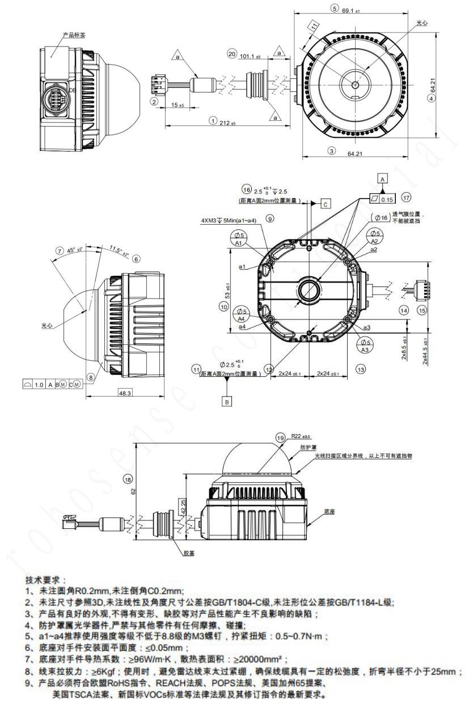{: .manual-img--xl }

## 附录 C 各通道发射延时表

<p class="manual-table-caption">表 22 各通道发射延时表</p>

<table class="packet-def-table">
  <thead>
    <tr>
      <th>通道序号</th>
      <th>发射延时（μs）</th>
      <th>通道序号</th>
      <th>发射延时（μs）</th>
    </tr>
  </thead>
  <tbody>
    <tr>
      <td>00-05</td>
      <td>0</td>
      <td>12-17</td>
      <td>64</td>
    </tr>
    <tr>
      <td>06-11</td>
      <td>21</td>
      <td>18-23</td>
      <td>107</td>
    </tr>
  </tbody>
</table>

{: .manual-img--xl }
