# E1 产品手册

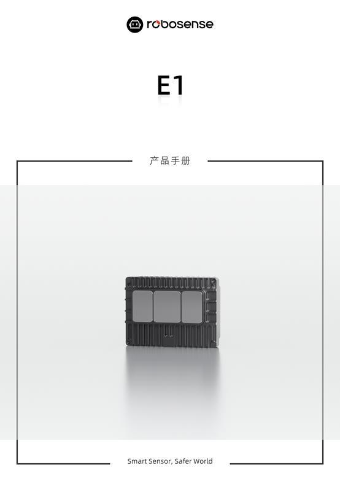{: .manual-img--xl }

## 1 安全提示

--8<-- "snippets/safety-reminder.md"

## 2 产品描述

### 2.1 产品结构

E1 的平台外形尺寸图如图 1 所示。

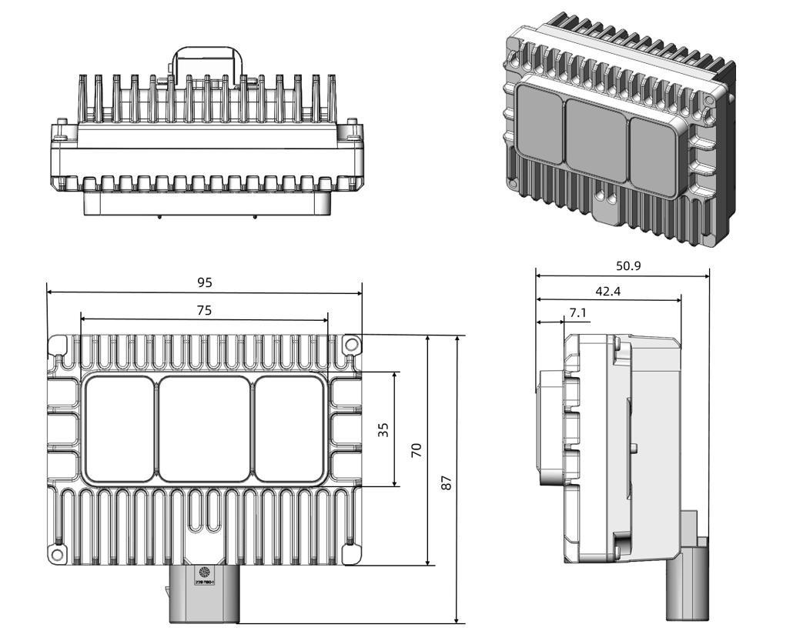{: .manual-img--xl }
<p align="center" style="font-size: 0.9em; color: gray;">图 1 E1 平台外形尺寸规格</p>

### 2.2 FOV 分布

E1 的光学包络如下图所示，所有极限公差累计后，激光雷达的光学包络面不能被车身外饰件遮挡，如激光雷达外罩、车顶饰板、引擎盖以及前保险杆等有可能遮挡 FOV 的零件，如图 2 所示。RoboSense 标定下线后，FOV 角度存在一定公差，具体以厂家最终结果为准。图 3 为 E1 的 FOV 示意图。

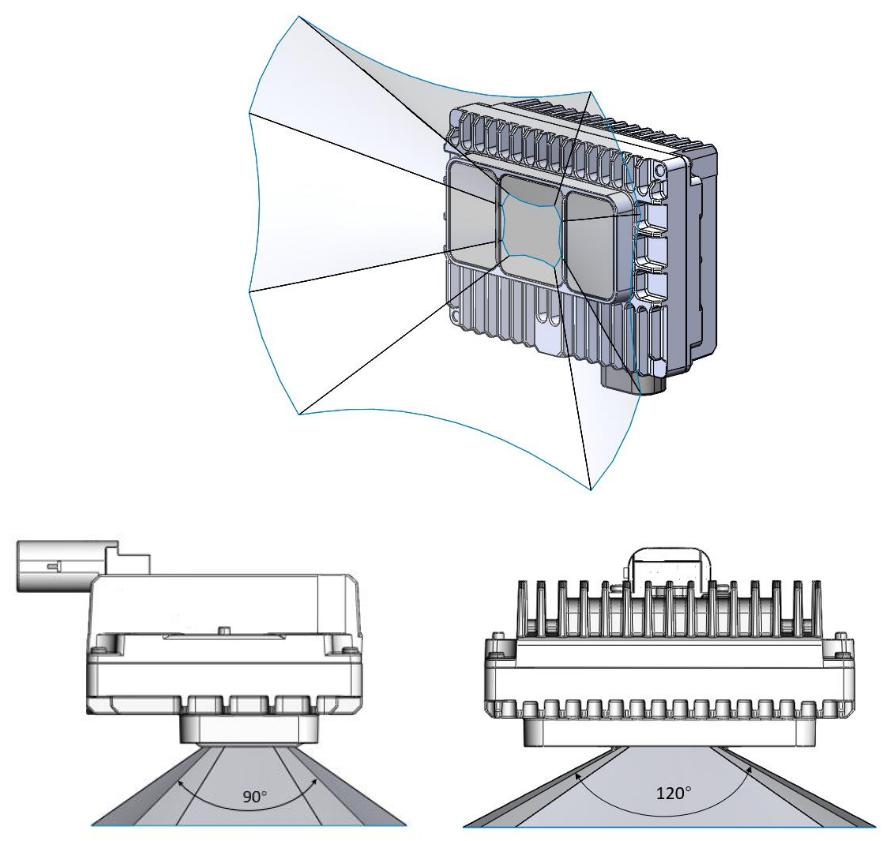{: .manual-img--xl }
<p align="center" style="font-size: 0.9em; color: gray;">图 2 E1 光学包络示意图</p>

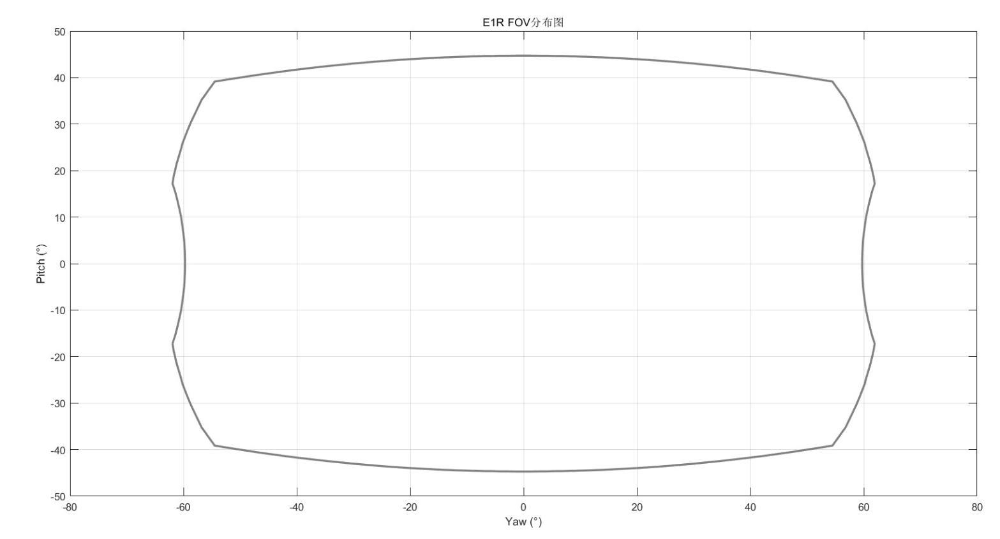{: .manual-img--xl }
<p align="center" style="font-size: 0.9em; color: gray;">图 3 E1 FOV 分布图</p>

### 2.3 规格参数

E1 固态激光雷达采用 Flash 扫描方式，10%NIST 测距 30 米，单帧出点数 26,000 点，水平测角 $120^{\circ}$ （ $-60.0^{\circ} \sim +60.0^{\circ}$ ），垂直测角 $90^{\circ}$ （ $-45^{\circ} \sim +45^{\circ}$ ），详情参见表 1。

<p class="manual-table-caption">表 1 E1 规格参数</p>

<table class="manual-spec-grid-table">
  <tbody>
    <tr class="section-head">
      <th colspan="5">规格参数</th>
    </tr>
    <tr>
      <td class="spec-label">测距原理</td>
      <td class="spec-value">TOF 法测距</td>
      <td class="spec-label">水平视场角</td>
      <td class="spec-value" colspan="2">120° (-60.0°~+60.0°)</td>
    </tr>
    <tr>
      <td class="spec-label">激光波长</td>
      <td class="spec-value">940 nm</td>
      <td class="spec-label">垂直视场角</td>
      <td class="spec-value" colspan="2">90° (-45°~+45°)</td>
    </tr>
    <tr>
      <td class="spec-label">激光安全等级</td>
      <td class="spec-value">Class1 人眼安全</td>
      <td class="spec-label">水平角分辨率</td>
      <td class="spec-value" colspan="2">平均 0.625°<sup>1</sup></td>
    </tr>
    <tr>
      <td class="spec-label">测距能力<sup>2</sup></td>
      <td class="spec-value">30m @10% NIST, 100klux 日照</td>
      <td class="spec-label">垂直角分辨率</td>
      <td class="spec-value" colspan="2">平均 0.625°<sup>1</sup></td>
    </tr>
    <tr>
      <td class="spec-label">盲区</td>
      <td class="spec-value">0.1m</td>
      <td class="spec-label">精度(典型值)<sup>3</sup></td>
      <td class="spec-value" colspan="2">±5cm@1 sigma</td>
    </tr>
    <tr>
      <td class="spec-label">出点数</td>
      <td class="spec-value">~260,000 点/秒</td>
      <td class="spec-label">以太网传输速率</td>
      <td class="spec-value" colspan="2">1000Base-T1 千兆以太网</td>
    </tr>
    <tr>
      <td class="spec-label">时间同步</td>
      <td class="spec-value">gPTP (IEEE-802.1AS)<br>PTP E2E L2 (IEEE-1588)</td>
      <td class="spec-label">工作电压</td>
      <td class="spec-value" colspan="2">9 V - 16 V</td>
    </tr>
    <tr>
      <td class="spec-label">帧率</td>
      <td class="spec-value">10 Hz</td>
      <td class="spec-label">重量</td>
      <td class="spec-value" colspan="2">330 g±20g(激光雷达本体)</td>
    </tr>
    <tr>
      <td class="spec-label">产品功率<sup>4</sup></td>
      <td class="spec-value">&lt;10 W</td>
      <td class="spec-label">存储温度</td>
      <td class="spec-value" colspan="2">-40°C ~ + 105°C</td>
    </tr>
    <tr>
      <td class="spec-label">工作温度<sup>5</sup></td>
      <td class="spec-value">-40°C ~ + 85°C</td>
      <td class="spec-label">防护等级</td>
      <td class="spec-value" colspan="2">IP67 / IP6K9K</td>
    </tr>
    <tr>
      <td class="spec-label">外形尺寸</td>
      <td class="spec-label">名称</td>
      <td class="spec-label">长 (mm)</td>
      <td class="spec-label">宽 (mm)</td>
      <td class="spec-label">高 (mm)</td>
    </tr>
    <tr>
      <td class="spec-label">外形尺寸</td>
      <td class="spec-value">主体轮廓</td>
      <td class="spec-value">95</td>
      <td class="spec-value">42.6</td>
      <td class="spec-value">69.5</td>
    </tr>
    <tr>
      <td class="spec-label">外形尺寸</td>
      <td class="spec-value">带连接器、安装位轮廓</td>
      <td class="spec-value">95</td>
      <td class="spec-value">51.1</td>
      <td class="spec-value">87</td>
    </tr>
  </tbody>
</table>

<div class="spec-footnotes">

<p><sup>1</sup> 水平&amp;垂直分辨率在整个 FOV 区域内并非均匀分布，角分辨率在中心区域为 0.625°，在视场边缘为 0.7°；</p>

<p><sup>2</sup> 测距能力以 10%NIST 漫反射板作为目标，测试结果会受到环境影响，包括但不限于环境温度、光照强度等因素；</p>

<p><sup>3</sup> 测距精度以 50%NIST 漫反射板作为目标，测试结果会受到环境影响，包括但不限于环境温度、目标物距离等因素，且精度值适用于大部分通道，部分通道之间存在差异；</p>

<p><sup>4</sup> 产品功耗测试结果会受到外部环境影响，包括但不限于环境温度、目标物的距离、目标物反射强度等因素；</p>

<p><sup>5</sup> 产品运行温度可能会受到外部环境影响，包括但不限于光照环境、气流变化等因素；</p>

</div>

### 2.4 产品原理

--8<-- "snippets/product-principle-e1-series.md"

## 3 产品安装布置推荐

### 3.1 接口说明

#### 3.1.1 E1 平台连接器

E1 平台推荐 TE 2397179-1 连接器方案，不接受客户自定义连接器型号，线束折弯半径大于 30 mm，具体接插件方案见表 2。

<p class="manual-table-caption">表 2 接插件方案</p>

<div class="manual-table-wrap">
<table>
  <thead>
    <tr>
      <th>接插件方案</th>
      <th>连接器类型</th>
      <th>型号</th>
      <th>图片</th>
      <th>功能</th>
    </tr>
  </thead>
  <tbody>
    <tr>
      <td rowspan="2">TE 弯插型 (二合一直插, 6 + 2 pin)</td>
      <td>激光雷达端连接器</td>
      <td>TE 2397179-1</td>
      <td>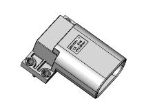</td>
      <td>电源+千兆以太网</td>
    </tr>
    <tr>
      <td>线束连接器</td>
      <td>TE 2397144-1</td>
      <td>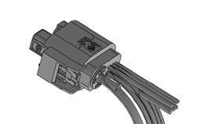</td>
      <td>电源+千兆以太网</td>
    </tr>
  </tbody>
</table>
</div>

#### 3.1.2 连接器安装要求

1. 线束端连接器及线材，与 LiDAR 端连接器装配后，须满足 IP67 及 IP6K9K 防水等级，具体选型由客户负责；
2. 线束端连接器末端出线位置与周边环境建议至少 70 mm 的手部预留拔插空间。

#### 3.1.3 整车线束端安装要求

1. 以太网线束材质需采用满足 1000BASE-T1 的 STP 线材；
2. 建议采用 Dacra 686-3（折弯半径 25 mm）或 GG X9305（折弯半径 12 mm），具体以线束供应商推荐为准；
3. 以太网线束总长度建议小于 $15 \mathrm{~m}$ , 但是考虑到板端损失, 建议实际应用中线束不超过 $12 \mathrm{~m}$ , 考虑到连接器对接数建议不超过 3 对 (包含线对板);
4. 建议以太网信号线在整机上走线时避开运动段与高温区域；
5. 整车线束需考虑线长、线径阻抗，电源线上激光雷达工作电压保持在 9 V——16V;
6. 暴露在外部的雷达线束建议采用防水胶套设计。

### 3.2 LIDAR 接线及接口说明

#### 3.2.1 车载以太网线束接口及定义

E1 使用 1 个车载以太网、电源二合一接头，线束如图 8 所示。

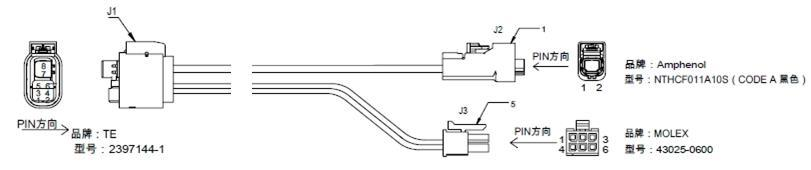{: .manual-img--xl }
<p align="center" style="font-size: 0.9em; color: gray;">图 8 车载以太网电源线束</p>

#### 3.2.2 接口盒接口

E1 的接口盒接线说明如表 3 所示:

<p class="manual-table-caption">表 3 接线说明</p>

<table class="manual-spec-grid-table">
  <tbody>
    <tr class="section-head">
      <th>接线说明</th>
      <th>TE 接口盒结构图</th>
    </tr>
    <tr>
      <td class="spec-label">连接激光雷达侧</td>
      <td class="spec-value" style="text-align: center"></td>
    </tr>
    <tr>
      <td class="spec-label">连接电源及上位机侧</td>
      <td class="spec-value" style="text-align: center">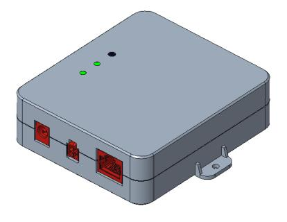</td>
    </tr>
  </tbody>
</table>

#### 3.2.3 电源接口

E1 接口盒使用标准 DC 5.5-2.1 接口。

电源正常输入时，电源盒绿色指示灯常亮。当绿色指示灯熄灭，请检查电源输入是否正常，若电源输入正常，即接口盒可能已损坏，请联系 RoboSense。

#### 3.2.4 RJ45 网口

E1 本体只支持 1000BASE-T1 车载以太网，使用接口盒时网络接口使用标准 RJ45 接口。接口盒只支持千兆以太网。

### 3.3 状态机说明

E1 状态机说明参见图 9。

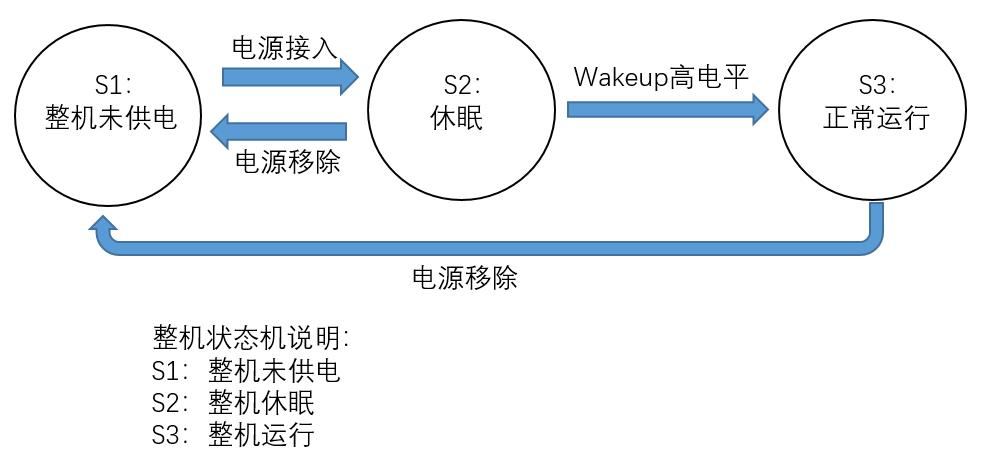{: .manual-img--xl }
<p align="center" style="font-size: 0.9em; color: gray;">图 9 激光雷达状态机描述</p>

### 3.4 安装及定位方式推荐

#### 3.4.1 安装公差要求

考虑整机误差累计，建议激光雷达安装公差要求为：

1. XYZ 三个方向安装位置精度为±3mm;
2. Roll、Yaw、Pitch 三个方向安装角精度为±1.5°。

最终以实际安装需要为准。

#### 3.4.2 雷达安装方向

如图 10 所示，建议 LiDAR 正置，不建议将 LiDAR 倒置、测置。

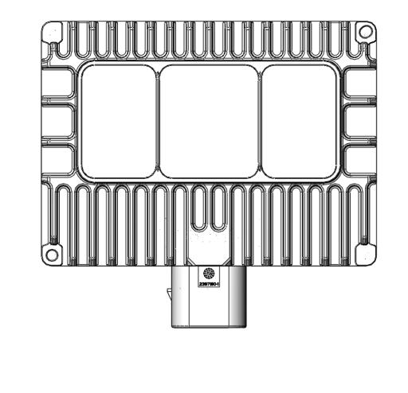{: .manual-img--xl }
<p align="center" style="font-size: 0.9em; color: gray;">图 10 雷达安装方向示意（正置）</p>

#### 3.4.3 安装支架位置

激光雷达后壳设置有 4 个 M4 螺孔或者过孔，以及 2 个定位柱，如图 10 所示。后壳定位柱和支架定位孔配合，支架设置 4 个固定孔，与后壳 4 个螺纹孔采用螺纹连接，完成激光雷达安装。

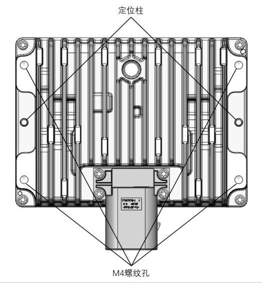{: .manual-img--xl }
<p align="center" style="font-size: 0.9em; color: gray;">图 11 支架安装固定位置</p>

#### 3.4.4 安装支架定位与紧固要求

1. 推荐激光雷达后壳定位孔/定位柱的定位方式;
2. 激光雷达支架建议在 4 个安装孔附近使用小凸台与激光雷达配合，凸台整体平面度要求 0.5 mm 以内；
3. M4 螺钉孔螺距为 0.7 mm;
4. 底部 M4 螺钉强度等级推荐 8.8 级及以上;
5. 推荐扭矩 $2.7 \pm 10\%$ N·m，具体以螺钉校准结果为准；
6. 建议螺钉长度为支架厚度 T + 3 mm，有效旋合牙数 4 牙及以上。

### 3.5 安装支架设计参考

固定支架需要有较好的强度和刚度, 并在各种工况下保持激光雷达处于一个稳定的状态, 设计要求如下:

1. 雷达安装场景存在不同的振动、冲击等载荷环境，雷达支架应具备一定的刚性来保障雷达在各载荷环境下可稳定工作。推荐雷达支架保持一定的刚性，具体边界要求由客户感知算法评估决定。（该推荐源自感知算法通常希望在外界振动激励下，雷达与固定部分及其他传感器的相对位置关系尽可能固定，并非出于雷达使用可靠性考虑。不同的感知算法对传感器间相对位置关系要求各异，应由客户评估确认）；
2. 雷达支架在经历随机振动、机械冲击等工况后会承受较大的负载，应结合实际工况校核支架强度。机械冲击工况，固定件最大应力应小于拉伸强度 2/3。随机振动工况，固定件 1sigma RMS 应力应小于拉伸强度 1/5。

### 3.6 激光雷达散热要求

1. 散热要求: E1 在使用过程中会发热, 且雷达的安装周边件会受到太阳辐射的影响, 可能会加剧 E1 的温升, 散热要求如下:

    - E1 前后面为主要散热面;
    - E1 固定件应为优良的传热体, 支架建议采用导热系数大于 $50 \, W/m \cdot K$ 的铝合金或者镀锌钢板和镀锌钢板等材料, 且 E1 应避免被固定结构封闭包裹;
    - E1 与周边的间隙大于 5mm, 如果可以开孔保证空气流经雷达更好;
    - 建议在固定件上做一些散热鳍片，增大散热面积与空气流向一致；
    - 建议提供安装数模（包括激光雷达与周边结构件）以及安装环境信息给 RoboSense 进行热仿真确认。

2. 工作温度要求。

    - E1 与周边件的间隙（大于 5 mm），安装件最好不要完全包裹激光雷达，开一些孔保证空气流动更好；
    - 原则上只需要满足任何条件下 E1 周边环境温度不高于 $85^{\circ}$ C 即可。

### 3.7 E1 激光雷达罩推荐方案

激光雷达罩开口尺寸由激光雷达标定后 FOV 偏差以及安装误差等因素决定，具体结构视客户要求决定。

1. 激光雷达的 FOV 包络区域禁止任何遮挡（包括玻璃透明材质），遮挡会影响 LiDAR 的测距能力；
2. 激光雷达窗口片边缘特征，受到外部尖锐物体（如碎石）冲击，容易破损或碎裂。如果窗口片边缘凸出雷达罩，可能存在窗口片碎石冲击试验无法通过的风险。任何窗口片边缘凸出的设计方案，需提前评估碎石冲击试验风险；

## 4 产品使用

### 4.1 产品坐标系

E1 坐标系定义如图 11 所示。

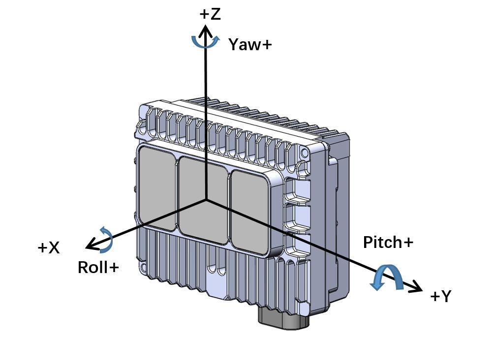{: .manual-img--xl }
<p align="center" style="font-size: 0.9em; color: gray;">图 12 E1 激光雷达坐标系定义</p>

### 4.2 RSView 使用

--8<-- "snippets/rsview-usage-e1-series.md"

### 4.3 通信协议

E1 与电脑之间的通信采用以太网介质, 使用 UDP 协议, 输出包有两种类型: MSOP 包和 DIFOP 包。

文中所有涉及 MSOP 协议包均为 1200 Bytes 定长；DIFOP 协议包均为 256 Bytes 定长。E1 网络参数可配置，出厂默认为单播模式，采用固定 IP 和固定目的端口号，按照如下表格。

<p class="manual-table-caption">表 4 出厂默认网络配置表</p>

<div class="manual-table-wrap">
<table class="manual-network-table manual-network-table--four-col">
  <colgroup>
    <col class="net-col-device" />
    <col class="net-col-ip" />
    <col class="net-col-port" />
    <col class="net-col-port" />
  </colgroup>
  <thead>
    <tr>
      <th></th>
      <th>IP 地址</th>
      <th>MSOP 包端口号</th>
      <th>DIFOP 包端口号</th>
    </tr>
  </thead>
  <tbody>
    <tr>
      <td>E1</td>
      <td>192.168.1.200</td>
      <td>6699</td>
      <td>7788</td>
    </tr>
    <tr>
      <td>电脑</td>
      <td>192.168.1.102</td>
      <td>6699</td>
      <td>7788</td>
    </tr>
  </tbody>
</table>
</div>

产品默认 MAC 地址是在工厂初始设置的，每台产品 MAC 地址唯一。

当使用产品的时候，需要把电脑的 IP 设置为与产品同一网段上，例如

192.168.1.x(x 的取值范围为 1 ~ 254)，子网掩码为 255.255.0.0。若不知产品网络配置信息，请将主机子网掩码设置为 255.255.0.0 后连接产品并使用 Wireshark 抓取产品输出包进行分析。

E1 和电脑之间的通信协议主要分两类，一览表见 5。

主数据流输出协议 MSOP，将激光雷达扫描出来的距离，角度，反射率等信息封装成包输出给电脑；

产品信息输出协议 DIFOP，将激光雷达当前状态的各种配置信息输出给电脑。

<p class="manual-table-caption">表 5 产品协议一览表</p>

<table class="packet-def-table product-protocol-table">
  <colgroup>
    <col class="pp-col-name" />
    <col class="pp-col-abbr" />
    <col class="pp-col-func" />
    <col class="pp-col-type" />
    <col class="pp-col-size" />
  </colgroup>
  <thead>
    <tr>
      <th>（协议/包）名称</th>
      <th>简写</th>
      <th>功能</th>
      <th>类型</th>
      <th>包大小</th>
    </tr>
  </thead>
  <tbody>
    <tr>
      <td>Main Data Stream Output Protocol</td>
      <td>MSOP</td>
      <td>扫描数据输出</td>
      <td>UDP</td>
      <td>1200 Bytes</td>
    </tr>
    <tr>
      <td>Device Information Output Protocol</td>
      <td>DIFOP</td>
      <td>产品信息输出</td>
      <td>UDP</td>
      <td>256 Bytes</td>
    </tr>
  </tbody>
</table>

#### 4.3.1 主数据流输出协议（MSOP）

主数据流输出协议：Main data Stream Output Protocol，简称：MSOP。

I/O 类型：产品输出，电脑解析。

默认端口号为 6699。

MSOP 包完成三维测量相关数据输出, 包括激光测距值、回波的反射强度值、垂直角度、水平角度和时间戳。MSOP 包的有效荷载长度为 1200Bytes，其中 32Bytes 为同步帧头 Header，1152Bytes 为数据块区间（共 96 个 12Bytes 的 data block），16Bytes 为帧尾。

基本数据结构如下图所示:

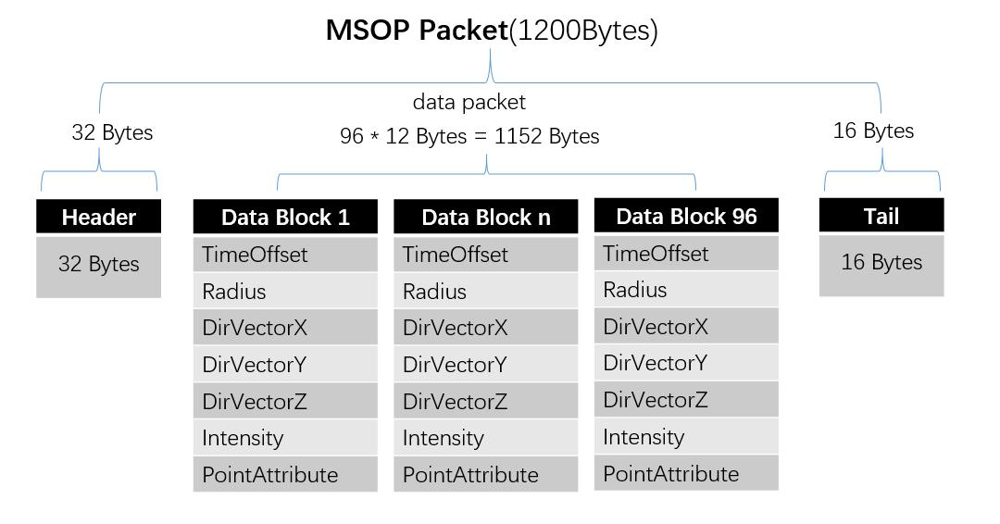{: .manual-img--xl }
<p align="center" style="font-size: 0.9em; color: gray;">图 13 MSOP Packet 数据包定义示意图</p>

##### 4.3.1.1 帧头

帧头 Header 共 32Bytes，用于识别数据的开始位置，包计数，UDP 通信预留以及存储时间戳。详细定义如下：

<p class="manual-table-caption">表 6 MSOP 包头定义</p>

<table class="packet-def-table">
  <thead>
    <tr>
      <th colspan="5">Header(32Bytes)</th>
    </tr>
  </thead>
  <tbody>
    <tr>
      <td>Sync</td>
      <td>PktCnt</td>
      <td>Ver</td>
      <td>ReturnMode</td>
      <td>TimeMode</td>
    </tr>
    <tr>
      <td>4 Bytes</td>
      <td>2 Bytes</td>
      <td>2 Bytes</td>
      <td>1 Byte</td>
      <td>1 Byte</td>
    </tr>
    <tr>
      <td>Timestamp</td>
      <td>FrameSync</td>
      <td>Res0</td>
      <td>LidarType</td>
      <td>LidarTmp</td>
    </tr>
    <tr>
      <td>10 Bytes</td>
      <td>1 Byte</td>
      <td>9 Bytes</td>
      <td>1 Byte</td>
      <td>1 Byte</td>
    </tr>
  </tbody>
</table>

Sync: 可作为包的检查序列，识别头为 0x55AA5AA5。

PktCnt：包序列号，表示包计数，循环计数，从每帧数据的起点的包计数为0，每帧数据的最后一个点的包计数为最大值。

Ver: 表示 UDP 通信协议的版本号。

ReturnMode: 回波模式标志位，出厂时固定 04（最强回波模式）。

TimeMode: 时间同步模式:

0x00 表示使用雷达内部计时

0x02 表示使用 PTP E2E 时间同步模式

0x03 表示使用 gPTP 时间同步模式

Timestamp: 用于存储时间戳，定义的时间戳用来记录系统的时间

其中 0-5 bytes: Second ; 6-9 bytes: MicroSecond

FrameSync: 帧同步状态（0x00:no 0x01:yes）

Res0: 预留位

LidarType: 雷达类型标志位，默认值为 0x62。

LidarTmp: 芯片温度，Temp = LidarTmp - 80; 即原始值 0 代表 - 80 度。

##### 4.3.1.2 数据块区域

数据块区间是 MSOP 包中传感器的测量值部分，共 1152Bytes。它由 96 个 data block 组成，每个 data block 长度为 12Bytes。

详细定义如下:

<p class="manual-table-caption">表 7 MSOP 包中的 data block 定义</p>

<table class="packet-def-table msop-data-table msop-data-table--auto-label-cols">
  <colgroup>
    <col class="msop-col-var" />
    <col class="msop-col-offset" />
    <col class="msop-col-len" />
    <col class="msop-col-content" />
  </colgroup>
  <thead>
    <tr>
      <th colspan="4">Data block (12Bytes)</th>
    </tr>
    <tr>
      <th>字段</th>
      <th>offset</th>
      <th>长度 (byte)</th>
      <th>定义说明</th>
    </tr>
  </thead>
  <tbody>
    <tr>
      <td>TimeOffset</td>
      <td>0</td>
      <td>2</td>
      <td class="msop-content">该组 Block 里面所有的点相对于包的 timestamp 的时间偏移量(单位: ns), 该组点的时间等于 timestamp+time_offset</td>
    </tr>
    <tr>
      <td>Radius</td>
      <td>2</td>
      <td>2</td>
      <td class="msop-content">极坐标系下, 通道 1 的径向点距离值, 距离解析分辨率 5mm</td>
    </tr>
    <tr>
      <td>DirVectorX</td>
      <td>4</td>
      <td>2</td>
      <td class="msop-content">通道 1 单位方向向量 X 轴分量, 范围 -32768~32767, 转浮点除以 2^15</td>
    </tr>
    <tr>
      <td>DirVectorY</td>
      <td>6</td>
      <td>2</td>
      <td class="msop-content">通道 1 单位方向向量 Y 轴分量, 范围 -32768~32767, 转浮点除以 2^15</td>
    </tr>
    <tr>
      <td>DirVectorZ</td>
      <td>8</td>
      <td>2</td>
      <td class="msop-content">通道 1 单位方向向量 Z 轴分量, 范围 -32768~32767, 转浮点除以 2^15</td>
    </tr>
    <tr>
      <td>Intensity</td>
      <td>10</td>
      <td>1</td>
      <td class="msop-content">通道 1 的点反射强度值, 取值范围 0~255</td>
    </tr>
    <tr>
      <td>PointAttribute</td>
      <td>11</td>
      <td>1</td>
      <td class="msop-content">通道 1 的点的属性, 1 表示正常点, 2 表示噪点, 后续该定义会进一步扩展属性, 原回波饱和程度特征合入点属性</td>
    </tr>
  </tbody>
</table>

!!! tip "相关计算说明"
    径向距离 `radius` 计算：（`Radius` 是 2 Bytes，分辨率为 5mm）

    获取某数据包中 `Radius` 值的十六进制数为：`R1` 为 `0x03`，`R2` 为 `0xfc`。`0x03` 为距离的高位，转换为十进制为 `3`，`0xfc` 为距离的低位，转换为十进制为 `252`。因此：

    ```
    此通道的径向距离 = R1 * 256 + R2 = 3 * 256 + 252 = 1020
    ```

    根据坐标分辨率，转换为米：

    ```
    1020 * 0.005 = 5.10m
    ```

    故径向距离为 `5.10m`。

    点云 `X、Y、Z` 坐标计算：

    由以下公式可以解析得到点云的 `XYZ` 坐标：

    ```
    X = radius * (DirVectorX / (2^15))
    Y = radius * (DirVectorY / (2^15))
    Z = radius * (DirVectorZ / (2^15))
    ```

##### 4.3.1.3 帧尾

帧尾部分包含参数是雷达 E2E Profile4 所用参数，详细定义如下表

<p class="manual-table-caption">表 8 MSOP 帧尾参数定义</p>

<table class="packet-def-table msop-data-table msop-data-table--auto-label-cols">
  <colgroup>
    <col class="msop-col-var" />
    <col class="msop-col-offset" />
    <col class="msop-col-len" />
    <col class="msop-col-content" />
  </colgroup>
  <thead>
    <tr>
      <th>字段</th>
      <th>offset</th>
      <th>长度 (byte)</th>
      <th>定义说明</th>
    </tr>
  </thead>
  <tbody>
    <tr>
      <td>Res1</td>
      <td>1184</td>
      <td>4</td>
      <td class="msop-content">预留位</td>
    </tr>
    <tr>
      <td>DataLength</td>
      <td>1188</td>
      <td>2</td>
      <td class="msop-content">04 B0</td>
    </tr>
    <tr>
      <td>Counter</td>
      <td>1190</td>
      <td>2</td>
      <td class="msop-content">00 00~FF FF</td>
    </tr>
    <tr>
      <td>DataId</td>
      <td>1192</td>
      <td>4</td>
      <td class="msop-content">00 00 0E 5C</td>
    </tr>
    <tr>
      <td>Crc32</td>
      <td>1196</td>
      <td>4</td>
      <td class="msop-content"></td>
    </tr>
  </tbody>
</table>

#### 4.3.2 产品信息输出协议（DIFOP）

产品信息输出协议，Device Info Output Protocol，简称：DIFOP

I/O 类型：产品输出，电脑读取。

默认端口号为 7788。

DIFOP 是为了将产品序列号（S/N）、固件版本信息、网络配置信息、运行状态定期发送给用户的“仅输出”协议，用户可以通过读取 DIFOP 解读当前使用

产品的各种参数的具体信息。

一个完整的 DIFOP Packet 的详细信息如下:

<p class="manual-table-caption">表 9 DIFOP Packet 详细结构信息</p>

<div class="manual-table-scroll-wrap">
<table class="packet-def-table msop-data-table msop-data-table--auto-label-cols">
  <colgroup>
    <col class="msop-col-var" />
    <col class="msop-col-offset" />
    <col class="msop-col-len" />
    <col class="msop-col-content" />
  </colgroup>
  <thead>
    <tr>
      <th colspan="4">DIFOP Packet(256Bytes)</th>
    </tr>
    <tr>
      <th>字段</th>
      <th>offset</th>
      <th>长度 (byte)</th>
      <th>定义说明</th>
    </tr>
  </thead>
  <tbody>
    <tr>
      <td>DifopHeader</td>
      <td>0</td>
      <td>8</td>
      <td class="msop-content">DIFOP 识别头</td>
    </tr>
    <tr>
      <td>Res0</td>
      <td>8</td>
      <td>8</td>
      <td class="msop-content">预留位</td>
    </tr>
    <tr>
      <td>SW Version</td>
      <td>16</td>
      <td>3</td>
      <td class="msop-content">雷达版本号</td>
    </tr>
    <tr>
      <td>Res1</td>
      <td>19</td>
      <td>1</td>
      <td class="msop-content">预留位</td>
    </tr>
    <tr>
      <td>SN</td>
      <td>20</td>
      <td>6</td>
      <td class="msop-content">设备序列号</td>
    </tr>
    <tr>
      <td>Res2</td>
      <td>26</td>
      <td>18</td>
      <td class="msop-content">预留位</td>
    </tr>
    <tr>
      <td>LocalIp</td>
      <td>44</td>
      <td>4</td>
      <td class="msop-content">雷达 IP 源地址</td>
    </tr>
    <tr>
      <td>NetMask</td>
      <td>48</td>
      <td>4</td>
      <td class="msop-content">子网掩码</td>
    </tr>
    <tr>
      <td>MacAddress</td>
      <td>52</td>
      <td>6</td>
      <td class="msop-content">雷达 IP 本机 MAC 地址</td>
    </tr>
    <tr>
      <td>MsopRemoteIp</td>
      <td>58</td>
      <td>4</td>
      <td class="msop-content">Msop 远程 IP</td>
    </tr>
    <tr>
      <td>MsopLocalPort</td>
      <td>62</td>
      <td>2</td>
      <td class="msop-content">Msop 本地端口号</td>
    </tr>
    <tr>
      <td>MsopRemotePort</td>
      <td>64</td>
      <td>2</td>
      <td class="msop-content">Msop 远程端口号</td>
    </tr>
    <tr>
      <td>DifopRemoteIp</td>
      <td>66</td>
      <td>4</td>
      <td class="msop-content">Difop 远程 IP</td>
    </tr>
    <tr>
      <td>DifopLocalPort</td>
      <td>70</td>
      <td>2</td>
      <td class="msop-content">Difop 本地端口号</td>
    </tr>
    <tr>
      <td>DifopRemotePort</td>
      <td>72</td>
      <td>2</td>
      <td class="msop-content">Difop 远程端口号</td>
    </tr>
    <tr>
      <td>Res3</td>
      <td>74</td>
      <td>25</td>
      <td class="msop-content">预留位</td>
    </tr>
    <tr>
      <td>FrequecySetting</td>
      <td>99</td>
      <td>1</td>
      <td class="msop-content">雷达帧率设置</td>
    </tr>
    <tr>
      <td>ReturnMode</td>
      <td>100</td>
      <td>1</td>
      <td class="msop-content">
        雷达回波信息:<br>
        0x00: FarthestWave<br>
        0x04: StrongestWave (Default)<br>
        0x07: NearestWave<br>
        0x08: 2ndStrongestWave<br>
        0x09: StrongestFarthestWave<br>
        0x0A: NearestFarthestWave<br>
        0x0B: Strongest2ndStrongestWave
      </td>
    </tr>
    <tr>
      <td>TimesyncMode</td>
      <td>101</td>
      <td>1</td>
      <td class="msop-content">
        时间同步模式:<br>
        0x0: Internal<br>
        0x2: E2E L2<br>
        0x3: GPTP
      </td>
    </tr>
    <tr>
      <td>TimesyncStatus</td>
      <td>102</td>
      <td>1</td>
      <td class="msop-content">
        时间同步状态:<br>
        0x00: failed<br>
        0x01: success<br>
        0x02: timeout
      </td>
    </tr>
    <tr>
      <td>TimeStatus</td>
      <td>103</td>
      <td>10</td>
      <td class="msop-content">
        时间:<br>
        0-5bytes: Second<br>
        6-9bytes: MicroSecond
      </td>
    </tr>
    <tr>
      <td>PHYMode</td>
      <td>113</td>
      <td>1</td>
      <td class="msop-content">
        物理层工作模式:<br>
        0x00: auto-negotiation<br>
        0x01: master<br>
        0x02: slave<br>
        other: same as 0x00
      </td>
    </tr>
    <tr>
      <td>Res4</td>
      <td>114</td>
      <td>142</td>
      <td class="msop-content">预留位</td>
    </tr>
  </tbody>
</table>
</div>

## 6 产品维护

--8<-- "snippets/product-maintenance.md"

## 7 售后

--8<-- "snippets/after-sales.md"

## 附录 A Driver & SDK

--8<-- "snippets/driver-sdk-e1-series.md"

## 附录 B 结构图纸

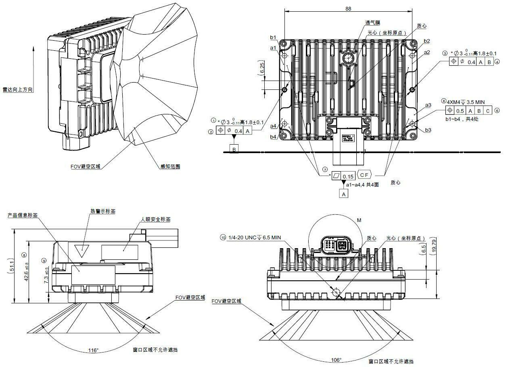{: .manual-img--xl }
<p align="center" style="font-size: 0.9em; color: gray;">TE 接口雷达结构图纸</p>

针脚定义:

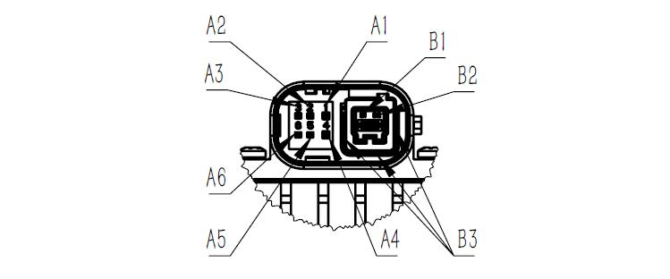{: .manual-img--xl }
<p align="center" style="font-size: 0.9em; color: gray;">接插件针脚定义</p>

<table class="packet-def-table connector-pin-table">
  <thead>
    <tr>
      <th>pin 脚编号</th>
      <th>序号</th>
      <th>引脚定义</th>
      <th>连接器型号</th>
    </tr>
  </thead>
  <tbody>
    <tr>
      <td>A1</td>
      <td>1</td>
      <td>Battery+</td>
      <td rowspan="9">TE-2397179-1</td>
    </tr>
    <tr>
      <td>A2</td>
      <td>2</td>
      <td>Wakeup(KL15)</td>
    </tr>
    <tr>
      <td>A3</td>
      <td>3</td>
      <td>NC</td>
    </tr>
    <tr>
      <td>A4</td>
      <td>4</td>
      <td>GND</td>
    </tr>
    <tr>
      <td>A5</td>
      <td>5</td>
      <td>NC</td>
    </tr>
    <tr>
      <td>A6</td>
      <td>6</td>
      <td>NC</td>
    </tr>
    <tr>
      <td>B1</td>
      <td>D1</td>
      <td>TRX_P(1000Base-T1)</td>
    </tr>
    <tr>
      <td>B2</td>
      <td>D2</td>
      <td>TRX_N(1000Base-T1)</td>
    </tr>
    <tr>
      <td>B3</td>
      <td>/</td>
      <td>SHIELD</td>
    </tr>
  </tbody>
</table>

{: .manual-img--xl }
