# E1R 产品手册

{: .manual-img--xl }

## 1 安全提示

--8<-- "snippets/safety-reminder.md"

## 2 产品描述

### 2.1 产品结构

E1R 的平台外形尺寸图如图 1 所示。

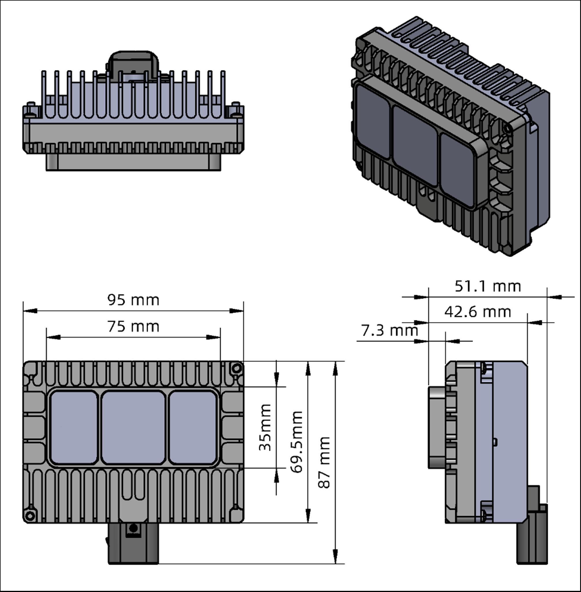{: .manual-img--xl }
<p align="center" style="font-size: 0.9em; color: gray;">图 1 E1R 平台外形尺寸规格</p>

### 2.2 FOV分布

E1R 的光学包络如下图所示，所有极限公差累计后，激光雷达的光学包络面不能被车身外饰件遮挡，如激光雷达外罩、车顶饰板、引擎盖以及前保险杆等有可能遮挡 FOV 的零件，如图 2 所示。RoboSense 标定下线后，FOV 角度存在一定公差，具体以厂家最终结果为准。图 3 为 E1R 的 FOV 示意图。

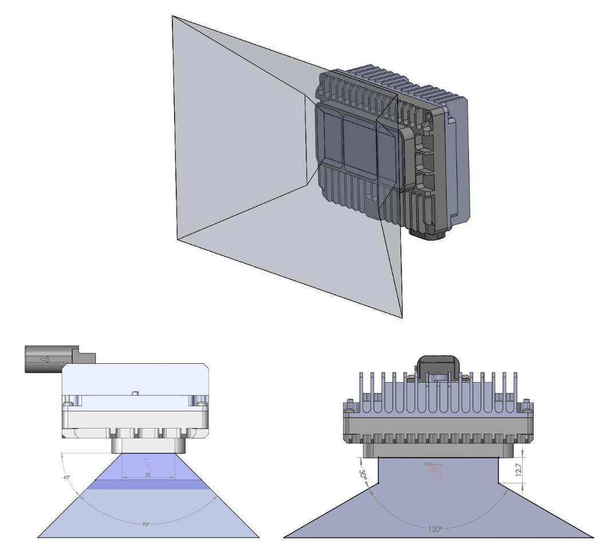{: .manual-img--xl }
<p align="center" style="font-size: 0.9em; color: gray;">图 2 E1R 光学包络示意图</p>

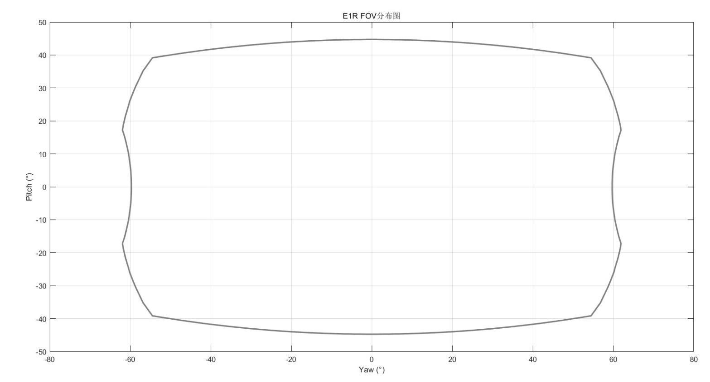{: .manual-img--xl }
<p align="center" style="font-size: 0.9em; color: gray;">图 3 E1R FOV 分布图</p>

### 2.3 规格参数

E1R 固态激光雷达采用 Flash 扫描方式，10%NIST 测距 30 米，单帧出点数 26,000 点，水平测角 $120^{\circ}$ （ $-60.0^{\circ} \sim +60.0^{\circ}$ ），垂直测角 $90^{\circ}$ （ $-45^{\circ} \sim +45^{\circ}$ ），详情参见表 1。

<p class="manual-table-caption">表 1 E1R 规格参数</p>

<table class="manual-spec-grid-table">
  <tbody>
    <tr class="section-head">
      <th colspan="5">规格参数</th>
    </tr>
    <tr>
      <td class="spec-label">测距原理</td>
      <td class="spec-value">TOF 法测距</td>
      <td class="spec-label">水平视场角</td>
      <td class="spec-value" colspan="2">120° (-60.0°~+60.0°)</td>
    </tr>
    <tr>
      <td class="spec-label">激光波长</td>
      <td class="spec-value">940 nm</td>
      <td class="spec-label">垂直视场角</td>
      <td class="spec-value" colspan="2">90° (-45°~+45°)</td>
    </tr>
    <tr>
      <td class="spec-label">激光安全等级</td>
      <td class="spec-value">Class1 人眼安全</td>
      <td class="spec-label">水平角分辨率</td>
      <td class="spec-value" colspan="2">平均 0.625°<sup>1</sup></td>
    </tr>
    <tr>
      <td class="spec-label">测距能力<sup>2</sup></td>
      <td class="spec-value">30m @10% NIST, 100klux 日照</td>
      <td class="spec-label">垂直角分辨率</td>
      <td class="spec-value" colspan="2">平均 0.625°<sup>1</sup></td>
    </tr>
    <tr>
      <td class="spec-label">盲区</td>
      <td class="spec-value">0.1m</td>
      <td class="spec-label">精度(典型值)<sup>3</sup></td>
      <td class="spec-value" colspan="2">±5cm@1 sigma</td>
    </tr>
    <tr>
      <td class="spec-label">出点数</td>
      <td class="spec-value">~260,000 点/秒</td>
      <td class="spec-label">以太网传输速率</td>
      <td class="spec-value" colspan="2">1000Base-T1 千兆以太网</td>
    </tr>
    <tr>
      <td class="spec-label">时间同步</td>
      <td class="spec-value">gPTP (IEEE-802.1AS)<br>PTP E2E L2 (IEEE-1588)</td>
      <td class="spec-label">工作电压</td>
      <td class="spec-value" colspan="2">9 V - 16 V</td>
    </tr>
    <tr>
      <td class="spec-label">帧率</td>
      <td class="spec-value">10 Hz</td>
      <td class="spec-label">重量</td>
      <td class="spec-value" colspan="2">330 g±20g(激光雷达本体)</td>
    </tr>
    <tr>
      <td class="spec-label">产品功率<sup>4</sup></td>
      <td class="spec-value">&lt;10 W</td>
      <td class="spec-label">存储温度</td>
      <td class="spec-value" colspan="2">-40°C ~ + 105°C</td>
    </tr>
    <tr>
      <td class="spec-label">工作温度<sup>5</sup></td>
      <td class="spec-value">-40°C ~ + 85°C</td>
      <td class="spec-label">防护等级</td>
      <td class="spec-value" colspan="2">IP67 / IP6K9K</td>
    </tr>
    <tr>
      <td class="spec-label">外形尺寸</td>
      <td class="spec-label">名称</td>
      <td class="spec-label">长 (mm)</td>
      <td class="spec-label">宽 (mm)</td>
      <td class="spec-label">高 (mm)</td>
    </tr>
    <tr>
      <td class="spec-label">外形尺寸</td>
      <td class="spec-value">主体轮廓</td>
      <td class="spec-value">95</td>
      <td class="spec-value">42.6</td>
      <td class="spec-value">69.5</td>
    </tr>
    <tr>
      <td class="spec-label">外形尺寸</td>
      <td class="spec-value">带连接器、安装位轮廓</td>
      <td class="spec-value">95</td>
      <td class="spec-value">51.1</td>
      <td class="spec-value">87</td>
    </tr>
  </tbody>
</table>

<div class="spec-footnotes">

<p><sup>1</sup> 水平&amp;垂直分辨率在整个 FOV 区域内并非均匀分布，角分辨率在中心区域为 0.625°，在视场边缘为 0.7°；</p>

<p><sup>2</sup> 测距能力以 10%NIST 漫反射板作为目标，测试结果会受到环境影响，包括但不限于环境温度、光照强度等因素；</p>

<p><sup>3</sup> 测距精度以 50%NIST 漫反射板作为目标，测试结果会受到环境影响，包括但不限于环境温度、目标物距离等因素，且精度值适用于大部分通道，部分通道之间存在差异；</p>

<p><sup>4</sup> 产品功耗测试结果会受到外部环境影响，包括但不限于环境温度、目标物的距离、目标物反射强度等因素；</p>

<p><sup>5</sup> 产品运行温度可能会受到外部环境影响，包括但不限于光照环境、气流变化等因素；</p>

</div>

### 2.4 产品原理

#### 2.4.1 时间同步方式

E1R 默认固件使用 gPTP (IEEE 802.1AS) 的时间同步方式。

##### 2.4.1.1 gPTP 同步原理

gPTP（general Precise Time Protocol，IEEE802.1AS 协议）是 PTP 在时效性网络（Time-Sensitive Networking）的派生协议。同步机制采用和 PTP 协议一致的 P2P 端延迟机制（Peer Delay Mechanism），同时采用以太网 L2 层通信。与 PTP 不同，gPTP 要求使用硬件方式打时间戳，即硬件时间戳，所以对于交换机和 Master 时钟要求较为严苛，需满足 IEEE802.1AS 协议。

##### 2.4.1.2 gPTP 接线方式

使用 gPTP 同步方式，需要做以下准备，连接方式详情参见图 4。

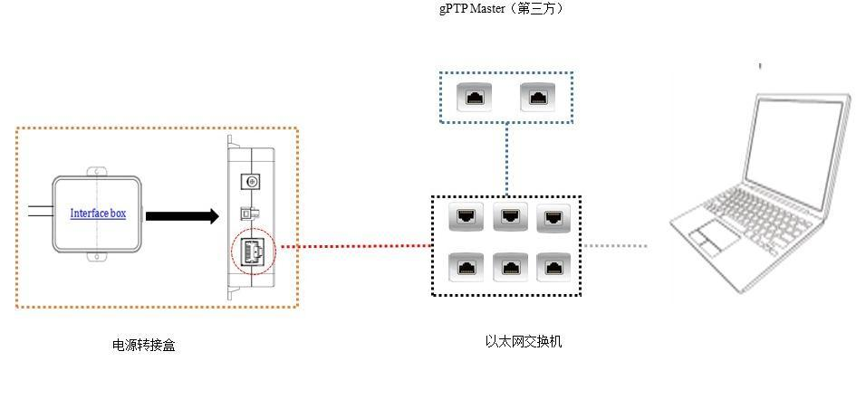{: .manual-img--xl }
<p align="center" style="font-size: 0.9em; color: gray;">图 4 gPTP 时间同步拓扑</p>

1. gPTP Master 授时主机（即插即用，无需额外配置）；
2. 以太网交换机;
3. 支持 gPTP 协议的待授时设备。

!!! tip "提示"
    1. Master 授时设备属于第三方设备，RoboSense 出货时不包含此配件，需用户自行采购；
    2. RoboSense 产品作为 Slave 设备只获取 Master 发出的时间，不对 Master 时钟源的准确度判断，若解析激光雷达点云时间出现突变，请检查 Master 提供的时间是否准确；
    3. 激光雷达同步之后，Master 断开连接，点云数据包中的时间则会按照激光雷达内部时钟进行叠加，激光雷达断电重启后才会被重置。

#### 2.4.2 使用 Linuxptp 工具简单验证时间同步

将 E1R 电源线和网线与接口盒相连，网线对端再与上位机相连。上位机操作系统（OS）必须为 Linux 系统，以下以 Ubuntu 为例。

1. 使用命令 `ifconfig` 查看网卡名。如图 5 所示，网卡名为 `enp2s0`。

    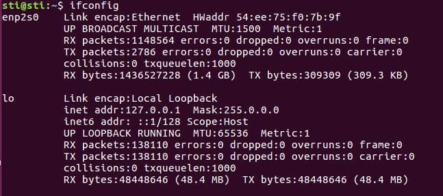{: .manual-img--xl }
    <p align="center" style="font-size: 0.9em; color: gray;">图 5 查找网卡名示意图</p>

2. 使用命令 `ethtool -T enp2s0`（上一步查询到的网卡名），可以查看此网卡是否支持 PTP 硬件。对于 gPTP 同步，需要硬件支持，`PTP Hardware Clock` 选项要求不是 `none` 值。

    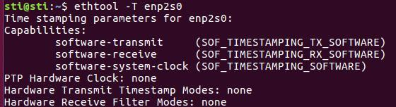{: .manual-img--xl }
    <p align="center" style="font-size: 0.9em; color: gray;">图 6 检查 PTP 硬件支持情况示意图</p>

3. 下载并安装 linuxptp 工具。

    ```bash
    sudo git clone git://git.code.sf.net/p/linuxptp/code linuxptp
    cd linuxptp
    sudo make
    sudo make install
    reboot
    ```

4. Ptp41 命令的使用。

    Ptp4l 命令选项介绍如下：

    a. 延迟机制选项

    - `-A` 自动模式，自动选择 E2E 延迟机制，当收到对等延迟请求时切换到 P2P。

    - `-E` E2E 模式，请求应答延迟机制（默认）

    - `-P` P2P 模式，端延迟机制

    b. 网络传输选项

    - `-2` IEEE 802.3

    - `-4` UDP IPV4（默认）

    - `-6` UDP IPV6

    c. 时间戳选项

    - `-H` 硬件时间戳（默认）

    - `-S` 软件模拟时间戳

    - `-L` 老的硬件时间戳，LEGACY HW 需要配合 PHC 设备使用。

    d. 其他选项

    - `-f [file]` 从指定文件 file 中读取配置。默认情况下不读取任何配置文件。

    - `-i [dev]` 选择 PTP 接口设备，例如 eth0（可多次指定）必须至少使用此选项或配置文件指定一个端口。

    - `-p [dev]` 此选项用于在旧 Linux 内核上指定要使用的 PHC 设备（例如 `/dev/ptp0` 时钟设备），默认为 auto，忽略软件 / LEGACY HW 时间戳（不推荐使用此选项）

    - `-s` slaveOnly mode，从时钟模式（覆盖配置文件）

    - `-t` 透明时钟模式

    - `-l [num]` 将日志记录级别设置为 `num`，默认是 6

    - `-m` 将消息打印到 stdout

    - `-q` 不打印消息到 syslog

    - `-v` 打印软件版本并退出

    - `-h` 帮助命令

此外，简单同步 E1R 使用命令如下:

1. PTP E2E（L2 层）命令:

    ```bash
    sudo ptp4l -E -S -2 -m -i enp2s0
    ```

    如设备硬件支持 `PTP Hardware Clock` 不是 `none` 值，可以使用 `-H` 替代 `-S`

2. gPTP 命令：

    ```bash
    sudo ptp4l -i enp4s0 -m -H -2 -f gptp-master.cfg
    ```

    设备要求硬件支持 `PTP Hardware Clock` 不是 `none` 值。其中，`gptp-master.cfg` 为 gPTP 主时钟配置文件。

    在主机上新建 `gptp-master.cfg` 文件，在此文件中复制以下内容后，保存文件：

    ```
    # 802.1AS example configuration containing those attributes which
    # differ from the defaults. See the file, default.cfg, for the
    # complete list of available options.
    [global]
    domainNumber             0
    logSyncInterval          -3
    syncReceiptTimeout       3
    neighborPropDelayThresh  800
    path_trace_enabled       1
    follow_up_info           1
    transportSpecific        0x1
    ptp_dst_mac              01:80:C2:00:00:0E
    #p2p_dst_mac             01:1B:19:00:00:00
    network_transport        L2
    delay_mechanism          P2P
    masterOnly               1
    BMCA                     noop
    asCapable                true
    inhibit_announce         1
    inhibit_delay_req        1
    ```

!!! warning "注意"
    无硬件支持设备可用 `-S` 替代 `-H` 进行 gPTP 同步模拟，但同步精度无法保证。

#### 2.4.3 GPS 时间同步

如需要将 E1R 与 GPS 模块同步。首先需要使 GPS 模块给 gPTP Master 授时，具体接口与授时方式需要与 gPTP Master 提供方明确。除特殊需求外，RoboSense 将不提供相关技术支持。

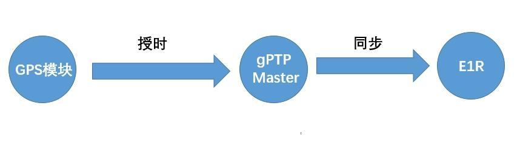{: .manual-img--xl }
<p align="center" style="font-size: 0.9em; color: gray;">图 7 GPS 同步拓扑简图</p>

## 3 产品安装布置推荐

### 3.1 接口说明

#### 3.1.1 E1R 平台连接器

E1R 平台推荐 TE 2397179-1 连接器方案，不接受客户自定义连接器型号，线束折弯半径大于 30 mm，具体接插件方案见表 2。

<p class="manual-table-caption">表 2 接插件方案</p>

<div class="manual-table-wrap">
<table>
  <thead>
    <tr>
      <th>接插件方案</th>
      <th>连接器类型</th>
      <th>型号</th>
      <th>图片</th>
      <th>功能</th>
    </tr>
  </thead>
  <tbody>
    <tr>
      <td>TE 弯插型 (二合一直插, 6 + 2 pin)</td>
      <td>激光雷达端连接器</td>
      <td>TE 2397179-1</td>
      <td>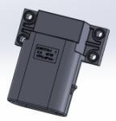</td>
      <td>电源+千兆以太网</td>
    </tr>
  </tbody>
</table>
</div>

#### 3.1.2 连接器安装要求

1) 线束端连接器防水圈与线材配合良好,需满足 IP67 及 IP6K9K 防水等级;

2) 线束端连接器末端出线位置与周边环境建议至少 70 mm 的手部预留拔插空间。

#### 3.1.3 整车线束端安装要求

1) 以太网线束材质需采用满足 1000BASE-T1 的 STP 线材；

2) 建议采用 Dacra 686-3(折弯半径 25 mm) 或 GG X9305(折弯半径 12 mm);

3) 以太网线束总长度建议小于 $15 \mathrm{~m}$ , 连接器对接数建议不超过 3 对 (包含线对板);

4) 以太网信号线在整车上走线，建议避开运动段与高温区域；

5) 供电需考虑线长、线径、阻抗，电源线上激光雷达工作电压保持在 9 V 以上；

### 3.2 LIDAR 接线及接口说明

#### 3.2.1 车载以太网线束接口及定义

E1R 使用 1 个车载以太网、电源二合一接头，线束如图 8 所示。

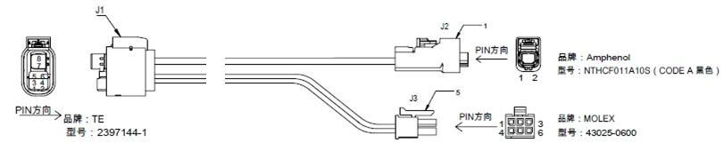{: .manual-img--xl }
<p align="center" style="font-size: 0.9em; color: gray;">图 8 车载以太网电源线束</p>

#### 3.2.2 接口盒接口

E1R 的接口盒接线说明如表 3 所示:

<p class="manual-table-caption">表 3 接线说明</p>

<table class="manual-spec-grid-table">
  <tbody>
    <tr class="section-head">
      <th>接线说明</th>
      <th>TE 接口盒结构图</th>
    </tr>
    <tr>
      <td class="spec-label">连接激光雷达侧</td>
      <td class="spec-value" style="text-align: center">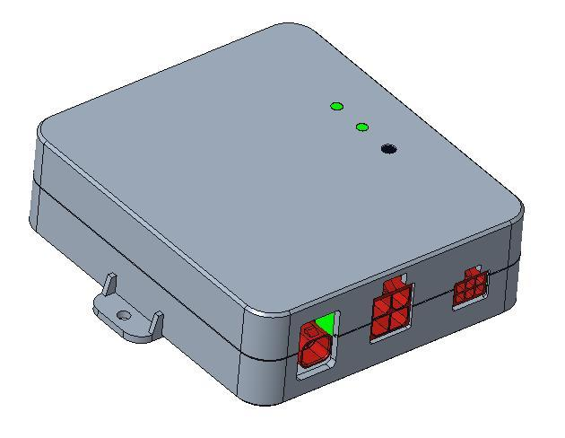</td>
    </tr>
    <tr>
      <td class="spec-label">连接电源及上位机侧</td>
      <td class="spec-value" style="text-align: center">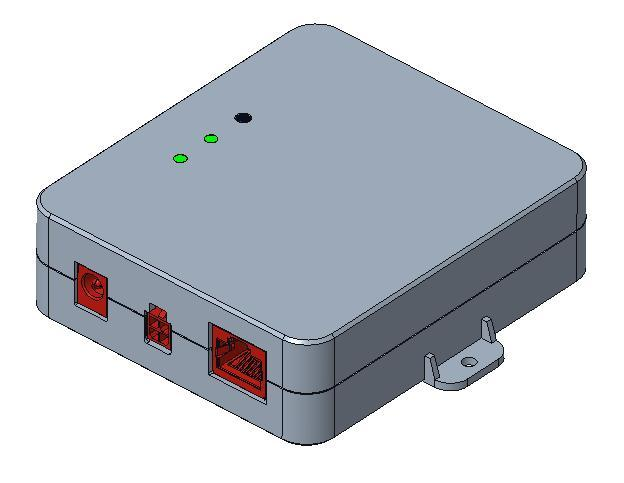</td>
    </tr>
  </tbody>
</table>

#### 3.2.3 电源接口

E1R 接口盒使用标准 DC 5.5-2.1 接口。电源正常输入时，电源盒绿色指示灯常亮。当绿色指示灯熄灭，请检查电源输入是否正常，若电源输入正常，即接口盒可能已损坏，请联系 RoboSense。

#### 3.2.4 RJ45 网口

E1R 本体只支持 1000BASE-T1 车载以太网，使用接口盒时网络接口使用标准 RJ45 接口。接口盒只支持千兆以太网。

### 3.3 状态机说明

E1R 状态机说明参见图 9。

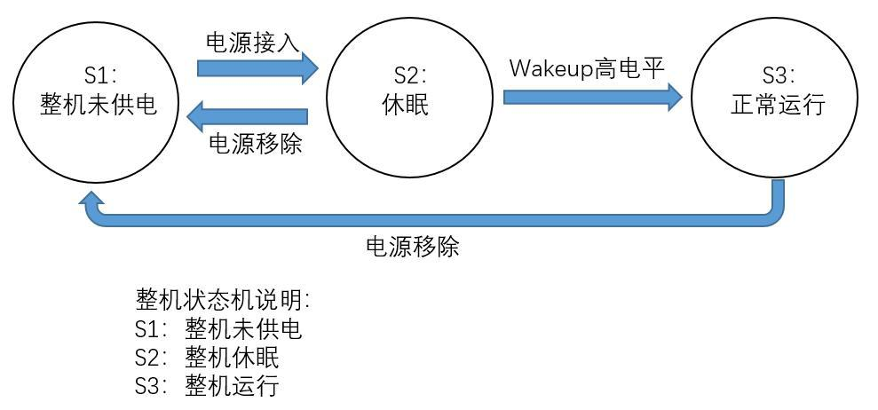{: .manual-img--xl }
<p align="center" style="font-size: 0.9em; color: gray;">图 9 激光雷达状态机描述</p>

### 3.4 安装及定位方式推荐

E1R 不包含安装耳，推荐采用安装支架的方式固定。

#### 3.4.1 安装支架位置

激光雷达后壳设置有 4 个 M4 螺孔或者过孔，以及 2 个定位柱，如图 10 所示。后壳定位柱和支架定位孔配合，支架设置 4 个固定孔，与后壳 4 个螺纹孔采用螺纹连接，完成激光雷达安装。

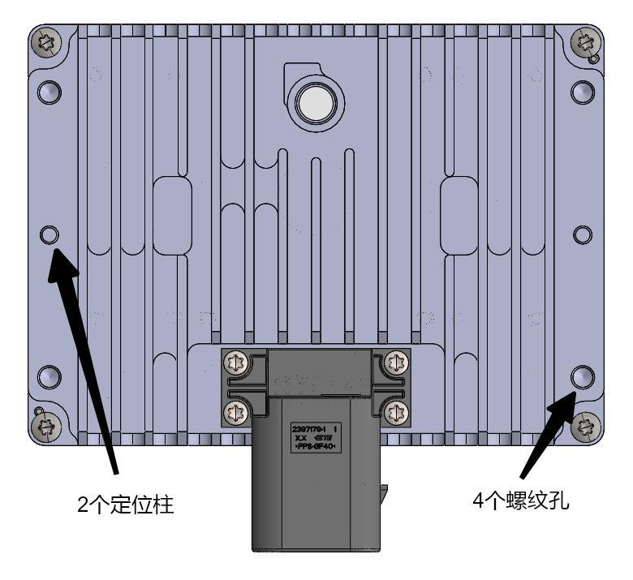{: .manual-img--xl }
<p align="center" style="font-size: 0.9em; color: gray;">图 10 支架安装固定位置</p>

#### 3.4.2 安装支架定位与紧固要求

1. 推荐激光雷达后壳定位孔/定位柱的定位方式；
2. 后壳侧耳 4 颗 M4 螺钉（可以根据实际设计需求选择）；
3. 激光雷达支架建议在 4 个安装孔附近使用小凸台与激光雷达配合，凸台整体平面度要求 0.2 mm 以内；
4. M4 螺钉孔螺距为 1 mm；
5. 螺钉强度等级推荐 8.8 级及以上；
6. 推荐扭矩 5 ± 10% N·m；
7. 建议螺钉长度为支架厚度 T + 4.5 mm；
8. 推荐支架厚度：钢板 2～2.5 mm，压铸铝合金 3～5 mm，支架厚度根据设计校核确定。

### 3.5 安装支架设计参考

固定支架需要有较好的刚性用于安装固定激光雷达，并在各种工况下保持激光雷达处于一个稳定的状态，设计要求如下：

1. 激光雷达及其固定支架整体的一阶模态频率至少大于 50 Hz，固定支架刚度过低会导致激光雷达刚体位移过大，影响点云精度；
2. 激光雷达及其固定支架需要保证在 780 Hz 不产生共振，如果确实无法避开共振区间，客户需提供激光雷达安装处在道路随机激励下的加速度 PSD 响应谱（仿真或实测或经验预估数据），RoboSense 根据光雷达的定频抗振能力曲线作比较识别是否有风险；
3. 激光雷达在使用过程中会经历各种随机振动、机械冲击等工况。这些工况下支架需要承受较大的负载，因此支架还需要有足够的强度，推荐 2 倍安全系数；
4. 同时在各个方向尽可能的增加加强筋、凸包、折弯等设计提高其刚度和强度；
5. 尽量避免设计出现尖角或小于 0.3 mm 的圆角、缺口等易产生应力集中的结构；
6. 建议避免激光雷达支架与防撞梁在高度上重叠，重叠后会增加行人保护设计的难度，矛盾点在于行人保护要求溃缩，而激光雷达支架要求刚性好；
7. 安装平面的平面度、共面度建议小于 0.5 mm；
8. 建议提供安装支架模型和安装环境信息给到 RoboSense，进行结构仿真确认。

### 3.6 安装支架散热要求

1. 散热要求：E1R 在使用过程中会有部分发热，且受其他热源的辐射，可能会加剧 E1R 的温升，散热要求如下：

    a. E1R 安装支架需为优良的传热导体，且 E1R 应尽量避免被支架封闭包裹；

    b. E1R 前后端为主要散热面；

    c. 支架建议采用导热系数大于 50 W/m·K 的铝合金或者镀锌钢板等材料；

    d. 尽量在支架上做一些散热鳍片，并合理的控制鳍片间距/高度/方向，尽量增大散热面积，与空气对流方向一致；

    e. 建议提供安装支架模型和安装环境信息给到 RoboSense，进行热仿真确认。

2. 工作温度要求。

    a. E1R 与周边件的间隙（大于 5 mm），安装件最好不要完全包裹激光雷达，开一些孔保证空气流动更好；

    b. 原则上只需要满足任何条件下 E1R 周边环境温度不高于 85℃ 即可。

## 4 产品使用

### 4.1 产品坐标系

E1R 坐标系定义如图 11 所示。

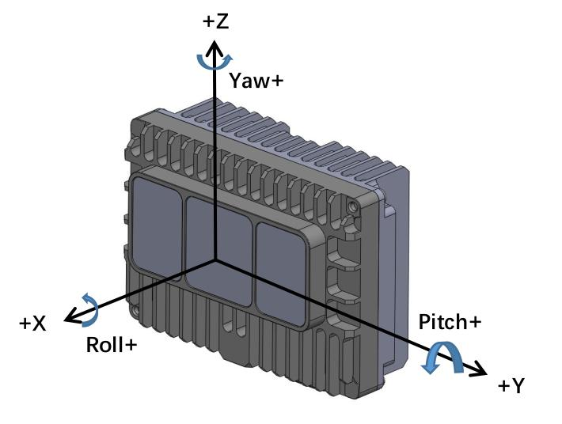{: .manual-img--xl }
<p align="center" style="font-size: 0.9em; color: gray;">图 11 E1R 激光雷达坐标系定义</p>

### 4.2 RSView 使用

在 E1R 的数据的检测上，可使用 Wireshark 和 tcp-dump 等免费工具获取原始数据，而 RSView 可帮助用户更为便捷的实现对原始数据的可视化。

#### 4.2.1 软件功能

RSView 提供将 E1R 数据进行实时可视化的功能。RSView 也能回放保存为 “.pcap” 文件格式的数据，但是目前还不支持 “.pcapng” 格式的文件。

RSView 将 E1R 得到距离测量值显示为一个点。它能够支持多种自定义颜色来显示数据，例如反射强度、时间、距离、水平角度和激光线束序号。所显示的数据能够导出保存为 “.csv” 格式，RSView 4.3.11 以后的版本支持导出 “.las” 格式的数据。

RSView 包含以下功能:

1. 通过以太网实时显示数据;
2. 将实时数据记录保存为 PCAP 文件;
3. 从记录的 PCAP 文件中回放;
4. 不同类型可视化模式，例如距离、时间、水平角度等等；
5. 用表格显示点的数据;
6. 将点云数据导出为 CSV 格式文件;
7. 测量距离工具;
8. 将回放数据的连续多帧同时显示;
9. 裁剪显示。

#### 4.2.2 安装 RSView

RSView 支持在 Windows 64 位、Ubuntu 18.04 以上操作系统上运行。可从 RoboSense 的官网（http://www.robosense.cn/resources）下载最新版本 RSView 软件压缩包。下载后，软件的解压路径请勿出现中文字符，软件无需安装，解压后运行可执行文件即可正常使用。

#### 4.2.3 使用 RSView

打开 RSview 后，在软件界面，可通过 F1 按钮打开软件使用指南，或通过点击软件菜单栏 Help 选项中的 RS-LiDAR User Guide 进行查阅。

### 4.3 通信协议

E1R 与电脑之间的通信采用以太网介质，使用 UDP 协议，输出包有两种类型：MSOP 包和 DIFOP 包。

文中所有涉及 MSOP 协议包均为 1200 Bytes 定长；DIFOP 协议包均为 256 Bytes 定长。E1R 网络参数可配置，出厂默认为单播模式，采用固定 IP 和固定目的端口号，按照如下表格。

<p class="manual-table-caption">表 4 出厂默认网络配置表</p>

<div class="manual-table-wrap">
<table class="manual-network-table manual-network-table--four-col">
  <colgroup>
    <col class="net-col-device" />
    <col class="net-col-ip" />
    <col class="net-col-port" />
    <col class="net-col-port" />
  </colgroup>
  <thead>
    <tr>
      <th></th>
      <th>IP 地址</th>
      <th>MSOP 包端口号</th>
      <th>DIFOP 包端口号</th>
    </tr>
  </thead>
  <tbody>
    <tr>
      <td>E1R</td>
      <td>192.168.1.200</td>
      <td>6699</td>
      <td>7788</td>
    </tr>
    <tr>
      <td>电脑</td>
      <td>192.168.1.102</td>
      <td>6699</td>
      <td>7788</td>
    </tr>
  </tbody>
</table>
</div>

产品默认 MAC 地址是在工厂初始设置的，每台产品 MAC 地址唯一。

当使用产品的时候，需要把电脑的 IP 设置为与产品同一网段上，例如 192.168.1.x(x 的取值范围为 1～254)，子网掩码为 255.255.0.0。若不知产品网络配置信息，请将主机子网掩码设置为 255.255.0.0 后连接产品并使用 Wireshark 抓取产品输出包进行分析。

E1R 和电脑之间的通信协议主要分两类，一览表见表 5。

主数据流输出协议 MSOP，将激光雷达扫描出来的距离，角度，反射率等信息封装成包输出给电脑；

产品信息输出协议 DIFOP，将激光雷达当前状态的各种配置信息输出给电脑。

<p class="manual-table-caption">表 5 产品协议一览表</p>

<table class="packet-def-table product-protocol-table">
  <colgroup>
    <col class="pp-col-name" />
    <col class="pp-col-abbr" />
    <col class="pp-col-func" />
    <col class="pp-col-type" />
    <col class="pp-col-size" />
  </colgroup>
  <thead>
    <tr>
      <th>（协议/包）名称</th>
      <th>简写</th>
      <th>功能</th>
      <th>类型</th>
      <th>包大小</th>
    </tr>
  </thead>
  <tbody>
    <tr>
      <td>Main Data Stream Output Protocol</td>
      <td>MSOP</td>
      <td>扫描数据输出</td>
      <td>UDP</td>
      <td>1200 Bytes</td>
    </tr>
    <tr>
      <td>Device Information Output Protocol</td>
      <td>DIFOP</td>
      <td>产品信息输出</td>
      <td>UDP</td>
      <td>256 Bytes</td>
    </tr>
  </tbody>
</table>

#### 4.3.1 主数据流输出协议（MSOP）

主数据流输出协议：Main data Stream Output Protocol，简称：MSOP。

I/O 类型：产品输出，电脑解析。

默认端口号为 6699。

MSOP 包完成三维测量相关数据输出, 包括激光测距值、回波的反射强度值、垂直角度、水平角度和时间戳。MSOP 包的有效荷载长度为 1200Bytes，其中 32Bytes 为同步帧头 Header，1152Bytes 为数据块区间（共 96 个 12Bytes 的 data block），16Bytes 为帧尾。

基本数据结构如下图所示:

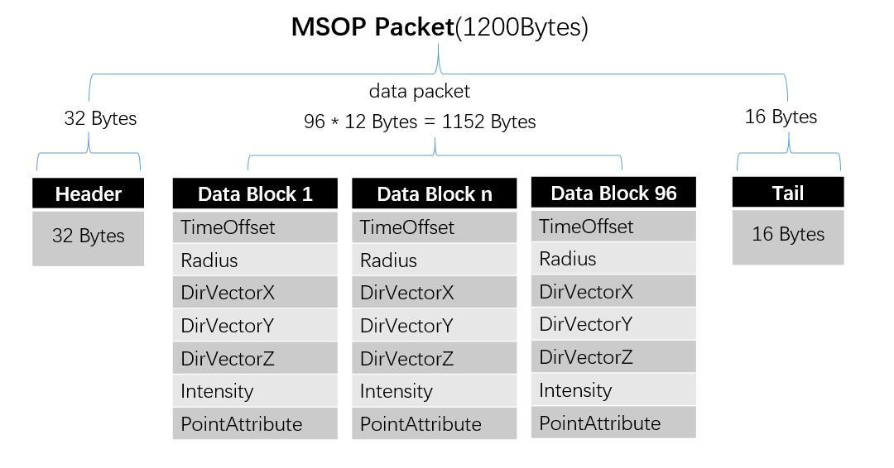{: .manual-img--xl }
<p align="center" style="font-size: 0.9em; color: gray;">图 12 MSOP Packet 数据包定义示意图</p>

##### 4.3.1.1 帧头

帧头 Header 共 32Bytes，用于识别数据的开始位置，包计数，UDP 通信预留以及存储时间戳。详细定义如下：

<p class="manual-table-caption">表 6 MSOP 包头定义</p>

<table class="packet-def-table">
  <thead>
    <tr>
      <th colspan="5">Header(32Bytes)</th>
    </tr>
  </thead>
  <tbody>
    <tr>
      <td>Sync</td>
      <td>PktCnt</td>
      <td>Ver</td>
      <td>ReturnMode</td>
      <td>TimeMode</td>
    </tr>
    <tr>
      <td>4 Bytes</td>
      <td>2 Bytes</td>
      <td>2 Bytes</td>
      <td>1 Byte</td>
      <td>1 Byte</td>
    </tr>
    <tr>
      <td>Timestamp</td>
      <td>FrameSync</td>
      <td>Res0</td>
      <td>LidarType</td>
      <td>LidarTmp</td>
    </tr>
    <tr>
      <td>10 Bytes</td>
      <td>1 Byte</td>
      <td>9 Bytes</td>
      <td>1 Byte</td>
      <td>1 Byte</td>
    </tr>
  </tbody>
</table>

Sync: 可作为包的检查序列，识别头为 0x55AA5AA5。

PktCnt: 包序列号，表示包计数，循环计数，从每帧数据的起点的包计数为0，每帧数据的最后一个点的包计数为最大值。

Ver: 表示 UDP 通信协议的版本号。

ReturnMode: 回波模式标志位，出厂时固定 04（最强回波模式）。

TimeMode: 时间同步模式:

0x00 表示使用雷达内部计时

0x02 表示使用 PTP E2E 时间同步模式

0x03 表示使用 gPTP 时间同步模式

Timestamp: 用于存储时间戳，定义的时间戳用来记录系统的时间

其中 0-5 bytes: Second ; 6-9 bytes: MicroSecond

FrameSync: 帧同步状态（0x00:no 0x01:yes）

Res0: 预留位

LidarType: 雷达类型标志位，默认值为 0x62。

LidarTmp: 芯片温度，Temp = LidarTmp - 80; 即原始值 0 代表 - 80 度。

##### 4.3.1.2 数据块区域

数据块区间是 MSOP 包中传感器的测量值部分，共 1152Bytes。它由 96 个 data block 组成，每个 data block 长度为 12Bytes。

详细定义如下:

<p class="manual-table-caption">表 7 MSOP 包中的 data block 定义</p>

<table class="packet-def-table msop-data-table msop-data-table--auto-label-cols">
  <colgroup>
    <col class="msop-col-var" />
    <col class="msop-col-offset" />
    <col class="msop-col-len" />
    <col class="msop-col-content" />
  </colgroup>
  <thead>
    <tr>
      <th colspan="4">Data block (12Bytes)</th>
    </tr>
    <tr>
      <th>字段</th>
      <th>offset</th>
      <th>长度 (byte)</th>
      <th>定义说明</th>
    </tr>
  </thead>
  <tbody>
    <tr>
      <td>TimeOffset</td>
      <td>0</td>
      <td>2</td>
      <td class="msop-content">该组 Block 里面所有的点相对于包的 timestamp 的时间偏移量(单位: ns), 该组点的时间等于 timestamp+time_offset</td>
    </tr>
    <tr>
      <td>Radius</td>
      <td>2</td>
      <td>2</td>
      <td class="msop-content">极坐标系下, 通道 1 的径向点距离值, 距离解析分辨率 5mm</td>
    </tr>
    <tr>
      <td>DirVectorX</td>
      <td>4</td>
      <td>2</td>
      <td class="msop-content">通道 1 单位方向向量 X 轴分量, 范围 -32768~32767, 转浮点除以 2^15</td>
    </tr>
    <tr>
      <td>DirVectorY</td>
      <td>6</td>
      <td>2</td>
      <td class="msop-content">通道 1 单位方向向量 Y 轴分量, 范围 -32768~32767, 转浮点除以 2^15</td>
    </tr>
    <tr>
      <td>DirVectorZ</td>
      <td>8</td>
      <td>2</td>
      <td class="msop-content">通道 1 单位方向向量 Z 轴分量, 范围 -32768~32767, 转浮点除以 2^15</td>
    </tr>
    <tr>
      <td>Intensity</td>
      <td>10</td>
      <td>1</td>
      <td class="msop-content">通道 1 的点反射强度值, 取值范围 0~255</td>
    </tr>
    <tr>
      <td>PointAttribute</td>
      <td>11</td>
      <td>1</td>
      <td class="msop-content">通道 1 的点的属性, 1 表示正常点, 2 表示噪点, 后续该定义会进一步扩展属性, 原回波饱和程度特征合入点属性</td>
    </tr>
  </tbody>
</table>

!!! tip "相关计算说明"
    **径向距离 radius 计算**（Radius 为 2 Bytes，分辨率为 5 mm）：例如某数据包中 Radius 值的十六进制数为 R1 = 0x03、R2 = 0xfc，则径向距离 = R1 × 256 + R2 = 3 × 256 + 252 = 1020，换算为米：1020 × 0.005 = 5.10 m。

    点云 X、Y、Z 坐标计算：

    由以下公式可以解析得到点云的 XYZ 坐标:

    $$
    \left\{ \begin{array}{l} X = \text { radius } * (\text { DirVectorX } / (2 ^ {1 5})) \\ Y = \text { radius } * (\text { DirVectorY } / (2 ^ {1 5})) \\ Z = \text { radius } * (\text { DirVectorZ } / (2 ^ {1 5})) \end{array} \right.
    $$

##### 4.3.1.3 帧尾

帧尾部分包含参数是雷达 E2E Profile4 所用参数，详细定义如下表

<p class="manual-table-caption">表 8 MSOP 帧尾参数定义</p>

<table class="packet-def-table msop-data-table msop-data-table--auto-label-cols">
  <colgroup>
    <col class="msop-col-var" />
    <col class="msop-col-offset" />
    <col class="msop-col-len" />
    <col class="msop-col-content" />
  </colgroup>
  <thead>
    <tr>
      <th>字段</th>
      <th>offset</th>
      <th>长度 (byte)</th>
      <th>定义说明</th>
    </tr>
  </thead>
  <tbody>
    <tr>
      <td>Res1</td>
      <td>1184</td>
      <td>4</td>
      <td class="msop-content">预留位</td>
    </tr>
    <tr>
      <td>DataLength</td>
      <td>1188</td>
      <td>2</td>
      <td class="msop-content">04 B0</td>
    </tr>
    <tr>
      <td>Counter</td>
      <td>1190</td>
      <td>2</td>
      <td class="msop-content">00 00~FF FF</td>
    </tr>
    <tr>
      <td>DataId</td>
      <td>1192</td>
      <td>4</td>
      <td class="msop-content">00 00 0E 5C</td>
    </tr>
    <tr>
      <td>Crc32</td>
      <td>1196</td>
      <td>4</td>
      <td class="msop-content"></td>
    </tr>
  </tbody>
</table>

#### 4.3.2 产品信息输出协议（DIFOP）

产品信息输出协议，Device Info Output Protocol，简称：DIFOP

I/O 类型：产品输出，电脑读取。

默认端口号为 7788。

DIFOP 是为了将产品序列号（S/N）、固件版本信息、网络配置信息、运行状态定期发送给用户的“仅输出”协议，用户可以通过读取 DIFOP 解读当前使用产品的各种参数的具体信息。

一个完整的 DIFOP Packet 的详细信息如下:

<p class="manual-table-caption">表 9 DIFOP Packet 详细结构信息</p>

<div class="manual-table-scroll-wrap">
<table class="packet-def-table msop-data-table msop-data-table--auto-label-cols">
  <colgroup>
    <col class="msop-col-var" />
    <col class="msop-col-offset" />
    <col class="msop-col-len" />
    <col class="msop-col-content" />
  </colgroup>
  <thead>
    <tr>
      <th colspan="4">DIFOP Packet(256Bytes)</th>
    </tr>
    <tr>
      <th>字段</th>
      <th>offset</th>
      <th>长度 (byte)</th>
      <th>定义说明</th>
    </tr>
  </thead>
  <tbody>
    <tr>
      <td>DifopHeader</td>
      <td>0</td>
      <td>8</td>
      <td class="msop-content">DIFOP 识别头</td>
    </tr>
    <tr>
      <td>Res0</td>
      <td>8</td>
      <td>8</td>
      <td class="msop-content">预留位</td>
    </tr>
    <tr>
      <td>SW Version</td>
      <td>16</td>
      <td>3</td>
      <td class="msop-content">雷达版本号</td>
    </tr>
    <tr>
      <td>Res1</td>
      <td>19</td>
      <td>1</td>
      <td class="msop-content">预留位</td>
    </tr>
    <tr>
      <td>SN</td>
      <td>20</td>
      <td>6</td>
      <td class="msop-content">设备序列号</td>
    </tr>
    <tr>
      <td>Res2</td>
      <td>26</td>
      <td>18</td>
      <td class="msop-content">预留位</td>
    </tr>
    <tr>
      <td>LocalIp</td>
      <td>44</td>
      <td>4</td>
      <td class="msop-content">雷达 IP 源地址</td>
    </tr>
    <tr>
      <td>NetMask</td>
      <td>48</td>
      <td>4</td>
      <td class="msop-content">子网掩码</td>
    </tr>
    <tr>
      <td>MacAddress</td>
      <td>52</td>
      <td>6</td>
      <td class="msop-content">雷达 IP 本机 MAC 地址</td>
    </tr>
    <tr>
      <td>MsopRemoteIp</td>
      <td>58</td>
      <td>4</td>
      <td class="msop-content">Msop 远程 IP</td>
    </tr>
    <tr>
      <td>MsopLocalPort</td>
      <td>62</td>
      <td>2</td>
      <td class="msop-content">Msop 本地端口号</td>
    </tr>
    <tr>
      <td>MsopRemotePort</td>
      <td>64</td>
      <td>2</td>
      <td class="msop-content">Msop 远程端口号</td>
    </tr>
    <tr>
      <td>DifopRemoteIp</td>
      <td>66</td>
      <td>4</td>
      <td class="msop-content">Difop 远程 IP</td>
    </tr>
    <tr>
      <td>DifopLocalPort</td>
      <td>70</td>
      <td>2</td>
      <td class="msop-content">Difop 本地端口号</td>
    </tr>
    <tr>
      <td>DifopRemotePort</td>
      <td>72</td>
      <td>2</td>
      <td class="msop-content">Difop 远程端口号</td>
    </tr>
    <tr>
      <td>Res3</td>
      <td>74</td>
      <td>25</td>
      <td class="msop-content">预留位</td>
    </tr>
    <tr>
      <td>FrequecySetting</td>
      <td>99</td>
      <td>1</td>
      <td class="msop-content">雷达帧率设置</td>
    </tr>
    <tr>
      <td>ReturnMode</td>
      <td>100</td>
      <td>1</td>
      <td class="msop-content">
        雷达回波信息:<br>
        0x00: FarthestWave<br>
        0x04: StrongestWave (Default)<br>
        0x07: NearestWave<br>
        0x08: 2ndStrongestWave<br>
        0x09: StrongestFarthestWave<br>
        0x0A: NearestFarthestWave<br>
        0x0B: Strongest2ndStrongestWave
      </td>
    </tr>
    <tr>
      <td>TimesyncMode</td>
      <td>101</td>
      <td>1</td>
      <td class="msop-content">
        时间同步模式:<br>
        0x0: Internal<br>
        0x2: E2E L2<br>
        0x3: GPTP
      </td>
    </tr>
    <tr>
      <td>TimesyncStatus</td>
      <td>102</td>
      <td>1</td>
      <td class="msop-content">
        时间同步状态:<br>
        0x00: failed<br>
        0x01: success<br>
        0x02: timeout
      </td>
    </tr>
    <tr>
      <td>TimeStatus</td>
      <td>103</td>
      <td>10</td>
      <td class="msop-content">
        时间:<br>
        0-5bytes: Second<br>
        6-9bytes: MicroSecond
      </td>
    </tr>
    <tr>
      <td>PHYMode</td>
      <td>113</td>
      <td>1</td>
      <td class="msop-content">
        物理层工作模式:<br>
        0x00: auto-negotiation<br>
        0x01: master<br>
        0x02: slave<br>
        other: same as 0x00
      </td>
    </tr>
    <tr>
      <td>Res4</td>
      <td>114</td>
      <td>142</td>
      <td class="msop-content">预留位</td>
    </tr>
  </tbody>
</table>
</div>

## 6 产品维护

--8<-- "snippets/product-maintenance.md"

## 7 售后

--8<-- "snippets/after-sales.md"

## 附录 A Driver & SDK

### A.1 rs_driver 的编译与安装

RS Driver 为 RoboSense 激光雷达提供跨平台的雷达驱动内核，方便用户二次开发使用。v1.5.10 的驱动内核及之后的版本已支持 E1R 的点云解析及变换。

可以在官方 GitHub 账号上下载 rs_driver 包：

https://github.com/RoboSense-LiDAR/rs_driver

rs_driver 目前支持下列系统和编译器：

1. Windows:
    - MSVC（VS2017 & VS2019 已测试）
    - Mingw-w64（x86_64-8.1.0-posix-seh-rt_v6-rev0 已测试）

2. Ubuntu（16.04, 18.04, 20.04）:
    - gcc（4.8+）

##### A.1.1 依赖库的安装

rs_driver 依赖下列的第三方库，在编译之前需要先安装：

- Boost 
- Pcap 
- PCL (非必须，如果不需要可视化工具可忽略)
- Eigen3 (非必须，如果不需要内置坐标变换可忽略)

在 Ubuntu 中安装以下依赖库:

```
sudo apt-get install libboost-dev libpcap-dev libpcl-dev libeigen3-dev
```

在 Windows 中安装以下依赖库:

- Boost 

Windows 下需要从源码编译 Boost 库，请参考官方指南 https://www.boost.org/doc/libs/1_67_0/more/getting_started/Windows.html

编译安装完成之后，将 Boost 的路径添加到系统环境变量 `BOOST_ROOT`，如图 13 所示。如果使用 MSVC，也可以选择直接下载相应版本的预编译的安装包。

{: .manual-img--xl }
<p align="center" style="font-size: 0.9em; color: gray;">图 13 环境变量添加示意图</p>

- pcap

首先，安装 pcap 运行库 https://www.winpcap.org/install/bin/WinPcap_4_1_3.exe

然后, 下载开发者包(https://www.winpcap.org/install/bin/WpdPack_4_1_2.zip)到任意位置, 然后将 WpdPack_4_1_2/WpdPack 的路径添加到环境变量 PATH, 如图 13 所示。

- PCL (非必须，如果不需要可视化工具可忽略)：

    - MSVC 

    如果使用 MSVC 编译器，可使用 PCL 官方提供的安装包安装。

    安装过程中选择 “Add PCL to the system PATH for xxx”;

    {: .manual-img--xl }
    <p align="center" style="font-size: 0.9em; color: gray;">图 14 PCL 设置界面</p>

    - Mingw-w64

    PCL 官方并没有提供 mingw 编译的库，所以需要按照官方教程，从源码编译 PCL 并安装。

##### A.1.2 使用方式

##### A.1.2.1 rs_Driver 安装使用

驱动编译以 Linux 环境为例（在 Windows 中，rs_driver 暂不支持安装使用），按顺序执行以下代码，安装驱动；

```bash
cd rs_driver
mkdir build && cd build
cmake .. && make -j4
sudo make install
```

##### A.1.2.2 作为子模块使用

在作为子模块使用时，需要添加如下命令到 `CMakeLists.txt` 文件中（将 rs_driver 作为子模块添加到工程内，使用 `find_package()` 指令找到 rs_driver，然后链接相关库）。

```cmake
add_subdirectory(${PROJECT_SOURCE_DIR}/rs_driver)
find_package(rs_driver REQUIRED)
include_directories(${rs_driver_INCLUDE_DIRS})
target_link_libraries(project ${rs_driver_LIBRARIES})
```

##### A.1.3 示例程序 & 可视化工具

##### A.1.3.1 示例程序

rs_driver 提供了两个示例程序，用户可参考示例程序编写代码调用接口，存放于 `rs_driver/demo` 中：

1. demo_online.cpp 
2. demo_pcap.cpp 

若希望编译这两个示例程序，执行 CMake 配置时加上参数：

```bash
cmake -DCOMPILE_DEMOS=ON ..
```

##### A.1.3.2 可视化工具

rs_driver 提供了一个基于 PCL 的点云可视化工具，存放于 `rs_driver/tool` 中：

1) rs_driver_viewer.cpp 

若希望编译可视化工具，执行 CMake 配置时加上参数：

```bash
cmake -DCOMPILE_TOOLS=ON ..
```

##### A.1.4 坐标变换

rs_driver 提供了内置的坐标变换功能，可以直接输出经过坐标变换后的点云，节省了用户对点云进行坐标变换的额外操作耗时。若希望启用此功能，执行 CMake 配置时加上参数：

```bash
cmake -DENABLE_TRANSFORM=ON ..
```

### A.2 rlidar_sdk 的编译与安装

rslidar_sdk 是 ROS 平台下的驱动 SDK，请通过 github 上的 RoboSense 主页下载，或联系 RoboSense 获取。

1. rslidar_sdk 依赖 rs_driver，后者是 RoboSense 的基本驱动。rs_driver 请从 github 平台下载；
2. 如使用环境为 ROS2，rslidar_sdk 还依赖 rslidar_msg，这是 msg 定义文件。msg 文件请从 github 平台下载；
3. 驱动 SDK 下载包含丰富的使用指引，请在使用驱动 SDK 前，详细阅读文件内的 README 文件及 doc 文件夹下的文档。

!!! tip "提示"
    1. SDK 获取地址：https://github.com/RoboSense-LiDAR/rslidar_sdk
    2. rs_driver 获取地址：https://github.com/RoboSense-LiDAR/rs_driver
    3. msg 获取地址：https://github.com/RoboSense-LiDAR/rslidar_msg

## 附录 B 结构图纸

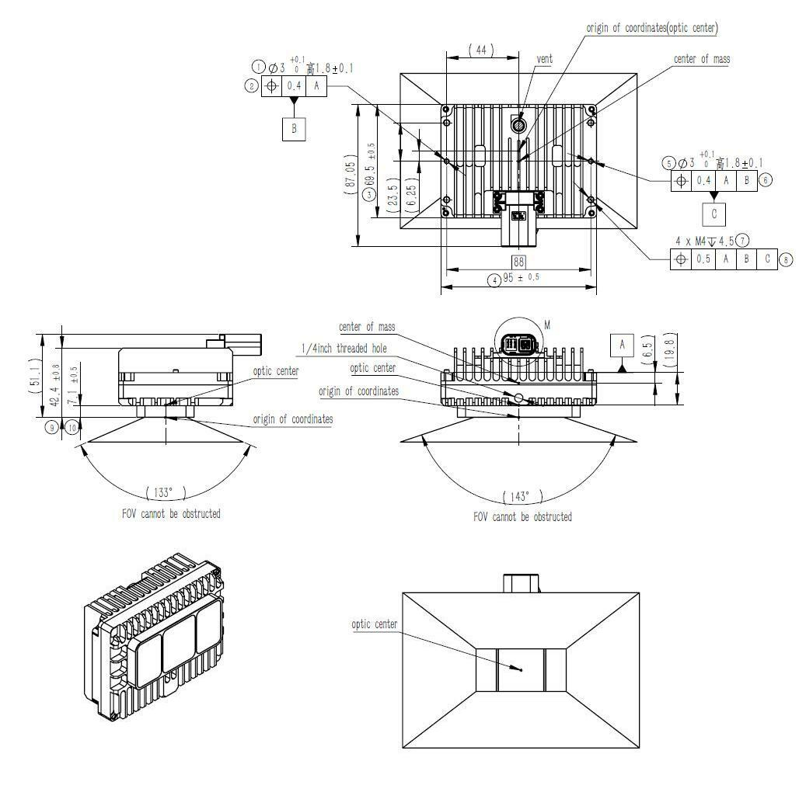{: .manual-img--xl }
<p align="center" style="font-size: 0.9em; color: gray;">TE 接口雷达结构图纸</p>

针脚定义:

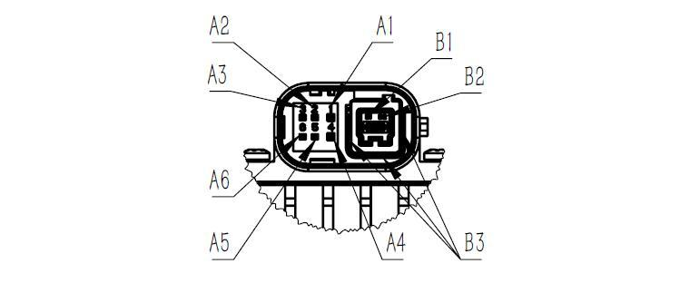{: .manual-img--xl }
<p align="center" style="font-size: 0.9em; color: gray;">接插件针脚定义</p>

<table class="packet-def-table connector-pin-table">
  <thead>
    <tr>
      <th>pin 脚编号</th>
      <th>序号</th>
      <th>引脚定义</th>
      <th>连接器型号</th>
    </tr>
  </thead>
  <tbody>
    <tr>
      <td>A1</td>
      <td>1</td>
      <td>Battery+</td>
      <td rowspan="9">TE-2397179-1</td>
    </tr>
    <tr>
      <td>A2</td>
      <td>2</td>
      <td>Wakeup(KL15)</td>
    </tr>
    <tr>
      <td>A3</td>
      <td>3</td>
      <td>NC</td>
    </tr>
    <tr>
      <td>A4</td>
      <td>4</td>
      <td>GND</td>
    </tr>
    <tr>
      <td>A5</td>
      <td>5</td>
      <td>NC</td>
    </tr>
    <tr>
      <td>A6</td>
      <td>6</td>
      <td>NC</td>
    </tr>
    <tr>
      <td>B1</td>
      <td>D1</td>
      <td>TRX_P(1000Base-T1)</td>
    </tr>
    <tr>
      <td>B2</td>
      <td>D2</td>
      <td>TRX_N(1000Base-T1)</td>
    </tr>
    <tr>
      <td>B3</td>
      <td>/</td>
      <td>SHIELD</td>
    </tr>
  </tbody>
</table>

{: .manual-img--xl }
