# EM4 产品手册

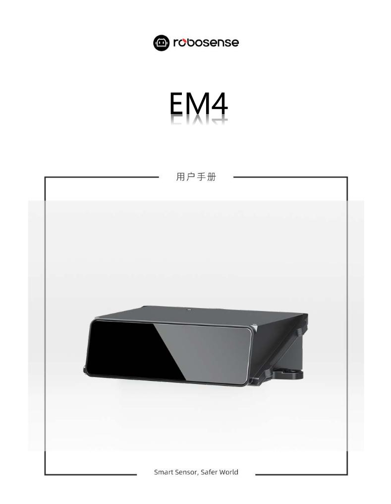{: .manual-img--xl }

## 1 安全提示

--8<-- "snippets/safety-reminder.md"

## 2 产品描述

!!! info "以下内容描述 EM4-T B 样的状态和功能，后续新版本样机推出后将同步更新产品手册至最新状态。"

### 2.1 产品概要

EM4-T 是一款基于 VCSEL+SPAD-SoC 数字化收发模组+一维转镜扫描的高性能车规级激光雷达。垂直方向上配置了 13 个发射分区，每个分区对应 SPAD-SoC 的 40 线接收，总计 520 线，如图 1 所示。EM4 的最大探测范围为 300 米，非 ROI 区域分辨率为 $0.1^{\circ}$ （H）x $0.05^{\circ}$ （V），ROI 区域可达 $0.05^{\circ}$ （H）x $0.05^{\circ}$ （V）。

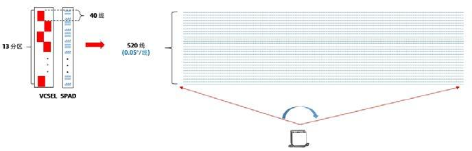{: .manual-img--xl }

图1 EM4-T 工作原理图

### 2.2 产品结构

EM4-T 结构图如图 2 所示。

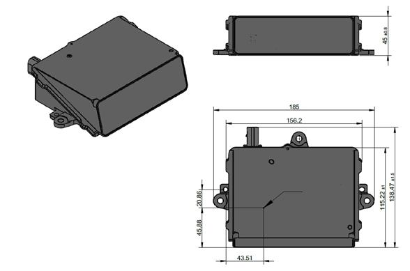{: .manual-img--xl }

图2 产品结构说明图（光心在多边形转镜的旋转中心）

### 2.3 FOV 分布

EM4-T 的 FOV 分布如表 1、图 3 所示。

表1 EM4-T FOV

| 规格 | 水平方向 | 垂直方向 |
| --- | --- | --- |
| 120° × 25° FOV | -60° ~ +60° | -12.5° ~ +12.5° |

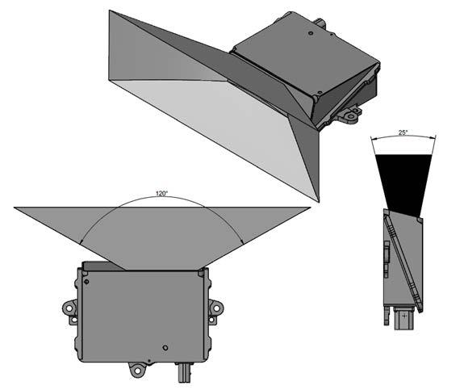{: .manual-img--xl }

图3 EM4-T FOV 示意图

### 2.4 规格参数

表2 相关参数规格

<table class="manual-spec-grid-table">
  <tbody>
    <tr class="section-head">
      <th colspan="4">传感器</th>
    </tr>
    <tr>
      <td class="spec-label">测距能力1</td>
      <td class="spec-value">≥250m @10% NIST, 100klux</td>
      <td class="spec-label">精度2（典型值）</td>
      <td class="spec-value">± 5 cm@1σ</td>
    </tr>
    <tr>
      <td class="spec-label">水平视场角</td>
      <td class="spec-value">120° (-60° ~ +60°) ROI: 40° (-20° ~ +20°)</td>
      <td class="spec-label">水平角分辨率</td>
      <td class="spec-value">0.1° ROI: 0.05°</td>
    </tr>
    <tr>
      <td class="spec-label">垂直视场角</td>
      <td class="spec-value">25° (-12.5° ~ +12.5°)</td>
      <td class="spec-label">垂直角分辨率</td>
      <td class="spec-value">0.05°</td>
    </tr>
    <tr class="section-head">
      <th colspan="4">输出</th>
    </tr>
    <tr>
      <td class="spec-label">出点数</td>
      <td class="spec-value" colspan="3">
        非 ROI 模式： 
        单回波模式：6,240,000 pts/s
        双回波模式：12,480,000 pts/s
        ROI 模式： 
        单回波模式：8,320,000 pts/s
        双回波模式：16,640,000 pts/s
        *仅压缩模式，支持 ROI 模式下的双回波。
      </td>
    </tr>
    <tr>
      <td class="spec-label">以太网输出</td>
      <td class="spec-value" colspan="3">1000Base-T1</td>
    </tr>
    <tr>
      <td class="spec-label">输出数据协议</td>
      <td class="spec-value" colspan="3">UDP</td>
    </tr>
    <tr>
      <td class="spec-label">激光雷达数据包内容</td>
      <td class="spec-value" colspan="3">三维空间坐标、反射强度、时间戳等。</td>
    </tr>
    <tr class="section-head">
      <th colspan="4">机械/电子操作</th>
    </tr>
    <tr>
      <td class="spec-label">工作电压</td>
      <td class="spec-value">12V（9V~16VDC）</td>
      <td class="spec-label">主体尺寸</td>
      <td class="spec-value">宽 150mm * 深 120mm * 高 45mm *全尺寸见图 1</td>
    </tr>
    <tr>
      <td class="spec-label">产品功率3</td>
      <td class="spec-value">15W（典型值）</td>
      <td class="spec-label">工作温度4</td>
      <td class="spec-value">-40℃ ~ +85℃</td>
    </tr>
    <tr>
      <td class="spec-label">重量</td>
      <td class="spec-value">&lt;1000g</td>
      <td class="spec-label">存储温度</td>
      <td class="spec-value">-40℃ ~ +105℃</td>
    </tr>
    <tr>
      <td class="spec-label">时间同步</td>
      <td class="spec-value">gPTP</td>
      <td class="spec-label">防护等级</td>
      <td class="spec-value">IP67/IP6K9K</td>
    </tr>
    <tr>
      <td class="spec-label">帧率</td>
      <td class="spec-value">10 Hz</td>
      <td class="spec-label">盲区</td>
      <td class="spec-value">1m</td>
    </tr>
  </tbody>
</table>

1 测距能力以 10% NIST 漫反射板作为目标，环境光照度为 100KLux，目标 PoD 为 90%

2 测距精度以 90% NIST 漫反射板作为目标，测试结果会受到环境影响，包括但不限于环境温度、目标物距离等因素

3 产品功耗测试结果会受到外部环境影响，包括但不限于环境温度、目标物的距离、目标物反射强度等因素

4 产品运行温度可能会受到外部环境影响，包括但不限于光照环境、气流变化等因素

### 2.5 时间同步方式

EM4-T 当前只支持 gPTP（IEEE802.1AS 协议）同步方式。用户如有特殊需求，请联系 RoboSense

#### 2.5.1 gPTP 同步原理

gPTP(general Precise Time Protocol, IEEE802.1AS 协议)是 PTP 在时效性网络（Time-Sensitive Networking）的派生协议。同步机制采用和 PTP 协议一致的 P2P 端延迟机制（Peer Delay Mechanism），同时采用以太网 L2 层通信。与 PTP 不同，gPTP 要求使用硬件方式打时间戳，即硬件时间戳，所以对于交换机和 Master 时钟要求较为严苛，需满足 IEEE802.1AS 协议。

#### 2.5.2 gPTP 接线方式

使用 gPTP 同步方式，需要做以下准备：

> 1. gPTP Master 授时主机（即插即用，无需额外配置）；

> 2. 以太网交换机;

> 3. 支持 gPTP 协议的待授时设备。

!!! info "提示说明"

    1. Master 授时设备属于第三方设备，RoboSense 出货时不包含此配件，需用户自行采购；

    2. RoboSense 产品作为 Slave 设备只获取 Master 发出的时间，不对 Master 时钟源的准确度判断，若解析激光雷达点云时间出现突变，请检查 Master 提供的时间是否准确；

    3. 激光雷达同步之后, Master 断开连接, 点云数据包中的时间则会按照激光雷达内部时钟进行叠加, 激光雷达断电重启后才会被重置。

### 2.6 帧同步方式

EM4-T 的 SoC 每 400ms 向扫描转镜发射同步脉冲，默认配置下，整百 ms 时间点，转镜处在 FOV 扫描的起始位置。激光雷达从左往右扫描，转镜坐标系 $15^{\circ}$ 位置（FOV 的 $-60^{\circ}$ ，FOV 扫描的起始位置），如图 4 所示。

软件版本 V07.00.0A 开始支持 “整百 ms 时间点，转镜处在 FOV 扫描的起始位置”，之前的软件版本可以支持帧扫描起始时间的调整，但是默认值设置下，整百 ms 时间点，转镜不处在 FOV 扫描的起始位置。

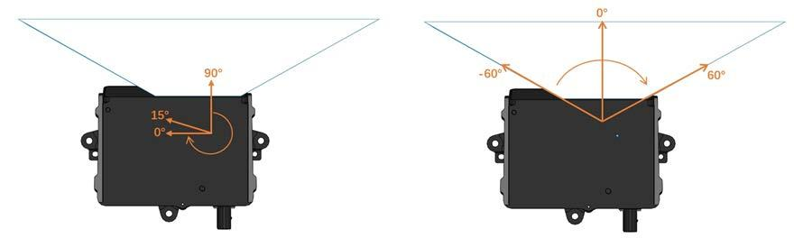{: .manual-img--xl }

图4 转镜坐标系与 FOV 坐标系

V07.00.0A 之前的软件支持配置寄存器实现 FOV 扫描起始时间的调整，调整步进为 1us，相关寄存器信息见表 3：

表3 帧同步寄存器信息

| 寄存器地址 | 寄存器长度 | 操作 | 数值范围 | 单位 |
| --- | --- | --- | --- | --- |
| 0x83C4011C | 4 Bytes | 读/写 | 0~1000000 | us |

寄存器配置可通过 LiDARAssistant 小工具实现，详情参见 LiDARAssistant 小工具的说明文档。

V07.00.0A 及之后的软件版本会通过 DID 命令来调整 FOV 扫描起始时间。

## 3 产品安装

### 3.1 LiDAR 接线及接口说明

#### 3.1.1 车载以太网线束接口及定义

EM4-T 使用 1 个车载以太网与电源二合一的接口，配套线束如图 5 所示。

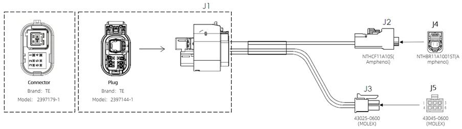{: .manual-img--xl }

图5 车载以太网电源线束

EM4-T 车载以太网电源线束接头及引脚定义见表 4：

表4 车载以太网电源线束接口定义

<table class="wire-harness-table">
  <colgroup>
    <col class="wh-col-a" />
    <col class="wh-col-pin" />
    <col class="wh-col-def" />
    <col class="wh-col-desc" />
    <col class="wh-col-b" />
  </colgroup>
  <thead>
    <tr>
      <th colspan="2">A 端线序</th>
      <th>定义</th>
      <th>描述</th>
      <th>B 端线序</th>
    </tr>
  </thead>
  <tbody>
    <tr>
      <td class="wh-connector" rowspan="8">J1 (TE 2397144-1)</td>
      <td>1</td>
      <td>VBat</td>
      <td>供电</td>
      <td class="wh-connector" rowspan="6">J3 (Molex 43025-0600)</td>
    </tr>
    <tr>
      <td>2</td>
      <td>Wakeup</td>
      <td>唤醒信号</td>
    </tr>
    <tr>
      <td>3</td>
      <td>/</td>
      <td>/</td>
    </tr>
    <tr>
      <td>4</td>
      <td>GND</td>
      <td>接地</td>
    </tr>
    <tr>
      <td>5</td>
      <td>/</td>
      <td>/</td>
    </tr>
    <tr>
      <td>6</td>
      <td>/</td>
      <td>/</td>
    </tr>
    <tr>
      <td>7</td>
      <td>1000BASE-T1 N</td>
      <td>车载以太网差分回路</td>
      <td class="wh-connector" rowspan="2">J2 (Amphenol NTHCF011A10S)</td>
    </tr>
    <tr>
      <td>8</td>
      <td>1000BASE-T1 P</td>
      <td>车载以太网差分回路</td>
    </tr>
  </tbody>
</table>

#### 3.1.2 接口盒接口

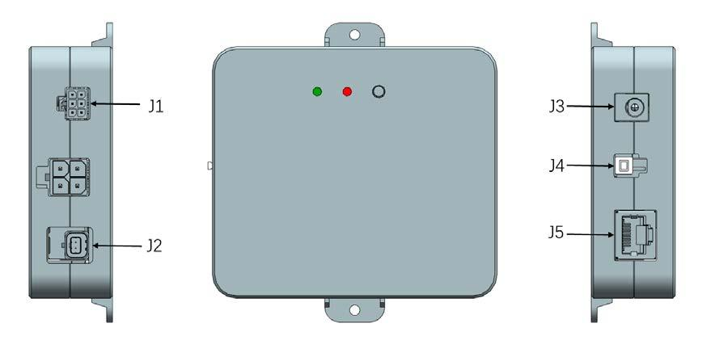{: .manual-img--xl }

图6 接口盒示意图

EM4-T 附件接口盒具有电源指示灯及各类的接口，如图 6 所示，可接驳电源输入、RJ45 网口。

表5 接口盒接口定义

| 连接器 | 接口 | 说明 |
| --- | --- | --- |
| J1 | 电源唤醒信号 | 给雷达供电及输出唤醒信号 |
| J2 | 以太网 | 1000BASE-T1 车载以太网接口 |
| J3 | DC Power 连接器 | 电源输入 |
| J4 | 按键开关 | 唤醒信号控制开关,开关按下时唤醒信号接通 |
| J5 | RJ45 | 1000BASE-TX 工业以太网 |

#### 3.1.3 电源接口

EM4-T 接口盒电源使用标准 DC 5.5-2.1 接口。

电源正常输入时，电源盒绿色指示灯常亮。当绿色指示灯熄灭，请检查电源输入是否正常，若电源输入正常，即接口盒可能已损坏，请联系 RoboSense

#### 3.1.4 RJ45 网口

接口盒只支持千兆以太网，使用接口盒时网络接口使用标准 RJ45 接口。

### 3.2 快速连接

`EM4-T` 的网络参数可配置。在出厂默认状态下，设备采用**固定 IP** 和**端口号**模式，详情见表6。

表6 出厂默认网络配置表

<table class="manual-network-table">
  <colgroup>
    <col class="net-col-device">
    <col class="net-col-ip">
    <col class="net-col-port">
    <col class="net-col-port">
    <col class="net-col-port">
  </colgroup>
  <thead>
    <tr>
      <th>设备</th>
      <th>IP 地址</th>
      <th>MSOP 包端 口号</th>
      <th>DIFOP1 包端 口号</th>
      <th>DIFOP2 包端 口号</th>
    </tr>
  </thead>
  <tbody>
    <tr>
      <td>EM4-T</td>
      <td>192.168.1.200</td>
      <td rowspan="2">6699</td>
      <td rowspan="2">7788</td>
      <td rowspan="2">7766</td>
    </tr>
    <tr>
      <td>电脑</td>
      <td>192.168.1.102</td>
    </tr>
  </tbody>
</table>

!!! info "三大核心输出数据协议定位"
    1. **MSOP 协议**：主数据流输出协议，将激光雷达扫描出来的距离、角度 ($yaw$)、反射强度等核心信息封装成包输出。
    2. **DIFOP1 协议**：产品信息输出协议，将激光雷达状态信息封装成包输出。
    3. **DIFOP2 协议**：产品信息输出协议，将激光雷达 SPAD-SoC 每一线 ($1 \sim 520$) 对应的角度 ($pitch$) 信息、VCSEL 不同分区角度 ($yaw$) 补偿信息、转镜每一面的角度 ($pitch$) 补偿信息封装成包输出。

用户在使用产品时，需要确保电脑的 IP 设置与产品处于**同一网段**（例如：`192.168.1.x`，其中 $x$ 的取值范围为 $1 \sim 254$ 且不与雷达冲突），子网掩码为 `255.255.255.0`

如果未知产品网络配置信息，请连接产品并使用 **Wireshark** 抓取产品输出包进行分析。配置网络与连接方式如下：

1) 连接激光雷达

连接方式如图 7 所示。

- 激光雷达与接口盒之间通过车载以太网电源线束进行物理连接。
- PC 与接口盒之间使用千兆工业以太网通过 RJ45 网口接头进行连接。
- 通电后，在正常工作情况下，激光雷达接口盒的绿色指示灯会常亮。

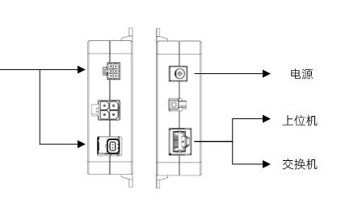{: .manual-img--xl }

图7 接口盒连接示意图

2) 通过 Wireshark 抓包，解析 ARP 报文进行本地 IP 配置

- 如上步骤，激光雷达与 PC 完成连接后，启动 **Wireshark**（第三方网络解析工具），选择正确的网口，开始抓包；

- 通过 Wireshark 的搜索框，输入 `ARP` 进行搜索激光雷达与 PC 间的互寻址报文，如图 8 所示：

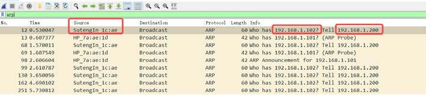{: .manual-img--xl }

图8 解析 ARP 报文

- 如 6 所示，`Source` 列中的 SutengIn 字样为激光雷达的信息源，提示 `192.168.1.200` 为 Source IP，即为激光雷达 IP，再请求访问 `192.168.1.102`，即为 PC IP。如若本地 IP 非请求访问的 IP，则需配置 PC 的本地 IP 为 `192.168.1.102` 详情操作见步骤3，如若可以正常访问，则跳转至步骤4。

3) 配置 PC 的本地 IP

- 在控制面板中，通过**网络与 Internet**进入**网络与共享中心**，在**查看活动网络**内容中，点击对应的以太网连接，进入对应的**以太网状态**，点击其中的**属性**设置；

- 双击**Internet 协议版本 4 (TCP/IPv4)**，进入 IP 信息设置，使用静态 IP 进行配置；

- 将本地 IP 地址设置为 `192.168.1.102`，子网掩码 `255.255.255.0`，点击**确认**，完成 PC 的静态 IP 设置。

4) 连接完成

🎉 激光雷达与 PC 成功建立连接，可以开始接收点云数据。

!!! info "提示说明"
    1. **时间同步模块 (gPTP)** 非出厂标配产品，如需使用相关功能，请自行购买。
    2. 以上配置本地静态 IP 仅以 **Windows** 系统操作为例，其它操作系统请以实际为准。
    3. **EM4-T** 采用静态 ARP 列表，只在雷达上电之后、还没与上位机连接之上之前发送 ARP 报文。雷达与上位机正常通讯之后如果更换上位机，雷达需要重新上电才能与新的上位机通讯。

## 4 产品使用

### 4.1 产品坐标系

车辆坐标系的定义基准如下：

- **坐标原点**：车前轴中心
- **$X$ 轴**：向前为正
- **$Y$ 轴**：向左为正
- **$Z$ 轴**：竖直向上为正

如图 9 所示：

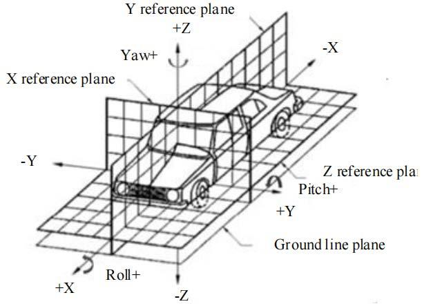{: .manual-img--xl }

图9 车辆坐标示意图

产品的坐标系原点与方向定义如下：

- **坐标原点**：LiDAR 光心
- **$X$ 轴**：向前为正
- **$Y$ 轴**：向左为正
- **$Z$ 轴**：竖直向上为正

如图 10 所示：

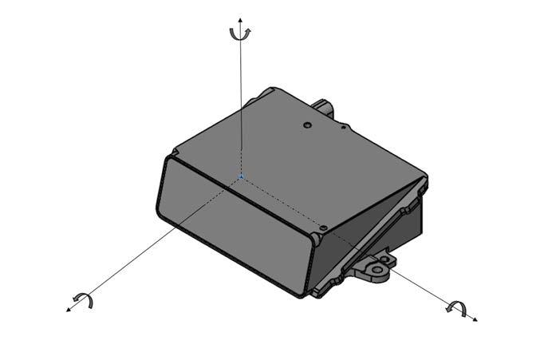{: .manual-img--xl }

图10 激光雷达坐标示意图

!!! info "空间变换提示"
    `LiDAR` 坐标系与车辆坐标系的变换关系由车身机械结构设计确认。

### 4.2 RSView 使用

在 `EM4-T` 的数据可视化方面，可以使用 `Wireshark` 和 `tcpdump` 等免费工具来捕获原始数据，而 **RSView** 可以帮助用户更方便地可视化原始数据。

#### 4.2.1 软件功能

RSView 提供了将 `EM4-T` 数据进行实时可视化的功能，其核心特性与支持格式如下：

- **数据记录与回放**：支持将实时数据记录并保存为 `.pcap` 文件格式的数据。目前软件还不支持 `.pcapng` 格式的文件。
- **多维度数据显示**：将测得的距离测量值显示为一个点（点云）。支持多种自定义颜色来显示数据，例如：反射强度、时间、距离、水平角度和激光线束序号。
- **数据导出**：所显示的数据能够导出保存为 `.csv` 格式。

**核心功能清单**

1. 通过以太网实时显示数据

2. 将实时数据记录保存为 `PCAP` 文件

3. 从记录的 `PCAP` 文件中进行回放

4. 拥有不同类型可视化模式（距离、时间、水平角度等）

5. 用表格形式显示点的具体数据

6. 将点云数据导出为 `CSV` 格式文件

7. 拥有测量距离工具

8. 支持将回放数据的连续多帧同时显示

9. 支持显示或隐藏 `EM4-T` 中个别线束（通道）

10. 支持裁剪显示

#### 4.2.2 安装 RSView

- **支持系统**：Windows 64 位、Ubuntu 18.04 及以上操作系统。
- **下载地址**：[RSView 最新版本软件安装包下载](https://www.robosense.cn/resources-143)

!!! info "重要安装须知"
    1. **路径限制**：软件的解压路径请勿出现中文字符。
    2. **无需安装**：该软件为绿色免安装版，解压后直接运行可执行文件即可正常使用。

#### 4.2.3 使用 RSView

LiDAR 与 PC 连接完成后，打开 RSView 按照以下引导步骤在线播放点云：

首先左上角菜单栏选择 `File` $\rightarrow$ `Open Sensor`

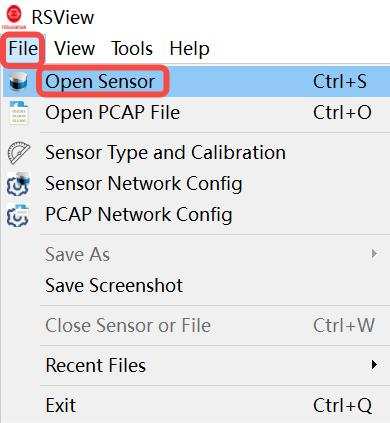{: .manual-img--xl }

在弹出的窗口中 **Sensor Type** 下拉菜单选择 `RSEM4` 确认无误后单击 `OK`

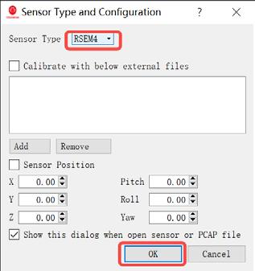{: .manual-img--xl }

在弹出的新窗口中，配置 LiDAR 的协议端口号。默认配置如下，确认后单击 `OK` 即可在线播放点云：

- **MSOP Port**（MSOP 包端口号）：默认状态下为 `6699`
- **DIFOP Port**（DIFOP2 包端口号）：默认状态下为 `7766`

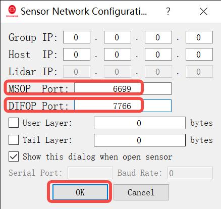

可通过 `F1` 键打开软件使用指南，或通过软件菜单栏 `Help` $\rightarrow$ `RS-LiDAR User Guide` 进行查阅。

### 4.3 通信协议

`EM4-T` 与电脑之间的通信采用**以太网**作为物理媒介，上层传输层使用 **UDP 协议**。

其输出的数据包主要分为以下三大核心类型：

-   **MSOP 数据包**

    - **固定格式**：固定长度均为 `1084 字节`

    - **压缩格式**：包长度不固定，动态拆包

-   **DIFOP1 数据包**

    协议数据包的固定长度均为 `256 字节`

-   **DIFOP2 数据包**

    协议数据包的固定长度均为 `1162 字节`

对于 MSOP 的**压缩格式**，数据包在网络传输中遵循以下拆包机制：

- 当数据包总长度大于 `1396 Bytes` 时，自动开始拆包
- 拆分后的第一个数据包长度固定为 `1320 Bytes`

**配置工具**：`EM4-T` 的网络参数（如 IP 地址、端口号等）可以通过官方提供的 `LiDARAssitant` 小工具进行快捷配置。

**工具获取**：如需获取 `LiDARAssitant` 安装包及操作说明，请直接联系技术支持部门。

!!! note "默认网络模式"
    在出厂默认情况下，设备使用 **固定 IP** 和 **固定目标端口号** 模式进行组网通信。用户在首次连接时，需将电脑网卡调整至同一网段。

`EM4-T` 与电脑之间的通信协议主要分为三类，其详细的字段映射、字节偏移及解析规范详情参见表7。

表7 产品协议一览表

<table class="packet-def-table product-protocol-table">
  <colgroup>
    <col class="pp-col-name" />
    <col class="pp-col-abbr" />
    <col class="pp-col-func" />
    <col class="pp-col-type" />
    <col class="pp-col-size" />
    <col class="pp-col-rate" />
  </colgroup>
  <thead>
    <tr>
      <th>(协议/包) 名称</th>
      <th>简写</th>
      <th>功能</th>
      <th>类型</th>
      <th>包大小</th>
      <th>每秒发送次数</th>
    </tr>
  </thead>
  <tbody>
    <tr>
      <td rowspan="4">Main data Stream Output Protocol</td>
      <td rowspan="4">MSOP</td>
      <td rowspan="4">扫描数据输出</td>
      <td rowspan="4">UDP</td>
      <td rowspan="3">固定模式：1084 Bytes</td>
      <td>NROI+单回波：24,000 次</td>
    </tr>
    <tr>
      <td>NROI+双回波：48,000 次</td>
    </tr>
    <tr>
      <td>ROI+单回波：32,000 次</td>
    </tr>
    <tr>
      <td class="protocol-size-compressed">
        压缩模式： 
        1) 不拆包，变长，上限 1396Bytes 
        2) 拆包，第一包 1320Bytes，第二包：变长
      </td>
      <td>/</td>
    </tr>
    <tr>
      <td>Device Information Output Protocol 1</td>
      <td>DIFOP1</td>
      <td>产品信息输出</td>
      <td>UDP</td>
      <td>256 Bytes</td>
      <td>DIFOP1：100 次</td>
    </tr>
    <tr>
      <td>Device Information Output Protocol 2</td>
      <td>DIFOP2</td>
      <td>产品信息输出</td>
      <td>UDP</td>
      <td>1162 Bytes</td>
      <td>DIFOP2：0.5 次</td>
    </tr>
  </tbody>
</table>

#### 4.3.1 主数据流输出协议（MSOP）

主数据流输出协议：Main data Stream Output Protocol，简称：MSOP。

I/O 类型：产品输出，电脑解析。

出厂默认端口号为 6699。

固定模式下，基本结构如图 11 所示：

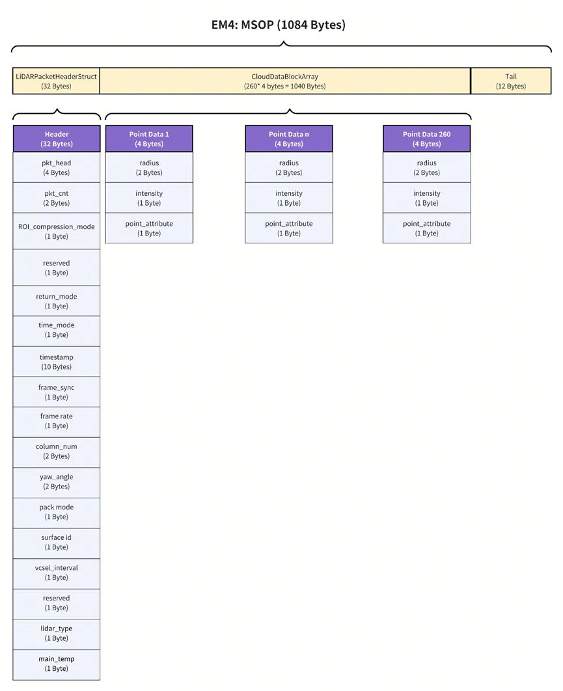{: .manual-img--xl }

图11 MSOP Packet 数据包定义示意图

详细定义见表8。

表8 MSOP 数据表

<table class="packet-def-table msop-data-table">
  <colgroup>
    <col class="msop-col-var" />
    <col class="msop-col-offset" />
    <col class="msop-col-len" />
    <col class="msop-col-content" />
  </colgroup>
  <thead>
    <tr>
      <th>变量</th>
      <th>偏置 (Byte)</th>
      <th>长度 (Byte)</th>
      <th>内容</th>
    </tr>
  </thead>
  <tbody>
    <tr>
      <td>pkt_head</td>
      <td>0</td>
      <td>4</td>
      <td class="msop-content">帧头：55aa5aa5</td>
    </tr>
    <tr>
      <td>pkt_cnt</td>
      <td>4</td>
      <td>2</td>
      <td class="msop-content">
        表示包计数，非压缩模式： 
        1.1 NROI 模式 
        单回波，包计数范围：1~2400
        *一帧点云共有 1200 列，每列分为 2 包，260 个像素封为一包，第一包和第二包分别为此列的 1-260 行和 261-520 行，以此类推。
        双回波，包计数范围：1~4800
        *一帧点云共有 1200 列，每列分为 4 包，130 个像素封为一包，第一包到第四包分别为此列的 1-130 行、131-260 行、261-390 行和 391-520 行，以此类推。
        1.2 ROI 模式 
        单回波，包计数范围：1~3200
        *一帧点云共有 1600 列，每列分为 2 包，260 个像素封为一包，第一包和第二包分别为此列的 1-260 行和 261-520 行，以此类推。
        双回波，不支持
      </td>
    </tr>
    <tr>
      <td>ROI_compression_mode</td>
      <td>6</td>
      <td>1</td>
      <td class="msop-content">0x00：非压缩 + NROI 0x01：非压缩 + ROI</td>
    </tr>
    <tr>
      <td>reserved</td>
      <td>7</td>
      <td>1</td>
      <td class="msop-content">保留</td>
    </tr>
    <tr>
      <td>return_mode</td>
      <td>8</td>
      <td>1</td>
      <td class="msop-content">0：双回波 4：最强回波 5：最后回波 6：最近回波</td>
    </tr>
    <tr>
      <td>time_mode</td>
      <td>9</td>
      <td>1</td>
      <td class="msop-content">时钟同步模式： 0x00：内部时钟 0x03：gPTP</td>
    </tr>
    <tr>
      <td>timestamp</td>
      <td>10</td>
      <td>10</td>
      <td class="msop-content">时间戳： Byte0~5：s Byte6~9：us</td>
    </tr>
    <tr>
      <td>frame_sync</td>
      <td>20</td>
      <td>1</td>
      <td class="msop-content">
        帧同步 
        0x00：没有同步 
        0x01：同步 
        同步：FOV 扫描起始时间波动小于 0.6ms，并保持 50ms 以上。
      </td>
    </tr>
    <tr>
      <td>frame rate</td>
      <td>21</td>
      <td>1</td>
      <td class="msop-content">0x0A：10Hz</td>
    </tr>
    <tr>
      <td>column_num</td>
      <td>22</td>
      <td>2</td>
      <td class="msop-content">NROI 列数：0~1199 ROI 列数：0~1599</td>
    </tr>
    <tr>
      <td>yaw_angle</td>
      <td>24</td>
      <td>2</td>
      <td class="msop-content">yaw 角度：单位为 0.01 deg</td>
    </tr>
    <tr>
      <td>pack mode</td>
      <td>26</td>
      <td>1</td>
      <td class="msop-content">压缩/非压缩模式 0x01：非压缩模式</td>
    </tr>
    <tr>
      <td>surface id</td>
      <td>27</td>
      <td>1</td>
      <td class="msop-content">当前转镜面 0x01：A 0x02：B 0x03：C 0x04：D</td>
    </tr>
    <tr>
      <td>vcsel_interval</td>
      <td>28</td>
      <td>1</td>
      <td class="msop-content">奇偶 VCSEL 分区之间的时间差有符号数，范围：-128~127us；中心值：256us</td>
    </tr>
    <tr>
      <td>reserved</td>
      <td>29</td>
      <td>1</td>
      <td class="msop-content">保留</td>
    </tr>
    <tr>
      <td>lidar_type</td>
      <td>30</td>
      <td>1</td>
      <td class="msop-content">默认值：0x70</td>
    </tr>
    <tr>
      <td>main_temp</td>
      <td>31</td>
      <td>1</td>
      <td class="msop-content">
        主 FPGA 温度 
        单位：°C 
        偏置：-80°C 
        *实际温度 = (数值 - 80)°C
      </td>
    </tr>
    <tr>
      <td>point data 1-260</td>
      <td>32</td>
      <td>1040</td>
      <td class="msop-content">
        260 像素点云数据， 
        1) 单回波：第 2m-1 (m=1,2,...,1200/1600) 包，point data n 为第 n 个像素的回波；第 2m (m=1,2,...,1200/1600) 包，point data n 为第 n+260 个像素的回波。 
        2) 双回波：第 4m-3 包 (m=1,2,...,1200)，point data 2n-1 (n=1,2,...,130) 为第 n 个像素的第一回波，point data 2n (n=1,2,...,130) 为第 n 个像素的第二回波； 
        第 4m-2 包 (m=1,2,...,1200)，point data 2n-1 (n=1,2,...,130) 为第 n+130 个像素的第一回波，point data 2n (n=1,2,...,130) 为第 n+130 个像素的第二回波； 
        第 4m-1 包 (m=1,2,...,1200)，point data 2n-1 (n=1,2,...,130) 为第 n+260 个像素的第一回波，point data 2n (n=1,2,...,130) 为第 n+260 个像素的第二回波； 
        第 4m 包 (m=1,2,...,1200)，point data 2n-1 (n=1,2,...,130) 为第 n+390 个像素的第一回波，point data 2n (n=1,2,...,130) 为第 n+390 个像素的第二回波；
      </td>
    </tr>
    <tr>
      <td>DataLength</td>
      <td>1072</td>
      <td>2</td>
      <td class="msop-content">E2E Profile4 Data Length：04 3C</td>
    </tr>
    <tr>
      <td>Counter</td>
      <td>1074</td>
      <td>2</td>
      <td class="msop-content">E2E Profile4 Counter：00 00~FF FF</td>
    </tr>
    <tr>
      <td>DataId</td>
      <td>1076</td>
      <td>4</td>
      <td class="msop-content">E2E Profile4 Data Id：00 00 0E 5D</td>
    </tr>
    <tr>
      <td>Crc32</td>
      <td>1080</td>
      <td>4</td>
      <td class="msop-content">E2E Profile4 Crc32</td>
    </tr>
  </tbody>
</table>

其中每个 point data 的详细定义见表 9：

表9 point data n 数据包定义

<table class="packet-def-table msop-data-table">
  <colgroup>
    <col class="msop-col-var" />
    <col class="msop-col-offset" />
    <col class="msop-col-len" />
    <col class="msop-col-content" />
  </colgroup>
  <thead>
    <tr>
      <th colspan="4">point data n (4 Bytes)</th>
    </tr>
    <tr>
      <th>变量</th>
      <th>偏置 (Byte)</th>
      <th>长度 (Byte)</th>
      <th>内容</th>
    </tr>
  </thead>
  <tbody>
    <tr>
      <td>radius</td>
      <td>0</td>
      <td>2</td>
      <td class="msop-content">径向距离，距离分辨率为 5mm</td>
    </tr>
    <tr>
      <td>intensity</td>
      <td>2</td>
      <td>1</td>
      <td class="msop-content">反射率，取值范围为 0~255</td>
    </tr>
    <tr>
      <td>point_attribute</td>
      <td>3</td>
      <td>1</td>
      <td class="msop-content">点的属性 0x00：正常点 0x08：雨雾噪点标记</td>
    </tr>
  </tbody>
</table>

压缩模式下，第一包和第二包 MSOP 的详细定义见表 10、表 11：

表10 第一包 MSOP 数据包定义

<table class="packet-def-table msop-data-table">
  <colgroup>
    <col class="msop-col-var" />
    <col class="msop-col-offset" />
    <col class="msop-col-len" />
    <col class="msop-col-content" />
  </colgroup>
  <thead>
    <tr>
      <th>变量</th>
      <th>偏置 (Byte)</th>
      <th>长度 (Byte)</th>
      <th>内容</th>
    </tr>
  </thead>
  <tbody>
    <tr>
      <td>pkt_head</td>
      <td>0</td>
      <td>4</td>
      <td class="msop-content">帧头：55aa5aa5</td>
    </tr>
    <tr>
      <td>pkt_cnt</td>
      <td>4</td>
      <td>2</td>
      <td class="msop-content">
        表示包计数，压缩模式下，每帧总包数不固定。 
        单回波，对每列的点云数据进行压缩，压缩后若包长度小于等于 1396Bytes，则每列对应 1 包，若包长度大于 1396Bytes，则每列对应 2 包，总包数不固定； 
        双回波，先对每列点云的第一回波进行压缩，若第一回波压缩后的数据长度小于等于 1396Bytes，则为 1 包，若包长度大于 1396Bytes，则为 2 包。然后，对第二回波进行压缩，若第二回波压缩后的数据长度小于等于 1396Bytes，则为 1 包，若包长度大于 1396Bytes，则为 2 包。
      </td>
    </tr>
    <tr>
      <td>ROI_compression_mode</td>
      <td>6</td>
      <td>1</td>
      <td class="msop-content">0x02：压缩 + NROI 0x03：压缩 + ROI</td>
    </tr>
    <tr>
      <td>Reserved</td>
      <td>7</td>
      <td>1</td>
      <td class="msop-content">保留</td>
    </tr>
    <tr>
      <td>return_mode</td>
      <td>8</td>
      <td>1</td>
      <td class="msop-content">0：双回波 4：最强回波 5：最后回波 6：最近回波</td>
    </tr>
    <tr>
      <td>time_mode</td>
      <td>9</td>
      <td>1</td>
      <td class="msop-content">时钟同步模式： 0x00：内部时钟 0x03：gPTP</td>
    </tr>
    <tr>
      <td>timestamp</td>
      <td>10</td>
      <td>10</td>
      <td class="msop-content">时间戳： Byte0~5：s Byte6~9：us</td>
    </tr>
    <tr>
      <td>frame_sync</td>
      <td>20</td>
      <td>1</td>
      <td class="msop-content">
        帧同步 
        0x00：没有同步 
        0x01：同步 
        同步：FOV 扫描起始时间波动小于 0.6ms，并保持 50ms 以上。
      </td>
    </tr>
    <tr>
      <td>frame rate</td>
      <td>21</td>
      <td>1</td>
      <td class="msop-content">0x0A：10Hz</td>
    </tr>
    <tr>
      <td>column_num</td>
      <td>22</td>
      <td>2</td>
      <td class="msop-content">NROI 列数：0~1199 ROI 列数：0~1599</td>
    </tr>
    <tr>
      <td>yaw_angle</td>
      <td>24</td>
      <td>2</td>
      <td class="msop-content">yaw 角度：单位为 0.01 deg</td>
    </tr>
    <tr>
      <td>pack mode</td>
      <td>26</td>
      <td>1</td>
      <td class="msop-content">
        bit0~3 是压缩/非压缩模式标志位： 
        3：压缩模式。 
        *对于压缩模式，包长度大于 1396Bytes，开始拆包，第一个包是 1320 Bytes，
        bit7~4 是分包标志位： 
        0：没有分包 
        1：第一包 
        2：第二包
      </td>
    </tr>
    <tr>
      <td>surface id</td>
      <td>27</td>
      <td>1</td>
      <td class="msop-content">当前转镜面 0x01：A 0x02：B 0x03：C 0x04：D</td>
    </tr>
    <tr>
      <td>vcsel_interval</td>
      <td>28</td>
      <td>1</td>
      <td class="msop-content">奇偶 VCSEL 分区之间的时间差 有符号数，范围：-128~127us；中心值：256us</td>
    </tr>
    <tr>
      <td>reserved</td>
      <td>29</td>
      <td>1</td>
      <td class="msop-content">保留</td>
    </tr>
    <tr>
      <td>lidar_type</td>
      <td>30</td>
      <td>1</td>
      <td class="msop-content">默认值：0x70</td>
    </tr>
    <tr>
      <td>main_temp</td>
      <td>31</td>
      <td>1</td>
      <td class="msop-content">
        主 FPGA 温度 
        单位：°C 
        偏置：-80°C 
        *实际温度 = (数值 - 80)°C
      </td>
    </tr>
    <tr>
      <td>point data</td>
      <td>32</td>
      <td>x(x≤1363)</td>
      <td class="msop-content">
        整列所有像素点的单个回波的径向距离 radius(2Bytes) 构成第一个压缩块，反射率 intensity 和属性 point_attribute(2Bytes) 构成第二个压缩块。 
        第一个 MSOP 包长度大于 1396Bytes，拆成两包，第一个包长度为 1320Bytes。
      </td>
    </tr>
  </tbody>
</table>

表11 第二包 MSOP 数据包定义

<table class="packet-def-table msop-data-table">
  <colgroup>
    <col class="msop-col-var" />
    <col class="msop-col-offset" />
    <col class="msop-col-len" />
    <col class="msop-col-content" />
  </colgroup>
  <thead>
    <tr>
      <th>变量</th>
      <th>偏置 (Byte)</th>
      <th>长度 (Byte)</th>
      <th>内容</th>
    </tr>
  </thead>
  <tbody>
    <tr>
      <td>pkt_head</td>
      <td>0</td>
      <td>4</td>
      <td class="msop-content">帧头：55aa5a02</td>
    </tr>
    <tr>
      <td>pkt_cnt</td>
      <td>4</td>
      <td>2</td>
      <td class="msop-content">
        表示包计数，压缩模式下，每帧总包数不固定。 
        若第一个 MSOP 包长度大于 1396Bytes，则会拆包，此时存在第二个 MSOP 包。
      </td>
    </tr>
    <tr>
      <td>reserved</td>
      <td>6</td>
      <td>2</td>
      <td class="msop-content">保留</td>
    </tr>
    <tr>
      <td>point data</td>
      <td>8</td>
      <td>y</td>
      <td class="msop-content">
        整列所有像素点的单个回波的径向距离 radius(2Bytes) 构成第一个压缩块，反射率 intensity 和属性 point_attribute (2Bytes) 构成第二个压缩块。 
        第一个 MSOP 包长度大于 1396Bytes，拆成两包，第一个包长度为 1320Bytes，第二包长度不固定。
      </td>
    </tr>
    <tr>
      <td>DataLength</td>
      <td>8+y</td>
      <td>2</td>
      <td class="msop-content">E2E Profile4 Data Length：04 3C</td>
    </tr>
    <tr>
      <td>Counter</td>
      <td>10+y</td>
      <td>2</td>
      <td class="msop-content">E2E Profile4 Counter：00 00~FF FF</td>
    </tr>
    <tr>
      <td>DataId</td>
      <td>12+y</td>
      <td>4</td>
      <td class="msop-content">E2E Profile4 Data Id：00 00 0E 5D</td>
    </tr>
    <tr>
      <td>Crc32</td>
      <td>16+y</td>
      <td>4</td>
      <td class="msop-content">E2E Profile4 Crc32</td>
    </tr>
  </tbody>
</table>

其中 point data 压缩块结构见表 12：

表12 压缩块结构

<table class="packet-def-table compression-block-table">
  <colgroup>
    <col class="cb-col-fixed" />
    <col class="cb-col-fixed" />
    <col class="cb-col-fixed" />
    <col class="cb-col-diff" />
    <col class="cb-col-diff" />
    <col class="cb-col-diff" />
    <col class="cb-col-diff" />
    <col class="cb-col-ellipsis" />
    <col class="cb-col-diff" />
    <col class="cb-col-diff" />
    <col class="cb-col-diff" />
    <col class="cb-col-diff" />
  </colgroup>
  <thead>
    <tr>
      <th>模式</th>
      <th>总长度</th>
      <th>初值</th>
      <th colspan="4">起始前向差值</th>
      <th>...</th>
      <th colspan="4">末尾前向差值</th>
    </tr>
    <tr>
      <th>2bit</th>
      <th>14bit</th>
      <th>16bit</th>
      <th>4bit</th>
      <th>4bit</th>
      <th>4bit</th>
      <th>4bit</th>
      <th>...</th>
      <th>4bit</th>
      <th>4bit</th>
      <th>4bit</th>
      <th>4bit</th>
    </tr>
  </thead>
  <tbody>
    <tr>
      <td>0</td>
      <td>1</td>
      <td>初值</td>
      <td colspan="4">-</td>
      <td>...</td>
      <td colspan="4">-</td>
    </tr>
    <tr>
      <td>1</td>
      <td>n+1</td>
      <td>初值</td>
      <td>diff_0</td>
      <td>diff_1</td>
      <td>diff_2</td>
      <td>diff_3</td>
      <td>...</td>
      <td>diff_n-4</td>
      <td>填 0</td>
      <td>填 0</td>
      <td>填 0</td>
    </tr>
    <tr>
      <td>2</td>
      <td>n+1</td>
      <td>初值</td>
      <td colspan="2">diff_0</td>
      <td colspan="2">diff_1</td>
      <td>...</td>
      <td colspan="2">diff_n-2</td>
      <td colspan="2">填 0</td>
    </tr>
    <tr>
      <td>3</td>
      <td>n+1</td>
      <td>初值</td>
      <td colspan="4">org_0</td>
      <td>...</td>
      <td colspan="4">org_n-1</td>
    </tr>
  </tbody>
</table>

#### 4.3.2 产品信息输出协议（DIFOP1&DIFOP2）

设备信息输出协议（Device Info Output Protocol，简称：**DIFOP**）属于产品输出、电脑解析的 I/O 类型。

`EM4-T` 在运行过程中会输出两种不同的 DIFOP 数据包。

| 协议类型 | 出厂默认端口号 | 发射周期 |
| :---: | :---: | :---: |
| **DIFOP1** | `7788` | `10ms` |
| **DIFOP2** | `7766` | `2s` |

!!! info "用户可以通过读取 DIFOP1 解读当前使用设备的各种参数的具体信息。"

DIFOP1 数据包中主要封装了以下核心设备参数：

- **设备基础信息**：设备序列号 ($S/N$)、固件版本信息。

- **兼容与网络**：上位机驱动兼容性信息、网络配置信息。

- **运行与诊断**：校准信息、电机运行配置、运行状态、故障诊断信息。

!!! info "用户可以通过读取 DIFOP2 帮助解析点云。"

DIFOP2 数据包中主要封装了以下核心补偿参数：

- **Pitch 角信息**：激光雷达 SPAD-SoC 每一线 ($1 \sim 520$) 对应的角度 ($pitch$) 信息。

- **Yaw 角补偿**：VCSEL 不同分区角度 ($yaw$) 的补偿信息。

- **转镜补偿**：转镜每一面的角度 ($pitch$) 补偿信息。

数据包的基本结构如表 13，14 所示。

表13 DIFOP1 数据表

<table class="packet-def-table difop-packet-table">
  <colgroup>
    <col class="difop-col-group" />
    <col class="difop-col-var" />
    <col class="difop-col-offset" />
    <col class="difop-col-len" />
    <col class="difop-col-content" />
  </colgroup>
  <thead>
    <tr>
      <th>Difop1</th>
      <th>变量</th>
      <th>偏置 (Byte)</th>
      <th>长度 (Byte)</th>
      <th>内容</th>
    </tr>
  </thead>
  <tbody>
    <tr>
      <td class="difop-group" rowspan="1">Header</td>
      <td>StatusHdr</td>
      <td>0</td>
      <td>4</td>
<td class="difop-content">0xA5FF005A</td>
    </tr>
    <tr>
      <td class="difop-group" rowspan="3">Version</td>
      <td>Reserved</td>
      <td>4</td>
      <td>20</td>
<td class="difop-content"></td>
    </tr>
    <tr>
      <td>SW Version</td>
      <td>24</td>
      <td>3</td>
<td class="difop-content"></td>
    </tr>
    <tr>
      <td>HW Version</td>
      <td>27</td>
      <td>2</td>
<td class="difop-content"></td>
    </tr>
    <tr>
      <td class="difop-group" rowspan="2">SerialNumber</td>
      <td>IntSN</td>
      <td>29</td>
      <td>6</td>
<td class="difop-content"></td>
    </tr>
    <tr>
      <td>CusSN</td>
      <td>35</td>
      <td>16</td>
<td class="difop-content">Customer SN</td>
    </tr>
    <tr>
      <td class="difop-group" rowspan="6">WorkInformation</td>
      <td>Reserved</td>
      <td>51</td>
      <td>1</td>
<td class="difop-content"></td>
    </tr>
    <tr>
      <td>FrameRate</td>
      <td>52</td>
      <td>1</td>
<td class="difop-content">0x0A：10Hz</td>
    </tr>
    <tr>
      <td>WaveMode</td>
      <td>53</td>
      <td>1</td>
<td class="difop-content">0x00：DoubleWave 0x04：StrongestWave</td>
    </tr>
    <tr>
      <td>Reserved</td>
      <td>54</td>
      <td>10</td>
<td class="difop-content"></td>
    </tr>
    <tr>
      <td>Lidar_Heater_Status</td>
      <td>64</td>
      <td>1</td>
<td class="difop-content">bit0：Lidar_Heater_Switch 0b0：Heating off 0b1：Heating on bit1-7：Reserved</td>
    </tr>
    <tr>
      <td>Reserved</td>
      <td>65</td>
      <td>24</td>
<td class="difop-content"></td>
    </tr>
    <tr>
      <td class="difop-group" rowspan="3">TimeSyncInformation</td>
      <td>TimesyncMode</td>
      <td>89</td>
      <td>1</td>
<td class="difop-content">0x00：internal local timer 0x03：gPTP timer</td>
    </tr>
    <tr>
      <td>TimesyncStatus</td>
      <td>90</td>
      <td>1</td>
<td class="difop-content">0x00：failed 0x01：Success 0x02：Timeout</td>
    </tr>
    <tr>
      <td>TimeStamp</td>
      <td>91</td>
      <td>10</td>
<td class="difop-content">0-5 bytes：Second 6-9 bytes：MicroSecond</td>
    </tr>
    <tr>
      <td class="difop-group" rowspan="16">NetParameter</td>
      <td>PhyMasterSlaveMode</td>
      <td>101</td>
      <td>1</td>
<td class="difop-content">0x02：slave</td>
    </tr>
    <tr>
      <td>SrcIP</td>
      <td>102</td>
      <td>4</td>
<td class="difop-content">192.168.1.200</td>
    </tr>
    <tr>
      <td>NetMask</td>
      <td>106</td>
      <td>4</td>
<td class="difop-content">255.255.255.0</td>
    </tr>
    <tr>
      <td>MacAddress</td>
      <td>110</td>
      <td>6</td>
<td class="difop-content"></td>
    </tr>
    <tr>
      <td>MsopDstIp</td>
      <td>116</td>
      <td>4</td>
<td class="difop-content">192.168.1.102</td>
    </tr>
    <tr>
      <td>MsopSrcPort</td>
      <td>120</td>
      <td>2</td>
<td class="difop-content">6699</td>
    </tr>
    <tr>
      <td>MsopDstPort</td>
      <td>122</td>
      <td>2</td>
<td class="difop-content">6699</td>
    </tr>
    <tr>
      <td>Difop1DstIp</td>
      <td>124</td>
      <td>4</td>
<td class="difop-content">192.168.1.102</td>
    </tr>
    <tr>
      <td>Difop1SrcPort</td>
      <td>128</td>
      <td>2</td>
<td class="difop-content">7788</td>
    </tr>
    <tr>
      <td>Difop1DstPort</td>
      <td>130</td>
      <td>2</td>
<td class="difop-content">7788</td>
    </tr>
    <tr>
      <td>Difop2DstIp</td>
      <td>132</td>
      <td>4</td>
<td class="difop-content">192.168.1.102</td>
    </tr>
    <tr>
      <td>Difop2SrcPort</td>
      <td>136</td>
      <td>2</td>
<td class="difop-content">7766</td>
    </tr>
    <tr>
      <td>Difop2DstPort</td>
      <td>138</td>
      <td>2</td>
<td class="difop-content">7766</td>
    </tr>
    <tr>
      <td>DoIPDstIp</td>
      <td>140</td>
      <td>4</td>
<td class="difop-content">192.168.1.102</td>
    </tr>
    <tr>
      <td>DoIPSrcPort</td>
      <td>144</td>
      <td>2</td>
<td class="difop-content">13400</td>
    </tr>
    <tr>
      <td>Reserved</td>
      <td>146</td>
      <td>10</td>
<td class="difop-content"></td>
    </tr>
    <tr>
      <td class="difop-group" rowspan="31">Voltage &amp; Temp</td>
      <td>MCU_VMON_RX_D1V1</td>
      <td>156</td>
      <td>2</td>
<td class="difop-content"></td>
    </tr>
    <tr>
      <td>MCU_VMON_F_1V0</td>
      <td>158</td>
      <td>2</td>
<td class="difop-content"></td>
    </tr>
    <tr>
      <td>MCU_VMON_F_1V8</td>
      <td>160</td>
      <td>2</td>
<td class="difop-content"></td>
    </tr>
    <tr>
      <td>MCU_VMON_F_2V5</td>
      <td>162</td>
      <td>2</td>
<td class="difop-content"></td>
    </tr>
    <tr>
      <td>MCU_VMON_M_3V3</td>
      <td>164</td>
      <td>2</td>
<td class="difop-content"></td>
    </tr>
    <tr>
      <td>MCU_VMON_A_3V3</td>
      <td>166</td>
      <td>2</td>
<td class="difop-content"></td>
    </tr>
    <tr>
      <td>MCU_VMON_WAKE_EXT</td>
      <td>168</td>
      <td>2</td>
<td class="difop-content"></td>
    </tr>
    <tr>
      <td>MCU_IMON_WINDOW</td>
      <td>170</td>
      <td>2</td>
<td class="difop-content"></td>
    </tr>
    <tr>
      <td>MCU_VMON_WINDOW</td>
      <td>172</td>
      <td>2</td>
<td class="difop-content"></td>
    </tr>
    <tr>
      <td>MCU_VMOM_SYS_5V</td>
      <td>174</td>
      <td>2</td>
<td class="difop-content"></td>
    </tr>
    <tr>
      <td>MCU_VMOM_VIN</td>
      <td>176</td>
      <td>2</td>
<td class="difop-content"></td>
    </tr>
    <tr>
      <td>PL_VMOM_M_1V2</td>
      <td>178</td>
      <td>2</td>
<td class="difop-content"></td>
    </tr>
    <tr>
      <td>PL_VMON_CHG</td>
      <td>180</td>
      <td>2</td>
<td class="difop-content"></td>
    </tr>
    <tr>
      <td>PL_VMON_VOP</td>
      <td>182</td>
      <td>2</td>
<td class="difop-content"></td>
    </tr>
    <tr>
      <td>RX_VT4_N</td>
      <td>184</td>
      <td>2</td>
<td class="difop-content"></td>
    </tr>
    <tr>
      <td>RX_3V3</td>
      <td>186</td>
      <td>2</td>
<td class="difop-content"></td>
    </tr>
    <tr>
      <td>Res3</td>
      <td>188</td>
      <td>4</td>
<td class="difop-content"></td>
    </tr>
    <tr>
      <td>TEMP_RX_Sensor</td>
      <td>192</td>
      <td>1</td>
<td class="difop-content">Phy = INT-100，单位℃</td>
    </tr>
    <tr>
      <td>TEMP_FPGA1</td>
      <td>193</td>
      <td>1</td>
<td class="difop-content">Phy = INT-100，单位℃</td>
    </tr>
    <tr>
      <td>TEMP_MCU</td>
      <td>194</td>
      <td>1</td>
<td class="difop-content">Phy = INT-100，单位℃</td>
    </tr>
    <tr>
      <td>TEMP_MOTOR</td>
      <td>195</td>
      <td>1</td>
<td class="difop-content">Phy = INT-100，单位℃</td>
    </tr>
    <tr>
      <td>TEMP_FPGA2</td>
      <td>196</td>
      <td>1</td>
<td class="difop-content">Phy = INT-100，单位℃</td>
    </tr>
    <tr>
      <td>TEMP_TXR1</td>
      <td>197</td>
      <td>1</td>
<td class="difop-content">Phy = INT-100，单位℃</td>
    </tr>
    <tr>
      <td>TEMP_RX</td>
      <td>198</td>
      <td>1</td>
<td class="difop-content">Phy = INT-100，单位℃</td>
    </tr>
    <tr>
      <td>TEMP_WINDOW</td>
      <td>199</td>
      <td>1</td>
<td class="difop-content">Phy = INT-100，单位℃</td>
    </tr>
    <tr>
      <td>TEMP_TXR2</td>
      <td>200</td>
      <td>1</td>
<td class="difop-content">Phy = INT-100，单位℃</td>
    </tr>
    <tr>
      <td>Reserved</td>
      <td>201</td>
      <td>5</td>
<td class="difop-content"></td>
    </tr>
    <tr>
      <td>Humidity_Sensor_Value</td>
      <td>206</td>
      <td>1</td>
<td class="difop-content">Phy = INT*1，单位%</td>
    </tr>
    <tr>
      <td>Temperature_Sensor_Value</td>
      <td>207</td>
      <td>1</td>
<td class="difop-content">Phy = INT-100，单位℃</td>
    </tr>
    <tr>
      <td>Dew_Point</td>
      <td>208</td>
      <td>1</td>
<td class="difop-content">Phy = INT-100，单位℃</td>
    </tr>
    <tr>
      <td>Reserved</td>
      <td>209</td>
      <td>7</td>
<td class="difop-content"></td>
    </tr>
    <tr>
      <td class="difop-group" rowspan="7">Fault</td>
      <td>Internal_Power_Supply_Fault</td>
      <td>216</td>
      <td>3</td>
<td class="difop-content"></td>
    </tr>
    <tr>
      <td>LiDAR_Temperature_Fault</td>
      <td>219</td>
      <td>3</td>
<td class="difop-content"></td>
    </tr>
    <tr>
      <td>Internal_Software_Fault</td>
      <td>222</td>
      <td>3</td>
<td class="difop-content"></td>
    </tr>
    <tr>
      <td>Internal_Performance_Fault</td>
      <td>225</td>
      <td>4</td>
<td class="difop-content"></td>
    </tr>
    <tr>
      <td>LidarFunctionFault</td>
      <td>229</td>
      <td>1</td>
<td class="difop-content">bit0：Window_Blockage_Error 0b0：False 0b1：True bit1：gPTP_Sync_Error 0b0：False 0b1：True bit2-7：Reserved</td>
    </tr>
    <tr>
      <td>ExtPowerSupplyFault</td>
      <td>230</td>
      <td>1</td>
<td class="difop-content">bit0：Battery_High 0b0：False 0b1：True bit1：Battery_Low 0b0：False 0b1：True bit2-7：Reserved</td>
    </tr>
    <tr>
      <td>External_Communication_Fault</td>
      <td>231</td>
      <td>2</td>
<td class="difop-content"></td>
    </tr>
    <tr>
      <td class="difop-group" rowspan="1">FaultStatus</td>
      <td>Reserved</td>
      <td>233</td>
      <td>11</td>
<td class="difop-content"></td>
    </tr>
    <tr>
      <td class="difop-group" rowspan="4">E2E</td>
      <td>DataLength</td>
      <td>244</td>
      <td>2</td>
<td class="difop-content">0x0100</td>
    </tr>
    <tr>
      <td>Counter</td>
      <td>246</td>
      <td>2</td>
<td class="difop-content">0x0000-0xFFFF</td>
    </tr>
    <tr>
      <td>DataId</td>
      <td>248</td>
      <td>4</td>
<td class="difop-content">0x00000E5C</td>
    </tr>
    <tr>
      <td>Crc32</td>
      <td>252</td>
      <td>4</td>
<td class="difop-content"></td>
    </tr>
  </tbody>
</table>

表14 DIFOP2 数据表

<table class="packet-def-table difop-packet-table">
  <colgroup>
    <col class="difop-col-group" />
    <col class="difop-col-var" />
    <col class="difop-col-offset" />
    <col class="difop-col-len" />
    <col class="difop-col-content" />
  </colgroup>
  <thead>
    <tr>
      <th>Difop2</th>
      <th>变量</th>
      <th>偏置 (Byte)</th>
      <th>长度 (Byte)</th>
      <th>内容</th>
    </tr>
  </thead>
  <tbody>
    <tr>
      <td class="difop-group" rowspan="1">Header</td>
      <td>InfoHdr</td>
      <td>0</td>
      <td>4</td>
<td class="difop-content">0xA5FF00AE</td>
    </tr>
    <tr>
      <td class="difop-group" rowspan="1">Reserved</td>
      <td>Reserved</td>
      <td>4</td>
      <td>63</td>
<td class="difop-content"></td>
    </tr>
    <tr>
      <td class="difop-group" rowspan="7">AngleInformation</td>
      <td>SurfaceCnt</td>
      <td>67</td>
      <td>1</td>
<td class="difop-content">0x04</td>
    </tr>
    <tr>
      <td>HalfVcselPixelCnt</td>
      <td>68</td>
      <td>1</td>
<td class="difop-content">0x14</td>
    </tr>
    <tr>
      <td>HalfVcselCnt</td>
      <td>69</td>
      <td>1</td>
<td class="difop-content">0x1A</td>
    </tr>
    <tr>
      <td>HalfVcselYawOffset</td>
      <td>70</td>
      <td>26</td>
<td class="difop-content">byte0-1：vcsel 1 ... byte24-25：vcsel 13</td>
    </tr>
    <tr>
      <td>PixelPitch[1~520]</td>
      <td>96</td>
      <td>1040</td>
<td class="difop-content">byte0-1：pixel 1 pitch ... byte1038-1039：pixel 520 pitch</td>
    </tr>
    <tr>
      <td>SurfacePitchOffset</td>
      <td>1136</td>
      <td>8</td>
<td class="difop-content">byte0~1：镜面 A byte2~3：镜面 B byte4~5：镜面 C byte6~7：镜面 D</td>
    </tr>
    <tr>
      <td>Reserved</td>
      <td>1144</td>
      <td>6</td>
<td class="difop-content"></td>
    </tr>
    <tr>
      <td class="difop-group" rowspan="4">E2E</td>
      <td>DataLength</td>
      <td>1150</td>
      <td>2</td>
<td class="difop-content"></td>
    </tr>
    <tr>
      <td>Counter</td>
      <td>1152</td>
      <td>2</td>
<td class="difop-content">0x0000~FFFF</td>
    </tr>
    <tr>
      <td>DataId</td>
      <td>1154</td>
      <td>4</td>
<td class="difop-content">0x00005AA5</td>
    </tr>
    <tr>
      <td>Crc32</td>
      <td>1158</td>
      <td>4</td>
<td class="difop-content"></td>
    </tr>
  </tbody>
</table>

### 4.4 点云解析说明

`EM4-T` 通过解析 `MSOP` 包中的 `timestamp` 字段得到时间戳信息，总长度为 10 个字节：

**前 6 个字节**为 s 表示从 `1970-01-01 00:00:00` (UTC 时间) 开始的秒数。

**后 4 个字节**为 us 存储微秒数 ($0 \sim 999999$)。

读取时间后先将 16 进制数转化为 10 进制秒数，以 `1970-01-01 00:00:00` 为基数计算出 UTC 时间，再加上所在时区的时差计算出真实的时间。

同一列 `VCSEL` 的奇偶分区时间不同，时间戳表示同一列全部完成检测的时间，即偶数分区像素点的时间，`EM4-T` 解析 `MSOP` 包中的 `vcsel_interval` 字段得到奇偶 `VCSEL` 分区之间的时间差，格式为 1 个字节的有符号数（补码），范围为 $-128 \sim 127\mu\text{s}$，中心值为 $256\mu\text{s}$，偶数分区时间减去时间差得到奇数分区时间。

$$
\text{偶数分区时间} = \text{timestamp}
$$

$$
\text{奇数分区时间} = \text{timestamp} - (256\mu\text{s} + \text{vcsel_interval})
$$

!!! example "示例"
    已知条件：
    
    1. 某一 `MSOP` 包中的 `timestamp` 字段读取值为：`00 00 00 68 7E 7F 12 00 00 00 64`
    
    2. `vcsel_interval` 字段读取值为：`01 00 00 11`

    计算步骤：

    1. `timestamp` 前 6 位十六进制数转十进制数得到 1754393106s，后 4 位十六进制数转十进制数得到 100us

    2. 以 `1970-01-01 00:00:00` 为基数推算 1754393106 秒后为 `2025-08-04 11:25:06`。假设所在时区为 UTC+8 北京时间，真实可读时间为 `2025-08-04 19:25:06`，零 100us。即该 `MSOP` 包中偶数 VCSEL 分区像素点的时间为：`2025-08-04 19:25:06，零 100us`

    3. `vcsel_interval` 字段转换为有符号的十进制数为 -67us

    4. 根据公式 $100\mu\text{s} + 256\mu\text{s} - 67\mu\text{s}$ 得到 289us。即该 `MSOP` 包中奇数 VCSEL 分区像素点的时间为：`2025-08-04 19:25:05，零 811us`

`EM4-T` 通过解析 `MSOP` 包中某一像素点的 `intensity` 字段可以得到该字段反射率信息，输出形式为反射率分区，范围为 $0 \sim 255$。**分区数字越小，反射率越小，反之亦然。**

!!! example "示例"

    某一 `MSOP` 包中第二个像素点的 `intensity` 字段读取值为 `6E`；

    十六进制 `6E` 转换为十进制为 **110**，表示第二个像素点的反射率在 **110 分区**。

- **Yaw 角 ($\theta$)**：`EM4-T` 通过解析 `MSOP` 包中 `yaw_angle` 字段（补码形式），根据 `DIFOP2` 包中 `HalfVcselYawOffset` 字段（补码形式）补偿修正得到 yaw 角 ($\theta$)，单位为 **0.01°**
- **径向距离 ($r$)**：解析 `MSOP` 包中某一像素点的 `radius` 字段得到径向距离 $r$，单位为 **mm**
- **像素间距 (PixelPitch)**：解析 `DIFOP2` 包中对应像素点的 `PixelPitch` 字段（补码形式），根据 `SurfacePitchOffset` 字段（补码形式）补偿修正得到 Pitch 角 ($\varphi$) 信息，单位为 **0.01°**

第 $j$ ($j = \text{A, B, C, D}$) 转镜面上第 $n$ 列第 $i$ 个像素点的 $yaw(j, i)$ 和 $pitch(j, i)$ 等于：

$$
yaw(j, i) = yaw\_angle + \text{HalfVcselYawOffset}([i/20]+1)
$$

$$
Pitch(j, i) = \text{PixelPitch}(i) + \text{SurfacePitchOffset}(j)
$$

得到笛卡尔坐标系下 $x$、$y$、$z$ 坐标，坐标转换如图 12 所示：

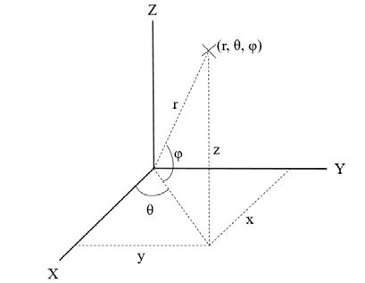{: .manual-img--xl }

图12 点云坐标示意图

计算公式和示例如下:

$$
\begin{aligned}
x &= r * \cos(pitch) * \cos(yaw) \\
y &= r * \cos(pitch) * \sin(yaw) \\
z &= r * \sin(pitch)
\end{aligned}
$$

!!! example "示例"
    已知条件：

    - A 转镜面某一 `MSOP` 包中 `yaw_angle` 字段读取值为：`15 50`

    - 第 22 个像素点的 `radius` 字段读取值为：`00 03 9E A5`

    - `DIFOP2` 包中 `HalfVcselYawOffset` 第二分区对应 Byte2-3 读取值为：`FF FD`

    - `PixelPitch` 字段中第 22 个像素对应 Byte42-43 读取值为：`F9 F6`

    - `SurfacePitchOffset` 字段中镜面 A 对应 Byte0-1 读取值为：`00 0F`

    参数转换（十六进制补码转十进制）：

    - 十六进制数补码 `15 50` 转十进制数为 $+5456$，`FF FD` 转十进制数为 $-3$ (单位 0.01°) 则 $yaw \text{ 角} = 54.53^\circ$

    - 十六进制数 `00 03 9E A5` 转十进制数为 $263,197\text{ mm}$ 则径向距离 $r = 263.197\text{ m}$

    - 十六进制数 `F9 F6` 转十进制为 $-1546$，`00 0F` 转十进制数为 $+15$ 则 $pitch \text{ 角} = -15.31^\circ$

    计算该像素点的 $(x, y, z)$ 坐标信息如下：

    $$
    x = 263.197 * \cos(-15.31^\circ) * \cos(54.53^\circ) = 147.31\text{ m}
    $$

    $$
    y = 263.197 * \cos(-15.31^\circ) * \sin(54.53^\circ) = 206.75\text{ m}
    $$

    $$
    z = 263.197 * \sin(-15.31^\circ) = -69.49\text{ m}
    $$

## 5 故障诊断

本章列举了部分在使用产品的过程中常见的问题以及对应的问题排查方法，详情参见表 15。

表15 常见故障排查方法表

<table class="packet-def-table fault-troubleshoot-table">
  <colgroup>
    <col class="fault-col-phenomenon" />
    <col class="fault-col-solution" />
  </colgroup>
  <thead>
    <tr>
      <th>故障现象</th>
      <th>解决方法</th>
    </tr>
  </thead>
  <tbody>
    <tr>
      <td>接口盒上面红/绿色指示灯不亮/闪烁</td>
      <td>检查接口盒与电源端的连接线是否松动； 检查线束是否破损。</td>
    </tr>
    <tr>
      <td>产品在启动时不断重启</td>
      <td>
        检查输入电源连接和极性是否正常； 
        检查输入电源的电压和电流是否满足要求（12 V 电压输入条件下，输入电流≥2 A）；
      </td>
    </tr>
    <tr>
      <td>Wireshark 可以收到数据但是 RSView 不显示点云</td>
      <td>
        关闭电脑防火墙，并且运行 RSView 通过防火墙； 
        确认电脑的 IP 配置和产品设置的目的地址一致； 
        确认 RSView 中 Sensor Network Configuration 设置正确； 
        确认 RSView 安装目录或配置文件存放目录不包含任何中文字符； 
        确认 Wireshark 中收到的数据包是 MSOP 类型的包。
      </td>
    </tr>
    <tr>
      <td>产品存在频发的数据丢失</td>
      <td>
        确认网络中是否有大量的其它网络数据包或网络冲突； 
        确认网络中是否存在其它网络产品以广播模式发送大量数据造成传感器数据阻塞； 
        确认电脑的性能和接口性能是否满足要求； 
        移除其它所有网络产品，直连电脑确认是否存在丢包现象。
      </td>
    </tr>
    <tr>
      <td>无法同步 gPTP 时间</td>
      <td>
        确认雷达固件是否与需要的同步模式匹配； 
        在 gPTP 时间同步方式下： 
        确认 gPTP Master 同步协议是否符合当前 gPTP 协议； 
        确认 gPTP Master 是否正常工作。
      </td>
    </tr>
    <tr>
      <td>产品通过路由器后无数据输出</td>
      <td>关闭路由器的 DHCP 功能或在路由器内部设置传感器的 IP 为正确的 IP。</td>
    </tr>
  </tbody>
</table>

## 6 产品维护

--8<-- "snippets/product-maintenance.md"

## 7 售后

--8<-- "snippets/after-sales.md"

## 附录A  TE 接头 Pin 脚定义

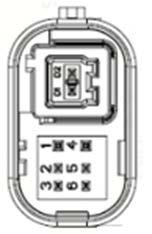{: .manual-img--xl }

<table class="packet-def-table connector-pin-table">
  <colgroup>
    <col class="connector-col-pin" />
    <col class="connector-col-def" />
    <col class="connector-col-model" />
  </colgroup>
  <thead>
    <tr>
      <th colspan="3">接插件引脚定义</th>
    </tr>
    <tr>
      <th>Pin 号</th>
      <th>定义</th>
      <th>连接器型号</th>
    </tr>
  </thead>
  <tbody>
    <tr>
      <td>1</td>
      <td>VBat</td>
      <td rowspan="8">TE 2397179-1</td>
    </tr>
    <tr>
      <td>2</td>
      <td>Wakeup</td>
    </tr>
    <tr>
      <td>3</td>
      <td>/</td>
    </tr>
    <tr>
      <td>4</td>
      <td>GND</td>
    </tr>
    <tr>
      <td>5</td>
      <td>/</td>
    </tr>
    <tr>
      <td>6</td>
      <td>/</td>
    </tr>
    <tr>
      <td>D1</td>
      <td>1000BASE-T1 N</td>
    </tr>
    <tr>
      <td>D2</td>
      <td>1000BASE-T1 P</td>
    </tr>
  </tbody>
</table>

{: .manual-img--xl }
