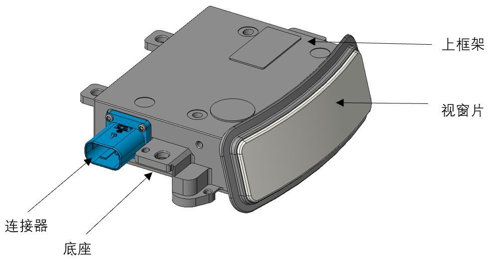
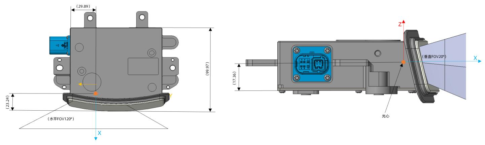
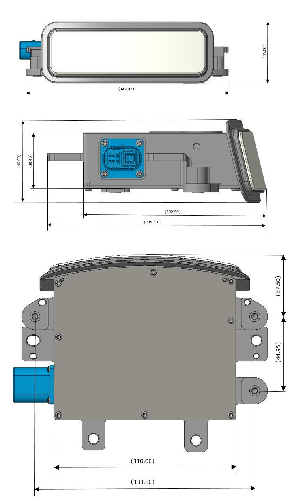
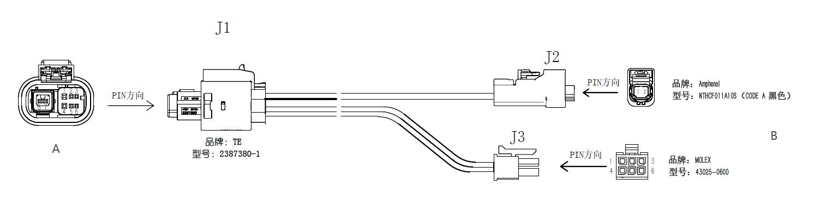
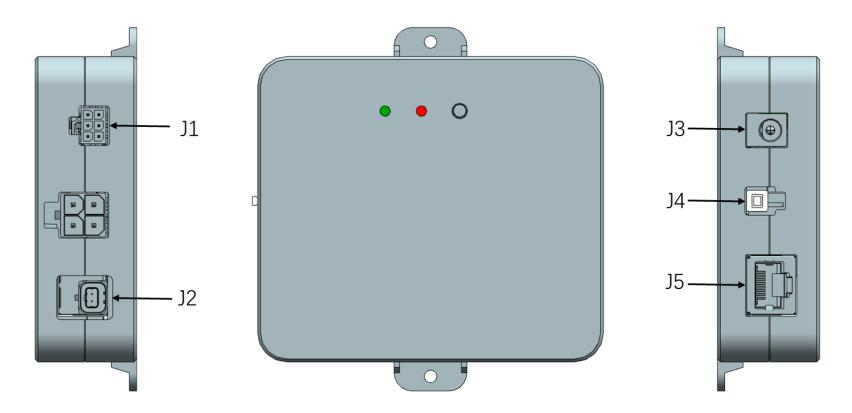
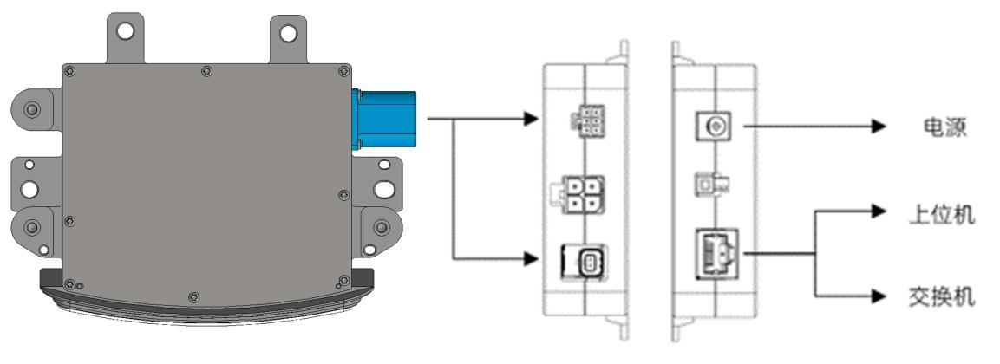
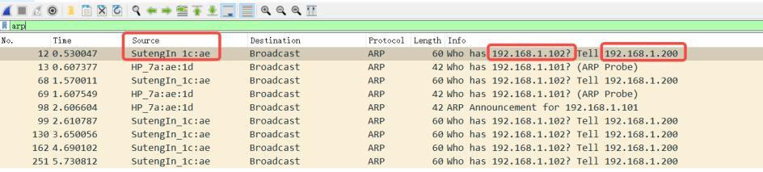
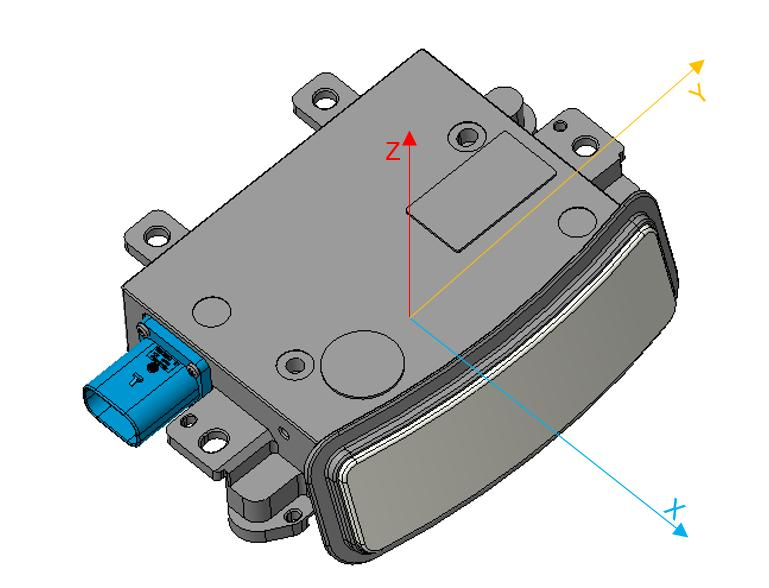
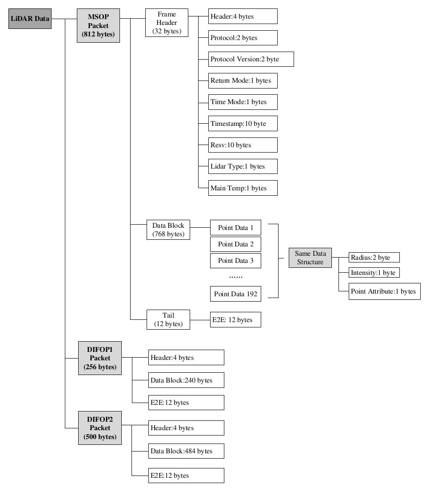
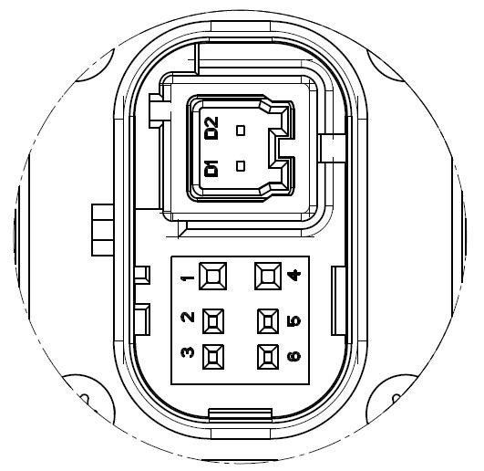

# EMX 产品手册

{: .manual-img--xl }

## 1 安全提示

--8<-- "snippets/safety-reminder.md"

## 2 产品描述

!!! info "以下内容描述 EMX B0 样机的状态和功能，后续新版本样机推出后将同步更新产品手册至最新状态。"

### 2.1 产品概要

EMX 是 RoboSense 新一代 192 线车载高性能数字化激光雷达，提供 192 线/每秒 288 万点的高清点云，全局角度分辨率 0.1*0.1°，最远测距可达 200m@10%。

### 2.2 产品结构

EMX 结构示意如图 1 所示，坐标原点位置如图 2 所示。

{: .manual-img--xl }

图1 产品结构说明图（单位：mm）

{: .manual-img--xl }

图2 坐标原点位置(单位: mm)

### 2.3 规格参数

表1 相关参数规格

<table class="manual-spec-grid-table">
  <tbody>
    <tr class="section-head">
      <th colspan="4">传感器</th>
    </tr>
    <tr>
      <td class="spec-label">测距能力1</td>
      <td class="spec-value">1.5m 至 200m (200m@10%NIST)</td>
      <td class="spec-label">精度2（典型值）</td>
      <td class="spec-value">±5 cm@1σ</td>
    </tr>
    <tr>
      <td class="spec-label">水平视场角</td>
      <td class="spec-value">120° (-60° ~ +60°)</td>
      <td class="spec-label">水平角分辨率</td>
      <td class="spec-value">0.08°</td>
    </tr>
    <tr>
      <td class="spec-label">垂直视场角</td>
      <td class="spec-value">20° (-12° ~ +8°)</td>
      <td class="spec-label">垂直角分辨率</td>
      <td class="spec-value">0.1°</td>
    </tr>
    <tr>
      <td class="spec-label">帧率</td>
      <td class="spec-value">10 Hz</td>
      <td class="spec-label">盲区</td>
      <td class="spec-value">≤1.5m</td>
    </tr>
    <tr class="section-head">
      <th colspan="4">输出</th>
    </tr>
    <tr>
      <td class="spec-label">以太网输出</td>
      <td class="spec-value" colspan="3">1000Base-T1</td>
    </tr>
    <tr>
      <td class="spec-label">输出数据协议</td>
      <td class="spec-value" colspan="3">UDP packets over Ethernet</td>
    </tr>
    <tr>
      <td class="spec-label">激光雷达数据包内容</td>
      <td class="spec-value" colspan="3">三维空间坐标、反射强度、时间戳等</td>
    </tr>
    <tr>
      <td class="spec-label">出点数</td>
      <td class="spec-value" colspan="3">约 288 万/s (单回波模式)</td>
    </tr>
    <tr>
      <td class="spec-label">出点数传输带宽</td>
      <td class="spec-value" colspan="3">约 97.4Mbps (单回波模式)</td>
    </tr>
    <tr class="section-head">
      <th colspan="4">机械/电子操作</th>
    </tr>
    <tr>
      <td class="spec-label">工作电压</td>
      <td class="spec-value">9V~16VDC</td>
      <td class="spec-label">尺寸</td>
      <td class="spec-value">深 102.5mm * 宽 110mm * 高 30.4mm (冻结)</td>
    </tr>
    <tr>
      <td class="spec-label">产品功率3</td>
      <td class="spec-value">10W (典型值)</td>
      <td class="spec-label">工作温度4</td>
      <td class="spec-value">-40℃ ~ +85℃</td>
    </tr>
    <tr>
      <td class="spec-label">重量</td>
      <td class="spec-value">500g±20g (不含数据线)</td>
      <td class="spec-label">存储温度</td>
      <td class="spec-value">-40℃ ~ +105℃</td>
    </tr>
    <tr>
      <td class="spec-label">时间同步</td>
      <td class="spec-value">gPTP (默认) PTP</td>
      <td class="spec-label">防护等级</td>
      <td class="spec-value">IP67/IP6K9K</td>
    </tr>
    <tr>
      <td class="spec-label">唤醒方式</td>
      <td class="spec-value" colspan="3">1pin 硬线唤醒（提供 0-2V 低电平雷达休眠，7-12V 高电平雷达唤醒）</td>
    </tr>
  </tbody>
</table>

## 3 产品安装

### 3.1 机械安装

激光雷达的结构安装示意图如图 3 所示。

{: .manual-img--xl }

图3 激光雷达结构安装示意图

### 3.2 LiDAR 接线及接口说明

#### 3.2.1 车载以太网线束接口及定义

EMX 使用 1 个车载以太网、电源二合一接头，配套线束如图 4 所示。

{: .manual-img--xl }

图4 车载以太网电源线束

EMX 车载以太网电源线束接头及引脚定义见表 2

表2 车载以太网电源线束接口定义

<table class="wire-harness-table">
  <colgroup>
    <col class="wh-col-a" />
    <col class="wh-col-pin" />
    <col class="wh-col-def" />
    <col class="wh-col-b" />
    <col class="wh-col-pin" />
  </colgroup>
  <thead>
    <tr>
      <th colspan="2">A 端线序</th>
      <th>定义</th>
      <th colspan="2">B 端线序</th>
    </tr>
  </thead>
  <tbody>
    <tr>
      <td class="wh-connector" rowspan="8">J1 (TE 2387380-1)</td>
      <td>1</td>
      <td>GND</td>
      <td class="wh-connector" rowspan="6">J3 (Molex 43025-0600)</td>
      <td>1</td>
    </tr>
    <tr>
      <td>2</td>
      <td>Wakeup</td>
      <td>6</td>
    </tr>
    <tr>
      <td>3</td>
      <td>/</td>
      <td>3</td>
    </tr>
    <tr>
      <td>4</td>
      <td>Baterry+</td>
      <td>2</td>
    </tr>
    <tr>
      <td>5</td>
      <td>/</td>
      <td>4</td>
    </tr>
    <tr>
      <td>6</td>
      <td>/</td>
      <td>5</td>
    </tr>
    <tr>
      <td>7</td>
      <td>1000BASE-T1 N</td>
      <td class="wh-connector" rowspan="2">J2 (Amphenol NTHCF011A10S)</td>
      <td>1</td>
    </tr>
    <tr>
      <td>8</td>
      <td>1000BASE-T1 P</td>
      <td>2</td>
    </tr>
  </tbody>
</table>

#### 3.2.2 接口盒接口

{: .manual-img--xl }

图5 接口盒示意图

EMX 附件接口盒具有电源指示灯及各类的接口，如图 5 所示，可接驳电源输入、RJ45 网口。

表3 接口盒接口定义

| 连接器 | 规格/型号 | 说明 |
| --- | --- | --- |
| J1 | MOLEX 43045-0600 | 给雷达供电及输出唤醒信号 |
| J2 | Amphenol NTBM11R1U01110T | 1000BASE-T1 车载以太网接口 |
| J3 | DC Power 连接器 | 电源输入 |
| J4 | 按键开关 | 唤醒信号控制开关，开关按下时唤醒信号接通 |
| J5 | RJ45 | 1000BASE-TX 工业以太网 |

#### 3.2.3 电源接口

EMX 接口盒电源使用标准 DC 5.5-2.1 接口。

电源正常输入时，电源盒绿色指示灯常亮。当绿色指示灯熄灭，请检查电源输入是否正常，若电源输入正常，即接口盒可能已损坏，请联系 RoboSense

#### 3.2.4 RJ45 网口

EMX 本体只支持 1000BASE-T1 车载以太网。接口盒只支持千兆以太网，使用接口盒时网络接口使用标准 RJ45 接口。

### 3.3 快速连接

EMX 网络参数可配置, 出厂默认采用固定 IP 和端口号模式, 详情参见表 4

表4 出厂默认网络配置表

<table class="manual-network-table manual-network-table--four-col">
  <colgroup>
    <col class="net-col-device" />
    <col class="net-col-ip" />
    <col class="net-col-port" />
    <col class="net-col-port" />
  </colgroup>
  <thead>
    <tr>
      <th>设备</th>
      <th>IP 地址</th>
      <th>MSOP 包端 口号</th>
      <th>DIFOP 包端 口号</th>
    </tr>
  </thead>
  <tbody>
    <tr>
      <td>EMX</td>
      <td>192.168.1.200</td>
      <td rowspan="2">6699</td>
      <td rowspan="2">7788</td>
    </tr>
    <tr>
      <td>电脑</td>
      <td>192.168.1.102</td>
    </tr>
  </tbody>
</table>

用户使用产品时，需要把电脑的 IP 设置为与产品同一网段上，例如 192.168.1.x(x 的取值范围为 1~254)，子网掩码为 255.255.255.0

未知产品网络配置信息，请连接产品并使用 Wireshark 抓取产品输出包进行分析。配置 IP 与连接方式如下。

1) 连接激光雷达

连接方式如图 6 所示。

- 激光雷达与接口盒间通过车载以太网电源线束进行连接;
- PC 与接口盒间使用千兆工业以太网通过 RJ45 网口接头进行连接;
- 通电后, 正常工作情况下, 激光雷达的接口盒的绿色指示灯会常亮, 指示灯位置详情参见图 6。

{: .manual-img--xl }

图6 接口盒连接示意图

2) 通过 Wireshark 抓包，解析 ARP 报文进行本地 IP 配置

- 如上步骤，激光雷达与 PC 完成连接后，启动 Wireshark（第三方网络解析工具），选择正确的网口，开始抓包；
- 通过 Wireshark 的搜索框，输入 “ARP” 进行搜索激光雷达与 PC 间的互相寻址报文，如图 7 所示；

{: .manual-img--xl }

图7 解析 ARP 报文

- 如图 7 所示，Source 列中的 SutengIn 字样为激光雷达的信息源，提示 192.168.1.200 为 Source IP，即为激光雷达 IP，再请求访问 192.168.1.102，即为 PC IP。如若本地 IP 非请求访问的 IP，则需配置 PC 的本地 IP 为 192.168.1.102，详情操作见步骤 3)；如若可以正常访问，则跳转至步骤 4)。

3) 配置 PC 的本地 IP

- 在控制面板中，通过 “网络与 Internet” 进入 “网络与共享中心”，在 “查看活动网络” 内容中，点击对应的以太网连接，进入对应的 “以太网状态”，点击其中的 “属性” 设置；
- 双击 Internet 协议版本 4（TCP/IPv4），进入 IP 信息设置，使用静态 IP 进行配置；
- 将本地 IP 地址设置为 192.168.1.102，子网掩码 255.255.255.0，点击 “确认”，完成 PC 的静态 IP 设置。

4) 连接完成

!!! info "提示说明"
    1. 时间同步模块（PTP&gPTP）非出厂标配产品，如需使用相关功能，请自行购买，按照图6方式连接即可。
    2. 以上配置本地静态 IP 仅以 Windows 系统操作为例，其它操作系统请以实际为准。
    3. EMX 采用静态 ARP 列表, 只在雷达上电之后、还没与上位机连接上之前发送 ARP 报文。雷达与上位机正常通讯之后如果更换上位机, 雷达需要重新上电才能与新的上位机通讯。

## 4 产品使用

### 4.1 产品坐标系

产品的坐标系如图 8 所示。

{: .manual-img--xl }

图8 激光雷达坐标示意图

!!! info "提示说明"
    激光雷达的坐标原点定义在激光雷达光心。

### 4.2 RSView 使用

在 EMX 的数据的检测上，可使用 Wireshark 和 tcp-dump 等免费工具获取原始数据，而 RSView 可帮助用户更为便捷的实现对原始数据的可视化。

#### 4.2.1 软件功能

RSView 提供将 EMX 数据进行实时可视化的功能。RSView 也能回放保存为.pcap 文件格式的数据，但是目前还不支持.pcapng 格式的文件。

RSView 将 EMX 得到距离测量值显示为一个点。它能够支持多种自定义颜色来显示数据，例如反射强度、时间、距离、水平角度和激光线束序号。所显示的数据能够导出保存为.csv 格式，RSView3.1.3 以后的版本支持导出.las 格式的数据。

RSView 包含以下功能:

1) 通过以太网实时显示数据;

2) 将实时数据记录保存为 PCAP 文件;

3) 从记录的 PCAP 文件中回放;

4) 不同类型可视化模式，例如距离、时间、水平角度等等；

5) 用表格显示点的数据;

6) 将点云数据导出为 CSV 格式文件;

7) 测量距离工具;

8) 将回放数据的连续多帧同时显示;

9) 显示或者隐藏 EMX 中个别线束（通道）；

10) 裁剪显示。

#### 4.2.2 安装 RSView

RSView 支持在 Windows 64 位、Ubuntu 18.04 以上操作系统上运行。因 EMX 当前处于 B0 样机阶段，需要特殊版本 RSView 才能显示点云，如有需要请联系 RoboSense 获取。

软件的解压路径请勿出现中文字符，软件无需安装，解压后运行可执行文件即可正常使用。

#### 4.2.3 使用 RSView

打开 RSview 后，在软件界面，可通过 F1 按钮打开软件使用指南，或通过点击软件菜单栏 Help 选项中的 RS-LiDAR User Guide 进行查阅。

### 4.3 通信协议

EMX 与电脑之间的通信采用以太网介质，使用 UDP 协议，和电脑之间的通信协议主要分为两类，详情参见表 5

表5 产品协议一览表

| (协议/包)名称 | 简写 | 功能 | 类型 | 包大小 |
| --- | --- | --- | --- | --- |
| Main data Stream Output Protocol | MSOP | 扫描数据输出 | UDP | 812 bytes |
| Device Information Output Protocol | DIFOP | 产品信息输出 | UDP | 256 bytes |

!!! info "提示说明"
    1. 产品手册 4.3.2 节皆为对协议中的有效载荷（812 bytes）部分进行描述和定义；
    2. 主数据流输出协议 MSOP，将激光雷达扫描出来的距离，角度，反射强度等信息封装成包输出；
    3. 产品信息输出协议 DIFOP，将激光雷达当前状态的各种配置信息输出。

#### 4.3.1 MSOP 与 DIFOP 数据协议

EMX 发出的 UDP 协议为 812 bytes 有效载荷，主数据流（MSOP）及产品信息（DIFOP）的数据结构如图 9 所示。

{: .manual-img--xl }

图9 激光雷达数据结构示意图

#### 4.3.2 主数据流输出协议（MSOP）

主数据流输出协议：Main data Stream Output Protocol，简称：MSOP。

I/O 类型：产品输出，电脑解析。

出厂默认端口号为 6699。

##### 4.3.2.1 帧头

帧头 Header 共 32 bytes，用于识别出数据的开始位置，数据结构详情参见表 6。

表6 MSOP Header 数据表

<table class="packet-def-table msop-data-table msop-data-table--auto-label-cols">
  <colgroup>
    <col class="msop-col-var" />
    <col class="msop-col-offset" />
    <col class="msop-col-len" />
    <col class="msop-col-content" />
  </colgroup>
  <thead>
    <tr>
      <th colspan="4">帧头(32 bytes)</th>
    </tr>
    <tr>
      <th>字段</th>
      <th>Offset</th>
      <th>长度（byte）</th>
      <th>定义说明</th>
    </tr>
  </thead>
  <tbody>
    <tr>
      <td>Header ID</td>
      <td>0</td>
      <td>4</td>
      <td class="msop-content">4 位用于数据包头的检测， 4 bytes 定义为 0x55, 0xAA, 0x5A, 0xA5。</td>
    </tr>
    <tr>
      <td>Pkt_cnt</td>
      <td>4</td>
      <td>2</td>
      <td class="msop-content">表示包计数，循环计数，从每帧数据的起点的包计数为 1，每帧数据的最后一个点的包计数为最大值。每帧共有 1520 个包。</td>
    </tr>
    <tr>
      <td>Protocal version</td>
      <td>6</td>
      <td>2</td>
      <td class="msop-content">表示 UDP 通信协议的版本号</td>
    </tr>
    <tr>
      <td>Return_mode</td>
      <td>8</td>
      <td>1</td>
      <td class="msop-content">
        表示当前设备的点云回波模式 
        0B0000-双回波（近的放前，远的放后） 
        0B0100-最强回波 
        0B0101-最后回波 
        0B0110-最近回波
      </td>
    </tr>
    <tr>
      <td>Time_mode</td>
      <td>9</td>
      <td>1</td>
      <td class="msop-content">
        表示当前设备时间同步设置的模式 
        0B00-表示当前使用雷达内部自己计时 
        0B10-表示当前使用 PTP 时间同步模式 
        0B11-表示当前使用 GPTP 时间同步模式
      </td>
    </tr>
    <tr>
      <td>Timestamp</td>
      <td>10</td>
      <td>10</td>
      <td class="msop-content">时间戳，前 6 byte 表示秒，后 4byte 表示微秒</td>
    </tr>
    <tr>
      <td>Reserved</td>
      <td>20</td>
      <td>10</td>
      <td class="msop-content">预留</td>
    </tr>
    <tr>
      <td>LiDAR Type</td>
      <td>30</td>
      <td>1</td>
      <td class="msop-content">默认值 0x42。</td>
    </tr>
    <tr>
      <td>Main Temp</td>
      <td>31</td>
      <td>1</td>
      <td class="msop-content">整机温度。Temp= Device_Temp - 80，即原始值 0 代表-80 度；255 代表 175 度。</td>
    </tr>
  </tbody>
</table>

##### 4.3.2.2 数据块区间

如表 7 所示，数据块区间 Data block 是 MSOP 包中传感器的测量值部分，共 768 bytes。它由 192 个 Point Data 组成，每个 Point Data 长度为 4 bytes，代表一组完整的测距数据。

Point Data 详细定义如下:

表7 Data Block 数据包定义

<table class="packet-def-table msop-data-table msop-data-table--auto-label-cols">
  <colgroup>
    <col class="msop-col-var" />
    <col class="msop-col-offset" />
    <col class="msop-col-len" />
    <col class="msop-col-content" />
  </colgroup>
  <thead>
    <tr>
      <th colspan="4">Data Block N (4 Bytes)</th>
    </tr>
    <tr>
      <th>字段</th>
      <th>Offset</th>
      <th>长度（byte）</th>
      <th>定义说明</th>
    </tr>
  </thead>
  <tbody>
    <tr>
      <td>radius</td>
      <td>0</td>
      <td>2</td>
      <td class="msop-content">极坐标系下，径向点距离值解析分辨为 5mm</td>
    </tr>
    <tr>
      <td>intensity</td>
      <td>2</td>
      <td>1</td>
      <td class="msop-content">回波反射强度值，取值范围 0~255</td>
    </tr>
    <tr>
      <td>point_attribute</td>
      <td>3</td>
      <td>1</td>
      <td class="msop-content">
        点属性： 
        0x01:normal point 
        0x02:noise point
      </td>
    </tr>
  </tbody>
</table>

##### 4.3.2.3 帧尾

帧尾长度 12 bytes，预留用于 E2E 校验及计数。

#### 4.3.3 产品信息输出协议（DIFOP）

设备信息输出协议，Device Info Output Protocol，简称：DIFOP。

I/O 类型：产品输出，电脑解析。

出厂默认端口号为 6699。

DIFOP 是为了将设备序列号(S/N)、固件版本信息、上位机驱动兼容性信息、网络配置信息、校准信息、电机运行配置、运行状态、故障诊新信息定期发送给用户的"仅输出"协议，用户可以通过读取 DIFOP 解读当前使用设备的各种参数的具体信息。

一个完整的 DIFOP Packet 的数据格式结构为帧头、数据区。每个数据包共 256bytes。 数据包的基本结构如下表所示。

表8 DIFOP1 包数据包定义

<table class="packet-def-table msop-data-table msop-data-table--auto-label-cols">
  <colgroup>
    <col class="msop-col-var" />
    <col class="msop-col-offset" />
    <col class="msop-col-len" />
    <col class="msop-col-content" />
  </colgroup>
  <thead>
    <tr>
      <th colspan="4">DIFOP1 256Byte</th>
    </tr>
    <tr>
      <th>字段</th>
      <th>Offset</th>
      <th>长度（byte）</th>
      <th>定义说明</th>
    </tr>
  </thead>
  <tbody>
    <tr>
      <td>StatusHdr</td>
      <td>0</td>
      <td>4</td>
      <td class="msop-content">A5 FF 00 5A</td>
    </tr>
    <tr>
      <td>Reserved</td>
      <td>4</td>
      <td>20</td>
      <td class="msop-content"></td>
    </tr>
    <tr>
      <td>SWVersion</td>
      <td>24</td>
      <td>3</td>
      <td class="msop-content"></td>
    </tr>
    <tr>
      <td>HWVersion</td>
      <td>27</td>
      <td>2</td>
      <td class="msop-content">Default: B0</td>
    </tr>
    <tr>
      <td>Reserved</td>
      <td>29</td>
      <td>6</td>
      <td class="msop-content"></td>
    </tr>
    <tr>
      <td>CustomerSN</td>
      <td>35</td>
      <td>16</td>
      <td class="msop-content">0xF18C</td>
    </tr>
    <tr>
      <td>WorkMode</td>
      <td>51</td>
      <td>1</td>
      <td class="msop-content">
        0x01: Init 
        0x02: Wait_Normal 
        0x03: Pre_Reset 
        0x04: Post_Reset 
        0x05: Standby 
        0x06: Pre_Sleep 
        0x07: Post_Sleep 
        0x08: Fault 
        0x0A: Normal 
        others: Reserved
      </td>
    </tr>
    <tr>
      <td>FrameRate</td>
      <td>52</td>
      <td>1</td>
      <td class="msop-content">0x0A:10Hz 0x14: 20Hz</td>
    </tr>
    <tr>
      <td>WaveMode</td>
      <td>53</td>
      <td>1</td>
      <td class="msop-content">
        0x00:NearestFarthestWave 
        0x04:StrongestWave 
        0x05:FarthestWave 
        0x06:NearestWave 
        0x0A:Hist 
        0x0B:Gray
      </td>
    </tr>
    <tr>
      <td>ROIMode</td>
      <td>54</td>
      <td>1</td>
      <td class="msop-content"></td>
    </tr>
    <tr>
      <td>CalibrationMode</td>
      <td>55</td>
      <td>1</td>
      <td class="msop-content">0x00: Normal mode 0x01: Factory mode</td>
    </tr>
    <tr>
      <td>WindowBlockageStatus</td>
      <td>56</td>
      <td>1</td>
      <td class="msop-content"></td>
    </tr>
    <tr>
      <td>WindowBlockageLevel</td>
      <td>57</td>
      <td>18</td>
      <td class="msop-content"></td>
    </tr>
    <tr>
      <td>Reserved</td>
      <td>75</td>
      <td>14</td>
      <td class="msop-content"></td>
    </tr>
    <tr>
      <td>TimesyncMode</td>
      <td>89</td>
      <td>1</td>
      <td class="msop-content">
        0x00: internal Src timer 
        0x01: PPS timer 
        0x02: E2E L2 timer 
        0x03: gPTP timer 
        0x04: p2p L4 timer
      </td>
    </tr>
    <tr>
      <td>TimesyncStatus</td>
      <td>90</td>
      <td>1</td>
      <td class="msop-content">0x00: failed 0x01: Success 0x02: Timeout</td>
    </tr>
    <tr>
      <td>TimeStamp</td>
      <td>91</td>
      <td>10</td>
      <td class="msop-content">0-5 bytes: Second 6-9 bytes: MicroSecond</td>
    </tr>
    <tr>
      <td>PhyMasterSlaveMode</td>
      <td>101</td>
      <td>1</td>
      <td class="msop-content">
        0x00: auto-negotiation 
        0x01: master 
        0x02: slave 
        other: same as 0x00
      </td>
    </tr>
    <tr>
      <td>SrcIP</td>
      <td>102</td>
      <td>4</td>
      <td class="msop-content">Default: C0 A8 01 C8</td>
    </tr>
    <tr>
      <td>NetMask</td>
      <td>106</td>
      <td>4</td>
      <td class="msop-content">Default: FF FF FF 00</td>
    </tr>
    <tr>
      <td>MacAddress</td>
      <td>110</td>
      <td>6</td>
      <td class="msop-content">Default: 08-48-57-00-FB-93</td>
    </tr>
    <tr>
      <td>MsopDstIp</td>
      <td>116</td>
      <td>4</td>
      <td class="msop-content">Default: C0 A8 01 66</td>
    </tr>
    <tr>
      <td>MsopSrcPort</td>
      <td>120</td>
      <td>2</td>
      <td class="msop-content">Default: 1A 2B</td>
    </tr>
    <tr>
      <td>MsopDstPort</td>
      <td>122</td>
      <td>2</td>
      <td class="msop-content">Default: 1A 2B</td>
    </tr>
    <tr>
      <td>Difop1DstIp</td>
      <td>124</td>
      <td>4</td>
      <td class="msop-content">Default: C0 A8 01 66</td>
    </tr>
    <tr>
      <td>Difop1SrcPort</td>
      <td>128</td>
      <td>2</td>
      <td class="msop-content">Default: 1E 6C</td>
    </tr>
    <tr>
      <td>Difop1DstPort</td>
      <td>130</td>
      <td>2</td>
      <td class="msop-content">Default: 1E 6C</td>
    </tr>
    <tr>
      <td>Reserved</td>
      <td>132</td>
      <td>24</td>
      <td class="msop-content"></td>
    </tr>
    <tr>
      <td>TMON6_WIN</td>
      <td>156</td>
      <td>1</td>
      <td class="msop-content">(hex to dec) -100 ° C</td>
    </tr>
    <tr>
      <td>TMON8_FPGA</td>
      <td>157</td>
      <td>1</td>
      <td class="msop-content">(hex to dec) -100 ° C</td>
    </tr>
    <tr>
      <td>Reserved</td>
      <td>158</td>
      <td>71</td>
      <td class="msop-content"></td>
    </tr>
    <tr>
      <td>LidarFunctionFault</td>
      <td>229</td>
      <td>1</td>
      <td class="msop-content"></td>
    </tr>
    <tr>
      <td>ExtPowerSupplyFault</td>
      <td>230</td>
      <td>1</td>
      <td class="msop-content"></td>
    </tr>
    <tr>
      <td>CommFault</td>
      <td>231</td>
      <td>2</td>
      <td class="msop-content"></td>
    </tr>
    <tr>
      <td>FaultLevel</td>
      <td>233</td>
      <td>1</td>
      <td class="msop-content">0x00: No fault 0x01: FL1</td>
    </tr>
    <tr>
      <td></td>
      <td></td>
      <td></td>
      <td class="msop-content">0x02: FL2 0x03: FL3</td>
    </tr>
    <tr>
      <td>FaultID</td>
      <td>234</td>
      <td>2</td>
      <td class="msop-content"></td>
    </tr>
    <tr>
      <td>FaultValue</td>
      <td>236</td>
      <td>4</td>
      <td class="msop-content"></td>
    </tr>
    <tr>
      <td>DTCList</td>
      <td>240</td>
      <td>4</td>
      <td class="msop-content"></td>
    </tr>
    <tr>
      <td>E2E</td>
      <td>244</td>
      <td>12</td>
      <td class="msop-content"></td>
    </tr>
  </tbody>
</table>

表9 DIFOP2 包数据包定义

<table class="packet-def-table msop-data-table msop-data-table--auto-label-cols">
  <colgroup>
    <col class="msop-col-var" />
    <col class="msop-col-offset" />
    <col class="msop-col-len" />
    <col class="msop-col-content" />
  </colgroup>
  <thead>
    <tr>
      <th colspan="4">DIFOP2 500Byte</th>
    </tr>
    <tr>
      <th>字段</th>
      <th>Offset</th>
      <th>长度（byte）</th>
      <th>定义说明</th>
    </tr>
  </thead>
  <tbody>
    <tr>
      <td>InfoHdr</td>
      <td>0</td>
      <td>4</td>
      <td class="msop-content">A5 FF 00 AE</td>
    </tr>
    <tr>
      <td>Res0</td>
      <td>4</td>
      <td>63</td>
      <td class="msop-content"></td>
    </tr>
    <tr>
      <td>SurfaceCnt</td>
      <td>67</td>
      <td>1</td>
      <td class="msop-content">there are 2 scan direction: clockwise and anti-clockwise</td>
    </tr>
    <tr>
      <td>VcselPixelCnt</td>
      <td>68</td>
      <td>1</td>
      <td class="msop-content">1 vcsel:8 pixel</td>
    </tr>
    <tr>
      <td>VcselCnt</td>
      <td>69</td>
      <td>1</td>
      <td class="msop-content">1 column:24 vcsel</td>
    </tr>
    <tr>
      <td>VcselYawOffset</td>
      <td>70</td>
      <td>24</td>
      <td class="msop-content">
        factor:1/512 
        1 vcsel:8 pixel 
        1 column:192 pixel: 24 vcsel
      </td>
    </tr>
    <tr>
      <td>PixelPitch[1~192]</td>
      <td>94</td>
      <td>384</td>
      <td class="msop-content">channel 1 pitch: factor:0.005; range:-2416~1595 -&gt;-12.08~8.08; Unit: deg</td>
    </tr>
    <tr>
      <td>SurfacePitchOffset</td>
      <td>478</td>
      <td>4</td>
      <td class="msop-content">
        There are 2 surface 
        byte[0:1] clockwise 
        byte[2:3] anti-clockwise
      </td>
    </tr>
    <tr>
      <td>RollOffset</td>
      <td>482</td>
      <td>2</td>
      <td class="msop-content">factor:0.01</td>
    </tr>
    <tr>
      <td>Res1</td>
      <td>484</td>
      <td>4</td>
      <td class="msop-content"></td>
    </tr>
    <tr>
      <td>E2E</td>
      <td>488</td>
      <td>12</td>
      <td class="msop-content"></td>
    </tr>
  </tbody>
</table>

## 5 故障诊断

本章列举了部分在使用产品的过程中常见的问题以及对应的问题排查方法，详情参见表 10。

表10 常见故障排查方法表

<table class="packet-def-table fault-troubleshoot-table">
  <colgroup>
    <col class="fault-col-phenomenon" />
    <col class="fault-col-solution" />
  </colgroup>
  <thead>
    <tr>
      <th>故障现象</th>
      <th>解决方法</th>
    </tr>
  </thead>
  <tbody>
    <tr>
      <td>接口盒上面红/绿色指示灯不亮/闪烁</td>
      <td>检查接口盒与电源端的连接线是否松动； 检查线束是否破损。</td>
    </tr>
    <tr>
      <td>产品在启动时不断重启</td>
      <td>
        检查输入电源连接和极性是否正常； 
        检查输入电源的电压和电流是否满足要求（12 V 电压输入条件下，输入电流≥2 A）；
      </td>
    </tr>
    <tr>
      <td>Wireshark 可以收到数据但是 RSView 不显示点云</td>
      <td>
        关闭电脑防火墙，并且运行 RSView 通过防火墙； 
        确认电脑的 IP 配置和产品设置的目的地址一致； 
        确认 RSView 中 Sensor Network Configuration 设置正确； 
        确认 RSView 安装目录或配置文件存放目录不包含任何中文字符； 
        确认 Wireshark 中收到的数据包是 MSOP 类型的包。
      </td>
    </tr>
    <tr>
      <td>产品存在频发的数据丢失</td>
      <td>
        确认网络中是否有大量的其它网络数据包或网络冲突； 
        确认网络中是否存在其它网络产品以广播模式发送大量数据造成传感器数据阻塞； 
        确认电脑的性能和接口性能是否满足要求； 
        移除其它所有网络产品，直连电脑确认是否存在丢包现象。
      </td>
    </tr>
    <tr>
      <td>无法同步 PTP/gPTP 时间</td>
      <td>
        确认雷达固件是否与需要的同步模式匹配； 
        在 PTP/gPTP 时间同步方式下： 
        确认 PTP/gPTP Master 同步协议是否符合当前 PTP/gPTP 协议； 
        确认 PTP/gPTP Master 是否正常工作。
      </td>
    </tr>
    <tr>
      <td>产品通过路由器后无数据输出</td>
      <td>关闭路由器的 DHCP 功能或在路由器内部设置传感器的 IP 为正确的 IP。</td>
    </tr>
  </tbody>
</table>

## 6 产品维护

--8<-- "snippets/product-maintenance.md"

## 7 售后

--8<-- "snippets/after-sales.md"

## 附录A TE 接头 Pin 脚定义

{: .manual-img--xl }

<table class="packet-def-table connector-pin-table">
  <colgroup>
    <col class="connector-col-pin" />
    <col class="connector-col-def" />
    <col class="connector-col-model" />
  </colgroup>
  <thead>
    <tr>
      <th colspan="3">接插件引脚定义</th>
    </tr>
    <tr>
      <th>pin号</th>
      <th>引脚定义</th>
      <th>连接器型号</th>
    </tr>
  </thead>
  <tbody>
    <tr>
      <td>1</td>
      <td>GND</td>
      <td rowspan="8">TE 2387351-1</td>
    </tr>
    <tr>
      <td>2</td>
      <td>Wakeup(KL15)</td>
    </tr>
    <tr>
      <td>3</td>
      <td>/</td>
    </tr>
    <tr>
      <td>4</td>
      <td>Battery+</td>
    </tr>
    <tr>
      <td>5</td>
      <td>/</td>
    </tr>
    <tr>
      <td>6</td>
      <td>/</td>
    </tr>
    <tr>
      <td>D1</td>
      <td>TRX_N(1000Base-T1)</td>
    </tr>
    <tr>
      <td>D2</td>
      <td>TRX_P(1000Base-T1)</td>
    </tr>
  </tbody>
</table>

{: .manual-img--xl } 