# Fairy (48T1) 产品手册

{: .manual-img--xl }

## 1 安全提示

--8<-- "snippets/safety-reminder.md"

## 2 产品描述

### 2.1 产品概要

Fairy 是 RoboSense 的一款高精高清中长距数字化激光雷达，主要应用于机器人环境感知、无人驾驶汽车环境感知、无人机测绘、智慧城市等领域。

Fairy 采用 RoboSense 革新的芯片化收发方案与数字化架构，具备行业顶尖最高 0.5cm@1σ（重复精度）的超高精度，同时提供 $360^{\circ} \times 32^{\circ}$ 的宽广 FOV 和 150m 的探测能力，并满足商用车振动要求。

### 2.2 产品结构

Fairy 结构图如图 1 所示。

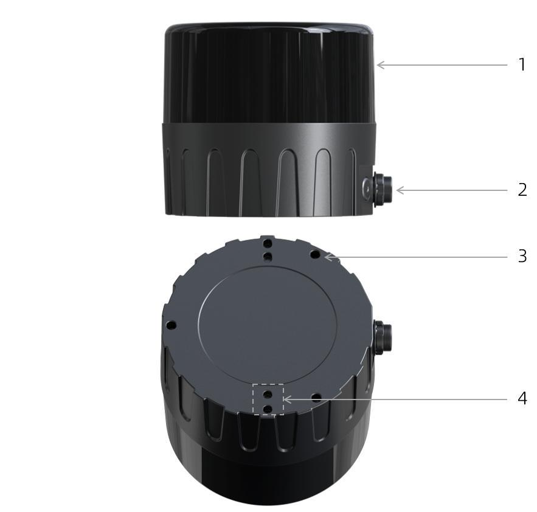{: .manual-img--xl }

图 1 产品结构说明

主要包括以下结构:

1. **防护罩**：

激光雷达发射激光束和接收到的激光回波都需透过弧形特制防护罩, 因此在激光发散的 FOV 范围内, 严禁遮挡。

2. **航空插头**：

激光雷达本体通过航插头与航插线连接，实现供电和数据传输的功能。

3. **M4 螺钉安装孔**：

用于激光雷达与安装支架间的固定，通过 M4 螺钉进行锁紧，详细参数见附录 D 结构图纸部分。

4. **定位孔**：

用于支撑、固定激光雷达与支架之间的位置和方向, 可提高安装效率与精度, 详细参数见附录 D 结构图纸部分。

### 2.3 FOV 分布

Fairy 的 FOV 在水平方向的角度范围是 $0 \sim 360^{\circ}$ ，在垂直方向的角度范围是 $-15.84^{\circ} \sim +15.84^{\circ}$ ，角度间隔约为 $0.67^{\circ}$ 分布。48 路通道与真实的垂直角度对应关系如图 2 所示。

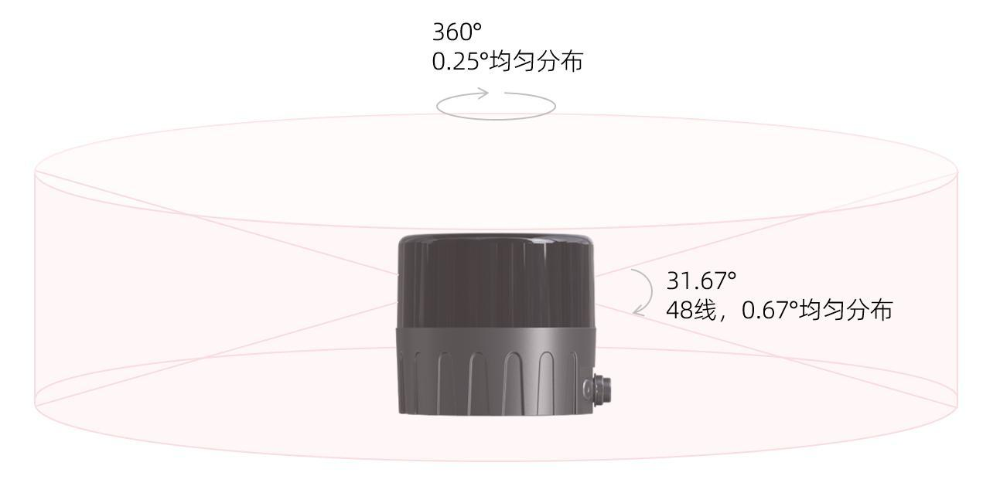{: .manual-img--xl }

图 2 FOV 示意图

Fairy 每 10 帧点云中有 1 帧点云出现约 $30^{\circ}$ 的点云缺口。该缺口的起始角度在固件上可配置，用户可根据实际需求配置在影响较小的位置处，见附录 A2.2。

### 2.4 规格参数 $^{1}$

表 1 Fairy 规格参数

<table class="manual-spec-grid-table">
  <tbody>
    <tr class="section-head">
      <th colspan="4">规格参数</th>
    </tr>
    <tr>
      <td class="spec-label">线数</td>
      <td class="spec-value">48</td>
      <td class="spec-label">水平视场角</td>
      <td class="spec-value">0° ~ 360°</td>
    </tr>
    <tr>
      <td class="spec-label">激光安全等级</td>
      <td class="spec-value">Class1 人眼安全</td>
      <td class="spec-label">垂直视场角</td>
      <td class="spec-value">-15.84° ~ +15.84°</td>
    </tr>
    <tr>
      <td class="spec-label">测距能力2</td>
      <td class="spec-value">150 m (80 m @10% NIST)</td>
      <td class="spec-label">水平角分辨率</td>
      <td class="spec-value">0.25°</td>
    </tr>
    <tr>
      <td class="spec-label">盲区</td>
      <td class="spec-value">≤0.2 m</td>
      <td class="spec-label">垂直角分辨率</td>
      <td class="spec-value">0.67°</td>
    </tr>
    <tr>
      <td class="spec-label">转速</td>
      <td class="spec-value">600 rpm</td>
      <td class="spec-label">精度(典型值)3</td>
      <td class="spec-value">0.5 cm (1 σ)</td>
    </tr>
    <tr>
      <td class="spec-label">出点数</td>
      <td class="spec-value">~690,000 pts/s (单回波) ~1,380,000 pts/s (双回波)</td>
      <td class="spec-label">帧率</td>
      <td class="spec-value">10 Hz</td>
    </tr>
    <tr>
      <td class="spec-label">以太网连接</td>
      <td class="spec-value">100Base-T1/100Base-TX</td>
      <td class="spec-label">传输带宽</td>
      <td class="spec-value">&lt;19 Mbps</td>
    </tr>
    <tr>
      <td class="spec-label">输出数据协议</td>
      <td class="spec-value" colspan="3">UDP Packets Over Ethernet</td>
    </tr>
    <tr>
      <td class="spec-label">激光雷达数据包内容</td>
      <td class="spec-value" colspan="3">空间坐标、反射强度、时间戳等</td>
    </tr>
    <tr>
      <td class="spec-label">工作电压</td>
      <td class="spec-value">9 V - 32 V</td>
      <td class="spec-label">工作寿命4</td>
      <td class="spec-value">17520 h</td>
    </tr>
    <tr>
      <td class="spec-label">产品功率5</td>
      <td class="spec-value">&lt;10 W</td>
      <td class="spec-label">尺寸</td>
      <td class="spec-value">直径 75 mm × 高 70 mm</td>
    </tr>
    <tr>
      <td class="spec-label">重量</td>
      <td class="spec-value">&lt;350 g (激光雷达本体)</td>
      <td class="spec-label">工作温度6</td>
      <td class="spec-value">-40℃ ~ +60℃</td>
    </tr>
    <tr>
      <td class="spec-label">时间同步</td>
      <td class="spec-value">GPS &amp; gPTP &amp; PTP</td>
      <td class="spec-label">存储温度</td>
      <td class="spec-value">-40℃ ~ +85℃</td>
    </tr>
    <tr>
      <td class="spec-label">产品型号</td>
      <td class="spec-value">Fairy</td>
      <td class="spec-label">防护等级</td>
      <td class="spec-value">IP67 / IP6K9K</td>
    </tr>
  </tbody>
</table>

1 以下数据只针对量产产品，任何样品、试验机等其它非量产版本可能并不适用本规格数据，如有疑问请联系 RoboSense；

2 测距能力以 10%NIST 漫反射板为目标，最远测距以 80%NIST 漫反射板为目标，测试结果会受到环境影响，包括但不限于环境温度、光照强度等因素；

3 测距精度以 50%NIST 漫反射板为目标，30℃户外环境，0.5 m~70 m 测距范围，通道 25 至 72 的平均值，测试结果会受到环境影响，包括但不限于环境温度、目标物距离等因素，且精度值适用于大部分通道，部分通道之间存在差异；

4 该工作寿命是指在室温（25℃）条件下，每天工作 16 小时，每年工作 365 天，工作三年。

5 设备功耗测试结果会受到外部环境影响，包括但不限于环境温度、目标物的距离、目标物反射强度等因素；

6 设备运行温度可能会受到外部环境影响，包括但不限于光照环境、气流变化等因素；

### 2.5 产品原理

#### 2.5.1 坐标映射

由于激光雷达封装的数据包仅为水平旋转角度和距离参量, 为了呈现三维点云图的效果, 将极坐标下的角度和距离信息转化为了笛卡尔坐标系下的 x, y, z 坐标, 它们的转换关系如下式所示:

$$
\left\{ \begin{array}{l} x = r   c o s (\omega)   s i n (\alpha) + R   c o s (\alpha); \\ y = r   c o s (\omega)   c o s (\alpha) + R   s i n (\alpha); \\ z = r   s i n (\omega) + Z; \end{array} \right.
$$

其中 r 为实测距离， $\omega$ 为激光的垂直角度， $\alpha$ 为激光的水平旋转角度，R 为光心到原点的平面半径，Z 为光心到原点的 Z 轴高度，x, y, z 为极坐标投影到笛卡尔 X, Y, Z 轴上的坐标。

#### 2.5.2 反射强度解读

Fairy 激光雷达提供了反射强度信息来表征被测物体的反射率。在 Fairy 数据中，标定后的反射强度范围区间为 1～255（该范围区间为 RoboSense 产品自定义的对目标反射率探测的数值）。

#### 2.5.3 回波模式

##### 2.5.3.1 回波模式原理

Fairy 支持多种回波模式，包括最强回波(Strongest Returnrn)、最后回波(Last Returnrn)、最近回波(First Returnrn)及双回波(Dual Returnrn)模式。在双回波模式下，目标物的详细信息得以展现，并且数据量是单回波的两倍。Fairy 能够分析接收到的多个返回值，并根据用户选择分别输出最强、最后、最近一个回波值，或者输出双回波值。若设置为最强回波模式，则仅输出最强的反射回波值；若设置为最后回波模式，则仅输出时域上检测到的最后回波。

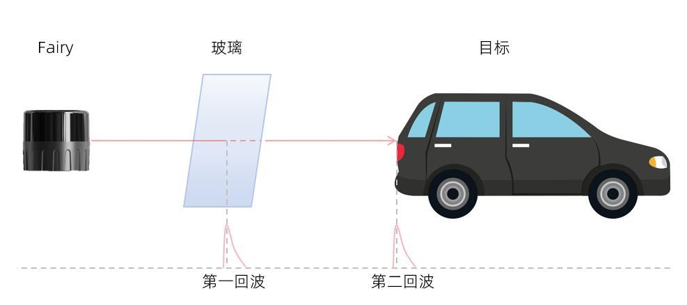{: .manual-img--xl }

图 3 双回波检测

##### 2.5.3.2 回波模式标志

Fairy 出厂默认为最强回波（Strongest Returnrn）模式，如若用户需更改设置，请参照章节 A.2 中产品参数设定进行配置。在 DIFOP 中第 300 个 byte 是回波模式的标志位，详情参见表 2。

表 2 回波模式和标志位对照表

<table class="packet-def-table echo-mode-table">
  <thead>
    <tr>
      <th>DIFOP Offset</th>
      <th>标志位</th>
      <th>回波模式</th>
    </tr>
  </thead>
  <tbody>
    <tr>
      <td rowspan="4">300</td>
      <td>00</td>
      <td>最强回波</td>
    </tr>
    <tr>
      <td>01</td>
      <td>最近回波</td>
    </tr>
    <tr>
      <td>02</td>
      <td>最后回波</td>
    </tr>
    <tr>
      <td>03</td>
      <td>双回波</td>
    </tr>
  </tbody>
</table>

#### 2.5.4 相位锁定

Fairy 相位锁定功能可用于设定 Fairy 在整秒时刻, 传感器旋转到特定的角度发射激光。

图 4 为 Fairy 设置不同相位的示意图，红色箭头表明，在整秒时刻，传感器分别旋转到 $0^{\circ}$ 、 $135^{\circ}$ 、 $270^{\circ}$ 发射激光，坐标系详情参见图 12。

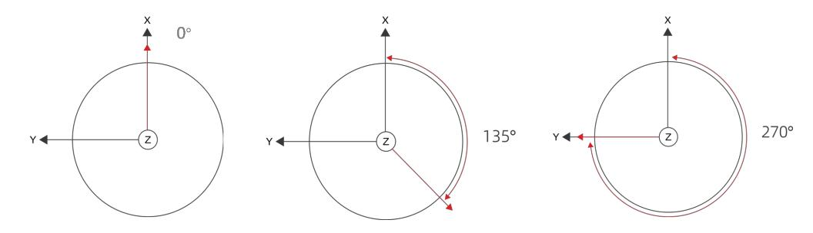{: .manual-img--xl }

图 4 Fairy 不同相位设定示意图

Web 端 Setting > Phase Lock Setting 中提供了一个“Phase Lock”的参数设定，可用于设定锁定的相位角度，输入范围为 0 ~ 360 的整数，详情参见附录 A Web 端部分。

#### 2.5.5 时间同步方式

Fairy 支持 GPS、PTP（IEEE 1588 V2 协议）、gPTP（IEEE802.1 AS 协议）三种同步方式，用户可在 Web 端进行设置，详情参见附录 A Web 端部分。

##### 2.5.5.1 GPS 时间同步原理

GPS 模块连续向产品发送 GPRMC 数据和 PPS 同步脉冲信号，PPS 同步脉冲长度为 20～200 ms，GPRMC 数据必须在 PPS 同步脉冲下降沿后 10ms 之后发射，在下一个 PPS 同步脉冲上升沿前 300ms～500ms 之间完成（建议 GPRMC 数据在两个 PPS 脉冲信号的正中间发送），时序图如图 4 所示。

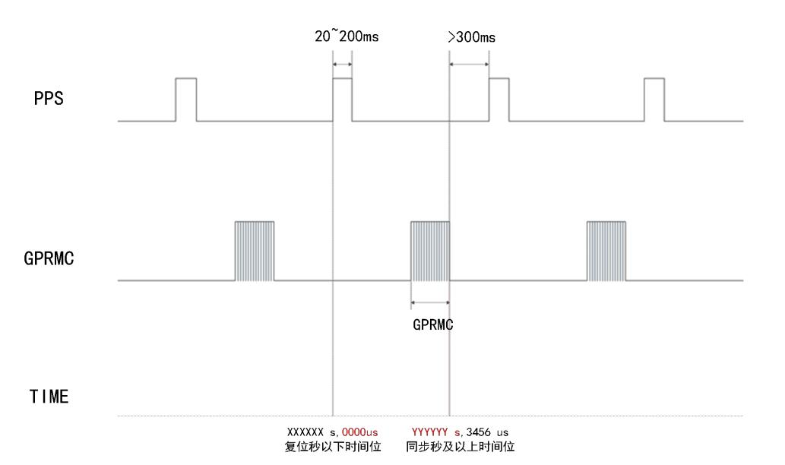{: .manual-img--xl }

图 5 GPS 时间同步时序图

!!! tip "提示说明"
    为确保时间同步的准确性，建议将 PPS 的脉宽设置在 20～200 ms 之间。GPRMC 的完成时间建议为 PPS 下降沿后 10 ms 和下一个 PPS 上升沿前 300～500 ms 之间。

##### 2.5.5.2 GPS 时间同步使用

Fairy 激光雷达 GPS 接口电平协议为 RS232 电平标准，详情参见表 3。

表 3 产品授时引脚定义

<table class="packet-def-table timing-pin-table">
  <thead>
    <tr>
      <th rowspan="2">通讯方式</th>
      <th colspan="2">接收引脚定义</th>
    </tr>
    <tr>
      <th>GPS_GPRMC</th>
      <th>GPS_PPS</th>
    </tr>
  </thead>
  <tbody>
    <tr>
      <td>RS232</td>
      <td>接 GPS 模块输出的 RS232 电平标准的串口数据</td>
      <td>接 GPS 模块输出的正同步脉冲信号，电平要求 3.0 ~ 15.0 V</td>
    </tr>
  </tbody>
</table>

外接的 GPS 模块需要设置输出串口的波特率为 9600 bps，数据位 8 bits，无校验位，停止位 1 bit。Fairy 只读取 GPS 模块发出的 GPRMC 格式的数据，其标准格式如下：

$$
\$ \text { GPRMC }, <   1 >, <   2 >, <   3 >, <   4 >, <   5 >, <   6 >, <   7 >, <   8 >, <   9 >, <   1 0 >, <   1 1 >, <   1 2 > * h h
$$

<1> UTC 时间

<2> 定位状态，A = 有效定位，V = 无效定位

<3> 纬度

<4> 纬度半球 N(北半球)或 S(南半球)

<5> 经度

<6> 经度半球 E(东经)或 W(西经)

<7> 地面速率

<8> 地面航向

<9> UTC 日期

<10> 磁偏角

<11> 磁偏角方向，E(东)或 W(西)

<12> 模式指示(A = 自主定位, D = 差分, E = 估算, N = 数据无效)

*后 hh 为$到*所有字符的异或和。

!!! tip "提示说明"
    1. Fairy 航插线上面的 GPS 接口规格为 SM2.54 端子插头，引脚定义如图 9 所示
    2. 1 PPS 脉冲的发送时间间隔需控制在 $1 \, s \pm 200 \, us$ 内
    3. GPRMC 消息中状态位必须在 A 有效的情况才允许进行时间同步授时
    4. 目前市场的 GPS 模块发出的 GPRMC 消息长度存在不一致情况，本产品可兼容市场上大部分 GPS 模块发出来的 GPRMC 消息格式，如果在使用过程中发现不兼容的情况，请联系 RoboSense

##### 2.5.5.3 PTP 同步原理

PTP（Precision Time Protocol，IEEE 1588V2 协议）是一种时间同步的协议，其本身只是用于设备之间的高精度时间同步，但也可被借用于设备之间的频率同步。相比现有的各种时间同步机制，PTP 具备以下优势：

1) 相比 NTP（Network Time Protocol，网络时间协议），PTP 能够满足更高精度的时间同步要求，NTP 一般只能达到亚秒级的时间同步精度，而 PTP 则可达到亚微秒级。

2) 相比 GPS（Global Positioning System，全球定位系统），PTP 具备更低的建设和维护成本。

##### 2.5.5.4 gPTP 同步原理

gPTP(general Precise Time Protocol, IEEE802.1AS 协议)是 PTP 在时效性网络（Time-Sensitive Networking）的派生协议。同步机制采用和 PTP 协议一致的 P2P 端延迟机制（Peer Delay Mechanism），同时采用以太网 L2 层通信。与 PTP 不同，gPTP 要求使用硬件方式打时间戳，即硬件时间戳，所以对于交换机和 Master 时钟要求较为严苛，需满足 IEEE802.1AS 协议。

##### 2.5.5.5 PTP/gPTP 接线方式

使用 PTP / gPTP 同步方式，需要做以下准备，连接方式详情参见产品手册章节 3.4:

1) 在 Web 端中选择 PTP / gPTP 模式，详情参见产品手册章节 4.2;

2) PTP Master / gPTP Master 授时主机（即插即用，无需额外配置）；

3) 以太网交换机;

4) 支持 PTP / gPTP 协议的待授时设备。

!!! tip "提示说明"
    1. Master 授时设备属于第三方设备，RoboSense 出货时不包含此配件，需用户自行采购
    2. RoboSense 产品只作为 Slave 设备只获取 Master 发出的时间，不对 Master 时钟源的准确度判断，若解析激光雷达点云时间出现突变，请检查 Master 提供的时间是否准确
    3. 激光雷达同步之后，Master 断开连接，点云数据包中的时间则会按照激光雷达内部时钟进行叠加，激光雷达断电重启后才会被重置

## 3 产品安装

### 3.1 配件说明

Fairy 配件清单如表 4 所示，清单仅供参考。

表 4 配件清单

<table class="accessories-table">
  <thead>
    <tr>
      <th>序号</th>
      <th>配件名称</th>
      <th>规格</th>
      <th>数量</th>
    </tr>
  </thead>
  <tbody>
    <tr>
      <td>1</td>
      <td>激光雷达 LiDAR</td>
      <td>Fairy</td>
      <td>1</td>
    </tr>
    <tr>
      <td>2</td>
      <td>螺丝包 Screw Pack</td>
      <td>M4*6</td>
      <td>3</td>
    </tr>
    <tr>
      <td>3</td>
      <td>螺丝包（选配） Screw Pack</td>
      <td>M4*10</td>
      <td>3</td>
    </tr>
    <tr>
      <td>4</td>
      <td>连接线（选配） Aviation Connector Cable</td>
      <td>1.5 m</td>
      <td>1</td>
    </tr>
    <tr>
      <td>5</td>
      <td>转接盒（选配） Interface Box</td>
      <td></td>
      <td>1</td>
    </tr>
    <tr>
      <td>6</td>
      <td>电源适配器（选配） Power Adapter</td>
      <td>DC12 V × 3.34 A / 40 W</td>
      <td>1</td>
    </tr>
    <tr>
      <td>7</td>
      <td>电源线（选配） Power Cable</td>
      <td>1.2 m</td>
      <td>1</td>
    </tr>
    <tr>
      <td>8</td>
      <td>网线（选配） Ethernet Cable</td>
      <td>1.5 m</td>
      <td>1</td>
    </tr>
    <tr>
      <td>9</td>
      <td>产品包装清单和出货检验报告 Product Packing List and Shipment Inspection Report</td>
      <td>/</td>
      <td>1</td>
    </tr>
  </tbody>
</table>

如特殊要求请以商务协议为准。

### 3.2 机械安装

激光雷达的结构安装图如图 6 所示。

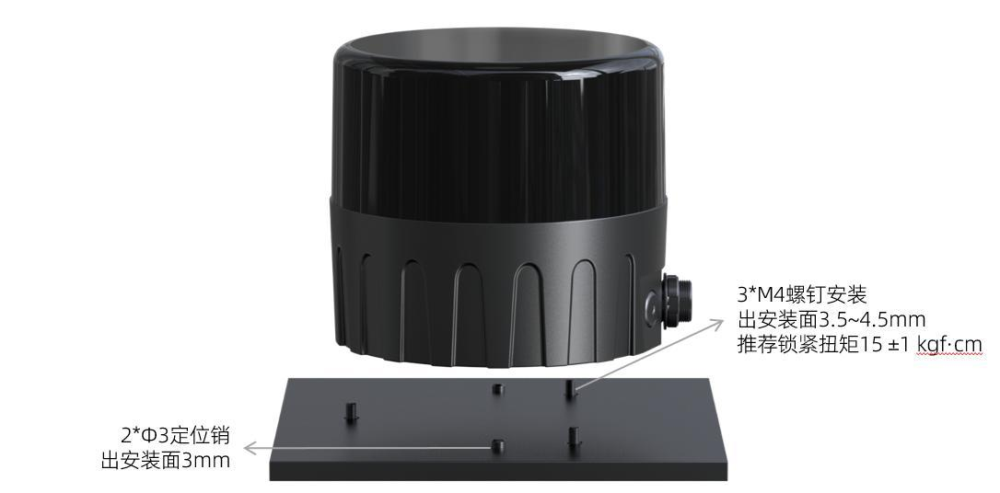{: .manual-img--xl }

图 6 激光雷达结构安装示意图

1. **螺钉规格**：

    - GB/T70.1，M4×6，内六角圆柱头，不锈钢，强度等级A2-70；

2. **安装及定位方式**：

    - 支架与雷达定位如图所示；推荐采用雷达底部定位柱方式进行定位；
    - 底部支架建议在 3 个安装孔附近使用小凸台与雷达配合，凸台整体平面度要求 0.15 mm 以内；
    - 底面用 3 个 M4 螺钉安装，出安装面 3.5～4.5mm，推荐锁紧扭矩 15 ±1 kgf·cm;
    - 底面用 2 个 $\Phi3$ 定位销进行安装定位，不能高于 3 mm;
    - 激光雷达安装的时候，如果激光雷达上下面都有接触式的安装面，请确保安装面之间的间距大于激光雷达高度，避免挤压激光雷达；
    - 由于激光雷达需要线束与外界进行通信，如果线束走线空间太小，弯折半径太小，会对线束寿命与信号质量有影响，对线束安装的要求如下：

        - 激光雷达安装走线时，请勿使激光雷达接线线缆太过紧绷，确保线缆具有一定的松弛度；
        - 线束直径 $6 \pm 0.2 ~mm$ ，线束最小弯折半径为 5 倍线束直径；

    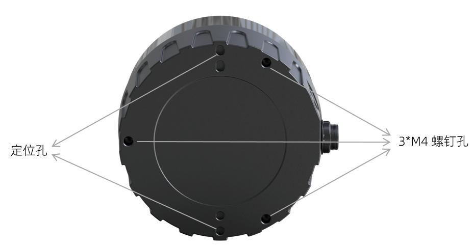{: .manual-img--xl }
    
图 7 激光雷达底部定位孔及螺钉孔示意图

3. **支架刚度和强度要求**：

    固定支架需有较好的刚性用于安装固定激光雷达，并在各种工况下保持激光雷达处于一个稳定的状态，设计要求如下：

    - 推荐雷达固定支架保持一定的刚性，具体边界要求由客户感知算法评估决定；
    - 雷达支架在经历随机振动、机械冲击等工况下会承受较大的负载，应结合实际工况校核支架强度。机械冲击工况，支架最大应力应小于拉伸强度的 2/3。随机振动工况，支架 1sigma RMS 应力应小于拉伸强度的 1/5；

4. **支架散热要求**：

    Fairy 在使用过程中会有一定程度的温升，且受周边热源、环境温度、太阳辐射等因素的影响，可能会加剧激光雷达的温升。RoboSense 可根据具体设计方案提供热仿真评估及优化建议。常规散热建议如下：

    - 激光雷达附近环境温度需控制在工作温度范围内（ $-40^{\circ}C \sim +60^{\circ}C$ ）；
    - 支架材料建议采用导热系数大于 $50 \, W/m \cdot K$ 的铝合金或者镀锌钢板等材料，尽量在支架上做一些散热鳍片，并合理的控制鳍片间距、高度和方向，尽量增大散热面积，方向上与空气对流方向一致，可以更有效散热；
    - 激光雷达底座或顶盖部位，确保不被非金属材质包覆，以免影响整机散热，造成激光雷达温升过高；
    - 必要时可在激光雷达与支架之间增加导热材料，以提升传热效率；

### 3.3 接口说明

#### 3.3.1 航插接口及定义

Fairy 激光雷达侧的航插头，如图 8 所示。

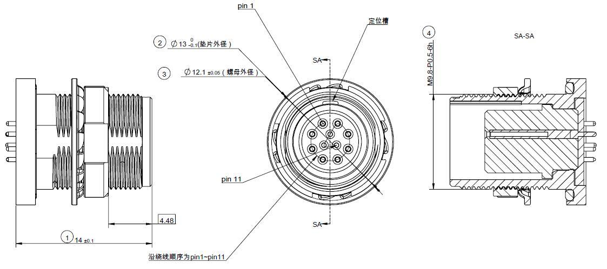{: .manual-img--xl }

图 8 航插接口引脚序号

激光雷达侧的航插接口上具体引脚定义参见表 5。

表 5 航插接口引脚定义

<table class="pin-def-table">
  <thead>
    <tr>
      <th>引脚编号</th>
      <th>规格</th>
      <th>信号</th>
    </tr>
  </thead>
  <tbody>
    <tr>
      <td>1</td>
      <td>26AWG</td>
      <td>NA(空 pin)</td>
    </tr>
    <tr>
      <td>2</td>
      <td>26AWG</td>
      <td>NA(空 pin)</td>
    </tr>
    <tr>
      <td>3</td>
      <td>26AWG</td>
      <td>1P(TX+)</td>
    </tr>
    <tr>
      <td>4</td>
      <td>26AWG</td>
      <td>1N(TX-)</td>
    </tr>
    <tr>
      <td>5</td>
      <td>26AWG</td>
      <td>GND</td>
    </tr>
    <tr>
      <td>6</td>
      <td>26AWG</td>
      <td>VIN</td>
    </tr>
    <tr>
      <td>7</td>
      <td>26AWG</td>
      <td>VIN</td>
    </tr>
    <tr>
      <td>8</td>
      <td>26AWG</td>
      <td>GND</td>
    </tr>
    <tr>
      <td>9</td>
      <td>30AWG</td>
      <td>GPS_PPS</td>
    </tr>
    <tr>
      <td>10</td>
      <td>30AWG</td>
      <td>SYNC_OUT1</td>
    </tr>
    <tr>
      <td>11</td>
      <td>30AWG</td>
      <td>GPS_GPRMC</td>
    </tr>
  </tbody>
</table>

#### 3.3.2 连接线（选配）

Fairy 选配附件连接线为一分三线束，其中 B 端为电源接头，C 端为网络接头，输出 100Base-T1 车载以太网，可根据需求选择将 B 端 C 端接头直连整车端域控，或连接选配附件转接盒后转为普通以太网，详见 3.3.3 章节。

D 端为 GPS 时间同步接头。连接线详情如图 9 所示:

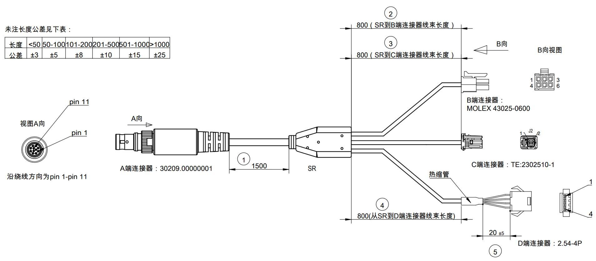{: .manual-img--xl }

图 9 连接线示意图

连接线各接口规格详情参见表6。

表 6 航插线接口规格

<table class="packet-def-table aviation-cable-table">
  <thead>
    <tr>
      <th>A 端序号</th>
      <th>芯线规格</th>
      <th>芯线定义</th>
      <th>A 端颜色</th>
      <th>B 端序号</th>
      <th>B 端颜色</th>
      <th>C 端序号</th>
      <th>C 端颜色</th>
      <th>D 端序号</th>
      <th>D 端颜色</th>
      <th>备注</th>
    </tr>
  </thead>
  <tbody>
    <tr>
      <td>1</td>
      <td>26AWG</td>
      <td>NA(空 pin)</td>
      <td>\</td>
      <td>\</td>
      <td>\</td>
      <td>\</td>
      <td>\</td>
      <td>\</td>
      <td>\</td>
      <td>\</td>
    </tr>
    <tr>
      <td>2</td>
      <td>26AWG</td>
      <td>NA(空 pin)</td>
      <td>\</td>
      <td>\</td>
      <td>\</td>
      <td>\</td>
      <td>\</td>
      <td>\</td>
      <td>\</td>
      <td>\</td>
    </tr>
    <tr>
      <td>3</td>
      <td>26AWG</td>
      <td>1P(TX+)</td>
      <td>绿白色</td>
      <td>\</td>
      <td>\</td>
      <td>1</td>
      <td>绿白色</td>
      <td>\</td>
      <td>\</td>
      <td>双绞线，绞距小于 12.7 mm</td>
    </tr>
    <tr>
      <td>4</td>
      <td>26AWG</td>
      <td>1N(TX-)</td>
      <td>绿色</td>
      <td>\</td>
      <td>\</td>
      <td>2</td>
      <td>绿色</td>
      <td>\</td>
      <td>\</td>
      <td>双绞线，绞距小于 12.7 mm</td>
    </tr>
    <tr>
      <td>5</td>
      <td>26AWG</td>
      <td>GND</td>
      <td>黑色</td>
      <td>1</td>
      <td>黑色</td>
      <td>\</td>
      <td>\</td>
      <td>\</td>
      <td>\</td>
      <td></td>
    </tr>
    <tr>
      <td>6</td>
      <td>26AWG</td>
      <td>VIN</td>
      <td>红色</td>
      <td>2</td>
      <td>红色</td>
      <td>\</td>
      <td>\</td>
      <td>\</td>
      <td>\</td>
      <td></td>
    </tr>
    <tr>
      <td>7</td>
      <td>26AWG</td>
      <td>VIN</td>
      <td>红色</td>
      <td>2</td>
      <td>红色</td>
      <td>\</td>
      <td>\</td>
      <td>\</td>
      <td>\</td>
      <td></td>
    </tr>
    <tr>
      <td>8</td>
      <td>26AWG</td>
      <td>GND</td>
      <td>黑色</td>
      <td>1</td>
      <td>黑色</td>
      <td>\</td>
      <td>\</td>
      <td>4</td>
      <td>黑色</td>
      <td></td>
    </tr>
    <tr>
      <td>9</td>
      <td>30AWG</td>
      <td>GPS_PPS</td>
      <td>紫色</td>
      <td>\</td>
      <td>\</td>
      <td>\</td>
      <td>\</td>
      <td>3</td>
      <td>紫色</td>
      <td></td>
    </tr>
    <tr>
      <td>10</td>
      <td>30AWG</td>
      <td>SYNC_OUT1</td>
      <td>蓝色</td>
      <td>\</td>
      <td>\</td>
      <td>\</td>
      <td>\</td>
      <td>2</td>
      <td>蓝色</td>
      <td></td>
    </tr>
    <tr>
      <td>11</td>
      <td>30AWG</td>
      <td>GPS_GPRMC</td>
      <td>黄色</td>
      <td>\</td>
      <td>\</td>
      <td>\</td>
      <td>\</td>
      <td>1</td>
      <td>黄色</td>
      <td></td>
    </tr>
  </tbody>
</table>

#### 3.3.3 转接盒（选配）接口

Fairy 选配附件转接盒具有一个状态指示灯及各类的接口，如表 7 所示:

表 7 接线说明

<table class="manual-spec-grid-table wiring-instruction-table">
  <tbody>
    <tr class="section-head">
      <th>接线说明</th>
      <th>转接盒结构图</th>
    </tr>
    <tr>
      <td class="wiring-desc">连接激光雷达侧，包含： 1. 电源接口：对应连接线 B 端接头 2. 网络接口：对应连接线 C 端接头</td>
      <td class="wiring-diagram">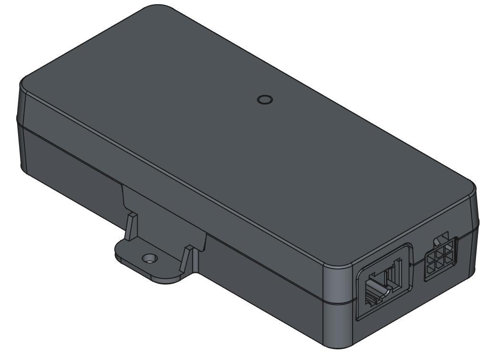</td>
    </tr>
    <tr>
      <td class="wiring-desc">连接电源及上位机侧，包含： 1. 电源接口：标准 DC 5.5-2.1 接口 2. 网络接口：RJ45 接口</td>
      <td class="wiring-diagram">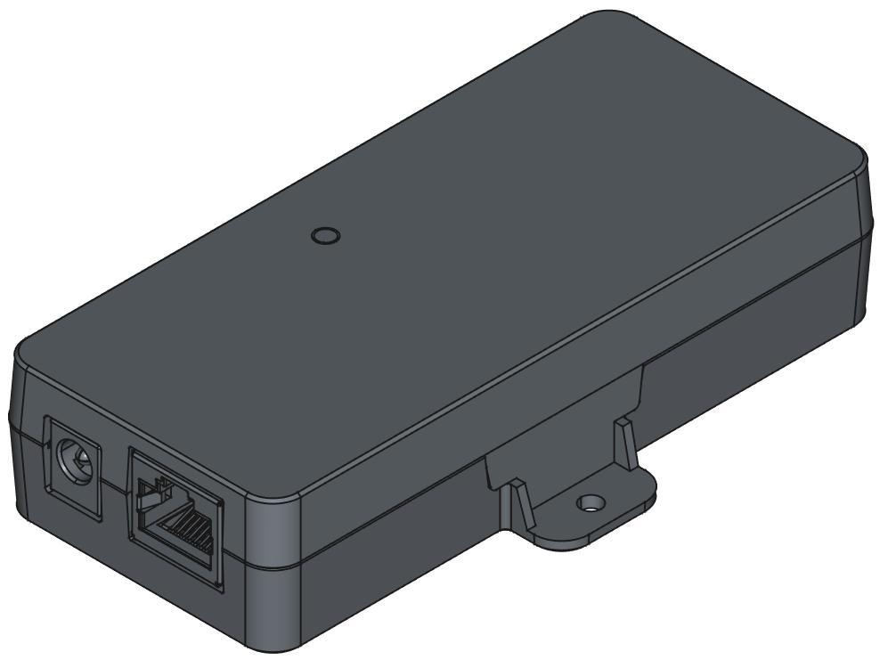</td>
    </tr>
  </tbody>
</table>

#### 3.3.4 GPS 时间同步接口

Fairy 同步接口定义：GPS_GPRMC 为 GPRMC 数据输入；GPS_PPS 为 PPS 信号输入。

!!! info "重要说明"
    Fairy 的“地”与外部系统连接时，外部系统供电电源负极（“地”）与 GPS 系统的“地”必须为非隔离共地系统。

### 3.4 快速连接

本章节介绍如何将 Fairy 通过连接线以及转接盒快速连接至上位机进行雷达调试和数据分析。

将 Fairy 连接整车端域控操作流程不在此章节介绍范围内，若有相关需求和疑问请联系 RoboSense。

Fairy 网络参数可配置，出厂默认采用固定 IP 和端口号模式，详情参见表 8。

表 8 出厂默认网络配置表

<table class="manual-network-table manual-network-table--four-col">
  <colgroup>
    <col class="net-col-device" />
    <col class="net-col-ip" />
    <col class="net-col-port" />
    <col class="net-col-port" />
  </colgroup>
  <thead>
    <tr>
      <th>设备</th>
      <th>IP 地址</th>
      <th>MSOP 包端 口号</th>
      <th>DIFOP 包端 口号</th>
    </tr>
  </thead>
  <tbody>
    <tr>
      <td>Fairy</td>
      <td>192.168.1.200</td>
      <td rowspan="2">6699</td>
      <td rowspan="2">7788</td>
    </tr>
    <tr>
      <td>电脑</td>
      <td>192.168.1.102</td>
    </tr>
  </tbody>
</table>

用户使用产品时，需要把电脑的 IP 设置为与产品同一网段上，例如 192.168.1.x(x 的取值范围为 1～254)，子网掩码为 255.255.255.0。未知产品网络配置信息，请连接产品并使用 Wireshark 抓取产品输出包进行分析。配置 IP 与连接方式如下。

**1. 连接激光雷达**

连接方式如图 10 所示。

1. 激光雷达航插头与连接线（一分三线束）对接；
2. 连接线 B 端与 C 端和转接盒相连，D 端可外接 GPS 时间同步模块；
3. 上位机与转接盒间通过 RJ45 网口接头进行连接;
4. 转接盒上电源接口通过适配器连接电源。通电后，激光雷达即可正常工作；

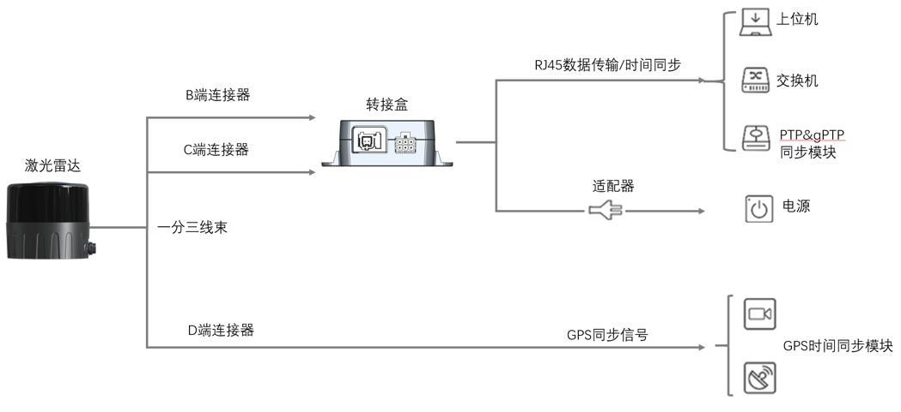{: .manual-img--xl }

图 10 激光雷达连接示意图

**2. 通过 Wireshark 抓包，解析 ARP 报文进行本地 IP 配置**

1. 如上步骤，激光雷达与 PC 完成连接后，启动 Wireshark（第三方网络解析工具），选择正确的网口，开始抓包；
2. 通过 Wireshark 的搜索框，输入 “arp” 进行搜索激光雷达与 PC 间的互相寻址报文，如图 11 所示；

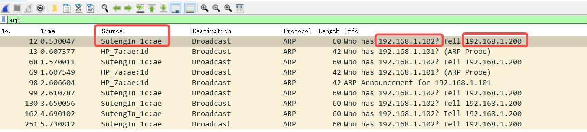{: .manual-img--xl }

图 11 解析 ARP 报文

3. 如图 11 所示，Source 列中的 SutengIn 字样为激光雷达的信息源，提示 192.168.1.200 为 Source IP，即为激光雷达 IP，再请求访问 192.168.1.102，即为 PC IP。如若本地 IP 非请求访问的 IP，则需配置 PC 的本地 IP 为 192.168.1.102，详情操作见步骤 3); 如若可以正常访问，则跳转至步骤 4);

**3. 配置 PC 的本地 IP**

1. 在控制面板中，通过 “网络与 Internet” 进入 “网络与共享中心”，在 “查看活动网络” 内容中，点击对应的以太网连接，进入对应的 “以太网状态”，点击其中的 “属性” 设置；
2. 双击 Internet 协议版本 4（TCP/IPv4），进入 IP 信息设置，使用静态IP 进行配置;
3. 将本地 IP 地址设置为 192.168.1.102，子网掩码 255.255.255.0，点击 “确认”，完成 PC 的静态 IP 设置。

**4. 连接完成**

!!! tip "提示说明"
    1. 时间同步模块（PTP & gPTP、GPS 时间同步模块）非出厂标配产品，如需使用相关功能，请自行购买，按照图 10 方式连接即可
    2. 以上配置本地静态 IP 仅以 Windows 系统操作为例，其它操作系统请以实际为准

## 4 产品使用

### 4.1 产品坐标系

产品的坐标及旋转方向如图 12 所示。

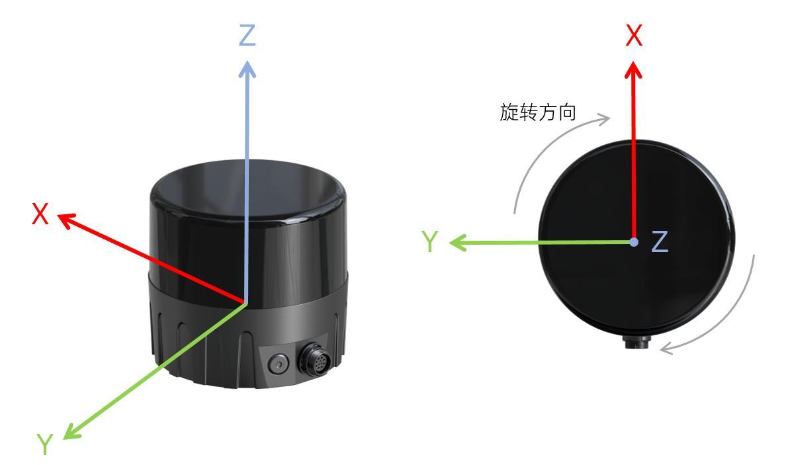{: .manual-img--xl }

图 12 激光雷达坐标及旋转方向示意图

!!! tip "提示说明"
    激光雷达的坐标原点定义在激光雷达底座中心处。

### 4.2 Web 端使用

#### 4.2.1 Web 端功能

Fairy 支持通过网页端对产品进行参数设定、运行信息/状态查看及固件升级等操作。

Fairy Web 地址跟随 Device IP 变化而变化，出厂默认 Device IP 为 192.168.1.200，若用户更改过 Device IP，则 Web 地址变更为新设定的 IP 地址。

#### 4.2.2 访问Web端

产品按照要求连接及正确配置完成后, 使用连接激光雷达的电脑浏览器访问产品 IP 地址（默认 Device IP : 192.168.1.200）进入激光雷达 Web 首页，首页默认为“Device”栏。

#### 4.2.3 使用 Web 端

关于使用 Web 进行操作详情参见产品手册附录 A。

### 4.3 RSView 使用

在 Fairy 的数据的检测上，可使用 Wireshark 和 tcp-dump 等免费工具获取原始数据，而 RSView 可帮助用户更为便捷的实现对原始数据的可视化。

#### 4.3.1 软件功能

RSView 提供将 Fairy 数据进行实时可视化的功能。RSView 也能回放保存为 “.pcap” 文件格式的数据，但是目前还不支持 “.pcapng” 格式的文件。

RSView 将 Fairy 得到距离测量值显示为一个点。它能够支持多种自定义颜色来显示数据，例如反射强度、时间、距离、水平角度和激光线束序号。所显示的数据能够导出保存为 “.csv” 格式，RSView 3.1.3 以后的版本支持导出 “.las” 格式的数据。

RSView 包含以下功能:

1. 通过以太网实时显示数据;
2. 将实时数据记录保存为 PCAP 文件;
3. 从记录的 PCAP 文件中回放;
4. 不同类型可视化模式，例如距离、时间、水平角度等等；
5. 用表格显示点的数据;
6. 将点云数据导出为 CSV 格式文件;
7. 测量距离工具;
8. 将回放数据的连续多帧同时显示;
9. 显示或者隐藏 Fairy 中个别线束;
10. 裁剪显示。

#### 4.3.2 安装 RSView

RSView 支持在 Windows 64 位、Ubuntu 18.04 以上操作系统上运行。请联系 RoboSense 技术支持人员获取 Fairy 最新版本 RSView 软件压缩包。软件的解压路径请勿出现中文字符，软件无需安装，解压后运行可执行文件即可正常使用。

### 4.4 通信协议

Fairy 与电脑之间的通信采用以太网介质，使用 UDP 协议，和电脑之间的通信协议主要分为两类，详情参见表 9。

表 9 产品协议一览表

<table class="packet-def-table product-protocol-table">
  <colgroup>
    <col class="pp-col-name" />
    <col class="pp-col-abbr" />
    <col class="pp-col-func" />
    <col class="pp-col-type" />
    <col class="pp-col-size" />
    <col class="pp-col-rate" />
  </colgroup>
  <thead>
    <tr>
      <th>（协议/包）名称</th>
      <th>简写</th>
      <th>功能</th>
      <th>类型</th>
      <th>包大小</th>
      <th>发送间隔</th>
    </tr>
  </thead>
  <tbody>
    <tr>
      <td>Main data Stream Output Protocol</td>
      <td>MSOP</td>
      <td>扫描数据输出</td>
      <td>UDP</td>
      <td>1248 bytes</td>
      <td>约 555.55 us</td>
    </tr>
    <tr>
      <td>Device Information Output Protocol</td>
      <td>DIFOP</td>
      <td>产品信息输出</td>
      <td>UDP</td>
      <td>1248 bytes</td>
      <td>约 1 s</td>
    </tr>
  </tbody>
</table>

!!! tip "提示说明"
    1. 产品手册 4.4 节皆为对协议中的有效载荷（1248 bytes）部分进行描述和定义
    2. 主数据流输出协议 MSOP，将激光雷达扫描出来的距离，角度，反射强度等信息封装成包输出
    3. 产品信息输出协议 DIFOP，将激光雷达当前状态的各种配置信息输出

#### 4.4.1 MSOP 与 DIFOP 数据协议

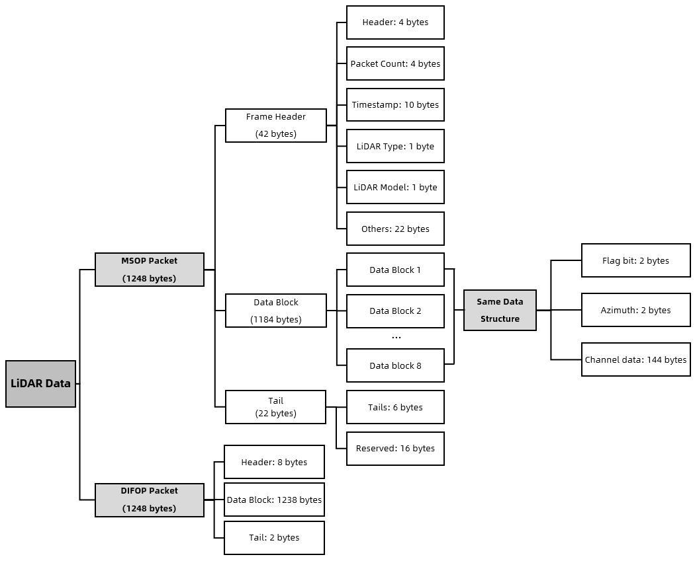{: .manual-img--xl }

图 13 激光雷达数据结构示意图

#### 4.4.2 主数据流输出协议（MSOP）

主数据流输出协议：Main data Stream Output Protocol，简称：MSOP。

I/O 类型：产品输出，电脑解析。

出厂默认端口号为 6699。

##### 4.4.2.1 帧头

帧头 Header 共 42 bytes，用于识别出数据的开始位置，数据结构详情参见表 10。

表 10 MSOP Header 数据表

<table class="packet-def-table msop-header-table">
  <colgroup>
    <col class="msop-col-info" />
    <col class="msop-col-offset" />
    <col class="msop-col-len" />
    <col class="msop-col-desc" />
    <col class="msop-col-total" />
  </colgroup>
  <thead>
    <tr>
      <th>信息</th>
      <th>Offset</th>
      <th>长度 (byte)</th>
      <th>释义</th>
      <th>总长度 (byte)</th>
    </tr>
  </thead>
  <tbody>
    <tr>
      <td>pkt_head</td>
      <td>0</td>
      <td>4</td>
      <td>0x55AA055A</td>
      <td rowspan="9">42</td>
    </tr>
    <tr>
      <td>预留</td>
      <td>4</td>
      <td>8</td>
      <td>/</td>
    </tr>
    <tr>
      <td>pktcnt</td>
      <td>12</td>
      <td>4</td>
      <td>发送包循环计数：0-65535</td>
    </tr>
    <tr>
      <td>预留</td>
      <td>16</td>
      <td>4</td>
      <td>/</td>
    </tr>
    <tr>
      <td>timestamp</td>
      <td>20</td>
      <td>10</td>
      <td>时间戳，前 6 byte 表示秒，后 4 byte 表示微秒</td>
    </tr>
    <tr>
      <td>预留</td>
      <td>30</td>
      <td>1</td>
      <td>/</td>
    </tr>
    <tr>
      <td>lidar_type</td>
      <td>31</td>
      <td>1</td>
      <td>0x0A: Fairy</td>
    </tr>
    <tr>
      <td>lidar_model</td>
      <td>32</td>
      <td>1</td>
      <td>0x02: 48 线</td>
    </tr>
    <tr>
      <td>预留</td>
      <td>33</td>
      <td>9</td>
      <td>/</td>
    </tr>
  </tbody>
</table>

!!! tip "提示说明"
    定义的时间戳用来记录系统的时间，分辨率为 1 us。

##### 4.4.2.2 数据块区间

如表 11 所示，数据块区间 Data block 是 MSOP 包中传感器测量值部分，共 1184 bytes。它由 8 个 Data block 组成，每个 block 长度为 148 bytes。

Data block 中 148 bytes 的空间包括：2 bytes 的标志位，使用 0xffee 表示；2 bytes 的 Azimuth，表示水平旋转角度信息，每个角度信息对应着 48 个的 channel data。

表 11 Data Block 数据包定义

<table class="packet-def-table data-block-def-table">
  <colgroup>
    <col class="msop-col-info" />
    <col class="msop-col-offset" />
    <col class="msop-col-len" />
    <col class="msop-col-desc" />
    <col class="msop-col-total" />
  </colgroup>
  <thead>
    <tr>
      <th>信息</th>
      <th>Offset</th>
      <th>长度 (byte)</th>
      <th>释义</th>
      <th>总长度 (byte)</th>
    </tr>
  </thead>
  <tbody>
    <tr>
      <td>Data_ide</td>
      <td>0</td>
      <td>2</td>
      <td>0xffee</td>
      <td rowspan="9">148</td>
    </tr>
    <tr>
      <td>Azimuth</td>
      <td>2</td>
      <td>2</td>
      <td>极坐标系下，水平夹角，分辨率 0.01</td>
    </tr>
    <tr>
      <td class="field-col" rowspan="2">data 1</td>
      <td>4</td>
      <td>2</td>
      <td>测距（取低 15bits，最高 bit 预留）</td>
    </tr>
    <tr>
      <td>6</td>
      <td>1</td>
      <td>反射率</td>
    </tr>
    <tr>
      <td class="field-col">data 2</td>
      <td>7</td>
      <td>3</td>
      <td>同 data 1</td>
    </tr>
    <tr>
      <td class="field-col">data 3</td>
      <td>10</td>
      <td>3</td>
      <td>同 data 1</td>
    </tr>
    <tr>
      <td class="field-col">...</td>
      <td>...</td>
      <td>...</td>
      <td>...</td>
    </tr>
    <tr>
      <td class="field-col">data 47</td>
      <td>142</td>
      <td>3</td>
      <td>同 data 1</td>
    </tr>
    <tr>
      <td class="field-col">data 48</td>
      <td>145</td>
      <td>3</td>
      <td>同 data 1</td>
    </tr>
  </tbody>
</table>

1. **通道数据定义**：

通道数据 Channel data 是 3 bytes，高两字节用于表示距离信息，低一字节用于表示反射强度信息，如表 12 所示。

表 12 Channel Data 示意表

<table class="packet-def-table channel-data-table channel-data-table--two-col">
  <colgroup>
    <col class="channel-data-col-distance" />
    <col class="channel-data-col-reflectivity" />
  </colgroup>
  <thead>
    <tr>
      <th colspan="2">通道数据（3 bytes）</th>
    </tr>
  </thead>
  <tbody>
    <tr>
      <td>2 bytes Distance</td>
      <td>1 byte Reflectivity</td>
    </tr>
    <tr>
      <td>取低 15bits，最高 bit 预留</td>
      <td>反射强度信息</td>
    </tr>
  </tbody>
</table>

!!! tip "提示说明"
    Distance 是 2 bytes，分辨率为 0.5 cm。

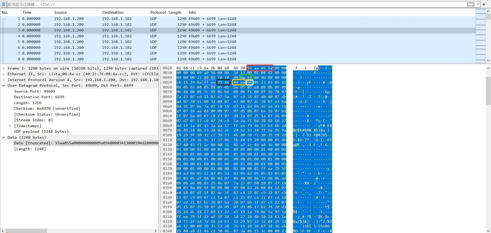{: .manual-img--xl }

图 14 MSOP 包示意图

红色框：Header ID;

绿色框：LiDAR Type 和 LiDAR Model;

蓝色框：Data Block 标志位；

黑色框：Channel data 1 的 Azimuth 值；

黄色框：Channel data 1 的 Distance 值；

白色框：Channel data 1 反射强度值。

数据包的距离值计算，计算方式如下：

a) 数据包里的距离值的十六进制数：0x04,0xEE;

b) 将数据组成 16 bits，为 16 bits 无符号整型数据。表示为：0x04EE;

c) 取低 15bits，距离值转换为十进制数字：1262，根据距离分辨率不同，进行计算；

d) 结果 $1262 \times 0.5 \, cm = 631 \, cm = 6.31 \, m$ 。

数据包的角度值计算，计算方式如下：

a) 数据包里的角度值的十六进制数：0x79，0x46；

b) 将数据组成 16 bits，为 16 bits 无符号整型数据。表示为：0x7946；

c) 转换为十进制数字：31046，将转化成十进制后的数据除以 100;

d) 结果 $31046^{\circ} / 100 = 310.46^{\circ}$ 。

数据包的反射强度值计算，计算方式如下：

a) 数据包里的反射强度值得十六进制数: 0x04;

b) 转换为十进制数字: 4;

c) 结果得到反射强度值为 4。

2. **角度值定义**：

在每个 Block 中，Fairy 输出的角度值是该 Block 中第一个通道激光测距时的角度值。角度值来源于角度编码器，角度编码器的零位即角度的零点，水平旋转角度值的分辨率为 $0.01^{\circ}$ 。

##### 4.4.2.3 帧尾

帧尾（Tail）包含两部分，一个长度为 6 bytes 固定字符的 Tails，和 16 bytes 的预留位。

#### 4.4.3 产品信息输出协议（DIFOP）

产品信息输出协议，Device Info Output Protocol，简称：DIFOP。

I/O 类型：产品输出，电脑读取。

默认端口号为 7788。

DIFOP 是为了将产品序列号（S/N）、固件版本信息、上位机驱动兼容性信息、配置信息、角度信息、运行状态、故障诊断等信息，定期发送给用户的“仅输出”协议，用户可以通过读取 DIFOP 解读当前使用产品的各种参数的具体信息。

一个完整的 DIFOP Packet 的数据格式结构为同步帧头，数据区，帧尾。每个数据包共 1248 bytes。数据包的基本结构如表 13 所示。

表 13 DIFOP Packet 的数据格式结构

<table class="packet-def-table difop-packet-table fairy-difop-layout-table">
  <colgroup>
    <col class="difop-col-var" />
    <col class="difop-col-offset" />
    <col class="difop-col-len" />
    <col class="difop-col-content" />
  </colgroup>
  <thead>
    <tr>
      <th>信息</th>
      <th>Offset</th>
      <th>长度 (byte)</th>
      <th>说明</th>
    </tr>
  </thead>
  <tbody>
    <tr>
      <td>DIFOP 帧头</td>
      <td>0</td>
      <td>8</td>
      <td class="difop-content">0xA5 0xFF 0x00 0x5A 0x11 0x11 0x55 0x55</td>
    </tr>
    <tr>
      <td>预留</td>
      <td>8</td>
      <td>2</td>
      <td class="difop-content"></td>
    </tr>
    <tr>
      <td>以太网 IP 源地址</td>
      <td>10</td>
      <td>4</td>
      <td class="difop-content" rowspan="7">附录 C.1</td>
    </tr>
    <tr>
      <td>以太网 IP 目标地址</td>
      <td>14</td>
      <td>4</td>
    </tr>
    <tr>
      <td>雷达 MAC 地址</td>
      <td>18</td>
      <td>6</td>
    </tr>
    <tr>
      <td>MSOP 端口</td>
      <td>24</td>
      <td>2</td>
    </tr>
    <tr>
      <td>预留</td>
      <td>26</td>
      <td>2</td>
    </tr>
    <tr>
      <td>DIFOP 端口</td>
      <td>28</td>
      <td>2</td>
    </tr>
    <tr>
      <td>预留</td>
      <td>30</td>
      <td>2</td>
    </tr>
    <tr>
      <td>FOV 起始角度</td>
      <td>32</td>
      <td>2</td>
      <td class="difop-content">范围为 0-359, 精度为 0.01°</td>
    </tr>
    <tr>
      <td>FOV 结束角度</td>
      <td>34</td>
      <td>2</td>
      <td class="difop-content">范围为 0-359, 精度为 0.01°</td>
    </tr>
    <tr>
      <td>预留</td>
      <td>36</td>
      <td>2</td>
      <td class="difop-content"></td>
    </tr>
    <tr>
      <td>锁相相位</td>
      <td>38</td>
      <td>2</td>
      <td class="difop-content">范围为 0-360, 精度为 1°</td>
    </tr>
    <tr>
      <td>主板固件版本</td>
      <td>40</td>
      <td>5</td>
      <td class="difop-content">附录 C.2</td>
    </tr>
    <tr>
      <td>底板固件版本</td>
      <td>45</td>
      <td>5</td>
      <td class="difop-content">附录 C.3</td>
    </tr>
    <tr>
      <td>APP 固件版本</td>
      <td>50</td>
      <td>5</td>
      <td class="difop-content">附录 C.4</td>
    </tr>
    <tr>
      <td>电机固件版本</td>
      <td>55</td>
      <td>5</td>
      <td class="difop-content">附录 C.5</td>
    </tr>
    <tr>
      <td>预留</td>
      <td>60</td>
      <td>25</td>
      <td class="difop-content"></td>
    </tr>
    <tr>
      <td rowspan="6">PTP 参数配置</td>
      <td>85</td>
      <td>2</td>
      <td class="difop-content">PTP domain number</td>
    </tr>
    <tr>
      <td>87</td>
      <td>1</td>
      <td class="difop-content">响应 peer delay request 消息</td>
    </tr>
    <tr>
      <td>88</td>
      <td>1</td>
      <td class="difop-content">没有闰秒偏差</td>
    </tr>
    <tr>
      <td>89</td>
      <td>1</td>
      <td class="difop-content">丢失 sync 消息的超时时间 s</td>
    </tr>
    <tr>
      <td>90</td>
      <td>1</td>
      <td class="difop-content">offset 从 unlock 到 lock 的阈值 ms</td>
    </tr>
    <tr>
      <td>91</td>
      <td>1</td>
      <td class="difop-content">offset 从 lock 到 unlock 的阈值 ms</td>
    </tr>
    <tr>
      <td>预留</td>
      <td>92</td>
      <td>196</td>
      <td class="difop-content"></td>
    </tr>
    <tr>
      <td>GPS 同步模式下的 GPRMC 波特率</td>
      <td>288</td>
      <td>1</td>
      <td class="difop-content">波特率取值如下: 0x00: 1200, 0x01: 2400, 0x02: 4800, 0x03: 9600 (默认), 0x04: 14400, 0x05: 19200, 0x06: 38400, 0x07: 43000, 0x08: 57600, 0x09: 76800, 0x0A: 115200, 0x0B: 128000, 0x0C: 230400, 0x0D: 256000, 0x0E: 460800, 0x0F: 921600, 0x10: 1382400</td>
    </tr>
    <tr>
      <td>预留</td>
      <td>289</td>
      <td>3</td>
      <td class="difop-content"></td>
    </tr>
    <tr>
      <td>产品序列号</td>
      <td>292</td>
      <td>6</td>
      <td class="difop-content">附录 C.6</td>
    </tr>
    <tr>
      <td>预留</td>
      <td>298</td>
      <td>2</td>
      <td class="difop-content"></td>
    </tr>
    <tr>
      <td>回波模式</td>
      <td>300</td>
      <td>1</td>
      <td class="difop-content"></td>
    </tr>
    <tr>
      <td>时间同步方式设置</td>
      <td>301</td>
      <td>1</td>
      <td class="difop-content">附录 C.7</td>
    </tr>
    <tr>
      <td>时间同步状态</td>
      <td>302</td>
      <td>1</td>
      <td class="difop-content"></td>
    </tr>
    <tr>
      <td>时间</td>
      <td>303</td>
      <td>10</td>
      <td class="difop-content">附录 C.8</td>
    </tr>
    <tr>
      <td rowspan="5">角度脉冲配置</td>
      <td>313</td>
      <td>1</td>
      <td class="difop-content">角度脉冲模式 0: mode2, 1: mode1(+25%)</td>
    </tr>
    <tr>
      <td>314</td>
      <td>1</td>
      <td class="difop-content">角度脉冲开关 0: off, 1: on</td>
    </tr>
    <tr>
      <td>315</td>
      <td>4</td>
      <td class="difop-content">角度脉冲宽度 ns (取值乘以 10 为设置 ns 数)</td>
    </tr>
    <tr>
      <td>319</td>
      <td>2</td>
      <td class="difop-content">角度脉冲起始角度 (取值乘以 0.01 为设置角度)</td>
    </tr>
    <tr>
      <td>321</td>
      <td>2</td>
      <td class="difop-content">角度脉冲步长 (取值乘以 0.01 为设置角度)</td>
    </tr>
    <tr>
      <td>预留</td>
      <td>323</td>
      <td>5</td>
      <td class="difop-content"></td>
    </tr>
    <tr>
      <td>性能配置</td>
      <td>328</td>
      <td>2</td>
      <td class="difop-content">帧起始空洞角度偏移 0-360</td>
    </tr>
    <tr>
      <td>预留</td>
      <td>330</td>
      <td>27</td>
      <td class="difop-content"></td>
    </tr>
    <tr>
      <td>GPS 状态</td>
      <td>357</td>
      <td>1</td>
      <td class="difop-content">bit0(PPS 锁定标志):锁相 = 1, 失锁 = 0 bit1(GPRMC 锁定标志):锁相 = 1, 失锁 = 0 bit2(UTC 锁定标志):锁相 = 1, 失锁 = 0 bit3(GPRMC 输入状态):有输入 = 1, 无输入 = 0 bit4(PPS 输入状态):有输入 = 1, 无输入 = 0 bit5-bit7 预留</td>
    </tr>
    <tr>
      <td rowspan="5">IMU 配置信息</td>
      <td>358</td>
      <td>1</td>
      <td class="difop-content">imu 使能控制 0:off 1:on</td>
    </tr>
    <tr>
      <td>359</td>
      <td>2</td>
      <td class="difop-content">imu udp 端口号</td>
    </tr>
    <tr>
      <td>361</td>
      <td>1</td>
      <td class="difop-content">imu 消息输出频率 0: 25hz 1: 50hz 2: 100hz 3: 200hz</td>
    </tr>
    <tr>
      <td>362</td>
      <td>1</td>
      <td class="difop-content">imu 加速度计量程 0: +/- 2g 1: +/- 4g 2: +/- 8g 3: +/- 16g</td>
    </tr>
    <tr>
      <td>363</td>
      <td>1</td>
      <td class="difop-content">imu 陀螺仪量程 0: +/- 250 dps 1: +/- 500 dps 2: +/- 1000 dps 3: +/- 2000 dps</td>
    </tr>
    <tr>
      <td>预留</td>
      <td>364</td>
      <td>7</td>
      <td class="difop-content"></td>
    </tr>
    <tr>
      <td>实时相位</td>
      <td>371</td>
      <td>2</td>
      <td class="difop-content">单位: 度</td>
    </tr>
    <tr>
      <td>电机实时转速</td>
      <td>373</td>
      <td>2</td>
      <td class="difop-content">附录 C.9</td>
    </tr>
    <tr>
      <td>预留</td>
      <td>375</td>
      <td>93</td>
      <td class="difop-content"></td>
    </tr>
    <tr>
      <td>垂直角校准</td>
      <td>468</td>
      <td>288</td>
      <td class="difop-content">附录 C.10</td>
    </tr>
    <tr>
      <td>水平角校准</td>
      <td>756</td>
      <td>288</td>
      <td class="difop-content">附录 C.11</td>
    </tr>
    <tr>
      <td>主板输入电压</td>
      <td>1044</td>
      <td>2</td>
      <td class="difop-content">附录 C.12</td>
    </tr>
    <tr>
      <td>预留</td>
      <td>1046</td>
      <td>20</td>
      <td class="difop-content"></td>
    </tr>
    <tr>
      <td>整机输入电压</td>
      <td>1066</td>
      <td>2</td>
      <td class="difop-content">附录 C.13</td>
    </tr>
    <tr>
      <td>底板 12V 电压</td>
      <td>1068</td>
      <td>2</td>
      <td class="difop-content">附录 C.14</td>
    </tr>
    <tr>
      <td>预留</td>
      <td>1070</td>
      <td>22</td>
      <td class="difop-content"></td>
    </tr>
    <tr>
      <td>IMU 标定数据</td>
      <td>1092</td>
      <td>28</td>
      <td class="difop-content">附录 C.15</td>
    </tr>
    <tr>
      <td>预留</td>
      <td>1120</td>
      <td>126</td>
      <td class="difop-content">预留</td>
    </tr>
    <tr>
      <td>帧尾</td>
      <td>1246</td>
      <td>2</td>
      <td class="difop-content">0x0F 0xF0</td>
    </tr>
  </tbody>
</table>

!!! tip "提示说明"
    1. Header（DIFOP 识别头）内容为 0xA5, 0xFF, 0x00, 0x5A, 0x11, 0x11, 0x55, 0x55，可作为包的检查序列
    2. Tail 帧尾内容为 0x0F, 0xF0
    3. 每一项信息的寄存器的定义以及使用参见产品手册附录 C 中的详细描述，对应关系见表 13 说明栏内容

#### 4.4.4 IMU 数据流输出协议

I/O 类型：产品输出，电脑解析。

出厂默认端口号为 6688。

IMU 输出的为产品内部 IMU 的姿态信息，可用于客户产品外参调整。一个完整的 IMU Packet 的数据格式结构为帧头，数据区，帧尾。每个数据包共 51 bytes。数据包的基本结构如表 14 所示。

表 14 IMU 数据格式结构

<table class="packet-def-table fairy-imu-layout-table">
  <thead>
    <tr>
      <th>信息</th>
      <th>Offset</th>
      <th>长度 (byte)</th>
      <th>说明</th>
      <th>备注</th>
    </tr>
  </thead>
  <tbody>
    <tr>
      <td>IMU 帧头</td>
      <td>0</td>
      <td>4</td>
      <td class="difop-content">0xAA 0x55 0x5A 0x05</td>
      <td class="difop-content"></td>
    </tr>
    <tr>
      <td>时间</td>
      <td>4</td>
      <td>10</td>
      <td class="difop-content">UTC 时间格式，前 6 个 byte 为秒时间戳，后 4 个 byte 为微秒时间戳。</td>
      <td class="difop-content"></td>
    </tr>
    <tr>
      <td>AccelX</td>
      <td>14</td>
      <td>4</td>
      <td class="difop-content">X 轴加速度值，浮点数，单位 m/s^2</td>
      <td class="difop-content"></td>
    </tr>
    <tr>
      <td>AccelY</td>
      <td>18</td>
      <td>4</td>
      <td class="difop-content">Y 轴加速度值，浮点数，单位 m/s^2</td>
      <td class="difop-content"></td>
    </tr>
    <tr>
      <td>AccelZ</td>
      <td>22</td>
      <td>4</td>
      <td class="difop-content">Z 轴加速度值，浮点数，单位 m/s^2</td>
      <td class="difop-content"></td>
    </tr>
    <tr>
      <td>GyroX</td>
      <td>26</td>
      <td>4</td>
      <td class="difop-content">X 轴角速度值，浮点数，单位 rad/s</td>
      <td class="difop-content"></td>
    </tr>
    <tr>
      <td>GyroY</td>
      <td>30</td>
      <td>4</td>
      <td class="difop-content">Y 轴角速度值，浮点数，单位 rad/s</td>
      <td class="difop-content"></td>
    </tr>
    <tr>
      <td>GyroZ</td>
      <td>34</td>
      <td>4</td>
      <td class="difop-content">Z 轴角速度值，浮点数，单位 rad/s</td>
      <td class="difop-content"></td>
    </tr>
    <tr>
      <td>内部温度</td>
      <td>38</td>
      <td>4</td>
      <td class="difop-content">IMU 内部温度，有符号，分辨率 0.01 度</td>
      <td class="difop-content"></td>
    </tr>
    <tr>
      <td>ODR</td>
      <td>42</td>
      <td>1</td>
      <td class="difop-content">数据输出频率</td>
      <td class="difop-content">0:25Hz 1:50Hz 2:100Hz 3:200Hz 4:1000Hz</td>
    </tr>
    <tr>
      <td>AccelFsr</td>
      <td>43</td>
      <td>1</td>
      <td class="difop-content">加速度计量程</td>
      <td class="difop-content">0: +/- 2g 1: +/- 4g 2: +/- 8g 3: +/- 16g</td>
    </tr>
    <tr>
      <td>GyroFsr</td>
      <td>44</td>
      <td>1</td>
      <td class="difop-content">陀螺仪量程</td>
      <td class="difop-content">0: +/- 250 dps 1: +/- 500 dps 2: +/- 1000 dps 3: +/- 2000 dps</td>
    </tr>
    <tr>
      <td>包计数</td>
      <td>45</td>
      <td>4</td>
      <td class="difop-content">u32 类型，由 1 开始</td>
      <td class="difop-content"></td>
    </tr>
    <tr>
      <td>帧尾</td>
      <td>49</td>
      <td>2</td>
      <td class="difop-content">0xF0 0x0F</td>
      <td class="difop-content"></td>
    </tr>
  </tbody>
</table>

## 5 故障诊断

本章列举了部分在使用产品的过程中常见的问题以及对应的问题排查方法，详情参见表 15。

表 15 常见故障排查方法表

<table class="packet-def-table fault-troubleshoot-table">
  <colgroup>
    <col class="fault-col-phenomenon" />
    <col class="fault-col-solution" />
  </colgroup>
  <thead>
    <tr>
      <th>故障现象</th>
      <th>解决方法</th>
    </tr>
  </thead>
  <tbody>
    <tr>
      <td>产品电机不旋转</td>
      <td>检查航插线电源/产品端的连接线是否松动及线束破损。</td>
    </tr>
    <tr>
      <td>产品在启动时不断重启</td>
      <td>
        检查输入电源连接和极性是否正常； 
        检查输入电源的电压和电流是否满足要求； 
        检查产品安装平面是否水平或激光雷达底部固定螺丝是否拧得太紧。
      </td>
    </tr>
    <tr>
      <td>产品内部旋转，但是没有数据</td>
      <td>
        检查激光是否正常发射； 
        检查网络连接是否正常； 
        确认电脑端网络配置是否正确； 
        使用另外的软件（例如 Wireshark）检查数据是否有被接收； 
        关闭防火墙和其它可能阻止网络的安全软件； 
        检查电源供电正常； 
        尝试重启产品。
      </td>
    </tr>
    <tr>
      <td>Wireshark 可以收到数据但是 RSView 不显示点云</td>
      <td>
        关闭电脑防火墙，并且运行 RSView 通过防火墙； 
        确认电脑的 IP 配置和产品设置的目的地址一致； 
        确认 RSView 中 Sensor Network Configuration 设置正确； 
        确认 RSView 安装目录或配置文件存放目录不包含任何中文字符； 
        确认 Wireshark 中收到的数据包是 MSOP 类型的包。
      </td>
    </tr>
    <tr>
      <td>产品存在频发的数据丢失</td>
      <td>
        确认网络中是否有大量的其它网络数据包或网络冲突； 
        确认网络中是否存在其它网络产品以广播模式发送大量数据造成传感器数据阻塞； 
        确认电脑的性能和接口性能是否满足要求； 
        移除其它所有网络产品，直连电脑确认是否存在丢包现象。
      </td>
    </tr>
    <tr>
      <td>无法同步 GPS/PTP/gPTP 时间</td>
      <td>
        确认已在网页端将同步模式切换到正确模式下； 
        在 GPS 时间同步方式下： 
        确认 GPS 模块波特率为 9600 bps，8 bits 数据位，无校验位，停止位 1； 
        确认 GPS 模块输出为 3.3 V TTL 还是 RS232 电平； 
        确认 1 PPS 脉冲连续且接线正确； 
        确认 GPRMC 的 NMEA 消息格式正确； 
        确认 GPS 模块和航插线共地； 
        确认 GPS 模块收到了有效的解； 
        确认 GPS 模块是否为有效定位（室外）； 
        在 PTP / gPTP 时间同步方式下： 
        确认 PTP / gPTP Master 同步协议是否符合当前 PTP / gPTP 协议； 
        确认 PTP / gPTP Master 是否正常工作。
      </td>
    </tr>
    <tr>
      <td>产品通过路由器后无数据输出</td>
      <td>关闭路由器的 DHCP 功能或在路由器内部设置传感器的 IP 为正确的 IP。</td>
    </tr>
    <tr>
      <td>ROS 驱动显示点云时有固定的空白区域不断旋转</td>
      <td>此现象正常，是因为 ROS 驱动按照固定包数进行分帧显示，空白部分的数据会在下一帧进行显示。</td>
    </tr>
    <tr>
      <td>RSView 软件输出点云成一条射线</td>
      <td>如果是 Windows 10 系统请设置 RSView 使用 Windows 7 兼容模式运行。</td>
    </tr>
  </tbody>
</table>

## 6 产品维护

--8<-- "snippets/product-maintenance.md"

## 7 售后

--8<-- "snippets/after-sales.md"

## 附录 A Web 端操作

### A.1 产品信息

激光雷达 Web 端默认为产品信息页，如图 15 所示:

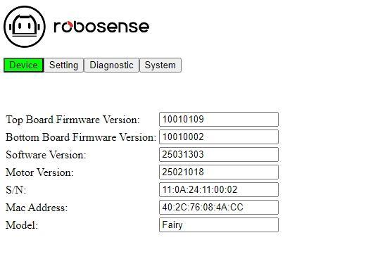{: .manual-img--xl }

图 15 Web 端首页信息

1. Top Board Firmware Version 为主板固件版本；
2. Bottom Board Firmware Version 为底板固件版本；
3. Software Version 为软件版本；
4. Motor Version 为电机版本；
5. S/N 为产品序列号；
6. Mac Address 为 MAC 地址；
7. Model 为产品名称。

### A.2 产品参数设定

#### A.2.1 General Setting

网页端“General Setting”栏为激光雷达基本参数设定页，在此处可更改 Device IP、端口号、回波模式及角度触发等功能设定。示意及功能描述如图 16 所示：

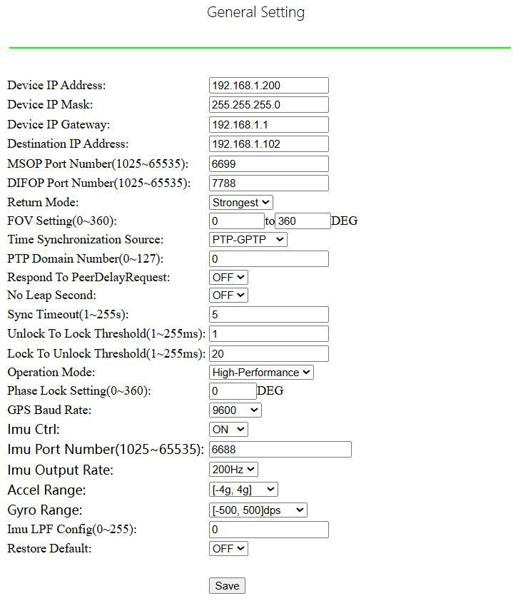{: .manual-img--xl }

图 16 Web 端激光雷达设置信息

1. 支持单播（默认）/广播模式：将 `Destination IP` 设置为 `255.255.255.255` 则切换为广播模式，默认出厂 IP 为 `192.168.1.102`
2. 可修改 MSOP 和 DIFOP 的数据端口，取值范围 **1025 ~ 65535**
3. 「Return Mode」可选择*最强（默认）/最后/最前/双回波*四种回波模式
4. 「Time Synchronization Source」可选择 GPS、PTP-E2E、PTP-P2P、PTP-GPTP、PTP-E2E-L2 确定时间同步方式
5. 可修改 PTP 时间同步域的 `domainNumber` 字段，取值范围 **0 ~ 127**
6. 「Respond To PeerDelayRequest」可选择 OFF（默认）/ON，用于确定作为 slave 时是否响应其他节点的 peer delay request 请求消息
7. 「No Leap Second」可选择 OFF（默认）/ON，用于确定是否响应 announce 报文的闰秒偏差设置
8. 可更改设备因丢失授时 master 消息而导致退出时间同步状态的超时时间（默认 `5s`），值范围为 **1~255 s**
9. 可更改设备由非同步状态切换到同步状态的与 master 之间的 offset 阈值（默认 `1ms`），值范围为 **1~255 ms**
10. 可更改设备由同步状态切换到非同步状态的与 master 之间的 offset 阈值（默认 `20ms`），值范围为 **1~255 ms**
11. 下拉选择 **“Operation Mode”** 选择工作模式，分别为 `Standby`/`High Performance`（默认）二种工作模式，当选择 Standby 模式时，激光雷达电机和发射器停止工作
12. 可更改设备 Phase lock 的角度，值范围为 **0~360 Degree**
13. 下拉选择 **“GPS Baud Rate”** 选择 GPS 波特率，可选项分别为 `9600`（默认）、`14400`、`19200`、`38400`、`43200`、`57600`、`76800`、`115200`
14. 下拉选择 **“Imu Ctrl”** 选择 `OFF` 和 `ON`（默认），用于确定是否开启对 IMU 功能的控制接口
15. 可更改 IMU 的通信端口，值范围为 **1025~65535**
16. 下拉选择 **“Imu Output Rate”** 选择 `25Hz`/`50Hz`/`100Hz`/`200Hz`（默认）来更改 IMU 输出数据的消息输出频率
17. 下拉选择 **“Accel Range”** 选择 `[-2g,2g]`/`[-4g,4g]`（默认）/`[-8g,8g]`/`[-16g,16g]`，用于更改 IMU 加速度计的最大加速度范围
18. 下拉选择 **“Gyro Range”** 选择 `[-250,250]dps`/`[-500,500]dps`（默认）/`[-1000,1000]dps`/`[-2000,2000]dps`，用于更改 IMU 陀螺仪量程范围
19. 下拉选择 **“Restore Default”** 选择 `OFF` 和 `ON` 来确认是否启用恢复默认设置功能

#### A.2.2 Performance Setting

网页端 “Performance Setting”栏为激光雷达高级参数设定页，在此处可进行雷达的反射率表现、吸拖点滤除等高级功能的设定（当前版本仅部署帧起始空洞角度设置功能，其他功能暂未生效，待后续版本更新）。示意及功能描述如图17所示：

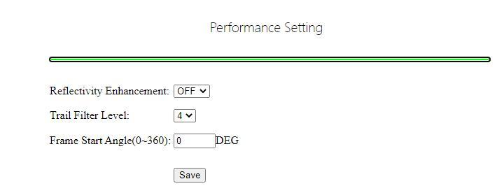{: .manual-img--xl }

图 17 高级功能设定

1. 可下拉“Reflectivity Enhancement”选择 OFF（默认）和 ON 来确定是否开启反射率增强的功能；
2. 可下拉“Trail Filter Level”选择 1/2/3/4（默认）/5/6/7 来确认拖点过滤等级；
3. 可更改设备帧起始空洞角度偏移 Frame Start Angle，取值范围为 0~360 Degree;

#### A.2.3 Angle Pulse Setting

网页端 “Angle Pulse Setting” 栏为激光雷达角度脉冲触发设定页，在此处可设定雷达的角度触发信号，示意及功能描述如图 18 所示：

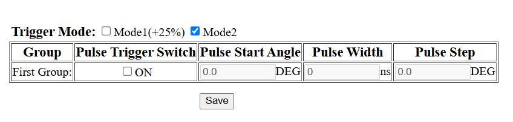{: .manual-img--xl }

图 18 高级功能设定

1. **Trigger Mode**：起始角模式有两种，模式 1 为起始脉宽增加 25%，模式 2 为起始脉宽不增加（默认）；  
2. **Group**：此栏为对应 SYNC OUT 组，Fairy 内含 SYNC OUT1；  
3. **Pulse Trigger Switch**：开启/关闭触发功能，当 Pulse Trigger Switch 勾选“ON”开启后选项为可编辑状态，关闭时为灰色不可编辑状态；  
4. **Pulse Start Angle**：可设置对应的起始角，输入值需为整数；  
5. **Pulse Width**：可设置对应的脉宽；  
6. **Pulse Step**：可设置对应的步距，输入值需为浮点数，保留 1 位小数。

!!! tip "提示说明"
    1. Device IP 和 Destination IP 需在同一网段，否则可能会导致无法正常连接
    2. MSOP、DIFOP 和 IMU 端口号值的范围为 1025～65535，且 MSOP 端口、DIFOP 端口和 IMU 端口不可设置为相同的值
    3. 更改完成后需点击“Save”进行保存，提示成功则表示设定生效

### A.3 产品诊断/运行状态

此页可实时查看激光雷达运行状态，包括电压、电流、实时转速、运行时长及温度等信息，如图 18 所示：

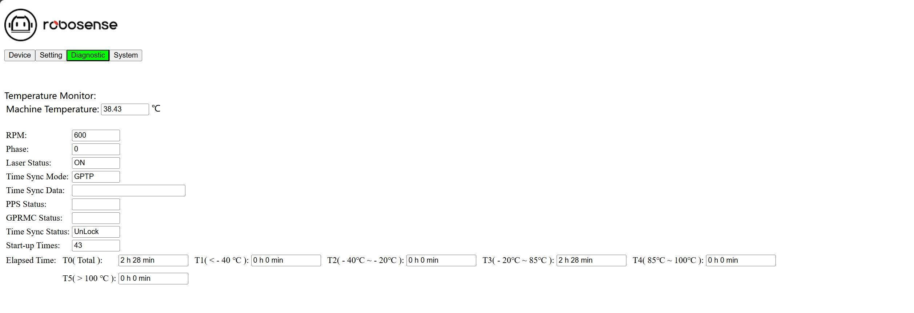{: .manual-img--xl }

图 19 Web 端运行状态/故障诊断

1.  用户可查看 Machine Temperature 获取当前产品运行温度；
2.  用户可查看 RPM 获取产品当前实时转速信息；
3.  用户可查看 Phase 获取产品当前旋转相位；
4.  Laser Status 有“On”（默认）和“Off”两种状态，用户设置 Standby 模式时为“Off”；
5.  用户可查看 Time Sync Mode 获取激光雷达的时间同步模式；
6.  用户可查看 Time Sync Data 获取激光雷达的时间同步数据；
7.  用户可查看 PPP Status 获取 PPS 状态；
8.  用户可查看 GPRMC Status 获取 GPRMC 状态；
9.  用户可查看 Time Sync Status 获取当前时间同步状态，Lock 表示已成功锁定，Unlock 表示时间同步尚未成功；
10. 用户可查看 Startup Times 获取当前产品总启动次数，每断电重启后会累加一次；
11. 用户可查看 Elapsed time 获取产品总运行时间和产品在各温度下累计工作时间。

!!! tip "提示说明"
    1. 本页刷新频率为 5 秒
    2. 若产品电压/电流框变红时，请检查产品当前是否为 Standby 模式，若不是则检查产品是否正常工作

### A.4 产品固件升级

点击网页 “System”, 此页可对产品的 App、底板、主板固件进行升级，操作如下：

1. 请联系 RoboSense 获得升级固件。准备好待升级的固件后，点击“选择文件”，如图 20 所示。

    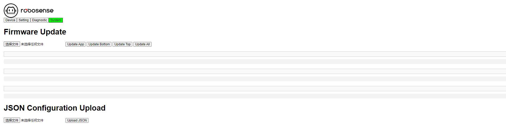{: .manual-img--xl }
    
图 20 Step1 点击选择文件

2. 选择对应待升级固件的文件夹，选中待升级固件后点击“打开”（路径请勿出现中文字符），如图 21 所示。

    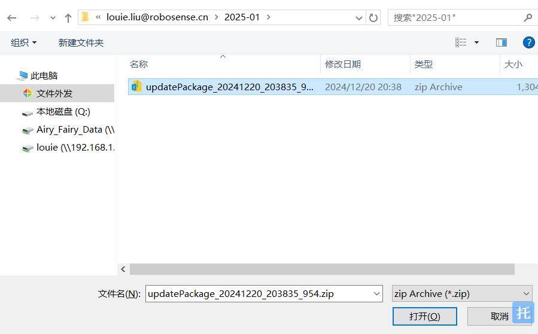{: .manual-img--xl }
    
图 21 选择升级包所在路径的文件

3. 此时 web 界面会显示待升级固件文件名，选择对应的升级按钮则可升级对应固件，如图 22 所示。

    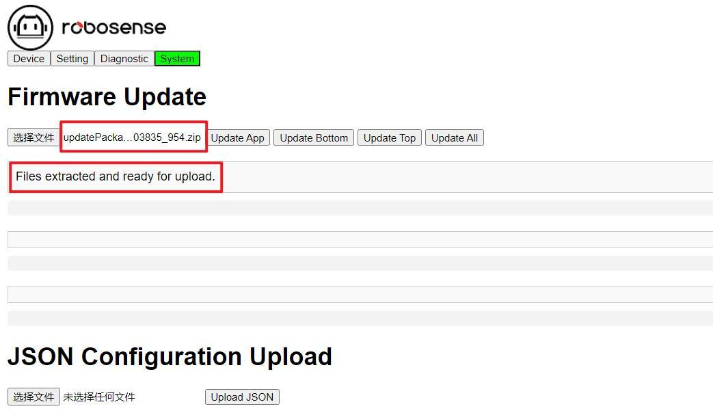{: .manual-img--xl }
    
图 22 升级文件选择完毕后界面

!!! tip "提示说明"
    1. 升级包的格式为 .zip，web 端升级界面只支持上传 .zip 格式文件包进行一键升级
    2. 升级包名称需符合如下要求方可正常升级，否则会报错
    3. 主板升级文件：顺序逻辑必要后缀 ".bin"
    4. 底板升级文件：顺序逻辑必要后缀 ".bit"
    5. Web App 升级文件：顺序逻辑必要后缀 ".hs_fs"

## 附录 B ROS & ROS2 Package

rslidar_sdk 是 ROS/ROS2 平台下的激光雷达驱动 SDK，请通过 github 上的 RoboSense 主页下载，或联系 RoboSense 获取。

1. `rslidar_sdk` 依赖 `rs_driver`，后者是 RoboSense 的基本驱动。`rs_driver` 请从 GitHub 平台下载；
2. 如使用环境为 ROS2，`rslidar_sdk` 还依赖 `rslidar_msg`，这是 msg 定义文件。msg 文件请从 GitHub 平台下载；
3. 驱动 SDK 下载包含丰富的使用指引，请在使用驱动 SDK 前，详细阅读文件内的 `README` 文件及 `doc` 文件夹下的文档。

提示:

> 1. SDK 获取地址：[https://github.com/RoboSense-LiDAR/rsLiDAR_sdk](https://github.com/RoboSense-LiDAR/rsLiDAR_sdk)
> 2. `rs_driver` 获取地址：[https://github.com/RoboSense-LiDAR/rs_driver](https://github.com/RoboSense-LiDAR/rs_driver)
> 3. msg 获取地址：[https://github.com/RoboSense-LiDAR/rslidar_msg](https://github.com/RoboSense-LiDAR/rslidar_msg)

## 附录 C DIFOP 数据定义

本附录内容补充章节 4.4.3 的 DIFOP 协议里各个信息定义的说明，便于用户对产品的使用和开发，涉及到计算部分，均采用大端模式，Value 代表对应 offset 字节换算后得出的十进制数值。

### C.1 以太网
ETH

表 16 以太网寄存器

<table class="packet-def-table">
  <thead>
    <tr>
      <th colspan="9">以太网寄存器（共 30 bytes）</th>
    </tr>
  </thead>
  <tbody>
    <tr>
      <td>序号</td>
      <td>byte 1</td>
      <td>byte 2</td>
      <td>byte 3</td>
      <td>byte 4</td>
      <td>byte 5</td>
      <td>byte 6</td>
      <td>byte 7</td>
      <td>byte 8</td>
    </tr>
    <tr>
      <td>功能</td>
      <td colspan="4">LIDAR_IP</td>
      <td colspan="4">DEST_PC_IP</td>
    </tr>
    <tr>
      <td>序号</td>
      <td>byte 9</td>
      <td>byte 10</td>
      <td>byte 11</td>
      <td>byte 12</td>
      <td>byte 13</td>
      <td>byte 14</td>
      <td>byte 15</td>
      <td>byte 16</td>
    </tr>
    <tr>
      <td>功能</td>
      <td colspan="6">MAC_ADDR</td>
      <td colspan="2">MSOP</td>
    </tr>
    <tr>
      <td>序号</td>
      <td>byte 17</td>
      <td>byte 18</td>
      <td>byte 19</td>
      <td>byte 20</td>
      <td>byte 21</td>
      <td>byte 22</td>
      <td></td>
      <td></td>
    </tr>
    <tr>
      <td>功能</td>
      <td colspan="2">预留</td>
      <td colspan="2">DIFOP</td>
      <td colspan="2">预留</td>
      <td></td>
      <td></td>
    </tr>
  </tbody>
</table>

!!! note "寄存器说明"
    1. LIDAR_IP 为激光雷达的源 IP 地址，占据 4 bytes
    2. DEST_PC_IP 为目的 PC 的 IP 地址，占据 4 bytes
    3. MAC_ADDR 为激光雷达的 MAC 地址
    4. MSOP 与 DIFOP 分别占 2 bytes，源端口号与目的端口号强制一致

### C.2 主板固件版本
TOP_FRM

表 17 主板固件版本

<table class="packet-def-table">
  <thead>
    <tr>
      <th colspan="6">主板固件版本（共 5 bytes）</th>
    </tr>
  </thead>
  <tbody>
    <tr>
      <td>序号</td>
      <td>byte 1</td>
      <td>byte 2</td>
      <td>byte 3</td>
      <td>byte 4</td>
      <td>byte 5</td>
    </tr>
    <tr>
      <td>功能</td>
      <td colspan="5">TOP_FRM</td>
    </tr>
  </tbody>
</table>

!!! note "寄存器说明"
    1. 该寄存器用于读取主板固件版本号
    2. 如 byte 1=0x00, byte 2=0x10, byte 3=0x04, byte 4=0x0c, byte 5=0x00, 则固件版本号为：00 10 04 0c 00

### C.3 底板固件版本
BOT_FRM

表 18 底板固件版本

<table class="packet-def-table">
  <thead>
    <tr>
      <th colspan="6">底板固件版本（共 5 bytes）</th>
    </tr>
  </thead>
  <tbody>
    <tr>
      <td>序号</td>
      <td>byte 1</td>
      <td>byte 2</td>
      <td>byte 3</td>
      <td>byte 4</td>
      <td>byte 5</td>
    </tr>
    <tr>
      <td>功能</td>
      <td colspan="5">BOT_FRM</td>
    </tr>
  </tbody>
</table>

!!! note "寄存器说明"
    1. 该寄存器用于读取底板固件版本号
    2. 如 byte 1=0x00, byte 2=0x24, byte 3=0x12, byte 4=0x13, byte 5=0x12, 则固件版本号为：00 24 12 13 12

### C.4 APP 固件版本
SOF_FRM

表 19 软件版本

<table class="packet-def-table">
  <thead>
    <tr>
      <th colspan="6">APP 固件版本（共 5 bytes）</th>
    </tr>
  </thead>
  <tbody>
    <tr>
      <td>序号</td>
      <td>byte 1</td>
      <td>byte 2</td>
      <td>byte 3</td>
      <td>byte 4</td>
      <td>byte 5</td>
    </tr>
    <tr>
      <td>功能</td>
      <td colspan="5">SOF_FRM</td>
    </tr>
  </tbody>
</table>

!!! note "寄存器说明"
    1. 该寄存器用于读取 APP 固件版本号
    2. 如 byte 1=0x00, byte 2=0x24, byte 3=0x12, byte 4=0x13, byte 5=0x12, 则固件版本号为：00 24 12 13 12

### C.5 电机固件版本
MOT_FRM

表 20 电机固件版本

<table class="packet-def-table">
  <thead>
    <tr>
      <th colspan="6">电机固件版本（共 5 bytes）</th>
    </tr>
  </thead>
  <tbody>
    <tr>
      <td>序号</td>
      <td>byte 1</td>
      <td>byte 2</td>
      <td>byte 3</td>
      <td>byte 4</td>
      <td>byte 5</td>
    </tr>
    <tr>
      <td>功能</td>
      <td colspan="5">MOT_FRM</td>
    </tr>
  </tbody>
</table>

!!! note "寄存器说明"
    1. 该寄存器用于读取电机固件版本号
    2. 如 byte 1=0x00, byte 2=0x24, byte 3=0x12, byte 4=0x12, byte 5=0x25, 则固件版本号为：00 24 12 12 25

### C.6 序列号
SN

表 21 序列号寄存器

<table class="packet-def-table">
  <thead>
    <tr>
      <th colspan="7">序列号（共 6 bytes）</th>
    </tr>
  </thead>
  <tbody>
    <tr>
      <td>序号</td>
      <td>byte 1</td>
      <td>byte 2</td>
      <td>byte 3</td>
      <td>byte 4</td>
      <td>byte 5</td>
      <td>byte 6</td>
    </tr>
    <tr>
      <td>功能</td>
      <td colspan="6">SN</td>
    </tr>
  </tbody>
</table>

!!! note "寄存器说明"
    1. 该寄存器用于设备序列号
    2. 类似 mac 地址，共 6 bytes，以 16 进制表示产品序列号

### C.7 时间同步信息
TIME_SYNC_INFO

表 22 时间同步信息

<table class="packet-def-table">
  <thead>
    <tr>
      <th colspan="3">时间同步信息（共 2 bytes）</th>
    </tr>
  </thead>
  <tbody>
    <tr>
      <td>序号</td>
      <td>byte 1</td>
      <td>byte 2</td>
    </tr>
    <tr>
      <td>功能</td>
      <td>Time_Sync_Mode</td>
      <td>Time_Sync_State</td>
    </tr>
  </tbody>
</table>

!!! note "寄存器说明"
    1. 该寄存器用于读取时间同步信息
    2. byte 1 为时间同步模式状态位，定义如下：
        - 0x00: GPS
        - 0x01: E2E-L4
        - 0x02: P2P
        - 0x03: gPTP
        - 0x04: E2E-L2
    3. byte 2 为时间同步成功状态位，定义如下：
        - 0x00: 未同步
        - 0x01: 同步成功

### C.8 时间
UTC_TIME

表 23 时间寄存器

<table class="packet-def-table">
  <thead>
    <tr>
      <th colspan="11">时间寄存器（共 10 bytes）</th>
    </tr>
  </thead>
  <tbody>
    <tr>
      <td>序号</td>
      <td>byte 1</td>
      <td>byte 2</td>
      <td>byte 3</td>
      <td>byte 4</td>
      <td>byte 5</td>
      <td>byte 6</td>
      <td>byte 7</td>
      <td>byte 8</td>
      <td>byte 9</td>
      <td>byte 10</td>
    </tr>
    <tr>
      <td>功能</td>
      <td colspan="6">sec</td>
      <td colspan="4">us</td>
    </tr>
  </tbody>
</table>

!!! note "寄存器说明"
    1. 该寄存器用于读取时间信息
    2. us 值范围：0 ~ 999999

### C.9 电机实时转速
REALTIME_ROTATION_SPEED

表 24 实时转速寄存器

<table class="packet-def-table">
  <tbody>
    <tr>
      <td>序号</td>
      <td>byte 1</td>
      <td>byte 2</td>
    </tr>
    <tr>
      <td>功能</td>
      <td colspan="2">REALTIME_ROTATION_SPEED</td>
    </tr>
  </tbody>
</table>

!!! note "寄存器说明"
    1. 该寄存器用于读取电机实时转速信息
    2. 共 2 byte，以 16 进制表示
    3. 例如 byte1=0x01，byte2=0x28，电机实际转速转成十进制是 600

### C.10 垂直角校准
COR_VERT_ANG

表 25 垂直角校准寄存器

<table class="packet-def-table">
  <thead>
    <tr>
      <th colspan="10">垂直角校准寄存器（共 288 bytes）</th>
    </tr>
  </thead>
  <tbody>
    <tr>
      <td>序号</td>
      <td>byte 1</td>
      <td>byte 2</td>
      <td>byte 3</td>
      <td>byte 4</td>
      <td>byte 5</td>
      <td>byte 6</td>
      <td>byte 7</td>
      <td>byte 8</td>
      <td>byte 9</td>
    </tr>
    <tr>
      <td>功能</td>
      <td colspan="3">1 通道垂直角度</td>
      <td colspan="3">2 通道垂直角度</td>
      <td colspan="3">3 通道垂直角度</td>
    </tr>
    <tr>
      <td>序号</td>
      <td>byte 10</td>
      <td>byte 11</td>
      <td>byte 12</td>
      <td>byte 13</td>
      <td>byte 14</td>
      <td>byte 15</td>
      <td>byte 16</td>
      <td>byte 17</td>
      <td>byte 18</td>
    </tr>
    <tr>
      <td>功能</td>
      <td colspan="3">4 通道垂直角度</td>
      <td colspan="3">5 通道垂直角度</td>
      <td colspan="3">6 通道垂直角度</td>
    </tr>
    <tr>
      <td>序号</td>
      <td>byte 19</td>
      <td>byte 20</td>
      <td>byte 21</td>
      <td>byte 22</td>
      <td>byte 23</td>
      <td>byte 24</td>
      <td>byte 25</td>
      <td>byte 26</td>
      <td>byte 27</td>
    </tr>
    <tr>
      <td>功能</td>
      <td colspan="3">7 通道垂直角度</td>
      <td colspan="3">8 通道垂直角度</td>
      <td colspan="3">9 通道垂直角度</td>
    </tr>
    <tr>
      <td>序号</td>
      <td>byte 28</td>
      <td>byte 29</td>
      <td>byte 30</td>
      <td>byte 31</td>
      <td>byte 32</td>
      <td>byte 33</td>
      <td>byte 34</td>
      <td>byte 35</td>
      <td>byte 36</td>
    </tr>
    <tr>
      <td>功能</td>
      <td colspan="3">10 通道垂直角度</td>
      <td colspan="3">11 通道垂直角度</td>
      <td colspan="3">12 通道垂直角度</td>
    </tr>
    <tr>
      <td>序号</td>
      <td>byte 37</td>
      <td>byte 38</td>
      <td>byte 39</td>
      <td>byte 40</td>
      <td>byte 41</td>
      <td>byte 42</td>
      <td>byte 43</td>
      <td>byte 44</td>
      <td>byte 45</td>
    </tr>
    <tr>
      <td>功能</td>
      <td colspan="3">13 通道垂直角度</td>
      <td colspan="3">14 通道垂直角度</td>
      <td colspan="3">15 通道垂直角度</td>
    </tr>
    <tr>
      <td>序号</td>
      <td>byte 46</td>
      <td>byte 47</td>
      <td>byte 48</td>
      <td>byte 49</td>
      <td>byte 50</td>
      <td>byte 51</td>
      <td>byte 52</td>
      <td>byte 53</td>
      <td>byte 54</td>
    </tr>
    <tr>
      <td>功能</td>
      <td colspan="3">16 通道垂直角度</td>
      <td colspan="3">17 通道垂直角度</td>
      <td colspan="3">18 通道垂直角度</td>
    </tr>
    <tr>
      <td>序号</td>
      <td>byte 55</td>
      <td>byte 56</td>
      <td>byte 57</td>
      <td>byte 58</td>
      <td>byte 59</td>
      <td>byte 60</td>
      <td>byte 61</td>
      <td>byte 62</td>
      <td>byte 63</td>
    </tr>
    <tr>
      <td>功能</td>
      <td colspan="3">19 通道垂直角度</td>
      <td colspan="3">20 通道垂直角度</td>
      <td colspan="3">21 通道垂直角度</td>
    </tr>
    <tr>
      <td>序号</td>
      <td colspan="3">...</td>
      <td colspan="3">...</td>
      <td colspan="3">...</td>
    </tr>
    <tr>
      <td>功能</td>
      <td colspan="9">...</td>
    </tr>
    <tr>
      <td>序号</td>
      <td>byte 262</td>
      <td>byte 263</td>
      <td>byte 264</td>
      <td>byte 265</td>
      <td>byte 266</td>
      <td>byte 267</td>
      <td>byte 268</td>
      <td>byte 269</td>
      <td>byte 270</td>
    </tr>
    <tr>
      <td>功能</td>
      <td colspan="3">88 通道垂直角度</td>
      <td colspan="3">89 通道垂直角度</td>
      <td colspan="3">90 通道垂直角度</td>
    </tr>
    <tr>
      <td>序号</td>
      <td>byte 271</td>
      <td>byte 272</td>
      <td>byte 273</td>
      <td>byte 274</td>
      <td>byte 275</td>
      <td>byte 276</td>
      <td>byte 277</td>
      <td>byte 278</td>
      <td>byte 279</td>
    </tr>
    <tr>
      <td>功能</td>
      <td colspan="3">91 通道垂直角度</td>
      <td colspan="3">92 通道垂直角度</td>
      <td colspan="3">93 通道垂直角度</td>
    </tr>
    <tr>
      <td>序号</td>
      <td>byte 280</td>
      <td>byte 281</td>
      <td>byte 282</td>
      <td>byte 283</td>
      <td>byte 284</td>
      <td>byte 285</td>
      <td>byte 286</td>
      <td>byte 287</td>
      <td>byte 288</td>
    </tr>
    <tr>
      <td>功能</td>
      <td colspan="3">94 通道垂直角度</td>
      <td colspan="3">95 通道垂直角度</td>
      <td colspan="3">96 通道垂直角度</td>
    </tr>
  </tbody>
</table>

!!! note "寄存器说明"
    1. 角度值为区分为正负，每个通道的垂直角度由 3 bytes 组成，其中第 1 个 byte 表示正负，第 2 和第 3 个 byte 共同组成角度的值
    2. 表示正负的第 1 个 byte 属性为 0x00 则通道垂直角度为正值，属性为 0x01 则通道垂直角度为负值
    3. 角度分辨率为 $0.01^{\circ}$
    4. 例如通道 5 寄存器的值为 byte 1=0x00, 为正数; byte 2=0x01, byte 3=0x71 转换成十进制 369。则通道 5 的垂直角度值为 $3.69^{\circ}$

### C.11 水平偏移角校准
COR_HOR_ANG

表 26 水平偏移角校准寄存器

<table class="packet-def-table">
  <thead>
    <tr>
      <th colspan="10">水平偏移角校准寄存器（共 288 bytes）</th>
    </tr>
  </thead>
  <tbody>
    <tr>
      <td>序号</td>
      <td>byte 1</td>
      <td>byte 2</td>
      <td>byte 3</td>
      <td>byte 4</td>
      <td>byte 5</td>
      <td>byte 6</td>
      <td>byte 7</td>
      <td>byte 8</td>
      <td>byte 9</td>
    </tr>
    <tr>
      <td>功能</td>
      <td colspan="3">1 通道水平偏移角度</td>
      <td colspan="3">2 通道水平偏移角度</td>
      <td colspan="3">3 通道水平偏移角度</td>
    </tr>
    <tr>
      <td>序号</td>
      <td>byte 10</td>
      <td>byte 11</td>
      <td>byte 12</td>
      <td>byte 13</td>
      <td>byte 14</td>
      <td>byte 15</td>
      <td>byte 16</td>
      <td>byte 17</td>
      <td>byte 18</td>
    </tr>
    <tr>
      <td>功能</td>
      <td colspan="3">4 通道水平偏移角度</td>
      <td colspan="3">5 通道水平偏移角度</td>
      <td colspan="3">6 通道水平偏移角度</td>
    </tr>
    <tr>
      <td>序号</td>
      <td>byte 19</td>
      <td>byte 20</td>
      <td>byte 21</td>
      <td>byte 22</td>
      <td>byte 23</td>
      <td>byte 24</td>
      <td>byte 25</td>
      <td>byte 26</td>
      <td>byte 27</td>
    </tr>
    <tr>
      <td>功能</td>
      <td colspan="3">7 通道水平偏移角度</td>
      <td colspan="3">8 通道水平偏移角度</td>
      <td colspan="3">9 通道水平偏移角度</td>
    </tr>
    <tr>
      <td>序号</td>
      <td>byte 28</td>
      <td>byte 29</td>
      <td>byte 30</td>
      <td>byte 31</td>
      <td>byte 32</td>
      <td>byte 33</td>
      <td>byte 34</td>
      <td>byte 35</td>
      <td>byte 36</td>
    </tr>
    <tr>
      <td>功能</td>
      <td colspan="3">10 通道水平偏移角度</td>
      <td colspan="3">11 通道水平偏移角度</td>
      <td colspan="3">12 通道水平偏移角度</td>
    </tr>
    <tr>
      <td>序号</td>
      <td>byte 37</td>
      <td>byte 38</td>
      <td>byte 39</td>
      <td>byte 40</td>
      <td>byte 41</td>
      <td>byte 42</td>
      <td>byte 43</td>
      <td>byte 44</td>
      <td>byte 45</td>
    </tr>
    <tr>
      <td>功能</td>
      <td colspan="3">13 通道水平偏移角度</td>
      <td colspan="3">14 通道水平偏移角度</td>
      <td colspan="3">15 通道水平偏移角度</td>
    </tr>
    <tr>
      <td>序号</td>
      <td>byte 46</td>
      <td>byte 47</td>
      <td>byte 48</td>
      <td>byte 49</td>
      <td>byte 50</td>
      <td>byte 51</td>
      <td>byte 52</td>
      <td>byte 53</td>
      <td>byte 54</td>
    </tr>
    <tr>
      <td>功能</td>
      <td colspan="3">16 通道水平偏移角度</td>
      <td colspan="3">17 通道水平偏移角度</td>
      <td colspan="3">18 通道水平偏移角度</td>
    </tr>
    <tr>
      <td>序号</td>
      <td>byte 55</td>
      <td>byte 56</td>
      <td>byte 57</td>
      <td>byte 58</td>
      <td>byte 59</td>
      <td>byte 60</td>
      <td>byte 61</td>
      <td>byte 62</td>
      <td>byte 63</td>
    </tr>
    <tr>
      <td>功能</td>
      <td colspan="3">19 通道水平偏移角度</td>
      <td colspan="3">20 通道水平偏移角度</td>
      <td colspan="3">21 通道水平偏移角度</td>
    </tr>
    <tr>
      <td>序号</td>
      <td colspan="3">...</td>
      <td colspan="3">...</td>
      <td colspan="3">...</td>
    </tr>
    <tr>
      <td>功能</td>
      <td colspan="9">...</td>
    </tr>
    <tr>
      <td>序号</td>
      <td>byte 262</td>
      <td>byte 263</td>
      <td>byte 264</td>
      <td>byte 265</td>
      <td>byte 266</td>
      <td>byte 267</td>
      <td>byte 268</td>
      <td>byte 269</td>
      <td>byte 270</td>
    </tr>
    <tr>
      <td>功能</td>
      <td colspan="3">88 通道水平偏移角度</td>
      <td colspan="3">89 通道水平偏移角度</td>
      <td colspan="3">90 通道水平偏移角度</td>
    </tr>
    <tr>
      <td>序号</td>
      <td>byte 271</td>
      <td>byte 272</td>
      <td>byte 273</td>
      <td>byte 274</td>
      <td>byte 275</td>
      <td>byte 276</td>
      <td>byte 277</td>
      <td>byte 278</td>
      <td>byte 279</td>
    </tr>
    <tr>
      <td>功能</td>
      <td colspan="3">91 通道水平偏移角度</td>
      <td colspan="3">92 通道水平偏移角度</td>
      <td colspan="3">93 通道水平偏移角度</td>
    </tr>
    <tr>
      <td>序号</td>
      <td>byte 280</td>
      <td>byte 281</td>
      <td>byte 282</td>
      <td>byte 283</td>
      <td>byte 284</td>
      <td>byte 285</td>
      <td>byte 286</td>
      <td>byte 287</td>
      <td>byte 288</td>
    </tr>
    <tr>
      <td>功能</td>
      <td colspan="3">94 通道水平偏移角度</td>
      <td colspan="3">95 通道水平偏移角度</td>
      <td colspan="3">96 通道水平偏移角度</td>
    </tr>
  </tbody>
</table>

!!! note "寄存器说明"
    1. 角度值为区分为正负，每个通道的水平偏移角度由 3 bytes 组成，其中第 1 个 byte 表示正负，第 2 和第 3 个 byte 共同组成角度的值
    2. 表示正负的第 1 个 byte 属性为 0x00 则通道水平偏移角度为正值，属性为 0x01 则通道水平偏移角度为负值
    3. 角度分辨率为 $0.01^{\circ}$
    4. 例如通道 5 寄存器的值为 byte 1=0x01，为负数；byte 2=0x00，byte 3=0xae 转换成十进制 174。则通道 5 的水平偏移角度值为 $-1.74^{\circ}$

### C.12 主板总输入电压
MAINBOARD_VOLTAGE

表 27 主板总输入电压

<table class="packet-def-table">
  <tbody>
    <tr>
      <td>序号</td>
      <td>byte 1</td>
      <td>byte 2</td>
    </tr>
    <tr>
      <td>功能</td>
      <td colspan="2">Mainboard Voltage</td>
    </tr>
  </tbody>
</table>

!!! note "寄存器说明"
    1. 该寄存器用于读取设备的主板输入电压
    2. 单位 V，电压值由 2 bytes 组成。计算公式：Mainboard Voltage = Value / 100

### C.13 整机输入电压
MACHINE_VOLTAGE

表 28 整机输入电压

<table class="packet-def-table">
  <tbody>
    <tr>
      <td>序号</td>
      <td>byte 1</td>
      <td>byte 2</td>
    </tr>
    <tr>
      <td>功能</td>
      <td colspan="2">Machine Voltage</td>
    </tr>
  </tbody>
</table>

!!! note "寄存器说明"
    1. 该寄存器用于读取设备的整机输入电压
    2. 单位 V，电压值由 2 bytes 组成。计算公式：Machine Voltage = Value / 100

### C.14 底板 12V 电压
BOTTOMBOARD_VOLTAGE（12V）

表 29 整机输入电压

<table class="packet-def-table">
  <tbody>
    <tr>
      <td>序号</td>
      <td>byte 1</td>
      <td>byte 2</td>
    </tr>
    <tr>
      <td>功能</td>
      <td colspan="2">Bottomboard Voltage (12V)</td>
    </tr>
  </tbody>
</table>

!!! note "寄存器说明"
    1. 该寄存器用于读取设备的底板 12V 电压
    2. 单位 V，电压值由 2 bytes 组成。计算公式：Bottomboard Voltage (12V) = Value / 100

### C.15 IMU 标定数据
IMU_CALIB_DATA

表 30 IMU 数据

<table class="packet-def-table">
  <thead>
    <tr>
      <th colspan="9">IMU 标定数据（共 28 bytes）</th>
    </tr>
  </thead>
  <tbody>
    <tr>
      <td>序号</td>
      <td>byte 1</td>
      <td>byte 2</td>
      <td>byte 3</td>
      <td>byte 4</td>
      <td>byte 5</td>
      <td>byte 6</td>
      <td>byte 7</td>
      <td>byte 8</td>
    </tr>
    <tr>
      <td>功能</td>
      <td colspan="4">q_x</td>
      <td colspan="4">q_y</td>
    </tr>
    <tr>
      <td>序号</td>
      <td>byte 9</td>
      <td>byte 10</td>
      <td>byte 11</td>
      <td>byte 12</td>
      <td>byte 13</td>
      <td>byte 14</td>
      <td>byte 15</td>
      <td>byte 16</td>
    </tr>
    <tr>
      <td>功能</td>
      <td colspan="4">q_z</td>
      <td colspan="4">q_w</td>
    </tr>
    <tr>
      <td>序号</td>
      <td>byte 17</td>
      <td>byte 18</td>
      <td>byte 19</td>
      <td>byte 20</td>
      <td>byte 21</td>
      <td>byte 22</td>
      <td>byte 23</td>
      <td>byte 24</td>
    </tr>
    <tr>
      <td>功能</td>
      <td colspan="4">x</td>
      <td colspan="4">y</td>
    </tr>
    <tr>
      <td>序号</td>
      <td>byte 25</td>
      <td>byte 26</td>
      <td>byte 27</td>
      <td>byte 28</td>
      <td></td>
      <td></td>
      <td></td>
      <td></td>
    </tr>
    <tr>
      <td>功能</td>
      <td colspan="4">z</td>
      <td colspan="4"></td>
    </tr>
  </tbody>
</table>

!!! note "寄存器说明"
    1. 该寄存器用于读取 IMU 相对于激光雷达坐标系的标定数据
    2. 该标定数据包含姿态估计和位置偏移，数据类型为 32 位 float（符合 IEEE 754 标准）
    3. 例如当前 x（byte 17~byte 20）的字节为 3b 8b 43 96，其计算方式如下：

        首先将 4 个字节组合为 32 位二进制数，即 00111011 10001011 01000011 10010110

    4. 分出符号位，指数域和尾数域。其中符号位是 31 位，即 0，指数域是 23 位~30 位，即 01110111，尾数域是 0~22 位，即 00010110100001110010110
    5. 计算各个域的值，根据 IEEE 754，其中符号域是 0，代表正数。指数域是 01110111，转换为十进制为 119，实际指数为 119-127=-8。尾数域对应 00010110100001110010110，该二进制代表的是小数位，再加上尾数位包含的 1，因此尾数为 1.00010110100001110010110，转化为十进制为 1.088
    6. 计算浮点数，利用公式 $\text{Float32} = (-1)^{\text{符号域}} \times \text{尾数域} \times 2^{\text{指数域}} = (-1)^0 \times 1.088 \times 2^{-8} = 0.00425$

## 附录 D 结构图纸

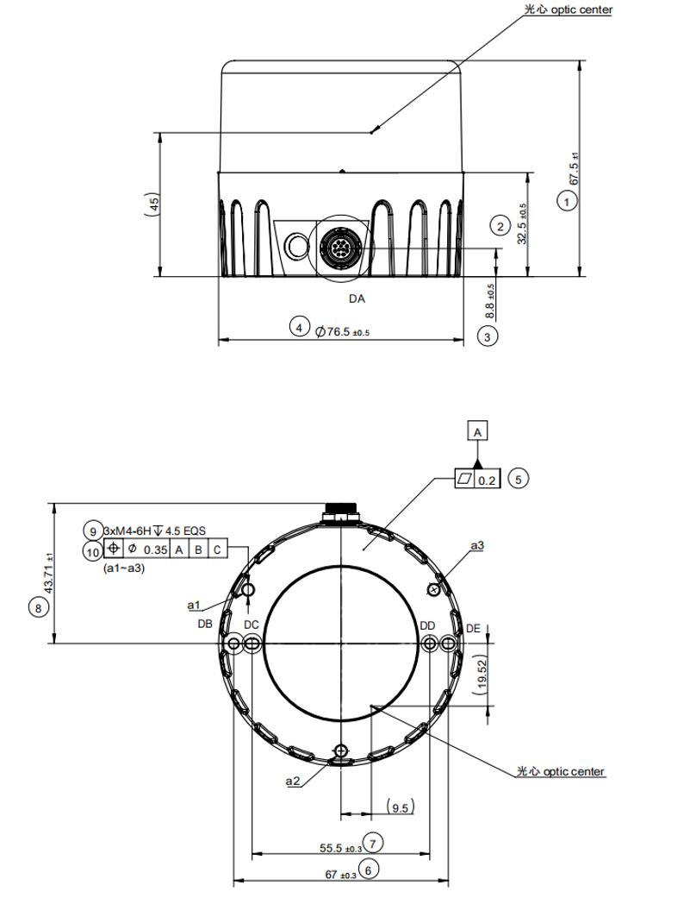{: .manual-img--xl }
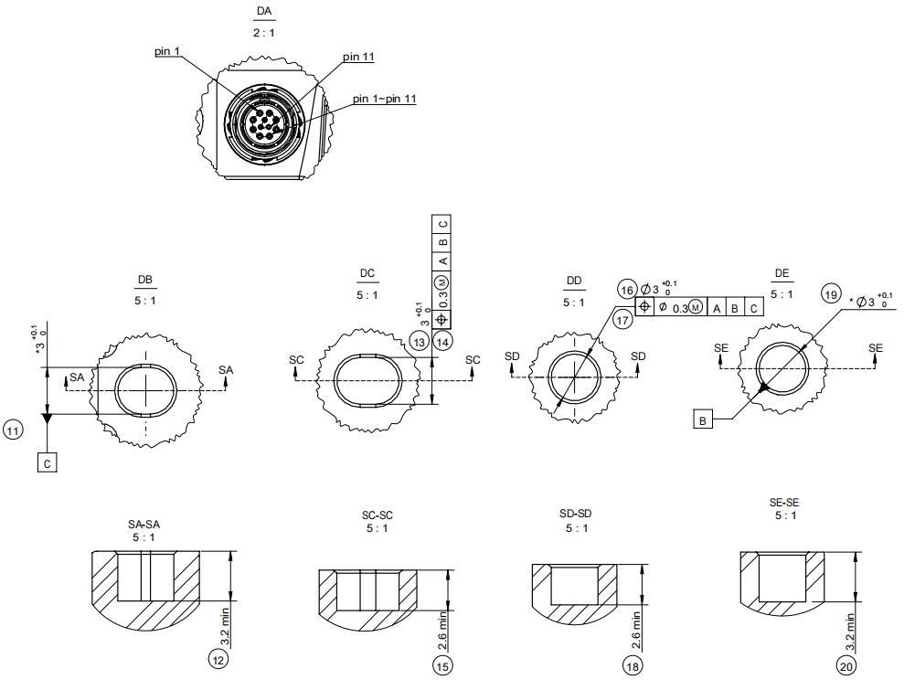{: .manual-img--xl }

## 附录 E 各通道发射延时表

表 31 各通道发射延时表

<table class="packet-def-table">
  <thead>
    <tr>
      <th>通道序号</th>
      <th>发射延时 (ns)</th>
      <th>通道序号</th>
      <th>发射延时 (ns)</th>
    </tr>
  </thead>
  <tbody>
    <tr>
      <td>00-07</td>
      <td>0</td>
      <td>24-31</td>
      <td>28160</td>
    </tr>
    <tr>
      <td>08-15</td>
      <td>5280</td>
      <td>32-39</td>
      <td>42240</td>
    </tr>
    <tr>
      <td>16-23</td>
      <td>14080</td>
      <td>40-47</td>
      <td>51040</td>
    </tr>
  </tbody>
</table>

{: .manual-img--xl }
